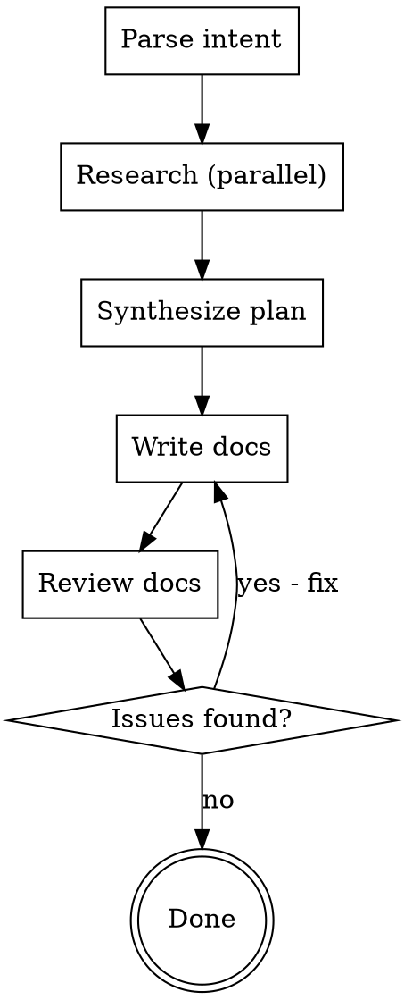

# Code of Conduct

## Our Pledge

In the interest of fostering an open and welcoming environment, we as
contributors and maintainers pledge to make participation in our project and
our community a harassment-free experience for everyone, regardless of age, body
size, disability, ethnicity, sex characteristics, gender identity and expression,
level of experience, education, socio-economic status, nationality, personal
appearance, race, religion, or sexual identity and orientation.

## Our Standards

Examples of behavior that contributes to creating a positive environment
include:

* Using welcoming and inclusive language
* Being respectful of differing viewpoints and experiences
* Gracefully accepting constructive criticism
* Focusing on what is best for the community
* Showing empathy towards other community members

Examples of unacceptable behavior by participants include:

* The use of sexualized language or imagery and unwelcome sexual attention or
  advances
* Trolling, insulting/derogatory comments, and personal or political attacks
* Public or private harassment
* Publishing others' private information, such as a physical or electronic
  address, without explicit permission
* Other conduct which could reasonably be considered inappropriate in a
  professional setting

## Our Responsibilities

Project maintainers are responsible for clarifying the standards of acceptable
behavior and are expected to take appropriate and fair corrective action in
response to any instances of unacceptable behavior.

Project maintainers have the right and responsibility to remove, edit, or
reject comments, commits, code, wiki edits, issues, and other contributions
that are not aligned to this Code of Conduct, or to ban temporarily or
permanently any contributor for other behaviors that they deem inappropriate,
threatening, offensive, or harmful.

## Scope

This Code of Conduct applies within all project spaces, and it also applies when
an individual is representing the project or its community in public spaces.
Examples of representing a project or community include using an official
project e-mail address, posting via an official social media account, or acting
as an appointed representative at an online or offline event. Representation of
a project may be further defined and clarified by project maintainers.

## Enforcement

Instances of abusive, harassing, or otherwise unacceptable behavior may be
reported by contacting the project team at <opensource-conduct@fb.com>. All
complaints will be reviewed and investigated and will result in a response that
is deemed necessary and appropriate to the circumstances. The project team is
obligated to maintain confidentiality with regard to the reporter of an incident.
Further details of specific enforcement policies may be posted separately.

Project maintainers who do not follow or enforce the Code of Conduct in good
faith may face temporary or permanent repercussions as determined by other
members of the project's leadership.

## Attribution

This Code of Conduct is adapted from the [Contributor Covenant][homepage], version 1.4,
available at https://www.contributor-covenant.org/version/1/4/code-of-conduct.html

[homepage]: https://www.contributor-covenant.org

For answers to common questions about this code of conduct, see
https://www.contributor-covenant.org/faq

---
# Source: CLAUDE.md
---
# CLAUDE.md

This file provides guidance to Claude Code when working with this repository.

## Project Overview

This is the React documentation website (react.dev), built with Next.js 15.1.11 and React 19. Documentation is written in MDX format.

## Development Commands

```bash
yarn build         # Production build
yarn lint          # Run ESLint
yarn lint:fix      # Auto-fix lint issues
yarn tsc           # TypeScript type checking
yarn check-all     # Run prettier, lint:fix, tsc, and rss together
```

## Project Structure

```
src/
├── content/           # Documentation content (MDX files)
│   ├── learn/         # Tutorial/learning content
│   ├── reference/     # API reference docs
│   ├── blog/          # Blog posts
│   └── community/     # Community pages
├── components/        # React components
├── pages/             # Next.js pages
├── hooks/             # Custom React hooks
├── utils/             # Utility functions
└── styles/            # CSS/Tailwind styles
```

## Code Conventions

### TypeScript/React
- Functional components only
- Tailwind CSS for styling

### Documentation Style

When editing files in `src/content/`, the appropriate skill will be auto-suggested:
- `src/content/learn/` - Learn page structure and tone
- `src/content/reference/` - Reference page structure and tone

For MDX components (DeepDive, Pitfall, Note, etc.), invoke `/docs-components`.
For Sandpack code examples, invoke `/docs-sandpack`.

See `.claude/docs/react-docs-patterns.md` for comprehensive style guidelines.

Prettier is used for formatting (config in `.prettierrc`).

---
# Source: docs-reviewer.md
---
---
name: docs-reviewer
description: "Lean docs reviewer that dispatches reviews docs for a particular skill."
model: opus
color: cyan
---

You are a direct, critical, expert reviewer for React documentation. 

Your role is to use given skills to validate given doc pages for consistency, correctness, and adherence to established patterns.

Complete this process:

## Phase 1: Task Creation
1. CRITICAL: Read the skill requested.
2. Understand the skill's requirements.
3. Create a task list to validate skills requirements.

## Phase 2: Validate

1. Read the docs files given.
2. Review each file with the task list to verify.

## Phase 3: Respond

You must respond with a checklist of the issues you identified, and line number.

DO NOT respond with passed validations, ONLY respond with the problems. 

---
# Source: SKILL.md
---
---
name: write
description: Use when creating new React documentation pages or updating existing ones. Accepts instructions like "add optimisticKey reference docs", "update ViewTransition with Activity", or "transition learn docs".
---

# Documentation Writer

Orchestrates research, writing, and review for React documentation.

## Invocation

```
/write add optimisticKey              → creates new reference docs
/write update ViewTransition Activity → updates ViewTransition docs to cover Activity
/write transition learn docs          → creates new learn docs for transitions
/write blog post for React 20         → creates a new blog post
```

## Workflow



### Step 1: Parse Intent

Determine from the user's instruction:

| Field | How to determine |
|-------|------------------|
| **Action** | "add"/"create"/"new" = new page; "update"/"edit"/"with" = modify existing |
| **Topic** | The React API or concept (e.g., `optimisticKey`, `ViewTransition`, `transitions`) |
| **Doc type** | "reference" (default for APIs/hooks/components), "learn" (for concepts/guides), "blog" (for announcements) |
| **Target file** | For updates: find existing file in `src/content/`. For new: determine path from doc type |

If the intent is ambiguous, ask the user to clarify before proceeding.

### Step 2: Research (Parallel Agents)

Spawn these agents **in parallel**:

#### Agent 1: React Expert Research

Use a Task agent (subagent_type: `general-purpose`) to invoke `/react-expert <topic>`. This researches the React source code, tests, PRs, issues, and type signatures.

**Prompt:**
```
Invoke the /react-expert skill for <TOPIC>. Follow the skill's full workflow:
setup the React repo, dispatch all 6 research agents in parallel, synthesize
results, and save to .claude/research/<topic>.md. Return the full research document.
```

#### Agent 2: Existing Docs Audit

Use a Task agent (subagent_type: `Explore`) to find and read existing documentation for the topic.

**Prompt:**
```
Find all existing documentation related to <TOPIC> in this repo:
1. Search src/content/ for files mentioning <TOPIC>
2. Read any matching files fully
3. For updates: identify what sections exist and what's missing
4. For new pages: identify related pages to understand linking/cross-references
5. Check src/sidebarLearn.json and src/sidebarReference.json for navigation placement

Return: list of existing files with summaries, navigation structure, and gaps.
```

#### Agent 3: Use Case Research

Use a Task agent (subagent_type: `general-purpose`) with web search to find common use cases and patterns.

**Prompt:**
```
Search the web for common use cases and patterns for React's <TOPIC>.
Focus on:
1. Real-world usage patterns developers actually need
2. Common mistakes or confusion points
3. Migration patterns (if replacing an older API)
4. Framework integration patterns (Next.js, Remix, etc.)

Return a summary of the top 5-8 use cases with brief code sketches.
Do NOT search Stack Overflow. Focus on official docs, GitHub discussions,
and high-quality technical blogs.
```

### Step 3: Synthesize Writing Plan

After all research agents complete, create a writing plan that includes:

1. **Page type** (from docs-writer-reference decision tree or learn/blog type)
2. **File path** for the new or updated file
3. **Outline** with section headings matching the appropriate template
4. **Content notes** for each section, drawn from research:
   - API signature and parameters (from react-expert types)
   - Usage examples (from react-expert tests + use case research)
   - Caveats and pitfalls (from react-expert warnings/errors/issues)
   - Cross-references to related pages (from docs audit)
5. **Navigation changes** needed (sidebar JSON updates)

Present this plan to the user and confirm before proceeding.

### Step 4: Write Documentation

Dispatch a Task agent (subagent_type: `general-purpose`) to write the documentation.

**The agent prompt MUST include:**

1. The full writing plan from Step 3
2. An instruction to invoke the appropriate skill:
   - `/docs-writer-reference` for reference pages
   - `/docs-writer-learn` for learn pages
   - `/docs-writer-blog` for blog posts
3. An instruction to invoke `/docs-components` for MDX component patterns
4. An instruction to invoke `/docs-sandpack` if adding interactive code examples
5. The research document content (key findings, not the full dump)

**Prompt template:**
```
You are writing React documentation. Follow these steps:

1. Invoke /docs-writer-<TYPE> to load the page template and conventions
2. Invoke /docs-components to load MDX component patterns
3. Invoke /docs-sandpack if you need interactive code examples
4. Write the documentation following the plan below

PLAN:
<writing plan from Step 3>

RESEARCH FINDINGS:
<key findings from Step 2 agents>

Write the file to: <target file path>
Also update <sidebar JSON> if adding a new page.
```

### Step 5: Review Documentation

Invoke `/review-docs` on the written files. This dispatches parallel review agents checking:
- Structure compliance (docs-writer-*)
- Voice and style (docs-voice)
- Component usage (docs-components)
- Sandpack patterns (docs-sandpack)

### Step 6: Fix Issues

If the review finds issues:
1. Present the review checklist to the user
2. Fix the issues identified
3. Re-run `/review-docs` on the fixed files
4. Repeat until clean

## Important Rules

- **Always research before writing.** Never write docs from LLM knowledge alone.
- **Always confirm the plan** with the user before writing.
- **Always review** with `/review-docs` after writing.
- **Match existing patterns.** Read neighboring docs to match style and depth.
- **Update navigation.** New pages need sidebar entries.

---
# Source: SKILL.md
---
---
name: docs-writer-learn
description: Use when writing or editing files in src/content/learn/. Provides Learn page structure and tone.
---

# Learn Page Writer

## Persona

**Voice:** Patient teacher guiding a friend through concepts
**Tone:** Conversational, warm, encouraging

## Voice & Style

For tone, capitalization, jargon, and prose patterns, invoke `/docs-voice`.

## Page Structure Variants

### 1. Standard Learn Page (Most Common)

```mdx
---
title: Page Title
---

<Intro>
1-3 sentences introducing the concept. Use *italics* for new terms.
</Intro>

<YouWillLearn>

* Learning outcome 1
* Learning outcome 2
* Learning outcome 3-5

</YouWillLearn>

## Section Name {/*section-id*/}

Content with Sandpack examples, Pitfalls, Notes, DeepDives...

## Another Section {/*another-section*/}

More content...

<Recap>

* Summary point 1
* Summary point 2
* Summary points 3-9

</Recap>

<Challenges>

#### Challenge title {/*challenge-id*/}

Description...

<Hint>
Optional guidance (single paragraph)
</Hint>

<Sandpack>
{/* Starting code */}
</Sandpack>

<Solution>
Explanation...

<Sandpack>
{/* Fixed code */}
</Sandpack>
</Solution>

</Challenges>
```

### 2. Chapter Introduction Page

For pages that introduce a chapter (like describing-the-ui.md, managing-state.md):

```mdx
<YouWillLearn isChapter={true}>

* [Sub-page title](/learn/sub-page-name) to learn...
* [Another page](/learn/another-page) to learn...

</YouWillLearn>

## Preview Section {/*section-id*/}

Preview description with mini Sandpack example

<LearnMore path="/learn/sub-page-name">

Read **[Page Title](/learn/sub-page-name)** to learn how to...

</LearnMore>

## What's next? {/*whats-next*/}

Head over to [First Page](/learn/first-page) to start reading this chapter page by page!
```

**Important:** Chapter intro pages do NOT include `<Recap>` or `<Challenges>` sections.

### 3. Tutorial Page

For step-by-step tutorials (like tutorial-tic-tac-toe.md):

```mdx
<Intro>
Brief statement of what will be built
</Intro>

<Note>
Alternative learning path offered
</Note>

Table of contents (prose listing of major sections)

## Setup {/*setup*/}
...

## Main Content {/*main-content*/}
Progressive code building with ### subsections

No YouWillLearn, Recap, or Challenges

Ends with ordered list of "extra credit" improvements
```

### 4. Reference-Style Learn Page

For pages with heavy API documentation (like typescript.md):

```mdx
<YouWillLearn>

* [Link to section](#section-anchor)
* [Link to another section](#another-section)

</YouWillLearn>

## Sections with ### subsections

## Further learning {/*further-learning*/}

No Recap or Challenges
```

## Heading ID Conventions

All headings require IDs in `{/*kebab-case*/}` format:

```markdown
## Section Title {/*section-title*/}
### Subsection Title {/*subsection-title*/}
#### DeepDive Title {/*deepdive-title*/}
```

**ID Generation Rules:**
- Lowercase everything
- Replace spaces with hyphens
- Remove apostrophes, quotes
- Remove or convert special chars (`:`, `?`, `!`, `.`, parentheses)

**Examples:**
- "What's React?" → `{/*whats-react*/}`
- "Step 1: Create the context" → `{/*step-1-create-the-context*/}`
- "Conditional (ternary) operator (? :)" → `{/*conditional-ternary-operator--*/}`

## Teaching Patterns

### Problem-First Teaching

Show broken/problematic code BEFORE the solution:

1. Present problematic approach with `// 🔴 Avoid:` comment
2. Explain WHY it's wrong (don't just say it is)
3. Show the solution with `// ✅ Good:` comment
4. Invite experimentation

### Progressive Complexity

Build understanding in layers:
1. Show simplest working version
2. Identify limitation or repetition
3. Introduce solution incrementally
4. Show complete solution
5. Invite experimentation: "Try changing..."

### Numbered Step Patterns

For multi-step processes:

**As section headings:**
```markdown
### Step 1: Action to take {/*step-1-action*/}
### Step 2: Next action {/*step-2-next-action*/}
```

**As inline lists:**
```markdown
To implement this:
1. **Declare** `inputRef` with the `useRef` Hook.
2. **Pass it** as `<input ref={inputRef}>`.
3. **Read** the input DOM node from `inputRef.current`.
```

### Interactive Invitations

After Sandpack examples, encourage experimentation:
- "Try changing X to Y. See how...?"
- "Try it in the sandbox above!"
- "Click each button separately:"
- "Have a guess!"
- "Verify that..."

### Decision Questions

Help readers build intuition:
> "When you're not sure whether some code should be in an Effect or in an event handler, ask yourself *why* this code needs to run."

## Component Placement Order

1. `<Intro>` - First after frontmatter
2. `<YouWillLearn>` - After Intro (standard/chapter pages)
3. Body content with `<Note>`, `<Pitfall>`, `<DeepDive>` placed contextually
4. `<Recap>` - Before Challenges (standard pages only)
5. `<Challenges>` - End of page (standard pages only)

For component structure and syntax, invoke `/docs-components`.

## Code Examples

For Sandpack file structure, naming conventions, code style, and pedagogical markers, invoke `/docs-sandpack`.

## Cross-Referencing

### When to Link

**Link to /learn:**
- Explaining concepts or mental models
- Teaching how things work together
- Tutorials and guides
- "Why" questions

**Link to /reference:**
- API details, Hook signatures
- Parameter lists and return values
- Rules and restrictions
- "What exactly" questions

### Link Formats

```markdown
[concept name](/learn/page-name)
[`useState`](/reference/react/useState)
[section link](/learn/page-name#section-id)
[MDN](https://developer.mozilla.org/...)
```

## Section Dividers

**Important:** Learn pages typically do NOT use `---` dividers. The heading hierarchy provides sufficient structure. Only consider dividers in exceptional cases like separating main content from meta/contribution sections.

## Do's and Don'ts

**Do:**
- Use "you" to address the reader
- Show broken code before fixes
- Explain behavior before naming concepts
- Build concepts progressively
- Include interactive Sandpack examples
- Use established analogies consistently
- Place Pitfalls AFTER explaining concepts
- Invite experimentation with "Try..." phrases

**Don't:**
- Use "simple", "easy", "just", or time estimates
- Reference concepts not yet introduced
- Skip required components for page type
- Use passive voice without reason
- Place Pitfalls before teaching the concept
- Use `---` dividers between sections
- Create unnecessary abstraction in examples
- Place consecutive Pitfalls or Notes without separating prose (combine or separate)

## Critical Rules

1. **All headings require IDs:** `## Title {/*title-id*/}`
2. **Chapter intros use `isChapter={true}` and `<LearnMore>`**
3. **Tutorial pages omit YouWillLearn/Recap/Challenges**
4. **Problem-first teaching:** Show broken → explain → fix
5. **No consecutive Pitfalls/Notes:** See `/docs-components` Callout Spacing Rules

For component patterns, invoke `/docs-components`. For Sandpack patterns, invoke `/docs-sandpack`.

---
# Source: SKILL.md
---
---
name: docs-writer-reference
description: Reference page structure, templates, and writing patterns for src/content/reference/. For components, see /docs-components. For code examples, see /docs-sandpack.
---

# Reference Page Writer

## Quick Reference

### Page Type Decision Tree

1. Is it a Hook? Use **Type A (Hook/Function)**
2. Is it a React component (`<Something>`)? Use **Type B (Component)**
3. Is it a compiler configuration option? Use **Type C (Configuration)**
4. Is it a directive (`'use something'`)? Use **Type D (Directive)**
5. Is it an ESLint rule? Use **Type E (ESLint Rule)**
6. Is it listing multiple APIs? Use **Type F (Index/Category)**

### Component Selection

For component selection and patterns, invoke `/docs-components`.

---

## Voice & Style

**Voice:** Authoritative technical reference writer
**Tone:** Precise, comprehensive, neutral

For tone, capitalization, jargon, and prose patterns, invoke `/docs-voice`.

**Do:**
- Start with single-line description: "`useState` is a React Hook that lets you..."
- Include Parameters, Returns, Caveats sections for every API
- Document edge cases most developers will encounter
- Use section dividers between major sections
- Include "See more examples below" links
- Be assertive, not hedging - "This is designed for..." not "This helps avoid issues with..."
- State facts, not benefits - "The callback always accesses the latest values" not "This helps avoid stale closures"
- Use minimal but meaningful names - `onEvent` or `onTick` over `onSomething`

**Don't:**
- Skip the InlineToc component
- Omit error cases or caveats
- Use conversational language
- Mix teaching with reference (that's Learn's job)
- Document past bugs or fixed issues
- Include niche edge cases (e.g., `this` binding, rare class patterns)
- Add phrases explaining "why you'd want this" - the Usage section examples do that
- Exception: Pitfall and DeepDive asides can use slightly conversational phrasing

---

## Page Templates

### Type A: Hook/Function

**When to use:** Documenting React hooks and standalone functions (useState, useEffect, memo, lazy, etc.)

```mdx
---
title: hookName
---

<Intro>

`hookName` is a React Hook that lets you [brief description].

```js
const result = hookName(arg)
```

</Intro>

<InlineToc />

---

## Reference {/*reference*/}

### `hookName(arg)` {/*hookname*/}

Call `hookName` at the top level of your component to...

```js
[signature example with annotations]
```

[See more examples below.](#usage)

#### Parameters {/*parameters*/}
* `arg`: Description of the parameter.

#### Returns {/*returns*/}
Description of return value.

#### Caveats {/*caveats*/}
* Important caveat about usage.

---

## Usage {/*usage*/}

### Common Use Case {/*common-use-case*/}
Explanation with Sandpack examples...

---

## Troubleshooting {/*troubleshooting*/}

### Common Problem {/*common-problem*/}
How to solve it...
```

---

### Type B: Component

**When to use:** Documenting React components (Suspense, Fragment, Activity, StrictMode)

```mdx
---
title: <ComponentName>
---

<Intro>

`<ComponentName>` lets you [primary action].

```js
<ComponentName prop={value}>
  <Children />
</ComponentName>
```

</Intro>

<InlineToc />

---

## Reference {/*reference*/}

### `<ComponentName>` {/*componentname*/}

[Component purpose and behavior]

#### Props {/*props*/}

* `propName`: Description of the prop...
* **optional** `optionalProp`: Description...

#### Caveats {/*caveats*/}

* [Caveats specific to this component]
```

**Key differences from Hook pages:**
- Title uses JSX syntax: `<ComponentName>`
- Uses `#### Props` instead of `#### Parameters`
- Reference heading uses JSX: `` ### `<ComponentName>` ``

---

### Type C: Configuration

**When to use:** Documenting React Compiler configuration options

```mdx
---
title: optionName
---

<Intro>

The `optionName` option [controls/specifies/determines] [what it does].

</Intro>

```js
{
  optionName: 'value' // Quick example
}
```

<InlineToc />

---

## Reference {/*reference*/}

### `optionName` {/*optionname*/}

[Description of the option's purpose]

#### Type {/*type*/}

```
'value1' | 'value2' | 'value3'
```

#### Default value {/*default-value*/}

`'value1'`

#### Options {/*options*/}

- **`'value1'`** (default): Description
- **`'value2'`**: Description
- **`'value3'`**: Description

#### Caveats {/*caveats*/}

* [Usage caveats]
```

---

### Type D: Directive

**When to use:** Documenting directives like 'use server', 'use client', 'use memo'

```mdx
---
title: "'use directive'"
titleForTitleTag: "'use directive' directive"
---

<RSC>

`'use directive'` is for use with [React Server Components](/reference/rsc/server-components).

</RSC>

<Intro>

`'use directive'` marks [what it marks] for [purpose].

```js {1}
function MyComponent() {
  'use directive';
  // ...
}
```

</Intro>

<InlineToc />

---

## Reference {/*reference*/}

### `'use directive'` {/*use-directive*/}

Add `'use directive'` at the beginning of [location] to [action].

#### Caveats {/*caveats*/}

* `'use directive'` must be at the very beginning...
* The directive must be written with single or double quotes, not backticks.
* [Other placement/syntax caveats]
```

**Key characteristics:**
- Title includes quotes: `title: "'use server'"`
- Uses `titleForTitleTag` for browser tab title
- `<RSC>` block appears before `<Intro>`
- Caveats focus on placement and syntax requirements

---

### Type E: ESLint Rule

**When to use:** Documenting ESLint plugin rules

```mdx
---
title: rule-name
---

<Intro>
Validates that [what the rule checks].
</Intro>

## Rule Details {/*rule-details*/}

[Explanation of why this rule exists and React's underlying assumptions]

## Common Violations {/*common-violations*/}

[Description of violation patterns]

### Invalid {/*invalid*/}

Examples of incorrect code for this rule:

```js
// X Missing dependency
useEffect(() => {
  console.log(count);
}, []); // Missing 'count'
```

### Valid {/*valid*/}

Examples of correct code for this rule:

```js
// checkmark All dependencies included
useEffect(() => {
  console.log(count);
}, [count]);
```

## Troubleshooting {/*troubleshooting*/}

### [Problem description] {/*problem-slug*/}

[Solution]

## Options {/*options*/}

[Configuration options if applicable]
```

**Key characteristics:**
- Intro is a single "Validates that..." sentence
- Uses "Invalid"/"Valid" sections with emoji-prefixed code comments
- Rule Details explains "why" not just "what"

---

### Type F: Index/Category

**When to use:** Overview pages listing multiple APIs in a category

```mdx
---
title: "Built-in React [Type]"
---

<Intro>

*Concept* let you [purpose]. Brief scope statement.

</Intro>

---

## Category Name {/*category-name*/}

*Concept* explanation with [Learn section link](/learn/topic).

To [action], use one of these [Type]:

* [`apiName`](/reference/react/apiName) lets you [action].
* [`apiName`](/reference/react/apiName) declares [thing].

```js
function Example() {
  const value = useHookName(args);
}
```

---

## Your own [Type] {/*your-own-type*/}

You can also [define your own](/learn/topic) as JavaScript functions.
```

**Key characteristics:**
- Title format: "Built-in React [Type]"
- Italicized concept definitions
- Horizontal rules between sections
- Closes with "Your own [Type]" section

---

## Advanced Patterns

### Multi-Function Documentation

**When to use:** When a hook returns a function that needs its own documentation (useState's setter, useReducer's dispatch)

```md
### `hookName(args)` {/*hookname*/}

[Main hook documentation]

#### Parameters {/*parameters*/}
#### Returns {/*returns*/}
#### Caveats {/*caveats*/}

---

### `set` functions, like `setSomething(nextState)` {/*setstate*/}

The `set` function returned by `hookName` lets you [action].

#### Parameters {/*setstate-parameters*/}
#### Returns {/*setstate-returns*/}
#### Caveats {/*setstate-caveats*/}
```

**Key conventions:**
- Horizontal rule (`---`) separates main hook from returned function
- Heading IDs include prefix: `{/*setstate-parameters*/}` vs `{/*parameters*/}`
- Use generic names: "set functions" not "setCount"

---

### Compound Return Objects

**When to use:** When a function returns an object with multiple properties/methods (createContext)

```md
### `createContext(defaultValue)` {/*createcontext*/}

[Main function documentation]

#### Returns {/*returns*/}

`createContext` returns a context object.

**The context object itself does not hold any information.** It represents...

* `SomeContext` lets you provide the context value.
* `SomeContext.Consumer` is an alternative way to read context.

---

### `SomeContext` Provider {/*provider*/}

[Documentation for Provider]

#### Props {/*provider-props*/}

---

### `SomeContext.Consumer` {/*consumer*/}

[Documentation for Consumer]

#### Props {/*consumer-props*/}
```

---

## Writing Patterns

### Opening Lines by Page Type

| Page Type | Pattern | Example |
|-----------|---------|---------|
| Hook | `` `hookName` is a React Hook that lets you [action]. `` | "`useState` is a React Hook that lets you add a state variable to your component." |
| Component | `` `<ComponentName>` lets you [action]. `` | "`<Suspense>` lets you display a fallback until its children have finished loading." |
| API | `` `apiName` lets you [action]. `` | "`memo` lets you skip re-rendering a component when its props are unchanged." |
| Configuration | `` The `optionName` option [controls/specifies/determines] [what]. `` | "The `target` option specifies which React version the compiler generates code for." |
| Directive | `` `'directive'` [marks/opts/prevents] [what] for [purpose]. `` | "`'use server'` marks a function as callable from the client." |
| ESLint Rule | `` Validates that [condition]. `` | "Validates that dependency arrays for React hooks contain all necessary dependencies." |

---

### Parameter Patterns

**Simple parameter:**
```md
* `paramName`: Description of what it does.
```

**Optional parameter:**
```md
* **optional** `paramName`: Description of what it does.
```

**Parameter with special function behavior:**
```md
* `initialState`: The value you want the state to be initially. It can be a value of any type, but there is a special behavior for functions. This argument is ignored after the initial render.
  * If you pass a function as `initialState`, it will be treated as an _initializer function_. It should be pure, should take no arguments, and should return a value of any type.
```

**Callback parameter with sub-parameters:**
```md
* `subscribe`: A function that takes a single `callback` argument and subscribes it to the store. When the store changes, it should invoke the provided `callback`. The `subscribe` function should return a function that cleans up the subscription.
```

**Nested options object:**
```md
* **optional** `options`: An object with options for this React root.
  * **optional** `onCaughtError`: Callback called when React catches an error in an Error Boundary.
  * **optional** `onUncaughtError`: Callback called when an error is thrown and not caught.
  * **optional** `identifierPrefix`: A string prefix React uses for IDs generated by `useId`.
```

---

### Return Value Patterns

**Single value return:**
```md
`hookName` returns the current value. The value will be the same as `initialValue` during the first render.
```

**Array return (numbered list):**
```md
`useState` returns an array with exactly two values:

1. The current state. During the first render, it will match the `initialState` you have passed.
2. The [`set` function](#setstate) that lets you update the state to a different value and trigger a re-render.
```

**Object return (bulleted list):**
```md
`createElement` returns a React element object with a few properties:

* `type`: The `type` you have passed.
* `props`: The `props` you have passed except for `ref` and `key`.
* `ref`: The `ref` you have passed. If missing, `null`.
* `key`: The `key` you have passed, coerced to a string. If missing, `null`.
```

**Promise return:**
```md
`prerender` returns a Promise:
- If rendering is successful, the Promise will resolve to an object containing:
  - `prelude`: a [Web Stream](MDN-link) of HTML.
  - `postponed`: a JSON-serializable object for resumption.
- If rendering fails, the Promise will be rejected.
```

**Wrapped function return:**
```md
`cache` returns a cached version of `fn` with the same type signature. It does not call `fn` in the process.

When calling `cachedFn` with given arguments, it first checks if a cached result exists. If cached, it returns the result. If not, it calls `fn`, stores the result, and returns it.
```

---

### Caveats Patterns

**Standard Hook caveat (almost always first for Hooks):**
```md
* `useXxx` is a Hook, so you can only call it **at the top level of your component** or your own Hooks. You can't call it inside loops or conditions. If you need that, extract a new component and move the state into it.
```

**Stable identity caveat (for returned functions):**
```md
* The `set` function has a stable identity, so you will often see it omitted from Effect dependencies, but including it will not cause the Effect to fire.
```

**Strict Mode caveat:**
```md
* In Strict Mode, React will **call your render function twice** in order to help you find accidental impurities. This is development-only behavior and does not affect production.
```

**Caveat with code example:**
```md
* It's not recommended to _suspend_ a render based on a store value returned by `useSyncExternalStore`. For example, the following is discouraged:

  ```js
  const selectedProductId = useSyncExternalStore(...);
  const data = use(fetchItem(selectedProductId)) // X Don't suspend based on store value
  ```
```

**Canary caveat:**
```md
* <CanaryBadge /> If you want to pass `ref` to a Fragment, you can't use the `<>...</>` syntax.
```

---

### Troubleshooting Patterns

**Heading format (first person problem statements):**
```md
### I've updated the state, but logging gives me the old value {/*old-value*/}

### My initializer or updater function runs twice {/*runs-twice*/}

### I want to read the latest state from a callback {/*read-latest-state*/}
```

**Error message format:**
```md
### I'm getting an error: "Too many re-renders" {/*too-many-rerenders*/}

### I'm getting an error: "Rendered more hooks than during the previous render" {/*more-hooks*/}
```

**Lint error format:**
```md
### I'm getting a lint error: "[exact error message]" {/*lint-error-slug*/}
```

**Problem-solution structure:**
1. State the problem with code showing the issue
2. Explain why it happens
3. Provide the solution with corrected code
4. Link to Learn section for deeper understanding

---

### Code Comment Conventions

For code comment conventions (wrong/right, legacy/recommended, server/client labeling, bundle size annotations), invoke `/docs-sandpack`.

---

### Link Description Patterns

| Pattern | Example |
|---------|---------|
| "lets you" + action | "`memo` lets you skip re-rendering when props are unchanged." |
| "declares" + thing | "`useState` declares a state variable that you can update directly." |
| "reads" + thing | "`useContext` reads and subscribes to a context." |
| "connects" + thing | "`useEffect` connects a component to an external system." |
| "Used with" | "Used with [`useContext`.](/reference/react/useContext)" |
| "Similar to" | "Similar to [`useTransition`.](/reference/react/useTransition)" |

---

## Component Patterns

For comprehensive MDX component patterns (Note, Pitfall, DeepDive, Recipes, Deprecated, RSC, Canary, Diagram, Code Steps), invoke `/docs-components`.

For Sandpack-specific patterns and code style, invoke `/docs-sandpack`.

### Reference-Specific Component Rules

**Component placement in Reference pages:**
- `<RSC>` goes before `<Intro>` at top of page
- `<Deprecated>` goes after `<Intro>` for page-level deprecation
- `<Deprecated>` goes after method heading for method-level deprecation
- `<Canary>` wrapper goes inline within `<Intro>`
- `<CanaryBadge />` appears in headings, props lists, and caveats

**Troubleshooting-specific components:**
- Use first-person problem headings
- Cross-reference Pitfall IDs when relevant

**Callout spacing:**
- Never place consecutive Pitfalls or consecutive Notes
- Combine related warnings into one with titled subsections, or separate with prose/code
- Consecutive DeepDives OK for multi-part explorations
- See `/docs-components` Callout Spacing Rules

---

## Content Principles

### Intro Section
- **One sentence, ~15 words max** - State what the Hook does, not how it works
- ✅ "`useEffectEvent` is a React Hook that lets you separate events from Effects."
- ❌ "`useEffectEvent` is a React Hook that lets you extract non-reactive logic from your Effects into a reusable function called an Effect Event."

### Reference Code Example
- Show just the API call (5-10 lines), not a full component
- Move full component examples to Usage section

### Usage Section Structure
1. **First example: Core mental model** - Show the canonical use case with simplest concrete example
2. **Subsequent examples: Canonical use cases** - Name the *why* (e.g., "Avoid reconnecting to external systems"), show a concrete *how*
   - Prefer broad canonical use cases over multiple narrow concrete examples
   - The section title IS the teaching - "When would I use this?" should be answered by the heading

### What to Include vs. Exclude
- **Never** document past bugs or fixed issues
- **Include** edge cases most developers will encounter
- **Exclude** niche edge cases (e.g., `this` binding, rare class patterns)

### Caveats Section
- Include rules the linter enforces or that cause immediate errors
- Include fundamental usage restrictions
- Exclude implementation details unless they affect usage
- Exclude repetition of things explained elsewhere
- Keep each caveat to one sentence when possible

### Troubleshooting Section
- Error headings only: "I'm getting an error: '[message]'" format
- Never document past bugs - if it's fixed, it doesn't belong here
- Focus on errors developers will actually encounter today

### DeepDive Content
- **Goldilocks principle** - Deep enough for curious developers, short enough to not overwhelm
- Answer "why is it designed this way?" - not exhaustive technical details
- Readers who skip it should miss nothing essential for using the API
- If the explanation is getting long, you're probably explaining too much

---

## Domain-Specific Guidance

### Hooks

**Returned function documentation:**
- Document setter/dispatch functions as separate `###` sections
- Use generic names: "set functions" not "setCount"
- Include stable identity caveat for returned functions

**Dependency array documentation:**
- List what counts as reactive values
- Explain when dependencies are ignored
- Link to removing effect dependencies guide

**Recipes usage:**
- Group related examples with meaningful titleText
- Each recipe has brief intro, Sandpack, and `<Solution />`

---

### Components

**Props documentation:**
- Use `#### Props` instead of `#### Parameters`
- Mark optional props with `**optional**` prefix
- Use `<CanaryBadge />` inline for canary-only props

**JSX syntax in titles/headings:**
- Frontmatter title: `title: <Suspense>`
- Reference heading: `` ### `<Suspense>` {/*suspense*/} ``

---

### React-DOM

**Common props linking:**
```md
`<input>` supports all [common element props.](/reference/react-dom/components/common#common-props)
```

**Props categorization:**
- Controlled vs uncontrolled props grouped separately
- Form-specific props documented with action patterns
- MDN links for standard HTML attributes

**Environment-specific notes:**
```mdx
<Note>

This API is specific to Node.js. Environments with [Web Streams](MDN-link), like Deno and modern edge runtimes, should use [`renderToReadableStream`](/reference/react-dom/server/renderToReadableStream) instead.

</Note>
```

**Progressive enhancement:**
- Document benefits for users without JavaScript
- Explain Server Function + form action integration
- Show hidden form field and `.bind()` patterns

---

### RSC

**RSC banner (before Intro):**
Always place `<RSC>` component before `<Intro>` for Server Component-only APIs.

**Serialization type lists:**
When documenting Server Function arguments, list supported types:
```md
Supported types for Server Function arguments:

* Primitives
	* [string](MDN-link)
	* [number](MDN-link)
* Iterables containing serializable values
	* [Array](MDN-link)
	* [Map](MDN-link)

Notably, these are not supported:
* React elements, or [JSX](/learn/writing-markup-with-jsx)
* Functions (other than Server Functions)
```

**Bundle size comparisons:**
- Show "Not included in bundle" for server-only imports
- Annotate client bundle sizes with gzip: `// 35.9K (11.2K gzipped)`

---

### Compiler

**Configuration page structure:**
- Type (union type or interface)
- Default value
- Options/Valid values with descriptions

**Directive documentation:**
- Placement requirements are critical
- Mode interaction tables showing combinations
- "Use sparingly" + "Plan for removal" patterns for escape hatches

**Library author guides:**
- Audience-first intro
- Benefits/Why section
- Numbered step-by-step setup

---

### ESLint

**Rule Details section:**
- Explain "why" not just "what"
- Focus on React's underlying assumptions
- Describe consequences of violations

**Invalid/Valid sections:**
- Standard intro: "Examples of [in]correct code for this rule:"
- Use X emoji for invalid, checkmark for valid
- Show inline comments explaining the violation

**Configuration options:**
- Show shared settings (preferred)
- Show rule-level options (backward compatibility)
- Note precedence when both exist

---

## Edge Cases

For deprecated, canary, and version-specific component patterns (placement, syntax, examples), invoke `/docs-components`.

**Quick placement rules:**
- `<Deprecated>` after `<Intro>` for page-level, after heading for method-level
- `<Canary>` wrapper inline in Intro, `<CanaryBadge />` in headings/props/caveats
- Version notes use `<Note>` with "Starting in React 19..." pattern

**Removed APIs on index pages:**
```md
## Removed APIs {/*removed-apis*/}

These APIs were removed in React 19:

* [`render`](https://18.react.dev/reference/react-dom/render): use [`createRoot`](/reference/react-dom/client/createRoot) instead.
```

Link to previous version docs (18.react.dev) for removed API documentation.

---

## Critical Rules

1. **Heading IDs required:** `## Title {/*title-id*/}` (lowercase, hyphens)
2. **Sandpack main file needs `export default`**
3. **Active file syntax:** ` ```js src/File.js active `
4. **Error headings in Troubleshooting:** Use `### I'm getting an error: "[message]" {/*id*/}`
5. **Section dividers (`---`)** required between headings (see Section Dividers below)
6. **InlineToc required:** Always include `<InlineToc />` after Intro
7. **Consistent parameter format:** Use `* \`paramName\`: description` with `**optional**` prefix for optional params
8. **Numbered lists for array returns:** When hooks return arrays, use numbered lists in Returns section
9. **Generic names for returned functions:** Use "set functions" not "setCount"
10. **Props vs Parameters:** Use `#### Props` for Components (Type B), `#### Parameters` for Hooks/APIs (Type A)
11. **RSC placement:** `<RSC>` component goes before `<Intro>`, not after
12. **Canary markers:** Use `<Canary>` wrapper inline in Intro, `<CanaryBadge />` in headings/props
13. **Deprecated placement:** `<Deprecated>` goes after `<Intro>` for page-level, after heading for method-level
14. **Code comment emojis:** Use X for wrong, checkmark for correct in code examples
15. **No consecutive Pitfalls/Notes:** Combine into one component with titled subsections, or separate with prose/code (see `/docs-components`)

For component heading level conventions (DeepDive, Pitfall, Note, Recipe headings), see `/docs-components`.

### Section Dividers

Use `---` horizontal rules to visually separate major sections:

- **After `<InlineToc />`** - Before `## Reference` heading
- **Between API subsections** - Between different function/hook definitions (e.g., between `useState()` and `set functions`)
- **Before `## Usage`** - Separates API reference from examples
- **Before `## Troubleshooting`** - Separates content from troubleshooting
- **Between EVERY Usage subsections** - When switching to a new major use case

Always have a blank line before and after `---`.

### Section ID Conventions

| Section | ID Format |
|---------|-----------|
| Main function | `{/*functionname*/}` |
| Returned function | `{/*setstate*/}`, `{/*dispatch*/}` |
| Sub-section of returned function | `{/*setstate-parameters*/}` |
| Troubleshooting item | `{/*problem-description-slug*/}` |
| Pitfall | `{/*pitfall-description*/}` |
| Deep dive | `{/*deep-dive-topic*/}` |

---
# Source: SKILL.md
---
---
name: review-docs
description: Use when reviewing React documentation for structure, components, and style compliance
---
CRITICAL: do not load these skills yourself.

Run these tasks in parallel for the given file(s). Each agent checks different aspects—not all apply to every file:

- [ ] Ask docs-reviewer agent to review {files} with docs-writer-learn (only for files in src/content/learn/).
- [ ] Ask docs-reviewer agent to review {files} with docs-writer-reference (only for files in src/content/reference/).
- [ ] Ask docs-reviewer agent to review {files} with docs-writer-blog (only for files in src/content/blog/).
- [ ] Ask docs-reviewer agent to review {files} with docs-voice (all documentation files).
- [ ] Ask docs-reviewer agent to review {files} with docs-components (all documentation files).
- [ ] Ask docs-reviewer agent to review {files} with docs-sandpack (files containing Sandpack examples).

If no file is specified, check git status for modified MDX files in `src/content/`.

The docs-reviewer will return a checklist of the issues it found. Respond with the full checklist and line numbers from all agents, and prompt the user to create a plan to fix these issues.


---
# Source: SKILL.md
---
---
name: react-expert
description: Use when researching React APIs or concepts for documentation. Use when you need authoritative usage examples, caveats, warnings, or errors for a React feature.
---

# React Expert Research Skill

## Overview

This skill produces exhaustive documentation research on any React API or concept by searching authoritative sources (tests, source code, PRs, issues) rather than relying on LLM training knowledge.

<CRITICAL>
**Skepticism Mandate:** You must be skeptical of your own knowledge. Claude is often trained on outdated or incorrect React patterns. Treat source material as the sole authority. If findings contradict your prior understanding, explicitly flag this discrepancy.

**Red Flags - STOP if you catch yourself thinking:**
- "I know this API does X" → Find source evidence first
- "Common pattern is Y" → Verify in test files
- Generating example code → Must have source file reference
</CRITICAL>

## Invocation

```
/react-expert useTransition
/react-expert suspense boundaries
/react-expert startTransition
```

## Sources (Priority Order)

1. **React Repo Tests** - Most authoritative for actual behavior
2. **React Source Code** - Warnings, errors, implementation details
3. **Git History** - Commit messages with context
4. **GitHub PRs & Comments** - Design rationale (via `gh` CLI)
5. **GitHub Issues** - Confusion/questions (facebook/react + reactjs/react.dev)
6. **React Working Group** - Design discussions for newer APIs
7. **Flow Types** - Source of truth for type signatures
8. **TypeScript Types** - Note discrepancies with Flow
9. **Current react.dev docs** - Baseline (not trusted as complete)

**No web search** - No Stack Overflow, blog posts, or web searches. GitHub API via `gh` CLI is allowed.

## Workflow

### Step 1: Setup React Repo

First, ensure the React repo is available locally:

```bash
# Check if React repo exists, clone or update
if [ -d ".claude/react" ]; then
  cd .claude/react && git pull origin main
else
  git clone --depth=100 https://github.com/facebook/react.git .claude/react
fi
```

Get the current commit hash for the research document:
```bash
cd .claude/react && git rev-parse --short HEAD
```

### Step 2: Dispatch 6 Parallel Research Agents

Spawn these agents IN PARALLEL using the Task tool. Each agent receives the skepticism preamble:

> "You are researching React's `<TOPIC>`. CRITICAL: Do NOT rely on your prior knowledge about this API. Your training may contain outdated or incorrect patterns. Only report what you find in the source files. If your findings contradict common understanding, explicitly highlight this discrepancy."

| Agent | subagent_type | Focus | Instructions |
|-------|---------------|-------|--------------|
| test-explorer | Explore | Test files for usage patterns | Search `.claude/react/packages/*/src/__tests__/` for test files mentioning the topic. Extract actual usage examples WITH file paths and line numbers. |
| source-explorer | Explore | Warnings/errors in source | Search `.claude/react/packages/*/src/` for console.error, console.warn, and error messages mentioning the topic. Document trigger conditions. |
| git-historian | Explore | Commit messages | Run `git log --all --grep="<topic>" --oneline -50` in `.claude/react`. Read full commit messages for context. |
| pr-researcher | Explore | PRs introducing/modifying API | Run `gh pr list -R facebook/react --search "<topic>" --state all --limit 20`. Read key PR descriptions and comments. |
| issue-hunter | Explore | Issues showing confusion | Search issues in both `facebook/react` and `reactjs/react.dev` repos. Look for common questions and misunderstandings. |
| types-inspector | Explore | Flow + TypeScript signatures | Find Flow types in `.claude/react/packages/*/src/*.js` (look for `@flow` annotations). Find TS types in `.claude/react/packages/*/index.d.ts`. Note discrepancies. |

### Step 3: Agent Prompts

Use these exact prompts when spawning agents:

#### test-explorer
```
You are researching React's <TOPIC>.

CRITICAL: Do NOT rely on your prior knowledge about this API. Your training may contain outdated or incorrect patterns. Only report what you find in the source files.

Your task: Find test files in .claude/react that demonstrate <TOPIC> usage.

1. Search for test files: Glob for `**/__tests__/**/*<topic>*` and `**/__tests__/**/*.js` then grep for <topic>
2. For each relevant test file, extract:
   - The test description (describe/it blocks)
   - The actual usage code
   - Any assertions about behavior
   - Edge cases being tested
3. Report findings with exact file paths and line numbers

Format your output as:
## Test File: <path>
### Test: "<test description>"
```javascript
<exact code from test>
```
**Behavior:** <what the test asserts>
```

#### source-explorer
```
You are researching React's <TOPIC>.

CRITICAL: Do NOT rely on your prior knowledge about this API. Only report what you find in the source files.

Your task: Find warnings, errors, and implementation details for <TOPIC>.

1. Search .claude/react/packages/*/src/ for:
   - console.error mentions of <topic>
   - console.warn mentions of <topic>
   - Error messages mentioning <topic>
   - The main implementation file
2. For each warning/error, document:
   - The exact message text
   - The condition that triggers it
   - The source file and line number

Format your output as:
## Warnings & Errors
| Message | Trigger Condition | Source |
|---------|------------------|--------|
| "<exact message>" | <condition> | <file:line> |

## Implementation Notes
<key details from source code>
```

#### git-historian
```
You are researching React's <TOPIC>.

CRITICAL: Do NOT rely on your prior knowledge. Only report what you find in git history.

Your task: Find commit messages that explain <TOPIC> design decisions.

1. Run: cd .claude/react && git log --all --grep="<topic>" --oneline -50
2. For significant commits, read full message: git show <hash> --stat
3. Look for:
   - Initial introduction of the API
   - Bug fixes (reveal edge cases)
   - Behavior changes
   - Deprecation notices

Format your output as:
## Key Commits
### <short hash> - <subject>
**Date:** <date>
**Context:** <why this change was made>
**Impact:** <what behavior changed>
```

#### pr-researcher
```
You are researching React's <TOPIC>.

CRITICAL: Do NOT rely on your prior knowledge. Only report what you find in PRs.

Your task: Find PRs that introduced or modified <TOPIC>.

1. Run: gh pr list -R facebook/react --search "<topic>" --state all --limit 20 --json number,title,url
2. For promising PRs, read details: gh pr view <number> -R facebook/react
3. Look for:
   - The original RFC/motivation
   - Design discussions in comments
   - Alternative approaches considered
   - Breaking changes

Format your output as:
## Key PRs
### PR #<number>: <title>
**URL:** <url>
**Summary:** <what it introduced/changed>
**Design Rationale:** <why this approach>
**Discussion Highlights:** <key points from comments>
```

#### issue-hunter
```
You are researching React's <TOPIC>.

CRITICAL: Do NOT rely on your prior knowledge. Only report what you find in issues.

Your task: Find issues that reveal common confusion about <TOPIC>.

1. Search facebook/react: gh issue list -R facebook/react --search "<topic>" --state all --limit 20 --json number,title,url
2. Search reactjs/react.dev: gh issue list -R reactjs/react.dev --search "<topic>" --state all --limit 20 --json number,title,url
3. For each issue, identify:
   - What the user was confused about
   - What the resolution was
   - Any gotchas revealed

Format your output as:
## Common Confusion
### Issue #<number>: <title>
**Repo:** <facebook/react or reactjs/react.dev>
**Confusion:** <what they misunderstood>
**Resolution:** <correct understanding>
**Gotcha:** <if applicable>
```

#### types-inspector
```
You are researching React's <TOPIC>.

CRITICAL: Do NOT rely on your prior knowledge. Only report what you find in type definitions.

Your task: Find and compare Flow and TypeScript type signatures for <TOPIC>.

1. Flow types (source of truth): Search .claude/react/packages/*/src/*.js for @flow annotations related to <topic>
2. TypeScript types: Search .claude/react/packages/*/index.d.ts and @types/react
3. Compare and note any discrepancies

Format your output as:
## Flow Types (Source of Truth)
**File:** <path>
```flow
<exact type definition>
```

## TypeScript Types
**File:** <path>
```typescript
<exact type definition>
```

## Discrepancies
<any differences between Flow and TS definitions>
```

### Step 4: Synthesize Results

After all agents complete, combine their findings into a single research document.

**DO NOT add information from your own knowledge.** Only include what agents found in sources.

### Step 5: Save Output

Write the final document to `.claude/research/<topic>.md`

Replace spaces in topic with hyphens (e.g., "suspense boundaries" → "suspense-boundaries.md")

## Output Document Template

```markdown
# React Research: <topic>

> Generated by /react-expert on YYYY-MM-DD
> Sources: React repo (commit <hash>), N PRs, M issues

## Summary

[Brief summary based SOLELY on source findings, not prior knowledge]

## API Signature

### Flow Types (Source of Truth)

[From types-inspector agent]

### TypeScript Types

[From types-inspector agent]

### Discrepancies

[Any differences between Flow and TS]

## Usage Examples

### From Tests

[From test-explorer agent - with file:line references]

### From PRs/Issues

[Real-world patterns from discussions]

## Caveats & Gotchas

[Each with source link]

- **<gotcha>** - Source: <link>

## Warnings & Errors

| Message | Trigger Condition | Source File |
|---------|------------------|-------------|
[From source-explorer agent]

## Common Confusion

[From issue-hunter agent]

## Design Decisions

[From git-historian and pr-researcher agents]

## Source Links

### Commits
- <hash>: <description>

### Pull Requests
- PR #<number>: <title> - <url>

### Issues
- Issue #<number>: <title> - <url>
```

## Common Mistakes to Avoid

1. **Trusting prior knowledge** - If you "know" something about the API, find the source evidence anyway
2. **Generating example code** - Every code example must come from an actual source file
3. **Skipping agents** - All 6 agents must run; each provides unique perspective
4. **Summarizing without sources** - Every claim needs a file:line or PR/issue reference
5. **Using web search** - No Stack Overflow, no blog posts, no social media

## Verification Checklist

Before finalizing the research document:

- [ ] React repo is at `.claude/react` with known commit hash
- [ ] All 6 agents were spawned in parallel
- [ ] Every code example has a source file reference
- [ ] Warnings/errors table has source locations
- [ ] No claims made without source evidence
- [ ] Discrepancies between Flow/TS types documented
- [ ] Source links section is complete

---
# Source: SKILL.md
---
---
name: docs-rsc-sandpack
description: Use when adding interactive RSC (React Server Components) code examples to React docs using <SandpackRSC>, or when modifying the RSC sandpack infrastructure.
---

# RSC Sandpack Patterns

For general Sandpack conventions (code style, naming, file naming, line highlighting, hidden files, CSS guidelines), see `/docs-sandpack`. This skill covers only RSC-specific patterns.

## Quick Start Template

Minimal single-file `<SandpackRSC>` example:

```mdx
<SandpackRSC>

` ` `js src/App.js
export default function App() {
  return <h1>Hello from a Server Component!</h1>;
}
` ` `

</SandpackRSC>
```

---

## How It Differs from `<Sandpack>`

| Feature | `<Sandpack>` | `<SandpackRSC>` |
|---------|-------------|-----------------|
| Execution model | All code runs in iframe | Server code runs in Web Worker, client code in iframe |
| `'use client'` directive | Ignored (everything is client) | Required to mark client components |
| `'use server'` directive | Not supported | Marks Server Functions callable from client |
| `async` components | Not supported | Supported (server components can be async) |
| External dependencies | Supported via `package.json` | Not supported (only React + react-dom) |
| Entry point | `App.js` with `export default` | `src/App.js` with `export default` |
| Component tag | `<Sandpack>` | `<SandpackRSC>` |

---

## File Directives

Files are classified by the directive at the top of the file:

| Directive | Where it runs | Rules |
|-----------|--------------|-------|
| (none) | Web Worker (server) | Default. Can be `async`. Can import other server files. Cannot use hooks, event handlers, or browser APIs. |
| `'use client'` | Sandpack iframe (browser) | Must be first statement. Can use hooks, event handlers, browser APIs. Cannot be `async`. Cannot import server files. |
| `'use server'` | Web Worker (server) | Marks Server Functions. Can be module-level (all exports are actions) or function-level. Callable from client via props or form `action`. |

---

## Common Patterns

### 1. Server + Client Components

```mdx
<SandpackRSC>

` ` `js src/App.js
import Counter from './Counter';

export default function App() {
  return (
    <div>
      <h1>Server-rendered heading</h1>
      <Counter />
    </div>
  );
}
` ` `

` ` `js src/Counter.js
'use client';

import { useState } from 'react';

export default function Counter() {
  const [count, setCount] = useState(0);
  return (
    <button onClick={() => setCount(count + 1)}>
      Count: {count}
    </button>
  );
}
` ` `

</SandpackRSC>
```

### 2. Async Server Component with Suspense

```mdx
<SandpackRSC>

` ` `js src/App.js
import { Suspense } from 'react';
import Albums from './Albums';

export default function App() {
  return (
    <Suspense fallback={<p>Loading...</p>}>
      <Albums />
    </Suspense>
  );
}
` ` `

` ` `js src/Albums.js
async function fetchAlbums() {
  await new Promise(resolve => setTimeout(resolve, 1000));
  return ['Abbey Road', 'Let It Be', 'Revolver'];
}

export default async function Albums() {
  const albums = await fetchAlbums();
  return (
    <ul>
      {albums.map(album => (
        <li key={album}>{album}</li>
      ))}
    </ul>
  );
}
` ` `

</SandpackRSC>
```

### 3. Server Functions (Actions)

```mdx
<SandpackRSC>

` ` `js src/App.js
import { addLike, getLikeCount } from './actions';
import LikeButton from './LikeButton';

export default async function App() {
  const count = await getLikeCount();
  return (
    <div>
      <p>Likes: {count}</p>
      <LikeButton addLike={addLike} />
    </div>
  );
}
` ` `

` ` `js src/actions.js
'use server';

let count = 0;

export async function addLike() {
  count++;
}

export async function getLikeCount() {
  return count;
}
` ` `

` ` `js src/LikeButton.js
'use client';

export default function LikeButton({ addLike }) {
  return (
    <form action={addLike}>
      <button type="submit">Like</button>
    </form>
  );
}
` ` `

</SandpackRSC>
```

---

## File Structure Requirements

### Entry Point

- **`src/App.js` is required** as the main entry point
- Must have `export default` (function component)
- Case-insensitive fallback: `src/app.js` also works

### Auto-Injected Infrastructure Files

These files are automatically injected by `sandpack-rsc-setup.ts` and should never be included in MDX:

| File | Purpose |
|------|---------|
| `/src/index.js` | Bootstraps the RSC pipeline |
| `/src/rsc-client.js` | Client bridge — creates Worker, consumes Flight stream |
| `/src/rsc-server.js` | Wraps pre-bundled worker runtime as ES module |
| `/node_modules/__webpack_shim__/index.js` | Minimal webpack compatibility layer |
| `/node_modules/__rsdw_client__/index.js` | `react-server-dom-webpack/client` as local dependency |

### No External Dependencies

`<SandpackRSC>` does not support external npm packages. Only `react` and `react-dom` are available. Do not include `package.json` in RSC examples.

---

## Architecture Reference

### Three-Layer Architecture

```
react.dev page (Next.js)
  ┌─────────────────────────────────────────┐
  │  <SandpackRSC>                          │
  │  ┌─────────┐  ┌──────────────────────┐  │
  │  │ Editor  │  │ Preview (iframe)     │  │
  │  │ App.js  │  │ Client React app     │  │
  │  │ (edit)  │  │ consumes Flight      │  │
  │  │         │  │ stream from Worker   │  │
  │  └─────────┘  └──────────┬───────────┘  │
  └───────────────────────────┼─────────────┘
                              │ postMessage
  ┌───────────────────────────▼─────────────┐
  │  Web Worker (Blob URL)                  │
  │  - React server build (pre-bundled)     │
  │  - react-server-dom-webpack/server      │
  │  - webpack shim                         │
  │  - User server code (Sucrase → CJS)    │
  └─────────────────────────────────────────┘
```

### Key Source Files

| File                                                            | Purpose                                                                        |
|-----------------------------------------------------------------|--------------------------------------------------------------------------------|
| `src/components/MDX/Sandpack/sandpack-rsc/RscFileBridge.tsx`    | Monitors Sandpack; posts raw files to iframe                                   |
| `src/components/MDX/Sandpack/SandpackRSCRoot.tsx`               | SandpackProvider setup, custom bundler URL, UI layout                          |
| `src/components/MDX/Sandpack/templateRSC.ts`                    | RSC template files                                                             |
| `.../sandbox-code/src/__react_refresh_init__.js`                | React Refresh shim                                                             |
| `.../sandbox-code/src/rsc-server.js`                            | Worker runtime: module system, Sucrase compilation, `renderToReadableStream()` |
| `.../sandbox-code/src/rsc-client.source.js`                     | Client bridge: Worker creation, file classification, Flight stream consumption |
| `.../sandbox-code/src/webpack-shim.js`                          | Minimal `__webpack_require__` / `__webpack_module_cache__` shim                |
| `.../sandbox-code/src/worker-bundle.dist.js`                    | Pre-bundled IIFE (generated): React server + RSDW/server + Sucrase             |
| `scripts/buildRscWorker.mjs`                                    | esbuild script: bundles rsc-server.js into worker-bundle.dist.js               |

---

## Build System

### Rebuilding the Worker Bundle

After modifying `rsc-server.js` or `webpack-shim.js`:

```bash
node scripts/buildRscWorker.mjs
```

This runs esbuild with:
- `format: 'iife'`, `platform: 'browser'`
- `conditions: ['react-server', 'browser']` (activates React server export conditions)
- `minify: true`
- Prepends `webpack-shim.js` to the output

### Raw-Loader Configuration

In `templateRSC.js` files are loaded as raw strings with the `!raw-loader`.

The strings are necessary to provide to Sandpack as local files (skips Sandpack bundling). 


### Development Commands

```bash
node scripts/buildRscWorker.mjs   # Rebuild worker bundle after source changes
yarn dev                           # Start dev server to test examples
```
---
# Source: SKILL.md
---
---
name: docs-voice
description: Use when writing any React documentation. Provides voice, tone, and style rules for all doc types.
---

# React Docs Voice & Style

## Universal Rules

- **Capitalize React terms** when referring to the React concept in headings or as standalone concepts:
  - Core: Hook, Effect, State, Context, Ref, Component, Fragment
  - Concurrent: Transition, Action, Suspense
  - Server: Server Component, Client Component, Server Function, Server Action
  - Patterns: Error Boundary
  - Canary: Activity, View Transition, Transition Type
  - **In prose:** Use lowercase when paired with descriptors: "state variable", "state updates", "event handler". Capitalize when the concept stands alone or in headings: "State is isolated and private"
  - General usage stays lowercase: "the page transitions", "takes an action"
- **Product names:** ESLint, TypeScript, JavaScript, Next.js (not lowercase)
- **Bold** for key concepts: **state variable**, **event handler**
- **Italics** for new terms being defined: *event handlers*
- **Inline code** for APIs: `useState`, `startTransition`, `<Suspense>`
- **Avoid:** "simple", "easy", "just", time estimates
- Frame differences as "capabilities" not "advantages/disadvantages"
- Avoid passive voice and jargon

## Tone by Page Type

| Type | Tone | Example |
|------|------|---------|
| Learn | Conversational | "Here's what that looks like...", "You might be wondering..." |
| Reference | Technical | "Call `useState` at the top level...", "This Hook returns..." |
| Blog | Accurate | Focus on facts, not marketing |

**Note:** Pitfall and DeepDive components can use slightly more conversational phrasing ("You might wonder...", "It might be tempting...") even in Reference pages, since they're explanatory asides.

## Avoiding Jargon

**Pattern:** Explain behavior first, then name it.

✅ "React waits until all code in event handlers runs before processing state updates. This is called *batching*."

❌ "React uses batching to process state updates atomically."

**Terms to avoid or explain:**
| Jargon | Plain Language |
|--------|----------------|
| atomic | all-or-nothing, batched together |
| idempotent | same inputs, same output |
| deterministic | predictable, same result every time |
| memoize | remember the result, skip recalculating |
| referentially transparent | (avoid - describe the behavior) |
| invariant | rule that must always be true |
| reify | (avoid - describe what's being created) |

**Allowed technical terms in Reference pages:**
- "stale closures" - standard JS/React term, can be used in Caveats
- "stable identity" - React term for consistent object references across renders
- "reactive" - React term for values that trigger re-renders when changed
- These don't need explanation in Reference pages (readers are expected to know them)

**Use established analogies sparingly—once when introducing a concept, not repeatedly:**

| Concept | Analogy |
|---------|---------|
| Components/React | Kitchen (components as cooks, React as waiter) |
| Render phases | Restaurant ordering (trigger/render/commit) |
| State batching | Waiter collecting full order before going to kitchen |
| State behavior | Snapshot/photograph in time |
| State storage | React storing state "on a shelf" |
| State purpose | Component's memory |
| Pure functions | Recipes (same ingredients → same dish) |
| Pure functions | Math formulas (y = 2x) |
| Props | Adjustable "knobs" |
| Children prop | "Hole" to be filled by parent |
| Keys | File names in a folder |
| Curly braces in JSX | "Window into JavaScript" |
| Declarative UI | Taxi driver (destination, not turn-by-turn) |
| Imperative UI | Turn-by-turn navigation |
| State structure | Database normalization |
| Refs | "Secret pocket" React doesn't track |
| Effects/Refs | "Escape hatch" from React |
| Context | CSS inheritance / "Teleportation" |
| Custom Hooks | Design system |

## Common Prose Patterns

**Wrong vs Right code:**
```mdx
\`\`\`js
// 🚩 Don't mutate state:
obj.x = 10;
\`\`\`

\`\`\`js
// ✅ Replace with new object:
setObj({ ...obj, x: 10 });
\`\`\`
```

**Table comparisons:**
```mdx
| passing a function | calling a function |
| `onClick={handleClick}` | `onClick={handleClick()}` |
```

**Linking:**
```mdx
[Read about state](/learn/state-a-components-memory)
[See `useState` reference](/reference/react/useState)
```

## Code Style

- Prefer JSX over createElement
- Use const/let, never var
- Prefer named function declarations for top-level functions
- Arrow functions for callbacks that need `this` preservation

## Version Documentation

When APIs change between versions:

```mdx
Starting in React 19, render `<Context>` as a provider:
\`\`\`js
<SomeContext value={value}>{children}</SomeContext>
\`\`\`

In older versions:
\`\`\`js
<SomeContext.Provider value={value}>{children}</SomeContext.Provider>
\`\`\`
```

Patterns:
- "Starting in React 19..." for new APIs
- "In older versions of React..." for legacy patterns

---
# Source: SKILL.md
---
---
name: docs-sandpack
description: Use when adding interactive code examples to React docs.
---

# Sandpack Patterns

## Quick Start Template

Most examples are single-file. Copy this and modify:

```mdx
<Sandpack>

` ` `js
import { useState } from 'react';

export default function Example() {
  const [value, setValue] = useState(0);

  return (
    <button onClick={() => setValue(value + 1)}>
      Clicked {value} times
    </button>
  );
}
` ` `

</Sandpack>
```

---

## File Naming

| Pattern | Usage |
|---------|-------|
| ` ```js ` | Main file (no prefix) |
| ` ```js src/FileName.js ` | Supporting files |
| ` ```js src/File.js active ` | Active file (reference pages) |
| ` ```js src/data.js hidden ` | Hidden files |
| ` ```css ` | CSS styles |
| ` ```json package.json ` | External dependencies |

**Critical:** Main file must have `export default`.

## Line Highlighting

```mdx
```js {2-4}
function Example() {
  // Lines 2-4
  // will be
  // highlighted
  return null;
}
```

## Code References (numbered callouts)

```mdx
```js [[1, 4, "age"], [2, 4, "setAge"]]
// Creates numbered markers pointing to "age" and "setAge" on line 4
```

## Expected Errors (intentionally broken examples)

```mdx
```js {expectedErrors: {'react-compiler': [7]}}
// Line 7 shows as expected error
```

## Multi-File Example

```mdx
<Sandpack>

```js src/App.js
import Gallery from './Gallery.js';

export default function App() {
  return <Gallery />;
}
```

```js src/Gallery.js
export default function Gallery() {
  return <h1>Gallery</h1>;
}
```

```css
h1 { color: purple; }
```

</Sandpack>
```

## External Dependencies

```mdx
<Sandpack>

```js
import { useImmer } from 'use-immer';
// ...
```

```json package.json
{
  "dependencies": {
    "immer": "1.7.3",
    "use-immer": "0.5.1",
    "react": "latest",
    "react-dom": "latest",
    "react-scripts": "latest"
  }
}
```

</Sandpack>
```

## Code Style in Sandpack (Required)

Sandpack examples are held to strict code style standards:

1. **Function declarations** for components (not arrows)
2. **`e`** for event parameters
3. **Single quotes** in JSX
4. **`const`** unless reassignment needed
5. **Spaces in destructuring**: `({ props })` not `({props})`
6. **Two-line createRoot**: separate declaration and render call
7. **Multiline if statements**: always use braces

### Don't Create Hydration Mismatches

Sandpack examples must produce the same output on server and client:

```js
// 🚫 This will cause hydration warnings
export default function App() {
  const isClient = typeof window !== 'undefined';
  return <div>{isClient ? 'Client' : 'Server'}</div>;
}
```

### Use Ref for Non-Rendered State

```js
// 🚫 Don't trigger re-renders for non-visual state
const [mounted, setMounted] = useState(false);
useEffect(() => { setMounted(true); }, []);

// ✅ Use ref instead
const mounted = useRef(false);
useEffect(() => { mounted.current = true; }, []);
```

## forwardRef and memo Patterns

### forwardRef - Use Named Function
```js
// ✅ Named function for DevTools display name
const MyInput = forwardRef(function MyInput(props, ref) {
  return <input {...props} ref={ref} />;
});

// 🚫 Anonymous loses name
const MyInput = forwardRef((props, ref) => { ... });
```

### memo - Use Named Function
```js
// ✅ Preserves component name
const Greeting = memo(function Greeting({ name }) {
  return <h1>Hello, {name}</h1>;
});
```

## Line Length

- Prose: ~80 characters
- Code: ~60-70 characters
- Break long lines to avoid horizontal scrolling

## Anti-Patterns

| Pattern | Problem | Fix |
|---------|---------|-----|
| `const Comp = () => {}` | Not standard | `function Comp() {}` |
| `onClick={(event) => ...}` | Conflicts with global | `onClick={(e) => ...}` |
| `useState` for non-rendered values | Re-renders | Use `useRef` |
| Reading `window` during render | Hydration mismatch | Check in useEffect |
| Single-line if without braces | Harder to debug | Use multiline with braces |
| Chained `createRoot().render()` | Less clear | Two statements |
| `//...` without space | Inconsistent | `// ...` with space |
| Tabs | Inconsistent | 2 spaces |
| `ReactDOM.render` | Deprecated | Use `createRoot` |
| Fake package names | Confusing | Use `'./your-storage-layer'` |
| `PropsWithChildren` | Outdated | `children?: ReactNode` |
| Missing `key` in lists | Warnings | Always include key |

## Additional Code Quality Rules

### Always Include Keys in Lists
```js
// ✅ Correct
{items.map(item => <li key={item.id}>{item.name}</li>)}

// 🚫 Wrong - missing key
{items.map(item => <li>{item.name}</li>)}
```

### Use Realistic Import Paths
```js
// ✅ Correct - descriptive path
import { fetchData } from './your-data-layer';

// 🚫 Wrong - looks like a real npm package
import { fetchData } from 'cool-data-lib';
```

### Console.log Labels
```js
// ✅ Correct - labeled for clarity
console.log('User:', user);
console.log('Component Stack:', errorInfo.componentStack);

// 🚫 Wrong - unlabeled
console.log(user);
```

### Keep Delays Reasonable
```js
// ✅ Correct - 1-1.5 seconds
setTimeout(() => setLoading(false), 1000);

// 🚫 Wrong - too long, feels sluggish
setTimeout(() => setLoading(false), 3000);
```

## Updating Line Highlights

When modifying code in examples with line highlights (`{2-4}`), **always update the highlight line numbers** to match the new code. Incorrect line numbers cause rendering crashes.

## File Name Conventions

- Capitalize file names for component files: `Gallery.js` not `gallery.js`
- After initially explaining files are in `src/`, refer to files by name only: `Gallery.js` not `src/Gallery.js`

## Naming Conventions in Code

**Components:** PascalCase
- `Profile`, `Avatar`, `TodoList`, `PackingList`

**State variables:** Destructured pattern
- `const [count, setCount] = useState(0)`
- Booleans: `[isOnline, setIsOnline]`, `[isPacked, setIsPacked]`
- Status strings: `'typing'`, `'submitting'`, `'success'`, `'error'`

**Event handlers:**
- `handleClick`, `handleSubmit`, `handleAddTask`

**Props for callbacks:**
- `onClick`, `onChange`, `onAddTask`, `onSelect`

**Custom Hooks:**
- `useOnlineStatus`, `useChatRoom`, `useFormInput`

**Reducer actions:**
- Past tense: `'added'`, `'changed'`, `'deleted'`
- Snake_case compounds: `'changed_selection'`, `'sent_message'`

**Updater functions:** Single letter
- `setCount(n => n + 1)`

### Pedagogical Code Markers

**Wrong vs right code:**
```js
// 🔴 Avoid: redundant state and unnecessary Effect
// ✅ Good: calculated during rendering
```

**Console.log for lifecycle teaching:**
```js
console.log('✅ Connecting...');
console.log('❌ Disconnected.');
```

### Server/Client Labeling

```js
// Server Component
async function Notes() {
  const notes = await db.notes.getAll();
}

// Client Component
"use client"
export default function Expandable({children}) {
  const [expanded, setExpanded] = useState(false);
}
```

### Bundle Size Annotations

```js
import marked from 'marked'; // 35.9K (11.2K gzipped)
import sanitizeHtml from 'sanitize-html'; // 206K (63.3K gzipped)
```

---

## Sandpack Example Guidelines

### Package.json Rules

**Include package.json when:**
- Using external npm packages (immer, remarkable, leaflet, toastify-js, etc.)
- Demonstrating experimental/canary React features
- Requiring specific React versions (`react: beta`, `react: 19.0.0-rc-*`)

**Omit package.json when:**
- Example uses only built-in React features
- No external dependencies needed
- Teaching basic hooks, state, or components

**Always mark package.json as hidden:**
```mdx
```json package.json hidden
{
  "dependencies": {
    "react": "latest",
    "react-dom": "latest",
    "react-scripts": "latest",
    "immer": "1.7.3"
  }
}
```
```

**Version conventions:**
- Use `"latest"` for stable features
- Use exact versions only when compatibility requires it
- Include minimal dependencies (just what the example needs)

### Hidden File Patterns

**Always hide these file types:**

| File Type | Reason |
|-----------|--------|
| `package.json` | Configuration not the teaching point |
| `sandbox.config.json` | Sandbox setup is boilerplate |
| `public/index.html` | HTML structure not the focus |
| `src/data.js` | When it contains sample/mock data |
| `src/api.js` | When showing API usage, not implementation |
| `src/styles.css` | When styling is not the lesson |
| `src/router.js` | Supporting infrastructure |
| `src/actions.js` | Server action implementation details |

**Rationale:**
- Reduces cognitive load
- Keeps focus on the primary concept
- Creates cleaner, more focused examples

**Example:**
```mdx
```js src/data.js hidden
export const items = [
  { id: 1, name: 'Item 1' },
  { id: 2, name: 'Item 2' },
];
```
```

### Active File Patterns

**Mark as active when:**
- File contains the primary teaching concept
- Learner should focus on this code first
- Component demonstrates the hook/pattern being taught

**Effect of the `active` marker:**
- Sets initial editor tab focus when Sandpack loads
- Signals "this is what you should study"
- Works with hidden files to create focused examples

**Most common active file:** `src/index.js` or `src/App.js`

**Example:**
```mdx
```js src/App.js active
// This file will be focused when example loads
export default function App() {
  // ...
}
```
```

### File Structure Guidelines

| Scenario | Structure | Reason |
|----------|-----------|--------|
| Basic hook usage | Single file | Simple, focused |
| Teaching imports | 2-3 files | Shows modularity |
| Context patterns | 4-5 files | Realistic structure |
| Complex state | 3+ files | Separation of concerns |

**Single File Examples (70% of cases):**
- Use for simple concepts
- 50-200 lines typical
- Best for: Counter, text inputs, basic hooks

**Multi-File Examples (30% of cases):**
- Use when teaching modularity/imports
- Use for context patterns (4-5 files)
- Use when component is reused

**File Naming:**
- Main component: `App.js` (capitalized)
- Component files: `Gallery.js`, `Button.js` (capitalized)
- Data files: `data.js` (lowercase)
- Utility files: `utils.js` (lowercase)
- Context files: `TasksContext.js` (named after what they provide)

### Code Size Limits

- Single file: **<200 lines**
- Multi-file total: **150-300 lines**
- Main component: **100-150 lines**
- Supporting files: **20-40 lines each**

### CSS Guidelines

**Always:**
- Include minimal CSS for demo interactivity
- Use semantic class names (`.panel`, `.button-primary`, `.panel-dark`)
- Support light/dark themes when showing UI concepts
- Keep CSS visible (never hidden)

**Size Guidelines:**
- Minimal (5-10 lines): Basic button styling, spacing
- Medium (15-30 lines): Panel styling, form layouts
- Complex (40+ lines): Only for layout-focused examples

---
# Source: SKILL.md
---
---
name: docs-components
description: Comprehensive MDX component patterns (Note, Pitfall, DeepDive, Recipes, etc.) for all documentation types. Authoritative source for component usage, examples, and heading conventions.
---

# MDX Component Patterns

## Quick Reference

### Component Decision Tree

| Need | Component |
|------|-----------|
| Helpful tip or terminology | `<Note>` |
| Common mistake warning | `<Pitfall>` |
| Advanced technical explanation | `<DeepDive>` |
| Canary-only feature | `<Canary>` or `<CanaryBadge />` |
| Server Components only | `<RSC>` |
| Deprecated API | `<Deprecated>` |
| Experimental/WIP | `<Wip>` |
| Visual diagram | `<Diagram>` |
| Multiple related examples | `<Recipes>` |
| Interactive code | `<Sandpack>` (see `/docs-sandpack`) |
| Console error display | `<ConsoleBlock>` |
| End-of-page exercises | `<Challenges>` (Learn pages only) |

### Heading Level Conventions

| Component | Heading Level |
|-----------|---------------|
| DeepDive title | `####` (h4) |
| Titled Pitfall | `#####` (h5) |
| Titled Note | `####` (h4) |
| Recipe items | `####` (h4) |
| Challenge items | `####` (h4) |

### Callout Spacing Rules

Callout components (Note, Pitfall, DeepDive) require a **blank line after the opening tag** before content begins.

**Never place consecutively:**
- `<Pitfall>` followed by `<Pitfall>` - Combine into one with titled subsections, or separate with prose
- `<Note>` followed by `<Note>` - Combine into one, or separate with prose

**Allowed consecutive patterns:**
- `<DeepDive>` followed by `<DeepDive>` - OK for multi-part explorations (see useMemo.md)
- `<Pitfall>` followed by `<DeepDive>` - OK when DeepDive explains "why" behind the Pitfall

**Separation content:** Prose paragraphs, code examples (Sandpack), or section headers.

**Why:** Consecutive warnings create a "wall of cautions" that overwhelms readers and causes important warnings to be skimmed.

**Incorrect:**
```mdx
<Pitfall>
Don't do X.
</Pitfall>

<Pitfall>
Don't do Y.
</Pitfall>
```

**Correct - combined:**
```mdx
<Pitfall>

##### Don't do X {/*pitfall-x*/}
Explanation.

##### Don't do Y {/*pitfall-y*/}
Explanation.

</Pitfall>
```

**Correct - separated:**
```mdx
<Pitfall>
Don't do X.
</Pitfall>

This leads to another common mistake:

<Pitfall>
Don't do Y.
</Pitfall>
```

---

## `<Note>`

Important clarifications, conventions, or tips. Less severe than Pitfall.

### Simple Note

```mdx
<Note>

The optimization of caching return values is known as [_memoization_](https://en.wikipedia.org/wiki/Memoization).

</Note>
```

### Note with Title

Use `####` (h4) heading with an ID.

```mdx
<Note>

#### There is no directive for Server Components. {/*no-directive*/}

A common misunderstanding is that Server Components are denoted by `"use server"`, but there is no directive for Server Components. The `"use server"` directive is for Server Functions.

</Note>
```

### Version-Specific Note

```mdx
<Note>

Starting in React 19, you can render `<SomeContext>` as a provider.

In older versions of React, use `<SomeContext.Provider>`.

</Note>
```

---

## `<Pitfall>`

Common mistakes that cause bugs. Use for errors readers will likely make.

### Simple Pitfall

```mdx
<Pitfall>

We recommend defining components as functions instead of classes. [See how to migrate.](#alternatives)

</Pitfall>
```

### Titled Pitfall

Use `#####` (h5) heading with an ID.

```mdx
<Pitfall>

##### Calling different memoized functions will read from different caches. {/*pitfall-different-caches*/}

To access the same cache, components must call the same memoized function.

</Pitfall>
```

### Pitfall with Wrong/Right Code

```mdx
<Pitfall>

##### `useFormStatus` will not return status information for a `<form>` rendered in the same component. {/*pitfall-same-component*/}

```js
function Form() {
  // 🔴 `pending` will never be true
  const { pending } = useFormStatus();
  return <form action={submit}></form>;
}
```

Instead call `useFormStatus` from inside a component located inside `<form>`.

</Pitfall>
```

---

## `<DeepDive>`

Optional deep technical content. **First child must be `####` heading with ID.**

### Standard DeepDive

```mdx
<DeepDive>

#### Is using an updater always preferred? {/*is-updater-preferred*/}

You might hear a recommendation to always write code like `setAge(a => a + 1)` if the state you're setting is calculated from the previous state. There's no harm in it, but it's also not always necessary.

In most cases, there is no difference between these two approaches. React always makes sure that for intentional user actions, like clicks, the `age` state variable would be updated before the next click.

</DeepDive>
```

### Comparison DeepDive

For comparing related concepts:

```mdx
<DeepDive>

#### When should I use `cache`, `memo`, or `useMemo`? {/*cache-memo-usememo*/}

All mentioned APIs offer memoization but differ in what they memoize, who can access the cache, and when their cache is invalidated.

#### `useMemo` {/*deep-dive-usememo*/}

In general, you should use `useMemo` for caching expensive computations in Client Components across renders.

#### `cache` {/*deep-dive-cache*/}

In general, you should use `cache` in Server Components to memoize work that can be shared across components.

</DeepDive>
```

---

## `<Recipes>`

Multiple related examples showing variations. Each recipe needs `<Solution />`.

```mdx
<Recipes titleText="Basic useState examples" titleId="examples-basic">

#### Counter (number) {/*counter-number*/}

In this example, the `count` state variable holds a number.

<Sandpack>
{/* code */}
</Sandpack>

<Solution />

#### Text field (string) {/*text-field-string*/}

In this example, the `text` state variable holds a string.

<Sandpack>
{/* code */}
</Sandpack>

<Solution />

</Recipes>
```

**Common titleText/titleId combinations:**
- "Basic [hookName] examples" / `examples-basic`
- "Examples of [concept]" / `examples-[concept]`
- "The difference between [A] and [B]" / `examples-[topic]`

---

## `<Challenges>`

End-of-page exercises. **Learn pages only.** Each challenge needs problem + solution Sandpack.

```mdx
<Challenges>

#### Fix the bug {/*fix-the-bug*/}

Problem description...

<Hint>
Optional hint text.
</Hint>

<Sandpack>
{/* problem code */}
</Sandpack>

<Solution>

Explanation...

<Sandpack>
{/* solution code */}
</Sandpack>

</Solution>

</Challenges>
```

**Guidelines:**
- Only at end of standard Learn pages
- No Challenges in chapter intros or tutorials
- Each challenge has `####` heading with ID

---

## `<Deprecated>`

For deprecated APIs. Content should explain what to use instead.

### Page-Level Deprecation

```mdx
<Deprecated>

In React 19, `forwardRef` is no longer necessary. Pass `ref` as a prop instead.

`forwardRef` will be deprecated in a future release. Learn more [here](/blog/2024/04/25/react-19#ref-as-a-prop).

</Deprecated>
```

### Method-Level Deprecation

```mdx
### `componentWillMount()` {/*componentwillmount*/}

<Deprecated>

This API has been renamed from `componentWillMount` to [`UNSAFE_componentWillMount`.](#unsafe_componentwillmount)

Run the [`rename-unsafe-lifecycles` codemod](codemod-link) to automatically update.

</Deprecated>
```

---

## `<RSC>`

For APIs that only work with React Server Components.

### Basic RSC

```mdx
<RSC>

`cache` is only for use with [React Server Components](/reference/rsc/server-components).

</RSC>
```

### Extended RSC (for Server Functions)

```mdx
<RSC>

Server Functions are for use in [React Server Components](/reference/rsc/server-components).

**Note:** Until September 2024, we referred to all Server Functions as "Server Actions".

</RSC>
```

---

## `<Canary>` and `<CanaryBadge />`

For features only available in Canary releases.

### Canary Wrapper (inline in Intro)

```mdx
<Intro>

`<Fragment>` lets you group elements without a wrapper node.

<Canary>Fragments can also accept refs, enabling interaction with underlying DOM nodes.</Canary>

</Intro>
```

### CanaryBadge in Section Headings

```mdx
### <CanaryBadge /> FragmentInstance {/*fragmentinstance*/}
```

### CanaryBadge in Props Lists

```mdx
* <CanaryBadge /> **optional** `ref`: A ref object from `useRef` or callback function.
```

### CanaryBadge in Caveats

```mdx
* <CanaryBadge /> If you want to pass `ref` to a Fragment, you can't use the `<>...</>` syntax.
```

---

## `<Diagram>`

Visual explanations of module dependencies, render trees, or data flow.

```mdx
<Diagram name="use_client_module_dependency" height={250} width={545} alt="A tree graph with the top node representing the module 'App.js'. 'App.js' has three children...">
`'use client'` segments the module dependency tree, marking `InspirationGenerator.js` and all dependencies as client-rendered.
</Diagram>
```

**Attributes:**
- `name`: Diagram identifier (used for image file)
- `height`: Height in pixels
- `width`: Width in pixels
- `alt`: Accessible description of the diagram

---

## `<CodeStep>` (Use Sparingly)

Numbered callouts in prose. Pairs with code block annotations.

### Syntax

In code blocks:
```mdx
```js [[1, 4, "age"], [2, 4, "setAge"], [3, 4, "42"]]
import { useState } from 'react';

function MyComponent() {
  const [age, setAge] = useState(42);
}
```
```

Format: `[[step_number, line_number, "text_to_highlight"], ...]`

In prose:
```mdx
1. The <CodeStep step={1}>current state</CodeStep> initially set to the <CodeStep step={3}>initial value</CodeStep>.
2. The <CodeStep step={2}>`set` function</CodeStep> that lets you change it.
```

### Guidelines

- Maximum 2-3 different colors per explanation
- Don't highlight every keyword - only key concepts
- Use for terms in prose, not entire code blocks
- Maintain consistent usage within a section

✅ **Good use** - highlighting key concepts:
```mdx
React will compare the <CodeStep step={2}>dependencies</CodeStep> with the dependencies you passed...
```

🚫 **Avoid** - excessive highlighting:
```mdx
When an <CodeStep step={1}>Activity</CodeStep> boundary is <CodeStep step={2}>hidden</CodeStep> during its <CodeStep step={3}>initial</CodeStep> render...
```

---

## `<ConsoleBlock>`

Display console output (errors, warnings, logs).

```mdx
<ConsoleBlock level="error">
Uncaught Error: Too many re-renders.
</ConsoleBlock>
```

**Levels:** `error`, `warning`, `info`

---

## Component Usage by Page Type

### Reference Pages

For component placement rules specific to Reference pages, invoke `/docs-writer-reference`.

Key placement patterns:
- `<RSC>` goes before `<Intro>` at top of page
- `<Deprecated>` goes after `<Intro>` for page-level deprecation
- `<Deprecated>` goes after method heading for method-level deprecation
- `<Canary>` wrapper goes inline within `<Intro>`
- `<CanaryBadge />` appears in headings, props lists, and caveats

### Learn Pages

For Learn page structure and patterns, invoke `/docs-writer-learn`.

Key usage patterns:
- Challenges only at end of standard Learn pages
- No Challenges in chapter intros or tutorials
- DeepDive for optional advanced content
- CodeStep should be used sparingly

### Blog Pages

For Blog page structure and patterns, invoke `/docs-writer-blog`.

Key usage patterns:
- Generally avoid deep technical components
- Note and Pitfall OK for clarifications
- Prefer inline explanations over DeepDive

---

## Other Available Components

**Version/Status:** `<Experimental>`, `<ExperimentalBadge />`, `<RSCBadge />`, `<NextMajor>`, `<Wip>`

**Visuals:** `<DiagramGroup>`, `<Illustration>`, `<IllustrationBlock>`, `<CodeDiagram>`, `<FullWidth>`

**Console:** `<ConsoleBlockMulti>`, `<ConsoleLogLine>`

**Specialized:** `<TerminalBlock>`, `<BlogCard>`, `<TeamMember>`, `<YouTubeIframe>`, `<ErrorDecoder />`, `<LearnMore>`, `<Math>`, `<MathI>`, `<LanguageList>`

See existing docs for usage examples of these components.

---
# Source: SKILL.md
---
---
name: docs-writer-blog
description: Use when writing or editing files in src/content/blog/. Provides blog post structure and conventions.
---

# Blog Post Writer

## Persona

**Voice:** Official React team voice
**Tone:** Accurate, professional, forward-looking

## Voice & Style

For tone, capitalization, jargon, and prose patterns, invoke `/docs-voice`.

---

## Frontmatter Schema

All blog posts use this YAML frontmatter structure:

```yaml
---
title: "Title in Quotes"
author: Author Name(s)
date: YYYY/MM/DD
description: One or two sentence summary.
---
```

### Field Details

| Field | Format | Example |
|-------|--------|---------|
| `title` | Quoted string | `"React v19"`, `"React Conf 2024 Recap"` |
| `author` | Unquoted, comma + "and" for multiple | `The React Team`, `Dan Abramov and Lauren Tan` |
| `date` | `YYYY/MM/DD` with forward slashes | `2024/12/05` |
| `description` | 1-2 sentences, often mirrors intro | Summarizes announcement or content |

### Title Patterns by Post Type

| Type | Pattern | Example |
|------|---------|---------|
| Release | `"React vX.Y"` or `"React X.Y"` | `"React v19"` |
| Upgrade | `"React [VERSION] Upgrade Guide"` | `"How to Upgrade to React 18"` |
| Labs | `"React Labs: [Topic] – [Month Year]"` | `"React Labs: What We've Been Working On – February 2024"` |
| Conf | `"React Conf [YEAR] Recap"` | `"React Conf 2024 Recap"` |
| Feature | `"Introducing [Feature]"` or descriptive | `"Introducing react.dev"` |
| Security | `"[Severity] Security Vulnerability in [Component]"` | `"Critical Security Vulnerability in React Server Components"` |

---

## Author Byline

Immediately after frontmatter, add a byline:

```markdown
---

Month DD, YYYY by [Author Name](social-link)

---
```

### Conventions

- Full date spelled out: `December 05, 2024`
- Team posts link to `/community/team`: `[The React Team](/community/team)`
- Individual authors link to Twitter/X or Bluesky
- Multiple authors: Oxford comma before "and"
- Followed by horizontal rule `---`

**Examples:**

```markdown
December 05, 2024 by [The React Team](/community/team)

---
```

```markdown
May 3, 2023 by [Dan Abramov](https://bsky.app/profile/danabra.mov), [Sophie Alpert](https://twitter.com/sophiebits), and [Andrew Clark](https://twitter.com/acdlite)

---
```

---

## Universal Post Structure

All blog posts follow this structure:

1. **Frontmatter** (YAML)
2. **Author byline** with date
3. **Horizontal rule** (`---`)
4. **`<Intro>` component** (1-3 sentences)
5. **Horizontal rule** (`---`) (optional)
6. **Main content sections** (H2 with IDs)
7. **Closing section** (Changelog, Thanks, etc.)

---

## Post Type Templates

### Major Release Announcement

```markdown
---
title: "React vX.Y"
author: The React Team
date: YYYY/MM/DD
description: React X.Y is now available on npm! In this post, we'll give an overview of the new features.
---

Month DD, YYYY by [The React Team](/community/team)

---

<Intro>

React vX.Y is now available on npm!

</Intro>

In our [Upgrade Guide](/blog/YYYY/MM/DD/react-xy-upgrade-guide), we shared step-by-step instructions for upgrading. In this post, we'll give an overview of what's new.

- [What's new in React X.Y](#whats-new)
- [Improvements](#improvements)
- [How to upgrade](#how-to-upgrade)

---

## What's new in React X.Y {/*whats-new*/}

### Feature Name {/*feature-name*/}

[Problem this solves. Before/after code examples.]

For more information, see the docs for [`Feature`](/reference/react/Feature).

---

## Improvements in React X.Y {/*improvements*/}

### Improvement Name {/*improvement-name*/}

[Description of improvement.]

---

## How to upgrade {/*how-to-upgrade*/}

See [How to Upgrade to React X.Y](/blog/YYYY/MM/DD/react-xy-upgrade-guide) for step-by-step instructions.

---

## Changelog {/*changelog*/}

### React {/*react*/}

* Add `useNewHook` for [purpose]. ([#12345](https://github.com/facebook/react/pull/12345) by [@contributor](https://github.com/contributor))

---

_Thanks to [Name](url) for reviewing this post._
```

### Upgrade Guide

```markdown
---
title: "React [VERSION] Upgrade Guide"
author: Author Name
date: YYYY/MM/DD
description: Step-by-step instructions for upgrading to React [VERSION].
---

Month DD, YYYY by [Author Name](social-url)

---

<Intro>

[Summary of upgrade and what this guide covers.]

</Intro>

<Note>

#### Stepping stone version {/*stepping-stone*/}

[If applicable, describe intermediate upgrade steps.]

</Note>

In this post, we will guide you through the steps for upgrading:

- [Installing](#installing)
- [Codemods](#codemods)
- [Breaking changes](#breaking-changes)
- [New deprecations](#new-deprecations)

---

## Installing {/*installing*/}

```bash
npm install --save-exact react@^X.Y.Z react-dom@^X.Y.Z
```

## Codemods {/*codemods*/}

<Note>

#### Run all React [VERSION] codemods {/*run-all-codemods*/}

```bash
npx codemod@latest react/[VERSION]/migration-recipe
```

</Note>

## Breaking changes {/*breaking-changes*/}

### Removed: `apiName` {/*removed-api-name*/}

`apiName` was deprecated in [Month YYYY (vX.X.X)](link).

```js
// Before
[old code]

// After
[new code]
```

<Note>

Codemod [description]:

```bash
npx codemod@latest react/[VERSION]/codemod-name
```

</Note>

## New deprecations {/*new-deprecations*/}

### Deprecated: `apiName` {/*deprecated-api-name*/}

[Explanation and migration path.]

---

Thanks to [Contributor](link) for reviewing this post.
```

### React Labs Research Update

```markdown
---
title: "React Labs: What We've Been Working On – [Month Year]"
author: Author1, Author2, and Author3
date: YYYY/MM/DD
description: In React Labs posts, we write about projects in active research and development.
---

Month DD, YYYY by [Author1](url), [Author2](url), and [Author3](url)

---

<Intro>

In React Labs posts, we write about projects in active research and development. We've made significant progress since our [last update](/blog/previous-labs-post), and we'd like to share our progress.

</Intro>

[Optional: Roadmap disclaimer about timelines]

---

## Feature Name {/*feature-name*/}

<Note>

`<FeatureName />` is now available in React's Canary channel.

</Note>

[Description of feature, motivation, current status.]

### Subsection {/*subsection*/}

[Details, examples, use cases.]

---

## Research Area {/*research-area*/}

[Problem space description. Status communication.]

This research is still early. We'll share more when we're further along.

---

_Thanks to [Reviewer](url) for reviewing this post._

Thanks for reading, and see you in the next update!
```

### React Conf Recap

```markdown
---
title: "React Conf [YEAR] Recap"
author: Author1 and Author2
date: YYYY/MM/DD
description: Last week we hosted React Conf [YEAR]. In this post, we'll summarize the talks and announcements.
---

Month DD, YYYY by [Author1](url) and [Author2](url)

---

<Intro>

Last week we hosted React Conf [YEAR] [where we announced [key announcements]].

</Intro>

---

The entire [day 1](youtube-url) and [day 2](youtube-url) streams are available online.

## Day 1 {/*day-1*/}

_[Watch the full day 1 stream here.](youtube-url)_

[Description of day 1 opening and keynote highlights.]

Watch the full day 1 keynote here:

<YouTubeIframe src="https://www.youtube.com/embed/VIDEO_ID" />

## Day 2 {/*day-2*/}

_[Watch the full day 2 stream here.](youtube-url)_

[Day 2 summary.]

<YouTubeIframe src="https://www.youtube.com/embed/VIDEO_ID" />

## Q&A {/*q-and-a*/}

* [Q&A Title](youtube-url) hosted by [Host](url)

## And more... {/*and-more*/}

We also heard talks including:
* [Talk Title](youtube-url) by [Speaker](url)

## Thank you {/*thank-you*/}

Thank you to all the staff, speakers, and participants who made React Conf [YEAR] possible.

See you next time!
```

### Feature/Tool Announcement

```markdown
---
title: "Introducing [Feature Name]"
author: Author Name
date: YYYY/MM/DD
description: Today we are announcing [feature]. In this post, we'll explain [what this post covers].
---

Month DD, YYYY by [Author Name](url)

---

<Intro>

Today we are [excited/thrilled] to announce [feature]. [What this means for users.]

</Intro>

---

## tl;dr {/*tldr*/}

* Key announcement point with [relevant link](/path).
* What users can do now.
* Availability or adoption information.

## What is [Feature]? {/*what-is-feature*/}

[Explanation of the feature/tool.]

## Why we built this {/*why-we-built-this*/}

[Motivation, history, problem being solved.]

## Getting started {/*getting-started*/}

To install [feature]:

<TerminalBlock>
npm install package-name
</TerminalBlock>

[You can find more documentation here.](/path/to/docs)

## What's next {/*whats-next*/}

[Future plans and next steps.]

## Thank you {/*thank-you*/}

[Acknowledgments to contributors.]

---

Thanks to [Reviewer](url) for reviewing this post.
```

### Security Announcement

```markdown
---
title: "[Severity] Security Vulnerability in [Component]"
author: The React Team
date: YYYY/MM/DD
description: Brief summary of the vulnerability. A fix has been published. We recommend upgrading immediately.

---

Month DD, YYYY by [The React Team](/community/team)

---

<Intro>

[One or two sentences summarizing the vulnerability.]

We recommend upgrading immediately.

</Intro>

---

On [date], [researcher] reported a security vulnerability that allows [description].

This vulnerability was disclosed as [CVE-YYYY-NNNNN](https://www.cve.org/CVERecord?id=CVE-YYYY-NNNNN) and is rated CVSS [score].

The vulnerability is present in versions [list] of:

* [package-name](https://www.npmjs.com/package/package-name)

## Immediate Action Required {/*immediate-action-required*/}

A fix was introduced in versions [linked versions]. Upgrade immediately.

### Affected frameworks {/*affected-frameworks*/}

[List of affected frameworks with npm links.]

### Vulnerability overview {/*vulnerability-overview*/}

[Technical explanation of the vulnerability.]

## Update Instructions {/*update-instructions*/}

### Framework Name {/*update-framework-name*/}

```bash
npm install package@version
```

## Timeline {/*timeline*/}

* **November 29th**: [Researcher] reported the vulnerability.
* **December 1st**: Fix was created and validated.
* **December 3rd**: Fix published and CVE disclosed.

## Attribution {/*attribution*/}

Thank you to [Researcher Name](url) for discovering and reporting this vulnerability.
```

---

## Heading Conventions

### ID Syntax

All headings require IDs using CSS comment syntax:

```markdown
## Heading Text {/*heading-id*/}
```

### ID Rules

- Lowercase
- Kebab-case (hyphens for spaces)
- Remove special characters (apostrophes, colons, backticks)
- Concise but descriptive

### Heading Patterns

| Context | Example |
|---------|---------|
| Feature section | `## New Feature: Automatic Batching {/*new-feature-automatic-batching*/}` |
| New hook | `### New hook: \`useActionState\` {/*new-hook-useactionstate*/}` |
| API in backticks | `### \`<Activity />\` {/*activity*/}` |
| Removed API | `#### Removed: \`propTypes\` {/*removed-proptypes*/}` |
| tl;dr section | `## tl;dr {/*tldr*/}` |

---

## Component Usage Guide

### Blog-Appropriate Components

| Component | Usage in Blog |
|-----------|---------------|
| `<Intro>` | **Required** - Opening summary after byline |
| `<Note>` | Callouts, caveats, important clarifications |
| `<Pitfall>` | Warnings about common mistakes |
| `<DeepDive>` | Optional technical deep dives (use sparingly) |
| `<TerminalBlock>` | CLI/installation commands |
| `<ConsoleBlock>` | Console error/warning output |
| `<ConsoleBlockMulti>` | Multi-line console output |
| `<YouTubeIframe>` | Conference video embeds |
| `<Diagram>` | Visual explanations |
| `<InlineToc />` | Auto-generated table of contents |

### `<Intro>` Pattern

Always wrap opening paragraph:

```markdown
<Intro>

React 19 is now available on npm!

</Intro>
```

### `<Note>` Patterns

**Simple note:**
```markdown
<Note>

For React Native users, React 18 ships with the New Architecture.

</Note>
```

**Titled note (H4 inside):**
```markdown
<Note>

#### React 18.3 has also been published {/*react-18-3*/}

To help with the upgrade, we've published `react@18.3`...

</Note>
```

### `<TerminalBlock>` Pattern

```markdown
<TerminalBlock>
npm install react@latest react-dom@latest
</TerminalBlock>
```

### `<YouTubeIframe>` Pattern

```markdown
<YouTubeIframe src="https://www.youtube.com/embed/VIDEO_ID" />
```

---

## Link Patterns

### Internal Links

| Type | Pattern | Example |
|------|---------|---------|
| Blog post | `/blog/YYYY/MM/DD/slug` | `/blog/2024/12/05/react-19` |
| API reference | `/reference/react/HookName` | `/reference/react/useState` |
| Learn section | `/learn/topic-name` | `/learn/react-compiler` |
| Community | `/community/team` | `/community/team` |

### External Links

| Type | Pattern |
|------|---------|
| GitHub PR | `[#12345](https://github.com/facebook/react/pull/12345)` |
| GitHub user | `[@username](https://github.com/username)` |
| Twitter/X | `[@username](https://x.com/username)` |
| Bluesky | `[Name](https://bsky.app/profile/handle)` |
| CVE | `[CVE-YYYY-NNNNN](https://www.cve.org/CVERecord?id=CVE-YYYY-NNNNN)` |
| npm package | `[package](https://www.npmjs.com/package/package)` |

### "See docs" Pattern

```markdown
For more information, see the docs for [`useActionState`](/reference/react/useActionState).
```

---

## Changelog Format

### Bullet Pattern

```markdown
* Add `useTransition` for concurrent rendering. ([#10426](https://github.com/facebook/react/pull/10426) by [@acdlite](https://github.com/acdlite))
* Fix `useReducer` observing incorrect props. ([#22445](https://github.com/facebook/react/pull/22445) by [@josephsavona](https://github.com/josephsavona))
```

**Structure:** `Verb` + backticked API + description + `([#PR](url) by [@user](url))`

**Verbs:** Add, Fix, Remove, Make, Improve, Allow, Deprecate

### Section Organization

```markdown
## Changelog {/*changelog*/}

### React {/*react*/}

* [changes]

### React DOM {/*react-dom*/}

* [changes]
```

---

## Acknowledgments Format

### Post-closing Thanks

```markdown
---

Thanks to [Name](url), [Name](url), and [Name](url) for reviewing this post.
```

Or italicized:

```markdown
_Thanks to [Name](url) for reviewing this post._
```

### Update Notes

For post-publication updates:

```markdown
<Note>

[Updated content]

-----

_Updated January 26, 2026._

</Note>
```

---

## Tone & Length by Post Type

| Type | Tone | Length | Key Elements |
|------|------|--------|--------------|
| Release | Celebratory, informative | Medium-long | Feature overview, upgrade link, changelog |
| Upgrade | Instructional, precise | Long | Step-by-step, codemods, breaking changes |
| Labs | Transparent, exploratory | Medium | Status updates, roadmap disclaimers |
| Conf | Enthusiastic, community-focused | Medium | YouTube embeds, speaker credits |
| Feature | Excited, explanatory | Medium | tl;dr, "why", getting started |
| Security | Urgent, factual | Short-medium | Immediate action, timeline, CVE |

---

## Do's and Don'ts

**Do:**
- Focus on facts over marketing
- Say "upcoming" explicitly for unreleased features
- Include FAQ sections for major announcements
- Credit contributors and link to GitHub
- Use "we" voice for team posts
- Link to upgrade guides from release posts
- Include table of contents for long posts
- End with acknowledgments

**Don't:**
- Promise features not yet available
- Rewrite history (add update notes instead)
- Break existing URLs
- Use hyperbolic language ("revolutionary", "game-changing")
- Skip the `<Intro>` component
- Forget heading IDs
- Use heavy component nesting in blogs
- Make time estimates or predictions

---

## Updating Old Posts

- Never break existing URLs; add redirects when URLs change
- Don't rewrite history; add update notes instead:
  ```markdown
  <Note>

  [Updated information]

  -----

  _Updated Month Year._

  </Note>
  ```

---

## Critical Rules

1. **Heading IDs required:** `## Title {/*title-id*/}`
2. **`<Intro>` required:** Every post starts with `<Intro>` component
3. **Byline required:** Date + linked author(s) after frontmatter
4. **Date format:** Frontmatter uses `YYYY/MM/DD`, byline uses `Month DD, YYYY`
5. **Link to docs:** New APIs must link to reference documentation
6. **Security posts:** Always include "We recommend upgrading immediately"

---

## Components Reference

For complete MDX component patterns, invoke `/docs-components`.

Blog posts commonly use: `<Intro>`, `<Note>`, `<Pitfall>`, `<TerminalBlock>`, `<ConsoleBlock>`, `<YouTubeIframe>`, `<DeepDive>`, `<Diagram>`.

Prefer inline explanations over heavy component usage.

---
# Source: LICENSE-DOCS.md
---
Attribution 4.0 International

=======================================================================

Creative Commons Corporation ("Creative Commons") is not a law firm and
does not provide legal services or legal advice. Distribution of
Creative Commons public licenses does not create a lawyer-client or
other relationship. Creative Commons makes its licenses and related
information available on an "as-is" basis. Creative Commons gives no
warranties regarding its licenses, any material licensed under their
terms and conditions, or any related information. Creative Commons
disclaims all liability for damages resulting from their use to the
fullest extent possible.

Using Creative Commons Public Licenses

Creative Commons public licenses provide a standard set of terms and
conditions that creators and other rights holders may use to share
original works of authorship and other material subject to copyright
and certain other rights specified in the public license below. The
following considerations are for informational purposes only, are not
exhaustive, and do not form part of our licenses.

     Considerations for licensors: Our public licenses are
     intended for use by those authorized to give the public
     permission to use material in ways otherwise restricted by
     copyright and certain other rights. Our licenses are
     irrevocable. Licensors should read and understand the terms
     and conditions of the license they choose before applying it.
     Licensors should also secure all rights necessary before
     applying our licenses so that the public can reuse the
     material as expected. Licensors should clearly mark any
     material not subject to the license. This includes other CC-
     licensed material, or material used under an exception or
     limitation to copyright. More considerations for licensors:
  wiki.creativecommons.org/Considerations_for_licensors

     Considerations for the public: By using one of our public
     licenses, a licensor grants the public permission to use the
     licensed material under specified terms and conditions. If
     the licensor's permission is not necessary for any reason--for
     example, because of any applicable exception or limitation to
     copyright--then that use is not regulated by the license. Our
     licenses grant only permissions under copyright and certain
     other rights that a licensor has authority to grant. Use of
     the licensed material may still be restricted for other
     reasons, including because others have copyright or other
     rights in the material. A licensor may make special requests,
     such as asking that all changes be marked or described.
     Although not required by our licenses, you are encouraged to
     respect those requests where reasonable. More_considerations
     for the public:
  wiki.creativecommons.org/Considerations_for_licensees

=======================================================================

Creative Commons Attribution 4.0 International Public License

By exercising the Licensed Rights (defined below), You accept and agree
to be bound by the terms and conditions of this Creative Commons
Attribution 4.0 International Public License ("Public License"). To the
extent this Public License may be interpreted as a contract, You are
granted the Licensed Rights in consideration of Your acceptance of
these terms and conditions, and the Licensor grants You such rights in
consideration of benefits the Licensor receives from making the
Licensed Material available under these terms and conditions.


Section 1 -- Definitions.

  a. Adapted Material means material subject to Copyright and Similar
     Rights that is derived from or based upon the Licensed Material
     and in which the Licensed Material is translated, altered,
     arranged, transformed, or otherwise modified in a manner requiring
     permission under the Copyright and Similar Rights held by the
     Licensor. For purposes of this Public License, where the Licensed
     Material is a musical work, performance, or sound recording,
     Adapted Material is always produced where the Licensed Material is
     synched in timed relation with a moving image.

  b. Adapter's License means the license You apply to Your Copyright
     and Similar Rights in Your contributions to Adapted Material in
     accordance with the terms and conditions of this Public License.

  c. Copyright and Similar Rights means copyright and/or similar rights
     closely related to copyright including, without limitation,
     performance, broadcast, sound recording, and Sui Generis Database
     Rights, without regard to how the rights are labeled or
     categorized. For purposes of this Public License, the rights
     specified in Section 2(b)(1)-(2) are not Copyright and Similar
     Rights.

  d. Effective Technological Measures means those measures that, in the
     absence of proper authority, may not be circumvented under laws
     fulfilling obligations under Article 11 of the WIPO Copyright
     Treaty adopted on December 20, 1996, and/or similar international
     agreements.

  e. Exceptions and Limitations means fair use, fair dealing, and/or
     any other exception or limitation to Copyright and Similar Rights
     that applies to Your use of the Licensed Material.

  f. Licensed Material means the artistic or literary work, database,
     or other material to which the Licensor applied this Public
     License.

  g. Licensed Rights means the rights granted to You subject to the
     terms and conditions of this Public License, which are limited to
     all Copyright and Similar Rights that apply to Your use of the
     Licensed Material and that the Licensor has authority to license.

  h. Licensor means the individual(s) or entity(ies) granting rights
     under this Public License.

  i. Share means to provide material to the public by any means or
     process that requires permission under the Licensed Rights, such
     as reproduction, public display, public performance, distribution,
     dissemination, communication, or importation, and to make material
     available to the public including in ways that members of the
     public may access the material from a place and at a time
     individually chosen by them.

  j. Sui Generis Database Rights means rights other than copyright
     resulting from Directive 96/9/EC of the European Parliament and of
     the Council of 11 March 1996 on the legal protection of databases,
     as amended and/or succeeded, as well as other essentially
     equivalent rights anywhere in the world.

  k. You means the individual or entity exercising the Licensed Rights
     under this Public License. Your has a corresponding meaning.


Section 2 -- Scope.

  a. License grant.

       1. Subject to the terms and conditions of this Public License,
          the Licensor hereby grants You a worldwide, royalty-free,
          non-sublicensable, non-exclusive, irrevocable license to
          exercise the Licensed Rights in the Licensed Material to:

            a. reproduce and Share the Licensed Material, in whole or
               in part; and

            b. produce, reproduce, and Share Adapted Material.

       2. Exceptions and Limitations. For the avoidance of doubt, where
          Exceptions and Limitations apply to Your use, this Public
          License does not apply, and You do not need to comply with
          its terms and conditions.

       3. Term. The term of this Public License is specified in Section
          6(a).

       4. Media and formats; technical modifications allowed. The
          Licensor authorizes You to exercise the Licensed Rights in
          all media and formats whether now known or hereafter created,
          and to make technical modifications necessary to do so. The
          Licensor waives and/or agrees not to assert any right or
          authority to forbid You from making technical modifications
          necessary to exercise the Licensed Rights, including
          technical modifications necessary to circumvent Effective
          Technological Measures. For purposes of this Public License,
          simply making modifications authorized by this Section 2(a)
          (4) never produces Adapted Material.

       5. Downstream recipients.

            a. Offer from the Licensor -- Licensed Material. Every
               recipient of the Licensed Material automatically
               receives an offer from the Licensor to exercise the
               Licensed Rights under the terms and conditions of this
               Public License.

            b. No downstream restrictions. You may not offer or impose
               any additional or different terms or conditions on, or
               apply any Effective Technological Measures to, the
               Licensed Material if doing so restricts exercise of the
               Licensed Rights by any recipient of the Licensed
               Material.

       6. No endorsement. Nothing in this Public License constitutes or
          may be construed as permission to assert or imply that You
          are, or that Your use of the Licensed Material is, connected
          with, or sponsored, endorsed, or granted official status by,
          the Licensor or others designated to receive attribution as
          provided in Section 3(a)(1)(A)(i).

  b. Other rights.

       1. Moral rights, such as the right of integrity, are not
          licensed under this Public License, nor are publicity,
          privacy, and/or other similar personality rights; however, to
          the extent possible, the Licensor waives and/or agrees not to
          assert any such rights held by the Licensor to the limited
          extent necessary to allow You to exercise the Licensed
          Rights, but not otherwise.

       2. Patent and trademark rights are not licensed under this
          Public License.

       3. To the extent possible, the Licensor waives any right to
          collect royalties from You for the exercise of the Licensed
          Rights, whether directly or through a collecting society
          under any voluntary or waivable statutory or compulsory
          licensing scheme. In all other cases the Licensor expressly
          reserves any right to collect such royalties.


Section 3 -- License Conditions.

Your exercise of the Licensed Rights is expressly made subject to the
following conditions.

  a. Attribution.

       1. If You Share the Licensed Material (including in modified
          form), You must:

            a. retain the following if it is supplied by the Licensor
               with the Licensed Material:

                 i. identification of the creator(s) of the Licensed
                    Material and any others designated to receive
                    attribution, in any reasonable manner requested by
                    the Licensor (including by pseudonym if
                    designated);

                ii. a copyright notice;

               iii. a notice that refers to this Public License;

                iv. a notice that refers to the disclaimer of
                    warranties;

                 v. a URI or hyperlink to the Licensed Material to the
                    extent reasonably practicable;

            b. indicate if You modified the Licensed Material and
               retain an indication of any previous modifications; and

            c. indicate the Licensed Material is licensed under this
               Public License, and include the text of, or the URI or
               hyperlink to, this Public License.

       2. You may satisfy the conditions in Section 3(a)(1) in any
          reasonable manner based on the medium, means, and context in
          which You Share the Licensed Material. For example, it may be
          reasonable to satisfy the conditions by providing a URI or
          hyperlink to a resource that includes the required
          information.

       3. If requested by the Licensor, You must remove any of the
          information required by Section 3(a)(1)(A) to the extent
          reasonably practicable.

       4. If You Share Adapted Material You produce, the Adapter's
          License You apply must not prevent recipients of the Adapted
          Material from complying with this Public License.


Section 4 -- Sui Generis Database Rights.

Where the Licensed Rights include Sui Generis Database Rights that
apply to Your use of the Licensed Material:

  a. for the avoidance of doubt, Section 2(a)(1) grants You the right
     to extract, reuse, reproduce, and Share all or a substantial
     portion of the contents of the database;

  b. if You include all or a substantial portion of the database
     contents in a database in which You have Sui Generis Database
     Rights, then the database in which You have Sui Generis Database
     Rights (but not its individual contents) is Adapted Material; and

  c. You must comply with the conditions in Section 3(a) if You Share
     all or a substantial portion of the contents of the database.

For the avoidance of doubt, this Section 4 supplements and does not
replace Your obligations under this Public License where the Licensed
Rights include other Copyright and Similar Rights.


Section 5 -- Disclaimer of Warranties and Limitation of Liability.

  a. UNLESS OTHERWISE SEPARATELY UNDERTAKEN BY THE LICENSOR, TO THE
     EXTENT POSSIBLE, THE LICENSOR OFFERS THE LICENSED MATERIAL AS-IS
     AND AS-AVAILABLE, AND MAKES NO REPRESENTATIONS OR WARRANTIES OF
     ANY KIND CONCERNING THE LICENSED MATERIAL, WHETHER EXPRESS,
     IMPLIED, STATUTORY, OR OTHER. THIS INCLUDES, WITHOUT LIMITATION,
     WARRANTIES OF TITLE, MERCHANTABILITY, FITNESS FOR A PARTICULAR
     PURPOSE, NON-INFRINGEMENT, ABSENCE OF LATENT OR OTHER DEFECTS,
     ACCURACY, OR THE PRESENCE OR ABSENCE OF ERRORS, WHETHER OR NOT
     KNOWN OR DISCOVERABLE. WHERE DISCLAIMERS OF WARRANTIES ARE NOT
     ALLOWED IN FULL OR IN PART, THIS DISCLAIMER MAY NOT APPLY TO YOU.

  b. TO THE EXTENT POSSIBLE, IN NO EVENT WILL THE LICENSOR BE LIABLE
     TO YOU ON ANY LEGAL THEORY (INCLUDING, WITHOUT LIMITATION,
     NEGLIGENCE) OR OTHERWISE FOR ANY DIRECT, SPECIAL, INDIRECT,
     INCIDENTAL, CONSEQUENTIAL, PUNITIVE, EXEMPLARY, OR OTHER LOSSES,
     COSTS, EXPENSES, OR DAMAGES ARISING OUT OF THIS PUBLIC LICENSE OR
     USE OF THE LICENSED MATERIAL, EVEN IF THE LICENSOR HAS BEEN
     ADVISED OF THE POSSIBILITY OF SUCH LOSSES, COSTS, EXPENSES, OR
     DAMAGES. WHERE A LIMITATION OF LIABILITY IS NOT ALLOWED IN FULL OR
     IN PART, THIS LIMITATION MAY NOT APPLY TO YOU.

  c. The disclaimer of warranties and limitation of liability provided
     above shall be interpreted in a manner that, to the extent
     possible, most closely approximates an absolute disclaimer and
     waiver of all liability.


Section 6 -- Term and Termination.

  a. This Public License applies for the term of the Copyright and
     Similar Rights licensed here. However, if You fail to comply with
     this Public License, then Your rights under this Public License
     terminate automatically.

  b. Where Your right to use the Licensed Material has terminated under
     Section 6(a), it reinstates:

       1. automatically as of the date the violation is cured, provided
          it is cured within 30 days of Your discovery of the
          violation; or

       2. upon express reinstatement by the Licensor.

     For the avoidance of doubt, this Section 6(b) does not affect any
     right the Licensor may have to seek remedies for Your violations
     of this Public License.

  c. For the avoidance of doubt, the Licensor may also offer the
     Licensed Material under separate terms or conditions or stop
     distributing the Licensed Material at any time; however, doing so
     will not terminate this Public License.

  d. Sections 1, 5, 6, 7, and 8 survive termination of this Public
     License.


Section 7 -- Other Terms and Conditions.

  a. The Licensor shall not be bound by any additional or different
     terms or conditions communicated by You unless expressly agreed.

  b. Any arrangements, understandings, or agreements regarding the
     Licensed Material not stated herein are separate from and
     independent of the terms and conditions of this Public License.


Section 8 -- Interpretation.

  a. For the avoidance of doubt, this Public License does not, and
     shall not be interpreted to, reduce, limit, restrict, or impose
     conditions on any use of the Licensed Material that could lawfully
     be made without permission under this Public License.

  b. To the extent possible, if any provision of this Public License is
     deemed unenforceable, it shall be automatically reformed to the
     minimum extent necessary to make it enforceable. If the provision
     cannot be reformed, it shall be severed from this Public License
     without affecting the enforceability of the remaining terms and
     conditions.

  c. No term or condition of this Public License will be waived and no
     failure to comply consented to unless expressly agreed to by the
     Licensor.

  d. Nothing in this Public License constitutes or may be interpreted
     as a limitation upon, or waiver of, any privileges and immunities
     that apply to the Licensor or You, including from the legal
     processes of any jurisdiction or authority.


=======================================================================

Creative Commons is not a party to its public licenses.
Notwithstanding, Creative Commons may elect to apply one of its public
licenses to material it publishes and in those instances will be
considered the "Licensor." Except for the limited purpose of indicating
that material is shared under a Creative Commons public license or as
otherwise permitted by the Creative Commons policies published at
creativecommons.org/policies, Creative Commons does not authorize the
use of the trademark "Creative Commons" or any other trademark or logo
of Creative Commons without its prior written consent including,
without limitation, in connection with any unauthorized modifications
to any of its public licenses or any other arrangements,
understandings, or agreements concerning use of licensed material. For
the avoidance of doubt, this paragraph does not form part of the public
licenses.

Creative Commons may be contacted at creativecommons.org.

---
# Source: malformed-metadata.md
---
```jsx {expectedErrors: {'react-compiler': 'invalid'}}
import {useState} from 'react';
function Counter() {
  const [count, setCount] = useState(0);
  setCount(count + 1);
  return <div>{count}</div>;
}
```

---
# Source: suppressed-error.md
---
```jsx {expectedErrors: {'react-compiler': [4]}}
import {useState} from 'react';
function Counter() {
  const [count, setCount] = useState(0);
  setCount(count + 1);
  return <div>{count}</div>;
}
```

---
# Source: mixed-language.md
---
```bash
setCount()
```

```txt
import {useState} from 'react';
```

---
# Source: stale-expected-error.md
---
```jsx {expectedErrors: {'react-compiler': [3]}}
function Hello() {
  return <h1>Hello</h1>;
}
```

---
# Source: basic-error.md
---
```jsx
import {useState} from 'react';
function Counter() {
  const [count, setCount] = useState(0);
  setCount(count + 1);
  return <div>{count}</div>;
}
```

---
# Source: duplicate-metadata.md
---
```jsx title="Counter" {expectedErrors: {'react-compiler': [99]}} {expectedErrors: {'react-compiler': [2]}}
import {useState} from 'react';
function Counter() {
  const [count, setCount] = useState(0);
  setCount(count + 1);
  return <div>{count}</div>;
}
```

---
# Source: CONTRIBUTING.md
---
# Contributing

Thank you for your interest in contributing to the React Docs!

## Code of Conduct

Facebook has adopted a Code of Conduct that we expect project
participants to adhere to. Please [read the full text](https://code.facebook.com/codeofconduct)
so that you can understand what actions will and will not be tolerated.

## Technical Writing Tips

This is a [good summary](https://medium.com/@kvosswinkel/coding-like-a-journalist-ee52360a16bc) for things to keep in mind when writing technical docs.

## Guidelines for Text

**Different sections intentionally have different styles.**

The documentation is divided into sections to cater to different learning styles and use cases. When editing an article, try to match the surrounding text in tone and style. When creating a new article, try to match the tone of the other articles in the same section. Learn about the motivation behind each section below.

**[Learn React](https://react.dev/learn)** is designed to introduce fundamental concepts in a step-by-step way. Each individual article in Learn React builds on the knowledge from the previous ones, so make sure not to add any "cyclical dependencies" between them. It is important that the reader can start with the first article and work their way to the last Learn React article without ever having to "look ahead" for a definition. This explains some ordering choices (e.g. that state is explained before events, or that "thinking in React" doesn't use refs). Learn React also serves as a reference manual for React concepts, so it is important to be very strict about their definitions and relationships between them.

**[API Reference](https://react.dev/reference/react)** is organized by APIs rather than concepts. It is intended to be exhaustive. Any corner cases or recommendations that were skipped for brevity in Learn React should be mentioned in the reference documentation for the corresponding APIs.

**Try to follow your own instructions.**

When writing step-by-step instructions (e.g. how to install something), try to forget everything you know about the topic, and actually follow the instructions you wrote, a single step at time. Often you will discover that there is implicit knowledge that you forgot to mention, or that there are missing or out-of-order steps in the instructions. Bonus points for getting *somebody else* to follow the steps and watching what they struggle with. Often it would be something very simple that you have not anticipated.

## Guidelines for Code Examples

### Syntax

#### Prefer JSX to `createElement`.

Ignore this if you're specifically describing `createElement`.

#### Use `const` where possible, otherwise `let`. Don't use `var`.

Ignore this if you're specifically writing about ES5.

#### Don't use ES6 features when equivalent ES5 features have no downsides.

Remember that ES6 is still new to a lot of people. While we use it in many places (`const` / `let`, classes, arrow functions), if the equivalent ES5 code is just as straightforward and readable, consider using it.

In particular, you should prefer named `function` declarations over `const myFunction = () => ...` arrows for top-level functions. However, you *should* use arrow functions where they provide a tangible improvement (such as preserving `this` context inside a component). Consider both sides of the tradeoff when deciding whether to use a new feature.

#### Don't use features that aren't standardized yet.

For example, **don't** write this:

```js
class MyComponent extends React.Component {
  state = {value: ''};
  handleChange = (e) => {
    this.setState({value: e.target.value});
  };
}
```

Instead, **do** write this:

```js
class MyComponent extends React.Component {
  constructor(props) {
    super(props);
    this.handleChange = this.handleChange.bind(this);
    this.state = {value: ''};
  }
  handleChange(e) {
    this.setState({value: e.target.value});
  }
}
```

Ignore this rule if you're specifically describing an experimental proposal. Make sure to mention its experimental nature in the code and in the surrounding text.

### Style

- Use semicolons.
- No space between function names and parens (`method() {}` not `method () {}`).
- When in doubt, use the default style favored by [Prettier](https://prettier.io/playground/).
- Always capitalize React concepts such as Hooks, Effects, and Transitions.

### Highlighting

Use `js` as the highlighting language in Markdown code blocks:

````
```js
// code
```
````

Sometimes you'll see blocks with numbers.  
They tell the website to highlight specific lines.

You can highlight a single line:

````
```js {2}
function hello() {
  // this line will get highlighted
}
```
````

A range of lines:

````
```js {2-4}
function hello() {
  // these lines
  // will get
  // highlighted
}
```
````

Or even multiple ranges:

````
```js {2-4,6}
function hello() {
  // these lines
  // will get
  // highlighted
  console.log('hello');
  // also this one
  console.log('there');
}
```
````

Be mindful that if you move some code in an example with highlighting, you also need to update the highlighting.

Don't be afraid to often use highlighting! It is very valuable when you need to focus the reader's attention on a particular detail that's easy to miss.

---
# Source: README.md
---
# react.dev

This repo contains the source code and documentation powering [react.dev](https://react.dev/).

## Getting started

### Prerequisites

1. Git
1. Node: any version starting with v16.8.0 or greater
1. Yarn: See [Yarn website for installation instructions](https://yarnpkg.com/lang/en/docs/install/)
1. A fork of the repo (for any contributions)
1. A clone of the [react.dev repo](https://github.com/reactjs/react.dev) on your local machine

### Installation

1. `cd react.dev` to go into the project root
3. `yarn` to install the website's npm dependencies

### Running locally

1. `yarn dev` to start the development server (powered by [Next.js](https://nextjs.org/))
1. `open http://localhost:3000` to open the site in your favorite browser

## Contributing

### Guidelines

The documentation is divided into several sections with a different tone and purpose. If you plan to write more than a few sentences, you might find it helpful to get familiar with the [contributing guidelines](https://github.com/reactjs/react.dev/blob/main/CONTRIBUTING.md#guidelines-for-text) for the appropriate sections.

### Create a branch

1. `git checkout main` from any folder in your local `react.dev` repository
1. `git pull origin main` to ensure you have the latest main code
1. `git checkout -b the-name-of-my-branch` (replacing `the-name-of-my-branch` with a suitable name) to create a branch

### Make the change

1. Follow the ["Running locally"](#running-locally) instructions
1. Save the files and check in the browser
  1. Changes to React components in `src` will hot-reload
  1. Changes to markdown files in `content` will hot-reload
  1. If working with plugins, you may need to remove the `.cache` directory and restart the server

### Test the change

1. If possible, test any visual changes in all latest versions of common browsers, on both desktop and mobile.
2. Run `yarn check-all`. (This will run Prettier, ESLint and validate types.)

### Push it

1. `git add -A && git commit -m "My message"` (replacing `My message` with a commit message, such as `Fix header logo on Android`) to stage and commit your changes
1. `git push my-fork-name the-name-of-my-branch`
1. Go to the [react.dev repo](https://github.com/reactjs/react.dev) and you should see recently pushed branches.
1. Follow GitHub's instructions.
1. If possible, include screenshots of visual changes. A preview build is triggered after your changes are pushed to GitHub.

## Translation

If you are interested in translating `react.dev`, please see the current translation efforts [here](https://github.com/reactjs/react.dev/issues/4135).

## License
Content submitted to [react.dev](https://react.dev/) is CC-BY-4.0 licensed, as found in the [LICENSE-DOCS.md](https://github.com/reactjs/react.dev/blob/main/LICENSE-DOCS.md) file.

---
# Source: index.md
---
---
title: React Blog
---

<Intro>

This blog is the official source for the updates from the React team. Anything important, including release notes or deprecation notices, will be posted here first.

You can also follow the [@react.dev](https://bsky.app/profile/react.dev) account on Bluesky, or [@reactjs](https://twitter.com/reactjs) account on Twitter, but you won’t miss anything essential if you only read this blog.

</Intro>

<div className="sm:-mx-5 flex flex-col gap-5 mt-12">

<BlogCard title="The React Foundation: A New Home for React Hosted by the Linux Foundation" date="February 24, 2026" url="/blog/2026/02/24/the-react-foundation">

The React Foundation has officially launched under the Linux Foundation.

</BlogCard>

<BlogCard title="Denial of Service and Source Code Exposure in React Server Components" date="December 11, 2025" url="/blog/2025/12/11/denial-of-service-and-source-code-exposure-in-react-server-components">

Security researchers have found and disclosed two additional vulnerabilities in React Server Components while attempting to exploit the patches in last week’s critical vulnerability...

</BlogCard>

<BlogCard title="Critical Security Vulnerability in React Server Components" date="December 3, 2025" url="/blog/2025/12/03/critical-security-vulnerability-in-react-server-components">

There is an unauthenticated remote code execution vulnerability in React Server Components. A fix has been published in versions 19.0.1, 19.1.2, and 19.2.1. We recommend upgrading immediately.

</BlogCard>

<BlogCard title="React Conf 2025 Recap" date="October 16, 2025" url="/blog/2025/10/16/react-conf-2025-recap">

Last week we hosted React Conf 2025. In this post, we summarize the talks and announcements from the event...

</BlogCard>

<BlogCard title="React Compiler v1.0" date="October 7, 2025" url="/blog/2025/10/07/react-compiler-1">

We're releasing the compiler's first stable release today, plus linting and tooling improvements to make adoption easier.

</BlogCard>

<BlogCard title="Introducing the React Foundation" date="October 7, 2025" url="/blog/2025/10/07/introducing-the-react-foundation">

Today, we're announcing our plans to create the React Foundation and a new technical governance structure ...

</BlogCard>

<BlogCard title="React 19.2" date="October 1, 2025" url="/blog/2025/10/01/react-19-2">

React 19.2 adds new features like Activity, React Performance Tracks, useEffectEvent, and more. In this post ...

</BlogCard>

<BlogCard title="React Labs: View Transitions, Activity, and more" date="April 23, 2025" url="/blog/2025/04/23/react-labs-view-transitions-activity-and-more">

In React Labs posts, we write about projects in active research and development. In this post, we're sharing two new experimental features that are ready to try today, and sharing other areas we're working on now ...

</BlogCard>

<BlogCard title="Sunsetting Create React App" date="February 14, 2025" url="/blog/2025/02/14/sunsetting-create-react-app">

Today, we’re deprecating Create React App for new apps, and encouraging existing apps to migrate to a framework, or to migrate to a build tool like Vite, Parcel, or RSBuild. We’re also providing docs for when a framework isn’t a good fit for your project, you want to build your own framework, or you just want to learn how React works by building a React app from scratch ...

</BlogCard>

<BlogCard title="React v19 " date="December 5, 2024" url="/blog/2024/12/05/react-19">

In the React 19 Upgrade Guide, we shared step-by-step instructions for upgrading your app to React 19. In this post, we'll give an overview of the new features in React 19, and how you can adopt them ...

</BlogCard>

<BlogCard title="React Compiler Beta Release" date="October 21, 2024" url="/blog/2024/10/21/react-compiler-beta-release">

We announced an experimental release of React Compiler at React Conf 2024. We've made a lot of progress since then, and in this post we want to share what's next for React Compiler ...

</BlogCard>

<BlogCard title="React Conf 2024 Recap" date="May 22, 2024" url="/blog/2024/05/22/react-conf-2024-recap">

Last week we hosted React Conf 2024, a two-day conference in Henderson, Nevada where 700+ attendees gathered in-person to discuss the latest in UI engineering. This was our first in-person conference since 2019, and we were thrilled to be able to bring the community together again ...

</BlogCard>

<BlogCard title="React 19 Upgrade Guide" date="April 25, 2024" url="/blog/2024/04/25/react-19-upgrade-guide">

The improvements added to React 19 require some breaking changes, but we've worked to make the upgrade as smooth as possible, and we don't expect the changes to impact most apps. In this post, we will guide you through the steps for upgrading libraries to React 19 ...

</BlogCard>

<BlogCard title="React Labs: What We've Been Working On – February 2024" date="February 15, 2024" url="/blog/2024/02/15/react-labs-what-we-have-been-working-on-february-2024">

In React Labs posts, we write about projects in active research and development. Since our last update, we've made significant progress on React Compiler, new features, and React 19, and we'd like to share what we learned.

</BlogCard>

<BlogCard title="React Canaries: Incremental Feature Rollout Outside Meta" date="May 3, 2023" url="/blog/2023/05/03/react-canaries">

Traditionally, new React features used to only be available at Meta first, and land in the open source releases later. We'd like to offer the React community an option to adopt individual new features as soon as their design is close to final--similar to how Meta uses React internally. We are introducing a new officially supported Canary release channel. It lets curated setups like frameworks decouple adoption of individual React features from the React release schedule.

</BlogCard>

<BlogCard title="React Labs: What We've Been Working On – March 2023" date="March 22, 2023" url="/blog/2023/03/22/react-labs-what-we-have-been-working-on-march-2023">

In React Labs posts, we write about projects in active research and development. Since our last update, we've made significant progress on React Server Components, Asset Loading, Optimizing Compiler, Offscreen Rendering, and Transition Tracing, and we'd like to share what we learned.

</BlogCard>


<BlogCard title="Introducing react.dev" date="March 16, 2023" url="/blog/2023/03/16/introducing-react-dev">

Today we are thrilled to launch react.dev, the new home for React and its documentation. In this post, we would like to give you a tour of the new site.

</BlogCard>


<BlogCard title="React Labs: What We've Been Working On – June 2022" date="June 15, 2022" url="/blog/2022/06/15/react-labs-what-we-have-been-working-on-june-2022">
React 18 was years in the making, and with it brought valuable lessons for the React team. Its release was the result of many years of research and exploring many paths. Some of those paths were successful; many more were dead-ends that led to new insights. One lesson we’ve learned is that it’s frustrating for the community to wait for new features without having insight into these paths that we’re exploring...
</BlogCard>

<BlogCard title="React v18.0" date="March 29, 2022" url="/blog/2022/03/29/react-v18">
React 18 is now available on npm! In our last post, we shared step-by-step instructions for upgrading your app to React 18. In this post, we’ll give an overview of what’s new in React 18, and what it means for the future...
</BlogCard>

<BlogCard title="How to Upgrade to React 18" date="March 8, 2022" url="/blog/2022/03/08/react-18-upgrade-guide">
As we shared in the release post, React 18 introduces features powered by our new concurrent renderer, with a gradual adoption strategy for existing applications. In this post, we will guide you through the steps for upgrading to React 18...
</BlogCard>

<BlogCard title="React Conf 2021 Recap" date="December 17, 2021" url="/blog/2021/12/17/react-conf-2021-recap">
Last week we hosted our 6th React Conf.  In previous years, we’ve used the React Conf stage to deliver industry changing announcements such as React Native and React Hooks. This year, we shared our multi-platform vision for React, starting with the release of React 18 and gradual adoption of concurrent features...
</BlogCard>

<BlogCard title="The Plan for React 18" date="June 8, 2021" url="/blog/2021/06/08/the-plan-for-react-18">
The React team is excited to share a few updates:

- We’ve started work on the React 18 release, which will be our next major version.
- We’ve created a Working Group to prepare the community for gradual adoption of new features in React 18.
- We’ve published a React 18 Alpha so that library authors can try it and provide feedback...
</BlogCard>

<BlogCard title="Introducing Zero-Bundle-Size React Server Components" date="December 21, 2020" url="/blog/2020/12/21/data-fetching-with-react-server-components">
2020 has been a long year. As it comes to an end we wanted to share a special Holiday Update on our research into zero-bundle-size React Server Components. To introduce React Server Components, we have prepared a talk and a demo. If you want, you can check them out during the holidays, or later when work picks back up in the new year...
</BlogCard>

</div>

---

### All release notes {/*all-release-notes*/}

Not every React release deserves its own blog post, but you can find a detailed changelog for every release in the [`CHANGELOG.md`](https://github.com/facebook/react/blob/main/CHANGELOG.md) file in the React repository, as well as on the [Releases](https://github.com/facebook/react/releases) page.

---

### Older posts {/*older-posts*/}

See the [older posts.](https://reactjs.org/blog/all.html)

<div className="h-12"></div>

---
# Source: react-compiler-beta-release.md
---
---
title: "React Compiler Beta Release"
author: Lauren Tan
date: 2024/10/21
description: At React Conf 2024, we announced the experimental release of React Compiler, a build-time tool that optimizes your React app through automatic memoization. In this post, we want to share what's next for open source, and our progress on the compiler.

---

October 21, 2024 by [Lauren Tan](https://twitter.com/potetotes).

---

<Note>

### React Compiler is now stable! {/*react-compiler-is-now-in-rc*/}

Please see the [stable release blog post](/blog/2025/10/07/react-compiler-1) for details.

</Note>

<Intro>

The React team is excited to share new updates:

</Intro>

1. We're publishing React Compiler Beta today, so that early adopters and library maintainers can try it and provide feedback.
2. We're officially supporting React Compiler for apps on React 17+, through an optional `react-compiler-runtime` package.
3. We're opening up public membership of the [React Compiler Working Group](https://github.com/reactwg/react-compiler) to prepare the community for gradual adoption of the compiler.

---

At [React Conf 2024](/blog/2024/05/22/react-conf-2024-recap), we announced the experimental release of React Compiler, a build-time tool that optimizes your React app through automatic memoization. [You can find an introduction to React Compiler here](/learn/react-compiler).

Since the first release, we've fixed numerous bugs reported by the React community, received several high quality bug fixes and contributions[^1] to the compiler, made the compiler more resilient to the broad diversity of JavaScript patterns, and have continued to roll out the compiler more widely at Meta.

In this post, we want to share what's next for React Compiler.

## Try React Compiler Beta today {/*try-react-compiler-beta-today*/}

At [React India 2024](https://www.youtube.com/watch?v=qd5yk2gxbtg), we shared an update on React Compiler. Today, we are excited to announce a new Beta release of React Compiler and ESLint plugin. New betas are published to npm using the `@beta` tag.

To install React Compiler Beta:

<TerminalBlock>
npm install -D babel-plugin-react-compiler@beta eslint-plugin-react-compiler@beta
</TerminalBlock>

Or, if you're using Yarn:

<TerminalBlock>
yarn add -D babel-plugin-react-compiler@beta eslint-plugin-react-compiler@beta
</TerminalBlock>

You can watch [Sathya Gunasekaran's](https://twitter.com/_gsathya) talk at React India here:

<YouTubeIframe src="https://www.youtube.com/embed/qd5yk2gxbtg" />

## We recommend everyone use the React Compiler linter today {/*we-recommend-everyone-use-the-react-compiler-linter-today*/}

React Compiler’s ESLint plugin helps developers proactively identify and correct [Rules of React](/reference/rules) violations. **We strongly recommend everyone use the linter today**. The linter does not require that you have the compiler installed, so you can use it independently, even if you are not ready to try out the compiler.

To install the linter only:

<TerminalBlock>
npm install -D eslint-plugin-react-compiler@beta
</TerminalBlock>

Or, if you're using Yarn:

<TerminalBlock>
yarn add -D eslint-plugin-react-compiler@beta
</TerminalBlock>

After installation you can enable the linter by [adding it to your ESLint config](/learn/react-compiler/installation#eslint-integration). Using the linter helps identify Rules of React breakages, making it easier to adopt the compiler when it's fully released.

## Backwards Compatibility {/*backwards-compatibility*/}

React Compiler produces code that depends on runtime APIs added in React 19, but we've since added support for the compiler to also work with React 17 and 18. If you are not on React 19 yet, in the Beta release you can now try out React Compiler by specifying a minimum `target` in your compiler config, and adding `react-compiler-runtime` as a dependency. [You can find docs on this here](/reference/react-compiler/configuration#react-17-18).

## Using React Compiler in libraries {/*using-react-compiler-in-libraries*/}

Our initial release was focused on identifying major issues with using the compiler in applications. We've gotten great feedback and have substantially improved the compiler since then. We're now ready for broad feedback from the community, and for library authors to try out the compiler to improve performance and the developer experience of maintaining your library.

React Compiler can also be used to compile libraries. Because React Compiler needs to run on the original source code prior to any code transformations, it is not possible for an application's build pipeline to compile the libraries they use. Hence, our recommendation is for library maintainers to independently compile and test their libraries with the compiler, and ship compiled code to npm.

Because your code is pre-compiled, users of your library will not need to have the compiler enabled in order to benefit from the automatic memoization applied to your library. If your library targets apps not yet on React 19, specify a minimum `target` and add `react-compiler-runtime` as a direct dependency. The runtime package will use the correct implementation of APIs depending on the application's version, and polyfill the missing APIs if necessary.

[You can find more docs on this here.](/reference/react-compiler/compiling-libraries)

## Opening up React Compiler Working Group to everyone {/*opening-up-react-compiler-working-group-to-everyone*/}

We previously announced the invite-only [React Compiler Working Group](https://github.com/reactwg/react-compiler) at React Conf to provide feedback, ask questions, and collaborate on the compiler's experimental release.

From today, together with the Beta release of React Compiler, we are opening up Working Group membership to everyone. The goal of the React Compiler Working Group is to prepare the ecosystem for a smooth, gradual adoption of React Compiler by existing applications and libraries. Please continue to file bug reports in the [React repo](https://github.com/facebook/react), but please leave feedback, ask questions, or share ideas in the [Working Group discussion forum](https://github.com/reactwg/react-compiler/discussions).

The core team will also use the discussions repo to share our research findings. As the Stable Release gets closer, any important information will also be posted on this forum.

## React Compiler at Meta {/*react-compiler-at-meta*/}

At [React Conf](/blog/2024/05/22/react-conf-2024-recap), we shared that our rollout of the compiler on Quest Store and Instagram were successful. Since then, we've deployed React Compiler across several more major web apps at Meta, including [Facebook](https://www.facebook.com) and [Threads](https://www.threads.net). That means if you've used any of these apps recently, you may have had your experience powered by the compiler. We were able to onboard these apps onto the compiler with few code changes required, in a monorepo with more than 100,000 React components.

We've seen notable performance improvements across all of these apps. As we've rolled out, we're continuing to see results on the order of [the wins we shared previously at ReactConf](https://youtu.be/lyEKhv8-3n0?t=3223). These apps have already been heavily hand tuned and optimized by Meta engineers and React experts over the years, so even improvements on the order of a few percent are a huge win for us.

We also expected developer productivity wins from React Compiler. To measure this, we collaborated with our data science partners at Meta[^2] to conduct a thorough statistical analysis of the impact of manual memoization on productivity. Before rolling out the compiler at Meta, we discovered that only about 8% of React pull requests used manual memoization and that these pull requests took 31-46% longer to author[^3]. This confirmed our intuition that manual memoization introduces cognitive overhead, and we anticipate that React Compiler will lead to more efficient code authoring and review. Notably, React Compiler also ensures that *all* code is memoized by default, not just the (in our case) 8% where developers explicitly apply memoization.

## Roadmap to Stable {/*roadmap-to-stable*/}

*This is not a final roadmap, and is subject to change.*

We intend to ship a Release Candidate of the compiler in the near future following the Beta release, when the majority of apps and libraries that follow the Rules of React have been proven to work well with the compiler. After a period of final feedback from the community, we plan on a Stable Release for the compiler. The Stable Release will mark the beginning of a new foundation for React, and all apps and libraries will be strongly recommended to use the compiler and ESLint plugin.

* ✅ Experimental: Released at React Conf 2024, primarily for feedback from early adopters.
* ✅ Public Beta: Available today, for feedback from the wider community.
* 🚧 Release Candidate (RC): React Compiler works for the majority of rule-following apps and libraries without issue.
* 🚧 General Availability: After final feedback period from the community.

These releases also include the compiler's ESLint plugin, which surfaces diagnostics statically analyzed by the compiler. We plan to combine the existing eslint-plugin-react-hooks plugin with the compiler's ESLint plugin, so only one plugin needs to be installed.

Post-Stable, we plan to add more compiler optimizations and improvements. This includes both continual improvements to automatic memoization, and new optimizations altogether, with minimal to no change of product code. Upgrading to each new release of the compiler is aimed to be straightforward, and each upgrade will continue to improve performance and add better handling of diverse JavaScript and React patterns.

Throughout this process, we also plan to prototype an IDE extension for React. It is still very early in research, so we expect to be able to share more of our findings with you in a future React Labs blog post.

---

Thanks to [Sathya Gunasekaran](https://twitter.com/_gsathya), [Joe Savona](https://twitter.com/en_JS), [Ricky Hanlon](https://twitter.com/rickhanlonii), [Alex Taylor](https://github.com/alexmckenley), [Jason Bonta](https://twitter.com/someextent), and [Eli White](https://twitter.com/Eli_White) for reviewing and editing this post.

---

[^1]: Thanks [@nikeee](https://github.com/facebook/react/pulls?q=is%3Apr+author%3Anikeee), [@henryqdineen](https://github.com/facebook/react/pulls?q=is%3Apr+author%3Ahenryqdineen), [@TrickyPi](https://github.com/facebook/react/pulls?q=is%3Apr+author%3ATrickyPi), and several others for their contributions to the compiler.

[^2]: Thanks [Vaishali Garg](https://www.linkedin.com/in/vaishaligarg09) for leading this study on React Compiler at Meta, and for reviewing this post.

[^3]: After controlling on author tenure, diff length/complexity, and other potential confounding factors.
---
# Source: react-19-upgrade-guide.md
---
---
title: "React 19 Upgrade Guide"
author: Ricky Hanlon
date: 2024/04/25
description: The improvements added to React 19 require some breaking changes, but we've worked to make the upgrade as smooth as possible and we don't expect the changes to impact most apps. In this post, we will guide you through the steps for upgrading apps and libraries to React 19.
---

April 25, 2024 by [Ricky Hanlon](https://twitter.com/rickhanlonii)

---


<Intro>

The improvements added to React 19 require some breaking changes, but we've worked to make the upgrade as smooth as possible, and we don't expect the changes to impact most apps.

</Intro>

<Note>

#### React 18.3 has also been published {/*react-18-3*/}

To help make the upgrade to React 19 easier, we've published a `react@18.3` release that is identical to 18.2 but adds warnings for deprecated APIs and other changes that are needed for React 19. 

We recommend upgrading to React 18.3 first to help identify any issues before upgrading to React 19.

For a list of changes in 18.3 see the [Release Notes](https://github.com/facebook/react/blob/main/CHANGELOG.md#1830-april-25-2024).

</Note>

In this post, we will guide you through the steps for upgrading to React 19:

- [Installing](#installing)
- [Codemods](#codemods)
- [Breaking changes](#breaking-changes)
- [New deprecations](#new-deprecations)
- [Notable changes](#notable-changes)
- [TypeScript changes](#typescript-changes)
- [Changelog](#changelog)

If you'd like to help us test React 19, follow the steps in this upgrade guide and [report any issues](https://github.com/facebook/react/issues/new?assignees=&labels=React+19&projects=&template=19.md&title=%5BReact+19%5D) you encounter. For a list of new features added to React 19, see the [React 19 release post](/blog/2024/12/05/react-19).

---
## Installing {/*installing*/}

<Note>

#### New JSX Transform is now required {/*new-jsx-transform-is-now-required*/}

We introduced a [new JSX transform](https://legacy.reactjs.org/blog/2020/09/22/introducing-the-new-jsx-transform.html) in 2020 to improve bundle size and use JSX without importing React. In React 19, we're adding additional improvements like using ref as a prop and JSX speed improvements that require the new transform.

If the new transform is not enabled, you will see this warning:

<ConsoleBlockMulti>

<ConsoleLogLine level="error">

Your app (or one of its dependencies) is using an outdated JSX transform. Update to the modern JSX transform for faster performance: https://react.dev/link/new-jsx-transform

</ConsoleLogLine>

</ConsoleBlockMulti>


We expect most apps will not be affected since the transform is enabled in most environments already. For manual instructions on how to upgrade, please see the [announcement post](https://legacy.reactjs.org/blog/2020/09/22/introducing-the-new-jsx-transform.html).

</Note>


To install the latest version of React and React DOM:

```bash
npm install --save-exact react@^19.0.0 react-dom@^19.0.0
```

Or, if you're using Yarn:

```bash
yarn add --exact react@^19.0.0 react-dom@^19.0.0
```

If you're using TypeScript, you also need to update the types.
```bash
npm install --save-exact @types/react@^19.0.0 @types/react-dom@^19.0.0
```

Or, if you're using Yarn:
```bash
yarn add --exact @types/react@^19.0.0 @types/react-dom@^19.0.0
```

We're also including a codemod for the most common replacements. See [TypeScript changes](#typescript-changes) below.

## Codemods {/*codemods*/}

To help with the upgrade, we've worked with the team at [codemod.com](https://codemod.com) to publish codemods that will automatically update your code to many of the new APIs and patterns in React 19.

All codemods are available in the [`react-codemod` repo](https://github.com/reactjs/react-codemod) and the Codemod team have joined in helping maintain the codemods. To run these codemods, we recommend using the `codemod` command instead of the `react-codemod` because it runs faster, handles more complex code migrations, and provides better support for TypeScript.


<Note>

#### Run all React 19 codemods {/*run-all-react-19-codemods*/}

Run all codemods listed in this guide with the React 19 `codemod` recipe:

```bash
npx codemod@latest react/19/migration-recipe
```

This will run the following codemods from `react-codemod`:
- [`replace-reactdom-render`](https://github.com/reactjs/react-codemod?tab=readme-ov-file#replace-reactdom-render) 
- [`replace-string-ref`](https://github.com/reactjs/react-codemod?tab=readme-ov-file#replace-string-ref)
- [`replace-act-import`](https://github.com/reactjs/react-codemod?tab=readme-ov-file#replace-act-import)
- [`replace-use-form-state`](https://github.com/reactjs/react-codemod?tab=readme-ov-file#replace-use-form-state) 
- [`prop-types-typescript`](https://github.com/reactjs/react-codemod#react-proptypes-to-prop-types)

This does not include the TypeScript changes. See [TypeScript changes](#typescript-changes) below.

</Note>

Changes that include a codemod include the command below. 

For a list of all available codemods, see the [`react-codemod` repo](https://github.com/reactjs/react-codemod).

## Breaking changes {/*breaking-changes*/}

### Errors in render are not re-thrown {/*errors-in-render-are-not-re-thrown*/}

In previous versions of React, errors thrown during render were caught and rethrown. In DEV, we would also log to `console.error`, resulting in duplicate error logs. 

In React 19, we've [improved how errors are handled](/blog/2024/04/25/react-19#error-handling) to reduce duplication by not re-throwing:

- **Uncaught Errors**: Errors that are not caught by an Error Boundary are reported to `window.reportError`.
- **Caught Errors**: Errors that are caught by an Error Boundary are reported to `console.error`.

This change should not impact most apps, but if your production error reporting relies on errors being re-thrown, you may need to update your error handling. To support this, we've added new methods to `createRoot` and `hydrateRoot` for custom error handling:

```js [[1, 2, "onUncaughtError"], [2, 5, "onCaughtError"]]
const root = createRoot(container, {
  onUncaughtError: (error, errorInfo) => {
    // ... log error report
  },
  onCaughtError: (error, errorInfo) => {
    // ... log error report
  }
});
```

For more info, see the docs for [`createRoot`](https://react.dev/reference/react-dom/client/createRoot) and [`hydrateRoot`](https://react.dev/reference/react-dom/client/hydrateRoot).


### Removed deprecated React APIs {/*removed-deprecated-react-apis*/}

#### Removed: `propTypes` and `defaultProps` for functions {/*removed-proptypes-and-defaultprops*/}
`PropTypes` were deprecated in [April 2017 (v15.5.0)](https://legacy.reactjs.org/blog/2017/04/07/react-v15.5.0.html#new-deprecation-warnings).

In React 19, we're removing the `propType` checks from the React package, and using them will be silently ignored. If you're using `propTypes`, we recommend migrating to TypeScript or another type-checking solution.

We're also removing `defaultProps` from function components in place of ES6 default parameters. Class components will continue to support `defaultProps` since there is no ES6 alternative.

```js
// Before
import PropTypes from 'prop-types';

function Heading({text}) {
  return <h1>{text}</h1>;
}
Heading.propTypes = {
  text: PropTypes.string,
};
Heading.defaultProps = {
  text: 'Hello, world!',
};
```
```ts
// After
interface Props {
  text?: string;
}
function Heading({text = 'Hello, world!'}: Props) {
  return <h1>{text}</h1>;
}
```

<Note>

Codemod `propTypes` to TypeScript with:

```bash
npx codemod@latest react/prop-types-typescript
```

</Note>

#### Removed: Legacy Context using `contextTypes` and `getChildContext` {/*removed-removing-legacy-context*/}

Legacy Context was deprecated in [October 2018 (v16.6.0)](https://legacy.reactjs.org/blog/2018/10/23/react-v-16-6.html).

Legacy Context was only available in class components using the APIs `contextTypes` and `getChildContext`, and was replaced with `contextType` due to subtle bugs that were easy to miss. In React 19, we're removing Legacy Context to make React slightly smaller and faster.

If you're still using Legacy Context in class components, you'll need to migrate to the new `contextType` API:

```js {5-11,19-21}
// Before
import PropTypes from 'prop-types';

class Parent extends React.Component {
  static childContextTypes = {
    foo: PropTypes.string.isRequired,
  };

  getChildContext() {
    return { foo: 'bar' };
  }

  render() {
    return <Child />;
  }
}

class Child extends React.Component {
  static contextTypes = {
    foo: PropTypes.string.isRequired,
  };

  render() {
    return <div>{this.context.foo}</div>;
  }
}
```

```js {2,7,9,15}
// After
const FooContext = React.createContext();

class Parent extends React.Component {
  render() {
    return (
      <FooContext value='bar'>
        <Child />
      </FooContext>
    );
  }
}

class Child extends React.Component {
  static contextType = FooContext;

  render() {
    return <div>{this.context}</div>;
  }
}
```

#### Removed: string refs {/*removed-string-refs*/}
String refs were deprecated in [March, 2018 (v16.3.0)](https://legacy.reactjs.org/blog/2018/03/27/update-on-async-rendering.html).

Class components supported string refs before being replaced by ref callbacks due to [multiple downsides](https://github.com/facebook/react/issues/1373). In React 19, we're removing string refs to make React simpler and easier to understand.

If you're still using string refs in class components, you'll need to migrate to ref callbacks:

```js {4,8}
// Before
class MyComponent extends React.Component {
  componentDidMount() {
    this.refs.input.focus();
  }

  render() {
    return <input ref='input' />;
  }
}
```

```js {4,8}
// After
class MyComponent extends React.Component {
  componentDidMount() {
    this.input.focus();
  }

  render() {
    return <input ref={input => this.input = input} />;
  }
}
```

<Note>

Codemod string refs with `ref` callbacks:

```bash
npx codemod@latest react/19/replace-string-ref
```

</Note>

#### Removed: Module pattern factories {/*removed-module-pattern-factories*/}
Module pattern factories were deprecated in [August 2019 (v16.9.0)](https://legacy.reactjs.org/blog/2019/08/08/react-v16.9.0.html#deprecating-module-pattern-factories).

This pattern was rarely used and supporting it causes React to be slightly larger and slower than necessary. In React 19, we're removing support for module pattern factories, and you'll need to migrate to regular functions:

```js
// Before
function FactoryComponent() {
  return { render() { return <div />; } }
}
```

```js
// After
function FactoryComponent() {
  return <div />;
}
```

#### Removed: `React.createFactory` {/*removed-createfactory*/}
`createFactory` was deprecated in [February 2020 (v16.13.0)](https://legacy.reactjs.org/blog/2020/02/26/react-v16.13.0.html#deprecating-createfactory).

Using `createFactory` was common before broad support for JSX, but it's rarely used today and can be replaced with JSX. In React 19, we're removing `createFactory` and you'll need to migrate to JSX:

```js
// Before
import { createFactory } from 'react';

const button = createFactory('button');
```

```js
// After
const button = <button />;
```

#### Removed: `react-test-renderer/shallow` {/*removed-react-test-renderer-shallow*/}

In React 18, we updated `react-test-renderer/shallow` to re-export [react-shallow-renderer](https://github.com/enzymejs/react-shallow-renderer). In React 19, we're removing `react-test-render/shallow` to prefer installing the package directly:

```bash
npm install react-shallow-renderer --save-dev
```
```diff
- import ShallowRenderer from 'react-test-renderer/shallow';
+ import ShallowRenderer from 'react-shallow-renderer';
```

<Note>

##### Please reconsider shallow rendering {/*please-reconsider-shallow-rendering*/}

Shallow rendering depends on React internals and can block you from future upgrades. We recommend migrating your tests to [@testing-library/react](https://testing-library.com/docs/react-testing-library/intro/) or [@testing-library/react-native](https://testing-library.com/docs/react-native-testing-library/intro). 

</Note>

### Removed deprecated React DOM APIs {/*removed-deprecated-react-dom-apis*/}

#### Removed: `react-dom/test-utils` {/*removed-react-dom-test-utils*/}

We've moved `act` from `react-dom/test-utils` to the `react` package:

<ConsoleBlockMulti>

<ConsoleLogLine level="error">

`ReactDOMTestUtils.act` is deprecated in favor of `React.act`. Import `act` from `react` instead of `react-dom/test-utils`. See https://react.dev/warnings/react-dom-test-utils for more info.

</ConsoleLogLine>

</ConsoleBlockMulti>

To fix this warning, you can import `act` from `react`:

```diff
- import {act} from 'react-dom/test-utils'
+ import {act} from 'react';
```

All other `test-utils` functions have been removed. These utilities were uncommon, and made it too easy to depend on low level implementation details of your components and React. In React 19, these functions will error when called and their exports will be removed in a future version.

See the [warning page](https://react.dev/warnings/react-dom-test-utils) for alternatives.

<Note>

Codemod `ReactDOMTestUtils.act` to `React.act`:

```bash
npx codemod@latest react/19/replace-act-import
```

</Note>

#### Removed: `ReactDOM.render` {/*removed-reactdom-render*/}

`ReactDOM.render` was deprecated in [March 2022 (v18.0.0)](https://react.dev/blog/2022/03/08/react-18-upgrade-guide). In React 19, we're removing `ReactDOM.render` and you'll need to migrate to using [`ReactDOM.createRoot`](https://react.dev/reference/react-dom/client/createRoot):

```js
// Before
import {render} from 'react-dom';
render(<App />, document.getElementById('root'));

// After
import {createRoot} from 'react-dom/client';
const root = createRoot(document.getElementById('root'));
root.render(<App />);
```

<Note>

Codemod `ReactDOM.render` to `ReactDOMClient.createRoot`:

```bash
npx codemod@latest react/19/replace-reactdom-render
```

</Note>

#### Removed: `ReactDOM.hydrate` {/*removed-reactdom-hydrate*/}

`ReactDOM.hydrate` was deprecated in [March 2022 (v18.0.0)](https://react.dev/blog/2022/03/08/react-18-upgrade-guide). In React 19, we're removing `ReactDOM.hydrate` you'll need to migrate to using [`ReactDOM.hydrateRoot`](https://react.dev/reference/react-dom/client/hydrateRoot),

```js
// Before
import {hydrate} from 'react-dom';
hydrate(<App />, document.getElementById('root'));

// After
import {hydrateRoot} from 'react-dom/client';
hydrateRoot(document.getElementById('root'), <App />);
```

<Note>

Codemod `ReactDOM.hydrate` to `ReactDOMClient.hydrateRoot`:

```bash
npx codemod@latest react/19/replace-reactdom-render
```

</Note>

#### Removed: `unmountComponentAtNode` {/*removed-unmountcomponentatnode*/}

`ReactDOM.unmountComponentAtNode` was deprecated in [March 2022 (v18.0.0)](https://react.dev/blog/2022/03/08/react-18-upgrade-guide). In React 19, you'll need to migrate to using `root.unmount()`.


```js
// Before
unmountComponentAtNode(document.getElementById('root'));

// After
root.unmount();
```

For more see `root.unmount()` for [`createRoot`](https://react.dev/reference/react-dom/client/createRoot#root-unmount) and [`hydrateRoot`](https://react.dev/reference/react-dom/client/hydrateRoot#root-unmount).

<Note>

Codemod `unmountComponentAtNode` to `root.unmount`:

```bash
npx codemod@latest react/19/replace-reactdom-render
```

</Note>

#### Removed: `ReactDOM.findDOMNode` {/*removed-reactdom-finddomnode*/}

`ReactDOM.findDOMNode` was [deprecated in October 2018 (v16.6.0)](https://legacy.reactjs.org/blog/2018/10/23/react-v-16-6.html#deprecations-in-strictmode). 

We're removing `findDOMNode` because it was a legacy escape hatch that was slow to execute, fragile to refactoring, only returned the first child, and broke abstraction levels (see more [here](https://legacy.reactjs.org/docs/strict-mode.html#warning-about-deprecated-finddomnode-usage)). You can replace `ReactDOM.findDOMNode` with [DOM refs](/learn/manipulating-the-dom-with-refs):

```js
// Before
import {findDOMNode} from 'react-dom';

function AutoselectingInput() {
  useEffect(() => {
    const input = findDOMNode(this);
    input.select()
  }, []);

  return <input defaultValue="Hello" />;
}
```

```js
// After
function AutoselectingInput() {
  const ref = useRef(null);
  useEffect(() => {
    ref.current.select();
  }, []);

  return <input ref={ref} defaultValue="Hello" />
}
```

## New deprecations {/*new-deprecations*/}

### Deprecated: `element.ref` {/*deprecated-element-ref*/}

React 19 supports [`ref` as a prop](/blog/2024/04/25/react-19#ref-as-a-prop), so we're deprecating the `element.ref` in place of `element.props.ref`.

Accessing `element.ref` will warn:

<ConsoleBlockMulti>

<ConsoleLogLine level="error">

Accessing element.ref is no longer supported. ref is now a regular prop. It will be removed from the JSX Element type in a future release.

</ConsoleLogLine>

</ConsoleBlockMulti>

### Deprecated: `react-test-renderer` {/*deprecated-react-test-renderer*/}

We are deprecating `react-test-renderer` because it implements its own renderer environment that doesn't match the environment users use, promotes testing implementation details, and relies on introspection of React's internals.

The test renderer was created before there were more viable testing strategies available like [React Testing Library](https://testing-library.com), and we now recommend using a modern testing library instead.

In React 19, `react-test-renderer` logs a deprecation warning, and has switched to concurrent rendering. We recommend migrating your tests to [@testing-library/react](https://testing-library.com/docs/react-testing-library/intro/) or [@testing-library/react-native](https://testing-library.com/docs/react-native-testing-library/intro) for a modern and well supported testing experience.

## Notable changes {/*notable-changes*/}

### StrictMode changes {/*strict-mode-improvements*/}

React 19 includes several fixes and improvements to Strict Mode.

When double rendering in Strict Mode in development, `useMemo` and `useCallback` will reuse the memoized results from the first render during the second render. Components that are already Strict Mode compatible should not notice a difference in behavior.

As with all Strict Mode behaviors, these features are designed to proactively surface bugs in your components during development so you can fix them before they are shipped to production. For example, during development, Strict Mode will double-invoke ref callback functions on initial mount, to simulate what happens when a mounted component is replaced by a Suspense fallback.

### Improvements to Suspense {/*improvements-to-suspense*/}

In React 19, when a component suspends, React will immediately commit the fallback of the nearest Suspense boundary without waiting for the entire sibling tree to render. After the fallback commits, React schedules another render for the suspended siblings to "pre-warm" lazy requests in the rest of the tree:

<Diagram name="prerender" height={162} width={1270} alt="Diagram showing a tree of three components, one parent labeled Accordion and two children labeled Panel. Both Panel components contain isActive with value false.">

Previously, when a component suspended, the suspended siblings were rendered and then the fallback was committed.

</Diagram>

<Diagram name="prewarm" height={162} width={1270} alt="The same diagram as the previous, with the isActive of the first child Panel component highlighted indicating a click with the isActive value set to true. The second Panel component still contains value false." >

In React 19, when a component suspends, the fallback is committed and then the suspended siblings are rendered.

</Diagram>

This change means Suspense fallbacks display faster, while still warming lazy requests in the suspended tree.

### UMD builds removed {/*umd-builds-removed*/}

UMD was widely used in the past as a convenient way to load React without a build step. Now, there are modern alternatives for loading modules as scripts in HTML documents. Starting with React 19, React will no longer produce UMD builds to reduce the complexity of its testing and release process. 

To load React 19 with a script tag, we recommend using an ESM-based CDN such as [esm.sh](https://esm.sh/).

```html
<script type="module">
  import React from "https://esm.sh/react@19/?dev"
  import ReactDOMClient from "https://esm.sh/react-dom@19/client?dev"
  ...
</script>
```

### Libraries depending on React internals may block upgrades {/*libraries-depending-on-react-internals-may-block-upgrades*/}

This release includes changes to React internals that may impact libraries that ignore our pleas to not use internals like `SECRET_INTERNALS_DO_NOT_USE_OR_YOU_WILL_BE_FIRED`. These changes are necessary to land improvements in React 19, and will not break libraries that follow our guidelines.

Based on our [Versioning Policy](https://react.dev/community/versioning-policy#what-counts-as-a-breaking-change), these updates are not listed as breaking changes, and we are not including docs for how to upgrade them. The recommendation is to remove any code that depends on internals.

To reflect the impact of using internals, we have renamed the `SECRET_INTERNALS` suffix to: 

`_DO_NOT_USE_OR_WARN_USERS_THEY_CANNOT_UPGRADE`

In the future we will more aggressively block accessing internals from React to discourage usage and ensure users are not blocked from upgrading.

## TypeScript changes {/*typescript-changes*/}

### Removed deprecated TypeScript types {/*removed-deprecated-typescript-types*/}

We've cleaned up the TypeScript types based on the removed APIs in React 19. Some of the removed have types been moved to more relevant packages, and others are no longer needed to describe React's behavior.

<Note>
We've published [`types-react-codemod`](https://github.com/eps1lon/types-react-codemod/) to migrate most type related breaking changes:

```bash
npx types-react-codemod@latest preset-19 ./path-to-app
```

If you have a lot of unsound access to `element.props`, you can run this additional codemod:

```bash
npx types-react-codemod@latest react-element-default-any-props ./path-to-your-react-ts-files
```

</Note>

Check out [`types-react-codemod`](https://github.com/eps1lon/types-react-codemod/) for a list of supported replacements. If you feel a codemod is missing, it can be tracked in the [list of missing React 19 codemods](https://github.com/eps1lon/types-react-codemod/issues?q=is%3Aissue+is%3Aopen+sort%3Aupdated-desc+label%3A%22React+19%22+label%3Aenhancement).


### `ref` cleanups required {/*ref-cleanup-required*/}

_This change is included in the `react-19` codemod preset as [`no-implicit-ref-callback-return
`](https://github.com/eps1lon/types-react-codemod/#no-implicit-ref-callback-return)._

Due to the introduction of ref cleanup functions, returning anything else from a ref callback will now be rejected by TypeScript. The fix is usually to stop using implicit returns:

```diff [[1, 1, "("], [1, 1, ")"], [2, 2, "{", 15], [2, 2, "}", 1]]
- <div ref={current => (instance = current)} />
+ <div ref={current => {instance = current}} />
```

The original code returned the instance of the `HTMLDivElement` and TypeScript wouldn't know if this was supposed to be a cleanup function or not.

### `useRef` requires an argument {/*useref-requires-argument*/}

_This change is included in the `react-19` codemod preset as [`refobject-defaults`](https://github.com/eps1lon/types-react-codemod/#refobject-defaults)._

A long-time complaint of how TypeScript and React work has been `useRef`. We've changed the types so that `useRef` now requires an argument. This significantly simplifies its type signature. It'll now behave more like `createContext`.

```ts
// @ts-expect-error: Expected 1 argument but saw none
useRef();
// Passes
useRef(undefined);
// @ts-expect-error: Expected 1 argument but saw none
createContext();
// Passes
createContext(undefined);
```

This now also means that all refs are mutable. You'll no longer hit the issue where you can't mutate a ref because you initialised it with `null`:

```ts
const ref = useRef<number>(null);

// Cannot assign to 'current' because it is a read-only property
ref.current = 1;
```

`MutableRef` is now deprecated in favor of a single `RefObject` type which `useRef` will always return:

```ts
interface RefObject<T> {
  current: T
}

declare function useRef<T>: RefObject<T>
```

`useRef` still has a convenience overload for `useRef<T>(null)` that automatically returns `RefObject<T | null>`. To ease migration due to the required argument for `useRef`, a convenience overload for `useRef(undefined)` was added that automatically returns `RefObject<T | undefined>`.

Check out [[RFC] Make all refs mutable](https://github.com/DefinitelyTyped/DefinitelyTyped/pull/64772) for prior discussions about this change.

### Changes to the `ReactElement` TypeScript type {/*changes-to-the-reactelement-typescript-type*/}

_This change is included in the [`react-element-default-any-props`](https://github.com/eps1lon/types-react-codemod#react-element-default-any-props) codemod._

The `props` of React elements now default to `unknown` instead of `any` if the element is typed as `ReactElement`. This does not affect you if you pass a type argument to `ReactElement`:

```ts
type Example2 = ReactElement<{ id: string }>["props"];
//   ^? { id: string }
```

But if you relied on the default, you now have to handle `unknown`:

```ts
type Example = ReactElement["props"];
//   ^? Before, was 'any', now 'unknown'
```

You should only need it if you have a lot of legacy code relying on unsound access of element props. Element introspection only exists as an escape hatch, and you should make it explicit that your props access is unsound via an explicit `any`.

### The JSX namespace in TypeScript {/*the-jsx-namespace-in-typescript*/}
This change is included in the `react-19` codemod preset as [`scoped-jsx`](https://github.com/eps1lon/types-react-codemod#scoped-jsx)

A long-time request is to remove the global `JSX` namespace from our types in favor of `React.JSX`. This helps prevent pollution of global types which prevents conflicts between different UI libraries that leverage JSX.

You'll now need to wrap module augmentation of the JSX namespace in `declare module "....":

```diff
// global.d.ts
+ declare module "react" {
    namespace JSX {
      interface IntrinsicElements {
        "my-element": {
          myElementProps: string;
        };
      }
    }
+ }
```

The exact module specifier depends on the JSX runtime you specified in the `compilerOptions` of your `tsconfig.json`:

- For `"jsx": "react-jsx"` it would be `react/jsx-runtime`.
- For `"jsx": "react-jsxdev"` it would be `react/jsx-dev-runtime`.
- For `"jsx": "react"` and `"jsx": "preserve"` it would be `react`.

### Better `useReducer` typings {/*better-usereducer-typings*/}

`useReducer` now has improved type inference thanks to [@mfp22](https://github.com/mfp22).

However, this required a breaking change where `useReducer` doesn't accept the full reducer type as a type parameter but instead either needs none (and rely on contextual typing) or needs both the state and action type.

The new best practice is _not_ to pass type arguments to `useReducer`.
```diff
- useReducer<React.Reducer<State, Action>>(reducer)
+ useReducer(reducer)
```
This may not work in edge cases where you can explicitly type the state and action, by passing in the `Action` in a tuple:
```diff
- useReducer<React.Reducer<State, Action>>(reducer)
+ useReducer<State, [Action]>(reducer)
```
If you define the reducer inline, we encourage to annotate the function parameters instead:
```diff
- useReducer<React.Reducer<State, Action>>((state, action) => state)
+ useReducer((state: State, action: Action) => state)
```
This is also what you'd also have to do if you move the reducer outside of the `useReducer` call:

```ts
const reducer = (state: State, action: Action) => state;
```

## Changelog {/*changelog*/}

### Other breaking changes {/*other-breaking-changes*/}

- **react-dom**: Error for javascript URLs in `src` and `href` [#26507](https://github.com/facebook/react/pull/26507)
- **react-dom**: Remove `errorInfo.digest` from `onRecoverableError` [#28222](https://github.com/facebook/react/pull/28222)
- **react-dom**: Remove `unstable_flushControlled` [#26397](https://github.com/facebook/react/pull/26397)
- **react-dom**: Remove `unstable_createEventHandle` [#28271](https://github.com/facebook/react/pull/28271)
- **react-dom**: Remove `unstable_renderSubtreeIntoContainer` [#28271](https://github.com/facebook/react/pull/28271)
- **react-dom**: Remove `unstable_runWithPriority` [#28271](https://github.com/facebook/react/pull/28271)
- **react-is**: Remove deprecated methods from `react-is` [28224](https://github.com/facebook/react/pull/28224)

### Other notable changes {/*other-notable-changes*/}

- **react**: Batch sync, default and continuous lanes [#25700](https://github.com/facebook/react/pull/25700)
- **react**: Don't prerender siblings of suspended component [#26380](https://github.com/facebook/react/pull/26380)
- **react**: Detect infinite update loops caused by render phase updates [#26625](https://github.com/facebook/react/pull/26625)
- **react-dom**: Transitions in popstate are now synchronous [#26025](https://github.com/facebook/react/pull/26025)
- **react-dom**: Remove layout effect warning during SSR [#26395](https://github.com/facebook/react/pull/26395)
- **react-dom**: Warn and don’t set empty string for src/href (except anchor tags) [#28124](https://github.com/facebook/react/pull/28124)

For a full list of changes, please see the [Changelog](https://github.com/facebook/react/blob/main/CHANGELOG.md#1900-december-5-2024).

---

Thanks to [Andrew Clark](https://twitter.com/acdlite), [Eli White](https://twitter.com/Eli_White), [Jack Pope](https://github.com/jackpope), [Jan Kassens](https://github.com/kassens), [Josh Story](https://twitter.com/joshcstory), [Matt Carroll](https://twitter.com/mattcarrollcode), [Noah Lemen](https://twitter.com/noahlemen), [Sophie Alpert](https://twitter.com/sophiebits), and [Sebastian Silbermann](https://twitter.com/sebsilbermann) for reviewing and editing this post.

---
# Source: react-19.md
---
---
title: "React v19"
author: The React Team
date: 2024/12/05
description: React 19 is now available on npm! In this post, we'll give an overview of the new features in React 19, and how you can adopt them.
---

December 05, 2024 by [The React Team](/community/team)

---
<Note>

### React 19 is now stable! {/*react-19-is-now-stable*/}

Additions since this post was originally shared with the React 19 RC in April:

- **Pre-warming for suspended trees**: see [Improvements to Suspense](/blog/2024/04/25/react-19-upgrade-guide#improvements-to-suspense).
- **React DOM static APIs**: see [New React DOM Static APIs](#new-react-dom-static-apis).

_The date for this post has been updated to reflect the stable release date._

</Note>

<Intro>

React v19 is now available on npm!

</Intro>

In our [React 19 Upgrade Guide](/blog/2024/04/25/react-19-upgrade-guide), we shared step-by-step instructions for upgrading your app to React 19. In this post, we'll give an overview of the new features in React 19, and how you can adopt them.

- [What's new in React 19](#whats-new-in-react-19)
- [Improvements in React 19](#improvements-in-react-19)
- [How to upgrade](#how-to-upgrade)

For a list of breaking changes, see the [Upgrade Guide](/blog/2024/04/25/react-19-upgrade-guide).

---

## What's new in React 19 {/*whats-new-in-react-19*/}

### Actions {/*actions*/}

A common use case in React apps is to perform a data mutation and then update state in response. For example, when a user submits a form to change their name, you will make an API request, and then handle the response. In the past, you would need to handle pending states, errors, optimistic updates, and sequential requests manually.

For example, you could handle the pending and error state in `useState`:

```js
// Before Actions
function UpdateName({}) {
  const [name, setName] = useState("");
  const [error, setError] = useState(null);
  const [isPending, setIsPending] = useState(false);

  const handleSubmit = async () => {
    setIsPending(true);
    const error = await updateName(name);
    setIsPending(false);
    if (error) {
      setError(error);
      return;
    } 
    redirect("/path");
  };

  return (
    <div>
      <input value={name} onChange={(event) => setName(event.target.value)} />
      <button onClick={handleSubmit} disabled={isPending}>
        Update
      </button>
      {error && <p>{error}</p>}
    </div>
  );
}
```

In React 19, we're adding support for using async functions in transitions to handle pending states, errors, forms, and optimistic updates automatically.

For example, you can use `useTransition` to handle the pending state for you:

```js
// Using pending state from Actions
function UpdateName({}) {
  const [name, setName] = useState("");
  const [error, setError] = useState(null);
  const [isPending, startTransition] = useTransition();

  const handleSubmit = () => {
    startTransition(async () => {
      const error = await updateName(name);
      if (error) {
        setError(error);
        return;
      } 
      redirect("/path");
    })
  };

  return (
    <div>
      <input value={name} onChange={(event) => setName(event.target.value)} />
      <button onClick={handleSubmit} disabled={isPending}>
        Update
      </button>
      {error && <p>{error}</p>}
    </div>
  );
}
```

The async transition will immediately set the `isPending` state to true, make the async request(s), and switch `isPending` to false after any transitions. This allows you to keep the current UI responsive and interactive while the data is changing.

<Note>

#### By convention, functions that use async transitions are called "Actions". {/*by-convention-functions-that-use-async-transitions-are-called-actions*/}

Actions automatically manage submitting data for you:

- **Pending state**: Actions provide a pending state that starts at the beginning of a request and automatically resets when the final state update is committed.
- **Optimistic updates**: Actions support the new [`useOptimistic`](#new-hook-optimistic-updates) hook so you can show users instant feedback while the requests are submitting.
- **Error handling**: Actions provide error handling so you can display Error Boundaries when a request fails, and revert optimistic updates to their original value automatically.
- **Forms**: `<form>` elements now support passing functions to the `action` and `formAction` props. Passing functions to the `action` props use Actions by default and reset the form automatically after submission.

</Note>

Building on top of Actions, React 19 introduces [`useOptimistic`](#new-hook-optimistic-updates) to manage optimistic updates, and a new hook [`React.useActionState`](#new-hook-useactionstate) to handle common cases for Actions. In `react-dom` we're adding [`<form>` Actions](#form-actions) to manage forms automatically and [`useFormStatus`](#new-hook-useformstatus) to support the common cases for Actions in forms.

In React 19, the above example can be simplified to:

```js
// Using <form> Actions and useActionState
function ChangeName({ name, setName }) {
  const [error, submitAction, isPending] = useActionState(
    async (previousState, formData) => {
      const error = await updateName(formData.get("name"));
      if (error) {
        return error;
      }
      redirect("/path");
      return null;
    },
    null,
  );

  return (
    <form action={submitAction}>
      <input type="text" name="name" />
      <button type="submit" disabled={isPending}>Update</button>
      {error && <p>{error}</p>}
    </form>
  );
}
```

In the next section, we'll break down each of the new Action features in React 19.

### New hook: `useActionState` {/*new-hook-useactionstate*/}

To make the common cases easier for Actions, we've added a new hook called `useActionState`:

```js
const [error, submitAction, isPending] = useActionState(
  async (previousState, newName) => {
    const error = await updateName(newName);
    if (error) {
      // You can return any result of the action.
      // Here, we return only the error.
      return error;
    }

    // handle success
    return null;
  },
  null,
);
```

`useActionState` accepts a function (the "Action"), and returns a wrapped Action to call. This works because Actions compose. When the wrapped Action is called, `useActionState` will return the last result of the Action as `data`, and the pending state of the Action as `pending`. 

<Note>

`React.useActionState` was previously called `ReactDOM.useFormState` in the Canary releases, but we've renamed it and deprecated `useFormState`.

See [#28491](https://github.com/facebook/react/pull/28491) for more info.

</Note>

For more information, see the docs for [`useActionState`](/reference/react/useActionState).

### React DOM: `<form>` Actions {/*form-actions*/}

Actions are also integrated with React 19's new `<form>` features for `react-dom`. We've added support for passing functions as the `action` and `formAction` props of `<form>`, `<input>`, and `<button>` elements to automatically submit forms with Actions:

```js [[1,1,"actionFunction"]]
<form action={actionFunction}>
```

When a `<form>` Action succeeds, React will automatically reset the form for uncontrolled components. If you need to reset the `<form>` manually, you can call the new `requestFormReset` React DOM API.

For more information, see the `react-dom` docs for [`<form>`](/reference/react-dom/components/form), [`<input>`](/reference/react-dom/components/input), and `<button>`.

### React DOM: New hook: `useFormStatus` {/*new-hook-useformstatus*/}

In design systems, it's common to write design components that need access to information about the `<form>` they're in, without drilling props down to the component. This can be done via Context, but to make the common case easier, we've added a new hook `useFormStatus`:

```js [[1, 4, "pending"], [1, 5, "pending"]]
import {useFormStatus} from 'react-dom';

function DesignButton() {
  const {pending} = useFormStatus();
  return <button type="submit" disabled={pending} />
}
```

`useFormStatus` reads the status of the parent `<form>` as if the form was a Context provider.

For more information, see the `react-dom` docs for [`useFormStatus`](/reference/react-dom/hooks/useFormStatus).

### New hook: `useOptimistic` {/*new-hook-optimistic-updates*/}

Another common UI pattern when performing a data mutation is to show the final state optimistically while the async request is underway. In React 19, we're adding a new hook called `useOptimistic` to make this easier:

```js {2,6,13,19}
function ChangeName({currentName, onUpdateName}) {
  const [optimisticName, setOptimisticName] = useOptimistic(currentName);

  const submitAction = async formData => {
    const newName = formData.get("name");
    setOptimisticName(newName);
    const updatedName = await updateName(newName);
    onUpdateName(updatedName);
  };

  return (
    <form action={submitAction}>
      <p>Your name is: {optimisticName}</p>
      <p>
        <label>Change Name:</label>
        <input
          type="text"
          name="name"
          disabled={currentName !== optimisticName}
        />
      </p>
    </form>
  );
}
```

The `useOptimistic` hook will immediately render the `optimisticName` while the `updateName` request is in progress. When the update finishes or errors, React will automatically switch back to the `currentName` value.

For more information, see the docs for [`useOptimistic`](/reference/react/useOptimistic).

### New API: `use` {/*new-feature-use*/}

In React 19 we're introducing a new API to read resources in render: `use`.

For example, you can read a promise with `use`, and React will Suspend until the promise resolves:

```js {1,5}
import {use} from 'react';

function Comments({commentsPromise}) {
  // `use` will suspend until the promise resolves.
  const comments = use(commentsPromise);
  return comments.map(comment => <p key={comment.id}>{comment}</p>);
}

function Page({commentsPromise}) {
  // When `use` suspends in Comments,
  // this Suspense boundary will be shown.
  return (
    <Suspense fallback={<div>Loading...</div>}>
      <Comments commentsPromise={commentsPromise} />
    </Suspense>
  )
}
```

<Note>

#### `use` does not support promises created in render. {/*use-does-not-support-promises-created-in-render*/}

If you try to pass a promise created in render to `use`, React will warn:

<ConsoleBlockMulti>

<ConsoleLogLine level="error">

A component was suspended by an uncached promise. Creating promises inside a Client Component or hook is not yet supported, except via a Suspense-compatible library or framework.

</ConsoleLogLine>

</ConsoleBlockMulti>

To fix, you need to pass a promise from a Suspense powered library or framework that supports caching for promises. In the future we plan to ship features to make it easier to cache promises in render.

</Note>

You can also read context with `use`, allowing you to read Context conditionally such as after early returns:

```js {1,11}
import {use} from 'react';
import ThemeContext from './ThemeContext'

function Heading({children}) {
  if (children == null) {
    return null;
  }
  
  // This would not work with useContext
  // because of the early return.
  const theme = use(ThemeContext);
  return (
    <h1 style={{color: theme.color}}>
      {children}
    </h1>
  );
}
```

The `use` API can only be called in render, similar to hooks. Unlike hooks, `use` can be called conditionally. In the future we plan to support more ways to consume resources in render with `use`.

For more information, see the docs for [`use`](/reference/react/use).

## New React DOM Static APIs {/*new-react-dom-static-apis*/}

We've added two new APIs to `react-dom/static` for static site generation:
- [`prerender`](/reference/react-dom/static/prerender)
- [`prerenderToNodeStream`](/reference/react-dom/static/prerenderToNodeStream)

These new APIs improve on `renderToString` by waiting for data to load for static HTML generation. They are designed to work with streaming environments like Node.js Streams and Web Streams. For example, in a Web Stream environment, you can prerender a React tree to static HTML with `prerender`: 

```js
import { prerender } from 'react-dom/static';

async function handler(request) {
  const {prelude} = await prerender(<App />, {
    bootstrapScripts: ['/main.js']
  });
  return new Response(prelude, {
    headers: { 'content-type': 'text/html' },
  });
}
```

Prerender APIs will wait for all data to load before returning the static HTML stream. Streams can be converted to strings, or sent with a streaming response. They do not support streaming content as it loads, which is supported by the existing [React DOM server rendering APIs](/reference/react-dom/server).

For more information, see [React DOM Static APIs](/reference/react-dom/static).

## React Server Components {/*react-server-components*/}

### Server Components {/*server-components*/}

Server Components are a new option that allows rendering components ahead of time, before bundling, in an environment separate from your client application or SSR server. This separate environment is the "server" in React Server Components. Server Components can run once at build time on your CI server, or they can be run for each request using a web server.

React 19 includes all of the React Server Components features included from the Canary channel. This means libraries that ship with Server Components can now target React 19 as a peer dependency with a `react-server` [export condition](https://github.com/reactjs/rfcs/blob/main/text/0227-server-module-conventions.md#react-server-conditional-exports) for use in frameworks that support the [Full-stack React Architecture](/learn/creating-a-react-app#which-features-make-up-the-react-teams-full-stack-architecture-vision). 


<Note>

#### How do I build support for Server Components? {/*how-do-i-build-support-for-server-components*/}

While React Server Components in React 19 are stable and will not break between minor versions, the underlying APIs used to implement a React Server Components bundler or framework do not follow semver and may break between minors in React 19.x. 

To support React Server Components as a bundler or framework, we recommend pinning to a specific React version, or using the Canary release. We will continue working with bundlers and frameworks to stabilize the APIs used to implement React Server Components in the future.

</Note>


For more, see the docs for [React Server Components](/reference/rsc/server-components).

### Server Actions {/*server-actions*/}

Server Actions allow Client Components to call async functions executed on the server.

When a Server Action is defined with the `"use server"` directive, your framework will automatically create a reference to the server function, and pass that reference to the Client Component. When that function is called on the client, React will send a request to the server to execute the function, and return the result.

<Note>

#### There is no directive for Server Components. {/*there-is-no-directive-for-server-components*/}

A common misunderstanding is that Server Components are denoted by `"use server"`, but there is no directive for Server Components. The `"use server"` directive is used for Server Actions.

For more info, see the docs for [Directives](/reference/rsc/directives).

</Note>

Server Actions can be created in Server Components and passed as props to Client Components, or they can be imported and used in Client Components.

For more, see the docs for [React Server Actions](/reference/rsc/server-actions).

## Improvements in React 19 {/*improvements-in-react-19*/}

### `ref` as a prop {/*ref-as-a-prop*/}

Starting in React 19, you can now access `ref` as a prop for function components:

```js [[1, 1, "ref"], [1, 2, "ref", 45], [1, 6, "ref", 14]]
function MyInput({placeholder, ref}) {
  return <input placeholder={placeholder} ref={ref} />
}

//...
<MyInput ref={ref} />
```

New function components will no longer need `forwardRef`, and we will be publishing a codemod to automatically update your components to use the new `ref` prop. In future versions we will deprecate and remove `forwardRef`.

<Note>

`ref`s passed to classes are not passed as props since they reference the component instance.

</Note>

### Diffs for hydration errors {/*diffs-for-hydration-errors*/}

We also improved error reporting for hydration errors in `react-dom`. For example, instead of logging multiple errors in DEV without any information about the mismatch:

<ConsoleBlockMulti>

<ConsoleLogLine level="error">

Warning: Text content did not match. Server: "Server" Client: "Client"
{'  '}at span
{'  '}at App

</ConsoleLogLine>

<ConsoleLogLine level="error">

Warning: An error occurred during hydration. The server HTML was replaced with client content in \<div\>.

</ConsoleLogLine>

<ConsoleLogLine level="error">

Warning: Text content did not match. Server: "Server" Client: "Client"
{'  '}at span
{'  '}at App

</ConsoleLogLine>

<ConsoleLogLine level="error">

Warning: An error occurred during hydration. The server HTML was replaced with client content in \<div\>.

</ConsoleLogLine>

<ConsoleLogLine level="error">

Uncaught Error: Text content does not match server-rendered HTML.
{'  '}at checkForUnmatchedText
{'  '}...

</ConsoleLogLine>

</ConsoleBlockMulti>

We now log a single message with a diff of the mismatch:


<ConsoleBlockMulti>

<ConsoleLogLine level="error">

Uncaught Error: Hydration failed because the server rendered HTML didn't match the client. As a result this tree will be regenerated on the client. This can happen if an SSR-ed Client Component used:{'\n'}
\- A server/client branch `if (typeof window !== 'undefined')`.
\- Variable input such as `Date.now()` or `Math.random()` which changes each time it's called.
\- Date formatting in a user's locale which doesn't match the server.
\- External changing data without sending a snapshot of it along with the HTML.
\- Invalid HTML tag nesting.{'\n'}
It can also happen if the client has a browser extension installed which messes with the HTML before React loaded.{'\n'}
https://react.dev/link/hydration-mismatch {'\n'}
{'  '}\<App\>
{'    '}\<span\>
{'+    '}Client
{'-    '}Server{'\n'}
{'  '}at throwOnHydrationMismatch
{'  '}...

</ConsoleLogLine>

</ConsoleBlockMulti>

### `<Context>` as a provider {/*context-as-a-provider*/}

In React 19, you can render `<Context>` as a provider instead of `<Context.Provider>`:


```js {5,7}
const ThemeContext = createContext('');

function App({children}) {
  return (
    <ThemeContext value="dark">
      {children}
    </ThemeContext>
  );  
}
```

New Context providers can use `<Context>` and we will be publishing a codemod to convert existing providers. In future versions we will deprecate `<Context.Provider>`.

### Cleanup functions for refs {/*cleanup-functions-for-refs*/}

We now support returning a cleanup function from `ref` callbacks:

```js {7-9}
<input
  ref={(ref) => {
    // ref created

    // NEW: return a cleanup function to reset
    // the ref when element is removed from DOM.
    return () => {
      // ref cleanup
    };
  }}
/>
```

When the component unmounts, React will call the cleanup function returned from the `ref` callback. This works for DOM refs, refs to class components, and `useImperativeHandle`. 

<Note>

Previously, React would call `ref` functions with `null` when unmounting the component. If your `ref` returns a cleanup function, React will now skip this step.

In future versions, we will deprecate calling refs with `null` when unmounting components.

</Note>

Due to the introduction of ref cleanup functions, returning anything else from a `ref` callback will now be rejected by TypeScript. The fix is usually to stop using implicit returns, for example:

```diff [[1, 1, "("], [1, 1, ")"], [2, 2, "{", 15], [2, 2, "}", 1]]
- <div ref={current => (instance = current)} />
+ <div ref={current => {instance = current}} />
```

The original code returned the instance of the `HTMLDivElement` and TypeScript wouldn't know if this was _supposed_ to be a cleanup function or if you didn't want to return a cleanup function.

You can codemod this pattern with [`no-implicit-ref-callback-return`](https://github.com/eps1lon/types-react-codemod/#no-implicit-ref-callback-return).

### `useDeferredValue` initial value {/*use-deferred-value-initial-value*/}

We've added an `initialValue` option to `useDeferredValue`:

```js [[1, 1, "deferredValue"], [1, 4, "deferredValue"], [2, 4, "''"]]
function Search({deferredValue}) {
  // On initial render the value is ''.
  // Then a re-render is scheduled with the deferredValue.
  const value = useDeferredValue(deferredValue, '');
  
  return (
    <Results query={value} />
  );
}
````

When <CodeStep step={2}>initialValue</CodeStep> is provided, `useDeferredValue` will return it as `value` for the initial render of the component, and schedules a re-render in the background with the <CodeStep step={1}>deferredValue</CodeStep> returned.

For more, see [`useDeferredValue`](/reference/react/useDeferredValue).

### Support for Document Metadata {/*support-for-metadata-tags*/}

In HTML, document metadata tags like `<title>`, `<link>`, and `<meta>` are reserved for placement in the `<head>` section of the document. In React, the component that decides what metadata is appropriate for the app may be very far from the place where you render the `<head>` or React does not render the `<head>` at all. In the past, these elements would need to be inserted manually in an effect, or by libraries like [`react-helmet`](https://github.com/nfl/react-helmet), and required careful handling when server rendering a React application. 

In React 19, we're adding support for rendering document metadata tags in components natively:

```js {5-8}
function BlogPost({post}) {
  return (
    <article>
      <h1>{post.title}</h1>
      <title>{post.title}</title>
      <meta name="author" content="Josh" />
      <link rel="author" href="https://twitter.com/joshcstory/" />
      <meta name="keywords" content={post.keywords} />
      <p>
        Eee equals em-see-squared...
      </p>
    </article>
  );
}
```

When React renders this component, it will see the `<title>` `<link>` and `<meta>` tags, and automatically hoist them to the `<head>` section of document. By supporting these metadata tags natively, we're able to ensure they work with client-only apps, streaming SSR, and Server Components.

<Note>

#### You may still want a Metadata library {/*you-may-still-want-a-metadata-library*/}

For simple use cases, rendering Document Metadata as tags may be suitable, but libraries can offer more powerful features like overriding generic metadata with specific metadata based on the current route. These features make it easier for frameworks and libraries like [`react-helmet`](https://github.com/nfl/react-helmet) to support metadata tags, rather than replace them.

</Note>

For more info, see the docs for [`<title>`](/reference/react-dom/components/title), [`<link>`](/reference/react-dom/components/link), and [`<meta>`](/reference/react-dom/components/meta).

### Support for stylesheets {/*support-for-stylesheets*/}

Stylesheets, both externally linked (`<link rel="stylesheet" href="...">`) and inline (`<style>...</style>`), require careful positioning in the DOM due to style precedence rules. Building a stylesheet capability that allows for composability within components is hard, so users often end up either loading all of their styles far from the components that may depend on them, or they use a style library which encapsulates this complexity.

In React 19, we're addressing this complexity and providing even deeper integration into Concurrent Rendering on the Client and Streaming Rendering on the Server with built in support for stylesheets. If you tell React the `precedence` of your stylesheet it will manage the insertion order of the stylesheet in the DOM and ensure that the stylesheet (if external) is loaded before revealing content that depends on those style rules.

```js {4,5,17}
function ComponentOne() {
  return (
    <Suspense fallback="loading...">
      <link rel="stylesheet" href="foo" precedence="default" />
      <link rel="stylesheet" href="bar" precedence="high" />
      <article class="foo-class bar-class">
        {...}
      </article>
    </Suspense>
  )
}

function ComponentTwo() {
  return (
    <div>
      <p>{...}</p>
      <link rel="stylesheet" href="baz" precedence="default" />  <-- will be inserted between foo & bar
    </div>
  )
}
```

During Server Side Rendering React will include the stylesheet in the `<head>`, which ensures that the browser will not paint until it has loaded. If the stylesheet is discovered late after we've already started streaming, React will ensure that the stylesheet is inserted into the `<head>` on the client before revealing the content of a Suspense boundary that depends on that stylesheet.

During Client Side Rendering React will wait for newly rendered stylesheets to load before committing the render. If you render this component from multiple places within your application React will only include the stylesheet once in the document:

```js {5}
function App() {
  return <>
    <ComponentOne />
    ...
    <ComponentOne /> // won't lead to a duplicate stylesheet link in the DOM
  </>
}
```

For users accustomed to loading stylesheets manually this is an opportunity to locate those stylesheets alongside the components that depend on them allowing for better local reasoning and an easier time ensuring you only load the stylesheets that you actually depend on.

Style libraries and style integrations with bundlers can also adopt this new capability so even if you don't directly render your own stylesheets, you can still benefit as your tools are upgraded to use this feature.

For more details, read the docs for [`<link>`](/reference/react-dom/components/link) and [`<style>`](/reference/react-dom/components/style).

### Support for async scripts {/*support-for-async-scripts*/}

In HTML normal scripts (`<script src="...">`) and deferred scripts (`<script defer="" src="...">`) load in document order which makes rendering these kinds of scripts deep within your component tree challenging. Async scripts (`<script async="" src="...">`) however will load in arbitrary order.

In React 19 we've included better support for async scripts by allowing you to render them anywhere in your component tree, inside the components that actually depend on the script, without having to manage relocating and deduplicating script instances.

```js {4,15}
function MyComponent() {
  return (
    <div>
      <script async={true} src="..." />
      Hello World
    </div>
  )
}

function App() {
  <html>
    <body>
      <MyComponent>
      ...
      <MyComponent> // won't lead to duplicate script in the DOM
    </body>
  </html>
}
```

In all rendering environments, async scripts will be deduplicated so that React will only load and execute the script once even if it is rendered by multiple different components.

In Server Side Rendering, async scripts will be included in the `<head>` and prioritized behind more critical resources that block paint such as stylesheets, fonts, and image preloads.

For more details, read the docs for [`<script>`](/reference/react-dom/components/script).

### Support for preloading resources {/*support-for-preloading-resources*/}

During initial document load and on client side updates, telling the Browser about resources that it will likely need to load as early as possible can have a dramatic effect on page performance.

React 19 includes a number of new APIs for loading and preloading Browser resources to make it as easy as possible to build great experiences that aren't held back by inefficient resource loading.

```js
import { prefetchDNS, preconnect, preload, preinit } from 'react-dom'
function MyComponent() {
  preinit('https://.../path/to/some/script.js', {as: 'script' }) // loads and executes this script eagerly
  preload('https://.../path/to/font.woff', { as: 'font' }) // preloads this font
  preload('https://.../path/to/stylesheet.css', { as: 'style' }) // preloads this stylesheet
  prefetchDNS('https://...') // when you may not actually request anything from this host
  preconnect('https://...') // when you will request something but aren't sure what
}
```
```html
<!-- the above would result in the following DOM/HTML -->
<html>
  <head>
    <!-- links/scripts are prioritized by their utility to early loading, not call order -->
    <link rel="prefetch-dns" href="https://...">
    <link rel="preconnect" href="https://...">
    <link rel="preload" as="font" href="https://.../path/to/font.woff">
    <link rel="preload" as="style" href="https://.../path/to/stylesheet.css">
    <script async="" src="https://.../path/to/some/script.js"></script>
  </head>
  <body>
    ...
  </body>
</html>
```

These APIs can be used to optimize initial page loads by moving discovery of additional resources like fonts out of stylesheet loading. They can also make client updates faster by prefetching a list of resources used by an anticipated navigation and then eagerly preloading those resources on click or even on hover.

For more details see [Resource Preloading APIs](/reference/react-dom#resource-preloading-apis).

### Compatibility with third-party scripts and extensions {/*compatibility-with-third-party-scripts-and-extensions*/}

We've improved hydration to account for third-party scripts and browser extensions.

When hydrating, if an element that renders on the client doesn't match the element found in the HTML from the server, React will force a client re-render to fix up the content. Previously, if an element was inserted by third-party scripts or browser extensions, it would trigger a mismatch error and client render.

In React 19, unexpected tags in the `<head>` and `<body>` will be skipped over, avoiding the mismatch errors. If React needs to re-render the entire document due to an unrelated hydration mismatch, it will leave in place stylesheets inserted by third-party scripts and browser extensions.

### Better error reporting {/*error-handling*/}

We improved error handling in React 19 to remove duplication and provide options for handling caught and uncaught errors. For example, when there's an error in render caught by an Error Boundary, previously React would throw the error twice (once for the original error, then again after failing to automatically recover), and then call `console.error` with info about where the error occurred. 

This resulted in three errors for every caught error:

<ConsoleBlockMulti>

<ConsoleLogLine level="error">

Uncaught Error: hit
{'  '}at Throws
{'  '}at renderWithHooks
{'  '}...

</ConsoleLogLine>

<ConsoleLogLine level="error">

Uncaught Error: hit<span className="ms-2 text-gray-30">{'    <--'} Duplicate</span>
{'  '}at Throws
{'  '}at renderWithHooks
{'  '}...

</ConsoleLogLine>

<ConsoleLogLine level="error">

The above error occurred in the Throws component:
{'  '}at Throws
{'  '}at ErrorBoundary
{'  '}at App{'\n'}
React will try to recreate this component tree from scratch using the error boundary you provided, ErrorBoundary.

</ConsoleLogLine>

</ConsoleBlockMulti>

In React 19, we log a single error with all the error information included:

<ConsoleBlockMulti>

<ConsoleLogLine level="error">

Error: hit
{'  '}at Throws
{'  '}at renderWithHooks
{'  '}...{'\n'}
The above error occurred in the Throws component:
{'  '}at Throws
{'  '}at ErrorBoundary
{'  '}at App{'\n'}
React will try to recreate this component tree from scratch using the error boundary you provided, ErrorBoundary.
{'  '}at ErrorBoundary
{'  '}at App

</ConsoleLogLine>

</ConsoleBlockMulti>

Additionally, we've added two new root options to complement `onRecoverableError`:

- `onCaughtError`: called when React catches an error in an Error Boundary.
- `onUncaughtError`: called when an error is thrown and not caught by an Error Boundary.
- `onRecoverableError`: called when an error is thrown and automatically recovered.

For more info and examples, see the docs for [`createRoot`](/reference/react-dom/client/createRoot) and [`hydrateRoot`](/reference/react-dom/client/hydrateRoot).

### Support for Custom Elements {/*support-for-custom-elements*/}

React 19 adds full support for custom elements and passes all tests on [Custom Elements Everywhere](https://custom-elements-everywhere.com/).

In past versions, using Custom Elements in React has been difficult because React treated unrecognized props as attributes rather than properties. In React 19, we've added support for properties that works on the client and during SSR with the following strategy:

- **Server Side Rendering**: props passed to a custom element will render as attributes if their type is a primitive value like `string`, `number`, or the value is `true`. Props with non-primitive types like `object`, `symbol`, `function`, or value `false` will be omitted.
- **Client Side Rendering**: props that match a property on the Custom Element instance will be assigned as properties, otherwise they will be assigned as attributes.

Thanks to [Joey Arhar](https://github.com/josepharhar) for driving the design and implementation of Custom Element support in React.


#### How to upgrade {/*how-to-upgrade*/}
See the [React 19 Upgrade Guide](/blog/2024/04/25/react-19-upgrade-guide) for step-by-step instructions and a full list of breaking and notable changes.

_Note: this post was originally published 04/25/2024 and has been updated to 12/05/2024 with the stable release._

---
# Source: react-labs-what-we-have-been-working-on-february-2024.md
---
---
title: "React Labs: What We've Been Working On – February 2024"
author: Joseph Savona, Ricky Hanlon, Andrew Clark, Matt Carroll, and Dan Abramov
date: 2024/02/15
description: In React Labs posts, we write about projects in active research and development. We’ve made significant progress since our last update, and we’d like to share our progress.
---

February 15, 2024 by [Joseph Savona](https://twitter.com/en_JS), [Ricky Hanlon](https://twitter.com/rickhanlonii), [Andrew Clark](https://twitter.com/acdlite), [Matt Carroll](https://twitter.com/mattcarrollcode), and [Dan Abramov](https://bsky.app/profile/danabra.mov).

---

<Intro>

In React Labs posts, we write about projects in active research and development. We’ve made significant progress since our [last update](/blog/2023/03/22/react-labs-what-we-have-been-working-on-march-2023), and we’d like to share our progress.

</Intro>

---

## React Compiler {/*react-compiler*/}

React Compiler is no longer a research project: the compiler now powers instagram.com in production, and we are working to ship the compiler across additional surfaces at Meta and to prepare the first open source release.

As discussed in our [previous post](/blog/2023/03/22/react-labs-what-we-have-been-working-on-march-2023#react-optimizing-compiler), React can *sometimes* re-render too much when state changes. Since the early days of React our solution for such cases has been manual memoization. In our current APIs, this means applying the [`useMemo`](/reference/react/useMemo), [`useCallback`](/reference/react/useCallback), and [`memo`](/reference/react/memo) APIs to manually tune how much React re-renders on state changes. But manual memoization is a compromise. It clutters up our code, is easy to get wrong, and requires extra work to keep up to date.

Manual memoization is a reasonable compromise, but we weren’t satisfied. Our vision is for React to *automatically* re-render just the right parts of the UI when state changes, *without compromising on React’s core mental model*. We believe that React’s approach — UI as a simple function of state, with standard JavaScript values and idioms — is a key part of why React has been approachable for so many developers. That’s why we’ve invested in building an optimizing compiler for React.

JavaScript is a notoriously challenging language to optimize, thanks to its loose rules and dynamic nature. React Compiler is able to compile code safely by modeling both the rules of JavaScript *and* the “rules of React”. For example, React components must be idempotent — returning the same value given the same inputs — and can’t mutate props or state values. These rules limit what developers can do and help to carve out a safe space for the compiler to optimize.

Of course, we understand that developers sometimes bend the rules a bit, and our goal is to make React Compiler work out of the box on as much code as possible. The compiler attempts to detect when code doesn’t strictly follow React’s rules and will either compile the code where safe or skip compilation if it isn’t safe. We’re testing against Meta’s large and varied codebase in order to help validate this approach.

For developers who are curious about making sure their code follows React’s rules, we recommend [enabling Strict Mode](/reference/react/StrictMode) and [configuring React’s ESLint plugin](/learn/editor-setup#linting). These tools can help to catch subtle bugs in your React code, improving the quality of your applications today, and future-proofs your applications for upcoming features such as React Compiler. We are also working on consolidated documentation of the rules of React and updates to our ESLint plugin to help teams understand and apply these rules to create more robust apps.

To see the compiler in action, you can check out our [talk from last fall](https://www.youtube.com/watch?v=qOQClO3g8-Y). At the time of the talk, we had early experimental data from trying React Compiler on one page of instagram.com. Since then, we shipped the compiler to production across instagram.com. We’ve also expanded our team to accelerate the rollout to additional surfaces at Meta and to open source. We’re excited about the path ahead and will have more to share in the coming months.

## Actions {/*actions*/}


We [previously shared](/blog/2023/03/22/react-labs-what-we-have-been-working-on-march-2023#react-server-components) that we were exploring solutions for sending data from the client to the server with Server Actions, so that you can execute database mutations and implement forms. During development of Server Actions, we extended these APIs to support data handling in client-only applications as well.

We refer to this broader collection of features as simply "Actions". Actions allow you to pass a function to DOM elements such as [`<form/>`](/reference/react-dom/components/form):

```js
<form action={search}>
  <input name="query" />
  <button type="submit">Search</button>
</form>
```

The `action` function can operate synchronously or asynchronously. You can define them on the client side using standard JavaScript or on the server with the  [`'use server'`](/reference/rsc/use-server) directive. When using an action, React will manage the life cycle of the data submission for you, providing hooks like [`useFormStatus`](/reference/react-dom/hooks/useFormStatus), and [`useActionState`](/reference/react/useActionState) to access the current state and response of the form action.

By default, Actions are submitted within a [transition](/reference/react/useTransition), keeping the current page interactive while the action is processing. Since Actions support async functions, we've also added the ability to use `async/await` in transitions. This allows you to show pending UI with the `isPending` state of a transition when an async request like `fetch` starts, and show the pending UI all the way through the update being applied. 

Alongside Actions, we're introducing a feature named [`useOptimistic`](/reference/react/useOptimistic) for managing optimistic state updates. With this hook, you can apply temporary updates that are automatically reverted once the final state commits. For Actions, this allows you to optimistically set the final state of the data on the client, assuming the submission is successful, and revert to the value for data received from the server. It works using regular `async`/`await`, so it works the same whether you're using `fetch` on the client, or a Server Action from the server.

Library authors can implement custom `action={fn}` props in their own components with `useTransition`. Our intent is for libraries to adopt the Actions pattern when designing their component APIs, to provide a consistent experience for React developers. For example, if your library provides a `<Calendar onSelect={eventHandler}>` component, consider also exposing a `<Calendar selectAction={action}>` API, too.

While we initially focused on Server Actions for client-server data transfer, our philosophy for React is to provide the same programming model across all platforms and environments. When possible, if we introduce a feature on the client, we aim to make it also work on the server, and vice versa. This philosophy allows us to create a single set of APIs that work no matter where your app runs, making it easier to upgrade to different environments later. 

Actions are now available in the Canary channel and will ship in the next release of React.

## New Features in React Canary {/*new-features-in-react-canary*/}

We introduced [React Canaries](/blog/2023/05/03/react-canaries) as an option to adopt individual new stable features as soon as their design is close to final, before they’re released in a stable semver version. 

Canaries are a change to the way we develop React. Previously, features would be researched and built privately inside of Meta, so users would only see the final polished product when released to Stable. With Canaries, we’re building in public with the help of the community to finalize features we share in the React Labs blog series. This means you hear about new features sooner, as they’re being finalized instead of after they’re complete.

React Server Components, Asset Loading, Document Metadata, and Actions have all landed in the React Canary, and we've added docs for these features on react.dev:

- **Directives**: [`"use client"`](/reference/rsc/use-client) and [`"use server"`](/reference/rsc/use-server) are bundler features designed for full-stack React frameworks. They mark the "split points" between the two environments: `"use client"` instructs the bundler to generate a `<script>` tag (like [Astro Islands](https://docs.astro.build/en/concepts/islands/#creating-an-island)), while `"use server"` tells the bundler to generate a POST endpoint (like [tRPC Mutations](https://trpc.io/docs/concepts)). Together, they let you write reusable components that compose client-side interactivity with the related server-side logic.

- **Document Metadata**: we added built-in support for rendering [`<title>`](/reference/react-dom/components/title), [`<meta>`](/reference/react-dom/components/meta), and metadata [`<link>`](/reference/react-dom/components/link) tags anywhere in your component tree. These work the same way in all environments, including fully client-side code, SSR, and RSC. This provides built-in support for features pioneered by libraries like [React Helmet](https://github.com/nfl/react-helmet).

- **Asset Loading**: we integrated Suspense with the loading lifecycle of resources such as stylesheets, fonts, and scripts so that React takes them into account to determine whether the content in elements like [`<style>`](/reference/react-dom/components/style), [`<link>`](/reference/react-dom/components/link), and [`<script>`](/reference/react-dom/components/script) are ready to be displayed. We’ve also added new [Resource Loading APIs](/reference/react-dom#resource-preloading-apis) like `preload` and `preinit` to provide greater control for when a resource should load and initialize.

- **Actions**: As shared above, we've added Actions to manage sending data from the client to the server. You can add `action` to elements like [`<form/>`](/reference/react-dom/components/form), access the status with [`useFormStatus`](/reference/react-dom/hooks/useFormStatus), handle the result with [`useActionState`](/reference/react/useActionState), and optimistically update the UI with [`useOptimistic`](/reference/react/useOptimistic).

Since all of these features work together, it’s difficult to release them in the Stable channel individually. Releasing Actions without the complementary hooks for accessing form states would limit the practical usability of Actions. Introducing React Server Components without integrating Server Actions would complicate modifying data on the server. 

Before we can release a set of features to the Stable channel, we need to ensure they work cohesively and developers have everything they need to use them in production. React Canaries allow us to develop these features individually, and release the stable APIs incrementally until the entire feature set is complete.

The current set of features in React Canary are complete and ready to release.

## The Next Major Version of React {/*the-next-major-version-of-react*/}

After a couple of years of iteration, `react@canary` is now ready to ship to `react@latest`. The new features mentioned above are compatible with any environment your app runs in, providing everything needed for production use. Since Asset Loading and Document Metadata may be a breaking change for some apps, the next version of React will be a major version: **React 19**.

There’s still more to be done to prepare for release. In React 19, we’re also adding long-requested improvements which require breaking changes like support for Web Components. Our focus now is to land these changes, prepare for release, finalize docs for new features, and publish announcements for what’s included.

We’ll share more information about everything React 19 includes, how to adopt the new client features, and how to build support for React Server Components in the coming months.

## Offscreen (renamed to Activity). {/*offscreen-renamed-to-activity*/}

Since our last update, we’ve renamed a capability we’re researching from “Offscreen” to “Activity”. The name “Offscreen” implied that it only applied to parts of the app that were not visible, but while researching the feature we realized that it’s possible for parts of the app to be visible and inactive, such as content behind a modal. The new name more closely reflects the behavior of marking certain parts of the app “active” or “inactive”.

Activity is still under research and our remaining work is to finalize the primitives that are exposed to library developers. We’ve deprioritized this area while we focus on shipping features that are more complete.

* * *

In addition to this update, our team has presented at conferences and made appearances on podcasts to speak more on our work and answer questions.

- [Sathya Gunasekaran](https://github.com/gsathya) spoke about the React Compiler at the [React India](https://www.youtube.com/watch?v=kjOacmVsLSE) conference

- [Dan Abramov](/community/team#dan-abramov) gave a talk at [RemixConf](https://www.youtube.com/watch?v=zMf_xeGPn6s) titled “React from Another Dimension” which explores an alternative history of how React Server Components and Actions could have been created

- [Dan Abramov](/community/team#dan-abramov) was interviewed on [the Changelog’s JS Party podcast](https://changelog.com/jsparty/311) about React Server Components

- [Matt Carroll](/community/team#matt-carroll) was interviewed on the [Front-End Fire podcast](https://www.buzzsprout.com/2226499/14462424-interview-the-two-reacts-with-rachel-nabors-evan-bacon-and-matt-carroll) where he discussed [The Two Reacts](https://overreacted.io/the-two-reacts/)

Thanks [Lauren Tan](https://twitter.com/potetotes), [Sophie Alpert](https://twitter.com/sophiebits), [Jason Bonta](https://threads.net/someextent), [Eli White](https://twitter.com/Eli_White), and [Sathya Gunasekaran](https://twitter.com/_gsathya) for reviewing this post.

Thanks for reading, and [see you at React Conf](https://conf.react.dev/)!

---
# Source: react-conf-2024-recap.md
---
---
title: "React Conf 2024 Recap"
author: Ricky Hanlon
date: 2024/05/22
description: Last week we hosted React Conf 2024, a two-day conference in Henderson, Nevada where 700+ attendees gathered in-person to discuss the latest in UI engineering. In this post, we'll summarize the talks and announcements from the event.
---

May 22, 2024 by [Ricky Hanlon](https://twitter.com/rickhanlonii).

---

<Intro>

Last week we hosted React Conf 2024, a two-day conference in Henderson, Nevada where 700+ attendees gathered in-person to discuss the latest in UI engineering. This was our first in-person conference since 2019, and we were thrilled to be able to bring the community together again.

</Intro>

---

At React Conf 2024, we announced the [React 19 RC](/blog/2024/12/05/react-19), the [React Native New Architecture Beta](https://github.com/reactwg/react-native-new-architecture/discussions/189), and an experimental release of the [React Compiler](/learn/react-compiler). The community also took the stage to announce [React Router v7](https://remix.run/blog/merging-remix-and-react-router), [Universal Server Components](https://www.youtube.com/watch?v=T8TZQ6k4SLE&t=20765s) in Expo Router, React Server Components in [RedwoodJS](https://redwoodjs.com/blog/rsc-now-in-redwoodjs), and much more.

The entire [day 1](https://www.youtube.com/watch?v=T8TZQ6k4SLE) and [day 2](https://www.youtube.com/watch?v=0ckOUBiuxVY) streams are available online. In this post, we'll summarize the talks and announcements from the event.

## Day 1 {/*day-1*/}

_[Watch the full day 1 stream here.](https://www.youtube.com/watch?v=T8TZQ6k4SLE&t=973s)_

To kick off day 1, Meta CTO [Andrew "Boz" Bosworth](https://www.threads.net/@boztank) shared a welcome message followed by an introduction by [Seth Webster](https://twitter.com/sethwebster), who manages the React Org at Meta, and our MC [Ashley Narcisse](https://twitter.com/_darkfadr).

In the day 1 keynote, [Joe Savona](https://twitter.com/en_JS) shared our goals and vision for React to make it easy for anyone to build great user experiences. [Lauren Tan](https://twitter.com/potetotes) followed with a State of React, where she shared that React was downloaded over 1 billion times in 2023, and that 37% of new developers learn to program with React. Finally, she highlighted the work of the React community to make React, React.

For more, check out these talks from the community later in the conference:

- [Vanilla React](https://www.youtube.com/watch?v=T8TZQ6k4SLE&t=5542s) by [Ryan Florence](https://twitter.com/ryanflorence)
- [React Rhythm & Blues](https://www.youtube.com/watch?v=0ckOUBiuxVY&t=12728s) by [Lee Robinson](https://twitter.com/leeerob)
- [RedwoodJS, now with React Server Components](https://www.youtube.com/watch?v=T8TZQ6k4SLE&t=26815s) by [Amy Dutton](https://twitter.com/selfteachme)
- [Introducing Universal React Server Components in Expo Router](https://www.youtube.com/watch?v=T8TZQ6k4SLE&t=20765s) by [Evan Bacon](https://twitter.com/Baconbrix)

Next in the keynote, [Josh Story](https://twitter.com/joshcstory) and [Andrew Clark](https://twitter.com/acdlite) shared new features coming in React 19, and announced the React 19 RC which is ready for testing in production. Check out all the features in the [React 19 release post](/blog/2024/12/05/react-19), and see these talks for deep dives on the new features:

- [What's new in React 19](https://www.youtube.com/watch?v=T8TZQ6k4SLE&t=8880s) by [Lydia Hallie](https://twitter.com/lydiahallie)
- [React Unpacked: A Roadmap to React 19](https://www.youtube.com/watch?v=T8TZQ6k4SLE&t=10112s) by [Sam Selikoff](https://twitter.com/samselikoff)
- [React 19 Deep Dive: Coordinating HTML](https://www.youtube.com/watch?v=T8TZQ6k4SLE&t=24916s) by [Josh Story](https://twitter.com/joshcstory)
- [Enhancing Forms with React Server Components](https://www.youtube.com/watch?v=0ckOUBiuxVY&t=25280s) by [Aurora Walberg Scharff](https://twitter.com/aurorascharff)
- [React for Two Computers](https://www.youtube.com/watch?v=T8TZQ6k4SLE&t=18825s) by [Dan Abramov](https://bsky.app/profile/danabra.mov)
- [And Now You Understand React Server Components](https://www.youtube.com/watch?v=0ckOUBiuxVY&t=11256s) by [Kent C. Dodds](https://twitter.com/kentcdodds)

Finally, we ended the keynote with [Joe Savona](https://twitter.com/en_JS), [Sathya Gunasekaran](https://twitter.com/_gsathya), and [Mofei Zhang](https://twitter.com/zmofei) announcing that the React Compiler is now [Open Source](https://github.com/facebook/react/pull/29061), and sharing an experimental version of the React Compiler to try out.

For more information on using the Compiler and how it works, check out [the docs](/learn/react-compiler) and these talks:

- [Forget About Memo](https://www.youtube.com/watch?v=T8TZQ6k4SLE&t=12020s) by [Lauren Tan](https://twitter.com/potetotes)
- [React Compiler Deep Dive](https://www.youtube.com/watch?v=0ckOUBiuxVY&t=9313s) by [Sathya Gunasekaran](https://twitter.com/_gsathya) and [Mofei Zhang](https://twitter.com/zmofei)

Watch the full day 1 keynote here:

<YouTubeIframe src="https://www.youtube.com/embed/T8TZQ6k4SLE?t=973s" />

## Day 2 {/*day-2*/}

_[Watch the full day 2 stream here.](https://www.youtube.com/watch?v=0ckOUBiuxVY&t=1720s)_

To kick off day 2, [Seth Webster](https://twitter.com/sethwebster) shared a welcome message, followed by a Thank You from [Eli White](https://x.com/Eli_White) and an introduction by our Chief Vibes Officer [Ashley Narcisse](https://twitter.com/_darkfadr).

In the day 2 keynote, [Nicola Corti](https://twitter.com/cortinico) shared the State of React Native, including 78 million downloads in 2023. He also highlighted apps using React Native including 2000+ screens used inside of Meta; the product details page in Facebook Marketplace, which is visited more than 2 billion times per day; and part of the Microsoft Windows Start Menu and some features in almost every Microsoft Office product across mobile and desktop.

Nicola also highlighted all the work the community does to support React Native including libraries, frameworks, and multiple platforms. For more, check out these talks from the community:

- [Extending React Native beyond Mobile and Desktop Apps](https://www.youtube.com/watch?v=0ckOUBiuxVY&t=5798s) by [Chris Traganos](https://twitter.com/chris_trag) and [Anisha Malde](https://twitter.com/anisha_malde)
- [Spatial computing with React](https://www.youtube.com/watch?v=0ckOUBiuxVY&t=22525s) by [Michał Pierzchała](https://twitter.com/thymikee)

[Riccardo Cipolleschi](https://twitter.com/cipolleschir) continued the day 2 keynote by announcing that the React Native New Architecture is now in Beta and ready for apps to adopt in production. He shared new features and improvements in the new architecture, and shared the roadmap for the future of React Native. For more check out:

- [Cross Platform React](https://www.youtube.com/watch?v=0ckOUBiuxVY&t=26569s) by [Olga Zinoveva](https://github.com/SlyCaptainFlint) and [Naman Goel](https://twitter.com/naman34)

Next in the keynote, Nicola announced that we are now recommending starting with a framework like Expo for all new apps created with React Native. With the change, he also announced a new React Native homepage and new Getting Started docs. You can view the new Getting Started guide in the [React Native docs](https://reactnative.dev/docs/next/environment-setup).

Finally, to end the keynote, [Kadi Kraman](https://twitter.com/kadikraman) shared the latest features and improvements in Expo, and how to get started developing with React Native using Expo.

Watch the full day 2 keynote here:

<YouTubeIframe src="https://www.youtube.com/embed/0ckOUBiuxVY?t=1720s" />

## Q&A {/*q-and-a*/}

The React and React Native teams also ended each day with a Q&A session:

- [React Q&A](https://www.youtube.com/watch?v=T8TZQ6k4SLE&t=27518s) hosted by [Michael Chan](https://twitter.com/chantastic)
- [React Native Q&A](https://www.youtube.com/watch?v=0ckOUBiuxVY&t=27935s) hosted by [Jamon Holmgren](https://twitter.com/jamonholmgren)

## And more... {/*and-more*/}

We also heard talks on accessibility, error reporting, css, and more:

- [Demystifying accessibility in React apps](https://www.youtube.com/watch?v=0ckOUBiuxVY&t=20655s) by [Kateryna Porshnieva](https://twitter.com/krambertech)
- [Pigment CSS, CSS in the server component age](https://www.youtube.com/watch?v=0ckOUBiuxVY&t=21696s) by [Olivier Tassinari](https://twitter.com/olivtassinari)
- [Real-time React Server Components](https://www.youtube.com/watch?v=T8TZQ6k4SLE&t=24070s) by [Sunil Pai](https://twitter.com/threepointone)
- [Let's break React Rules](https://www.youtube.com/watch?v=T8TZQ6k4SLE&t=25862s) by [Charlotte Isambert](https://twitter.com/c_isambert)
- [Solve 100% of your errors](https://www.youtube.com/watch?v=0ckOUBiuxVY&t=19881s) by [Ryan Albrecht](https://github.com/ryan953)

## Thank you {/*thank-you*/}

Thank you to all the staff, speakers, and participants who made React Conf 2024 possible. There are too many to list, but we want to thank a few in particular.

Thank you to [Barbara Markiewicz](https://twitter.com/barbara_markie), the team at [Callstack](https://www.callstack.com/), and our React Team Developer Advocate [Matt Carroll](https://twitter.com/mattcarrollcode) for helping to plan the entire event; and to [Sunny Leggett](https://zeroslopeevents.com/about) and everyone from [Zero Slope](https://zeroslopeevents.com) for helping to organize the event.

Thank you [Ashley Narcisse](https://twitter.com/_darkfadr) for being our MC and Chief Vibes Officer; and to [Michael Chan](https://twitter.com/chantastic) and [Jamon Holmgren](https://twitter.com/jamonholmgren) for hosting the Q&A sessions.

Thank you [Seth Webster](https://twitter.com/sethwebster) and [Eli White](https://x.com/Eli_White) for welcoming us each day and providing direction on structure and content; and to [Tom Occhino](https://twitter.com/tomocchino) for joining us with a special message during the after-party.

Thank you [Ricky Hanlon](https://www.youtube.com/watch?v=FxTZL2U-uKg&t=1263s) for providing detailed feedback on talks, working on slide designs, and generally filling in the gaps to sweat the details.

Thank you [Callstack](https://www.callstack.com/) for building the conference website; and to [Kadi Kraman](https://twitter.com/kadikraman) and the [Expo](https://expo.dev/) team for building the conference mobile app.

Thank you to all the sponsors who made the event possible: [Remix](https://remix.run/), [Amazon](https://developer.amazon.com/apps-and-games?cmp=US_2024_05_3P_React-Conf-2024&ch=prtnr&chlast=prtnr&pub=ref&publast=ref&type=org&typelast=org), [MUI](https://mui.com/), [Sentry](https://sentry.io/for/react/?utm_source=sponsored-conf&utm_medium=sponsored-event&utm_campaign=frontend-fy25q2-evergreen&utm_content=logo-reactconf2024-learnmore), [Abbott](https://www.jobs.abbott/software), [Expo](https://expo.dev/), [RedwoodJS](https://rwsdk.com/), and [Vercel](https://vercel.com).

Thank you to the AV Team for the visuals, stage, and sound; and to the Westin Hotel for hosting us.

Thank you to all the speakers who shared their knowledge and experiences with the community.

Finally, thank you to everyone who attended in person and online to show what makes React, React. React is more than a library, it is a community, and it was inspiring to see everyone come together to share and learn together.

See you next time!


---
# Source: introducing-react-dev.md
---
---
title: "Introducing react.dev"
author: Dan Abramov and Rachel Nabors
date: 2023/03/16
description: Today we are thrilled to launch react.dev, the new home for React and its documentation. In this post, we would like to give you a tour of the new site.
---

March 16, 2023 by [Dan Abramov](https://bsky.app/profile/danabra.mov) and [Rachel Nabors](https://twitter.com/rachelnabors)

---

<Intro>

Today we are thrilled to launch [react.dev](https://react.dev), the new home for React and its documentation. In this post, we would like to give you a tour of the new site.

</Intro>

---

## tl;dr {/*tldr*/}

* The new React site ([react.dev](https://react.dev)) teaches modern React with function components and Hooks.
* We've included diagrams, illustrations, challenges, and over 600 new interactive examples.
* The previous React documentation site has now moved to [legacy.reactjs.org](https://legacy.reactjs.org).

## New site, new domain, new homepage {/*new-site-new-domain-new-homepage*/}

First, a little bit of housekeeping.

To celebrate the launch of the new docs and, more importantly, to clearly separate the old and the new content, we've moved to the shorter [react.dev](https://react.dev) domain. The old [reactjs.org](https://reactjs.org) domain will now redirect here.

The old React docs are now archived at [legacy.reactjs.org](https://legacy.reactjs.org). All existing links to the old content will automatically redirect there to avoid "breaking the web", but the legacy site will not get many more updates.

Believe it or not, React will soon be ten years old. In JavaScript years, it's like a whole century! We've [refreshed the React homepage](https://react.dev) to reflect why we think React is a great way to create user interfaces today, and updated the getting started guides to more prominently mention modern React-based frameworks.

If you haven't seen the new homepage yet, check it out!

## Going all-in on modern React with Hooks {/*going-all-in-on-modern-react-with-hooks*/}

When we released React Hooks in 2018, the Hooks docs assumed the reader is familiar with class components. This helped the community adopt Hooks very swiftly, but after a while the old docs failed to serve the new readers. New readers had to learn React twice: once with class components and then once again with Hooks.

**The new docs teach React with Hooks from the beginning.** The docs are divided in two main sections:

* **[Learn React](/learn)** is a self-paced course that teaches React from scratch.
* **[API Reference](/reference)** provides the details and usage examples for every React API.

Let's have a closer look at what you can find in each section.

<Note>

There are still a few rare class component use cases that do not yet have a Hook-based equivalent. Class components remain supported, and are documented in the [Legacy API](/reference/react/legacy) section of the new site.

</Note>

## Quick start {/*quick-start*/}

The Learn section begins with the [Quick Start](/learn) page. It is a short introductory tour of React. It introduces the syntax for concepts like components, props, and state, but doesn't go into much detail on how to use them.

If you like to learn by doing, we recommend checking out the [Tic-Tac-Toe Tutorial](/learn/tutorial-tic-tac-toe) next. It walks you through building a little game with React, while teaching the skills you'll use every day. Here's what you'll build:

<Sandpack>

```js src/App.js
import { useState } from 'react';

function Square({ value, onSquareClick }) {
  return (
    <button className="square" onClick={onSquareClick}>
      {value}
    </button>
  );
}

function Board({ xIsNext, squares, onPlay }) {
  function handleClick(i) {
    if (calculateWinner(squares) || squares[i]) {
      return;
    }
    const nextSquares = squares.slice();
    if (xIsNext) {
      nextSquares[i] = 'X';
    } else {
      nextSquares[i] = 'O';
    }
    onPlay(nextSquares);
  }

  const winner = calculateWinner(squares);
  let status;
  if (winner) {
    status = 'Winner: ' + winner;
  } else {
    status = 'Next player: ' + (xIsNext ? 'X' : 'O');
  }

  return (
    <>
      <div className="status">{status}</div>
      <div className="board-row">
        <Square value={squares[0]} onSquareClick={() => handleClick(0)} />
        <Square value={squares[1]} onSquareClick={() => handleClick(1)} />
        <Square value={squares[2]} onSquareClick={() => handleClick(2)} />
      </div>
      <div className="board-row">
        <Square value={squares[3]} onSquareClick={() => handleClick(3)} />
        <Square value={squares[4]} onSquareClick={() => handleClick(4)} />
        <Square value={squares[5]} onSquareClick={() => handleClick(5)} />
      </div>
      <div className="board-row">
        <Square value={squares[6]} onSquareClick={() => handleClick(6)} />
        <Square value={squares[7]} onSquareClick={() => handleClick(7)} />
        <Square value={squares[8]} onSquareClick={() => handleClick(8)} />
      </div>
    </>
  );
}

export default function Game() {
  const [history, setHistory] = useState([Array(9).fill(null)]);
  const [currentMove, setCurrentMove] = useState(0);
  const xIsNext = currentMove % 2 === 0;
  const currentSquares = history[currentMove];

  function handlePlay(nextSquares) {
    const nextHistory = [...history.slice(0, currentMove + 1), nextSquares];
    setHistory(nextHistory);
    setCurrentMove(nextHistory.length - 1);
  }

  function jumpTo(nextMove) {
    setCurrentMove(nextMove);
  }

  const moves = history.map((squares, move) => {
    let description;
    if (move > 0) {
      description = 'Go to move #' + move;
    } else {
      description = 'Go to game start';
    }
    return (
      <li key={move}>
        <button onClick={() => jumpTo(move)}>{description}</button>
      </li>
    );
  });

  return (
    <div className="game">
      <div className="game-board">
        <Board xIsNext={xIsNext} squares={currentSquares} onPlay={handlePlay} />
      </div>
      <div className="game-info">
        <ol>{moves}</ol>
      </div>
    </div>
  );
}

function calculateWinner(squares) {
  const lines = [
    [0, 1, 2],
    [3, 4, 5],
    [6, 7, 8],
    [0, 3, 6],
    [1, 4, 7],
    [2, 5, 8],
    [0, 4, 8],
    [2, 4, 6],
  ];
  for (let i = 0; i < lines.length; i++) {
    const [a, b, c] = lines[i];
    if (squares[a] && squares[a] === squares[b] && squares[a] === squares[c]) {
      return squares[a];
    }
  }
  return null;
}
```

```css src/styles.css
* {
  box-sizing: border-box;
}

body {
  font-family: sans-serif;
  margin: 20px;
  padding: 0;
}

.square {
  background: #fff;
  border: 1px solid #999;
  float: left;
  font-size: 24px;
  font-weight: bold;
  line-height: 34px;
  height: 34px;
  margin-right: -1px;
  margin-top: -1px;
  padding: 0;
  text-align: center;
  width: 34px;
}

.board-row:after {
  clear: both;
  content: '';
  display: table;
}

.status {
  margin-bottom: 10px;
}
.game {
  display: flex;
  flex-direction: row;
}

.game-info {
  margin-left: 20px;
}
```

</Sandpack>

We'd also like to highlight [Thinking in React](/learn/thinking-in-react)—that's the tutorial that made React "click" for many of us. **We've updated both of these classic tutorials to use function components and Hooks,** so they're as good as new.

<Note>

The example above is a *sandbox*. We've added a lot of sandboxes—over 600!—everywhere throughout the site. You can edit any sandbox, or press "Fork" in the upper right corner to open it in a separate tab. Sandboxes let you quickly play with the React APIs, explore your ideas, and check your understanding.

</Note>

## Learn React step by step {/*learn-react-step-by-step*/}

We'd like everyone in the world to have an equal opportunity to learn React for free on their own.

This is why the Learn section is organized like a self-paced course split into chapters. The first two chapters describe the fundamentals of React. If you're new to React, or want to refresh it in your memory, start here:

- **[Describing the UI](/learn/describing-the-ui)** teaches how to display information with components.
- **[Adding Interactivity](/learn/adding-interactivity)** teaches how to update the screen in response to user input.

The next two chapters are more advanced, and will give you a deeper insight into the trickier parts:

- **[Managing State](/learn/managing-state)** teaches how to organize your logic as your app grows in complexity.
- **[Escape Hatches](/learn/escape-hatches)** teaches how you can "step outside" React, and when it makes most sense to do so.

Every chapter consists of several related pages. Most of these pages teach a specific skill or a technique—for example, [Writing Markup with JSX](/learn/writing-markup-with-jsx), [Updating Objects in State](/learn/updating-objects-in-state), or [Sharing State Between Components](/learn/sharing-state-between-components). Some of the pages focus on explaining an idea—like [Render and Commit](/learn/render-and-commit), or [State as a Snapshot](/learn/state-as-a-snapshot). And there are a few, like [You Might Not Need an Effect](/learn/you-might-not-need-an-effect), that share our suggestions based on what we've learned over these years.

You don't have to read these chapters as a sequence. Who has the time for this?! But you could. Pages in the Learn section only rely on concepts introduced by the earlier pages. If you want to read it like a book, go for it!

### Check your understanding with challenges {/*check-your-understanding-with-challenges*/}

Most pages in the Learn section end with a few challenges to check your understanding. For example, here are a few challenges from the page about [Conditional Rendering](/learn/conditional-rendering#challenges).

You don't have to solve them right now! Unless you *really* want to.

<Challenges noTitle={true}>

#### Show an icon for incomplete items with `? :` {/*show-an-icon-for-incomplete-items-with--*/}

Use the conditional operator (`cond ? a : b`) to render a ❌ if `isPacked` isn’t `true`.

<Sandpack>

```js
function Item({ name, isPacked }) {
  return (
    <li className="item">
      {name} {isPacked && '✅'}
    </li>
  );
}

export default function PackingList() {
  return (
    <section>
      <h1>Sally Ride's Packing List</h1>
      <ul>
        <Item 
          isPacked={true} 
          name="Space suit" 
        />
        <Item 
          isPacked={true} 
          name="Helmet with a golden leaf" 
        />
        <Item 
          isPacked={false} 
          name="Photo of Tam" 
        />
      </ul>
    </section>
  );
}
```

</Sandpack>

<Solution>

<Sandpack>

```js
function Item({ name, isPacked }) {
  return (
    <li className="item">
      {name} {isPacked ? '✅' : '❌'}
    </li>
  );
}

export default function PackingList() {
  return (
    <section>
      <h1>Sally Ride's Packing List</h1>
      <ul>
        <Item 
          isPacked={true} 
          name="Space suit" 
        />
        <Item 
          isPacked={true} 
          name="Helmet with a golden leaf" 
        />
        <Item 
          isPacked={false} 
          name="Photo of Tam" 
        />
      </ul>
    </section>
  );
}
```

</Sandpack>

</Solution>

#### Show the item importance with `&&` {/*show-the-item-importance-with-*/}

In this example, each `Item` receives a numerical `importance` prop. Use the `&&` operator to render "_(Importance: X)_" in italics, but only for items that have non-zero importance. Your item list should end up looking like this:

* Space suit _(Importance: 9)_
* Helmet with a golden leaf
* Photo of Tam _(Importance: 6)_

Don't forget to add a space between the two labels!

<Sandpack>

```js
function Item({ name, importance }) {
  return (
    <li className="item">
      {name}
    </li>
  );
}

export default function PackingList() {
  return (
    <section>
      <h1>Sally Ride's Packing List</h1>
      <ul>
        <Item 
          importance={9} 
          name="Space suit" 
        />
        <Item 
          importance={0} 
          name="Helmet with a golden leaf" 
        />
        <Item 
          importance={6} 
          name="Photo of Tam" 
        />
      </ul>
    </section>
  );
}
```

</Sandpack>

<Solution>

This should do the trick:

<Sandpack>

```js
function Item({ name, importance }) {
  return (
    <li className="item">
      {name}
      {importance > 0 && ' '}
      {importance > 0 &&
        <i>(Importance: {importance})</i>
      }
    </li>
  );
}

export default function PackingList() {
  return (
    <section>
      <h1>Sally Ride's Packing List</h1>
      <ul>
        <Item 
          importance={9} 
          name="Space suit" 
        />
        <Item 
          importance={0} 
          name="Helmet with a golden leaf" 
        />
        <Item 
          importance={6} 
          name="Photo of Tam" 
        />
      </ul>
    </section>
  );
}
```

</Sandpack>

Note that you must write `importance > 0 && ...` rather than `importance && ...` so that if the `importance` is `0`, `0` isn't rendered as the result!

In this solution, two separate conditions are used to insert a space between then name and the importance label. Alternatively, you could use a Fragment with a leading space: `importance > 0 && <> <i>...</i></>` or add a space immediately inside the `<i>`:  `importance > 0 && <i> ...</i>`.

</Solution>

</Challenges>

Notice the "Show solution" button in the left bottom corner. It's handy if you want to check yourself!

### Build an intuition with diagrams and illustrations {/*build-an-intuition-with-diagrams-and-illustrations*/}

When we couldn't figure out how to explain something with code and words alone, we've added diagrams that help provide some intuition. For example, here is one of the diagrams from [Preserving and Resetting State](/learn/preserving-and-resetting-state):

<Diagram name="preserving_state_diff_same_pt1" height={350} width={794} alt="Diagram with three sections, with an arrow transitioning each section in between. The first section contains a React component labeled 'div' with a single child labeled 'section', which has a single child labeled 'Counter' containing a state bubble labeled 'count' with value 3. The middle section has the same 'div' parent, but the child components have now been deleted, indicated by a yellow 'proof' image. The third section has the same 'div' parent again, now with a new child labeled 'div', highlighted in yellow, also with a new child labeled 'Counter' containing a state bubble labeled 'count' with value 0, all highlighted in yellow.">

When `section` changes to `div`, the `section` is deleted and the new `div` is added

</Diagram>

You'll also see some illustrations throughout the docs--here's one of the [browser painting the screen](/learn/render-and-commit#epilogue-browser-paint):

<Illustration alt="A browser painting 'still life with card element'." src="/images/docs/illustrations/i_browser-paint.png" />

We've confirmed with the browser vendors that this depiction is 100% scientifically accurate.

## A new, detailed API Reference {/*a-new-detailed-api-reference*/}

In the [API Reference](/reference/react), every React API now has a dedicated page. This includes all kinds of APIs:

- Built-in Hooks like [`useState`](/reference/react/useState).
- Built-in components like [`<Suspense>`](/reference/react/Suspense).
- Built-in browser components like [`<input>`](/reference/react-dom/components/input).
- Framework-oriented APIs like [`renderToPipeableStream`](/reference/react-dom/server/renderToReadableStream).
- Other React APIs like [`memo`](/reference/react/memo).

You'll notice that every API page is split into at least two segments: *Reference* and *Usage*.

[Reference](/reference/react/useState#reference) describes the formal API signature by listing its arguments and return values. It's concise, but it can feel a bit abstract if you're not familiar with that API. It describes what an API does, but not how to use it.

[Usage](/reference/react/useState#usage) shows why and how you would use this API in practice, like a colleague or a friend might explain. It shows the **canonical scenarios for how each API was meant to be used by the React team.** We've added color-coded snippets, examples of using different APIs together, and recipes that you can copy and paste from:

<Recipes titleText="Basic useState examples" titleId="examples-basic">

#### Counter (number) {/*counter-number*/}

In this example, the `count` state variable holds a number. Clicking the button increments it.

<Sandpack>

```js
import { useState } from 'react';

export default function Counter() {
  const [count, setCount] = useState(0);

  function handleClick() {
    setCount(count + 1);
  }

  return (
    <button onClick={handleClick}>
      You pressed me {count} times
    </button>
  );
}
```

</Sandpack>

<Solution />

#### Text field (string) {/*text-field-string*/}

In this example, the `text` state variable holds a string. When you type, `handleChange` reads the latest input value from the browser input DOM element, and calls `setText` to update the state. This allows you to display the current `text` below.

<Sandpack>

```js
import { useState } from 'react';

export default function MyInput() {
  const [text, setText] = useState('hello');

  function handleChange(e) {
    setText(e.target.value);
  }

  return (
    <>
      <input value={text} onChange={handleChange} />
      <p>You typed: {text}</p>
      <button onClick={() => setText('hello')}>
        Reset
      </button>
    </>
  );
}
```

</Sandpack>

<Solution />

#### Checkbox (boolean) {/*checkbox-boolean*/}

In this example, the `liked` state variable holds a boolean. When you click the input, `setLiked` updates the `liked` state variable with whether the browser checkbox input is checked. The `liked` variable is used to render the text below the checkbox.

<Sandpack>

```js
import { useState } from 'react';

export default function MyCheckbox() {
  const [liked, setLiked] = useState(true);

  function handleChange(e) {
    setLiked(e.target.checked);
  }

  return (
    <>
      <label>
        <input
          type="checkbox"
          checked={liked}
          onChange={handleChange}
        />
        I liked this
      </label>
      <p>You {liked ? 'liked' : 'did not like'} this.</p>
    </>
  );
}
```

</Sandpack>

<Solution />

#### Form (two variables) {/*form-two-variables*/}

You can declare more than one state variable in the same component. Each state variable is completely independent.

<Sandpack>

```js
import { useState } from 'react';

export default function Form() {
  const [name, setName] = useState('Taylor');
  const [age, setAge] = useState(42);

  return (
    <>
      <input
        value={name}
        onChange={e => setName(e.target.value)}
      />
      <button onClick={() => setAge(age + 1)}>
        Increment age
      </button>
      <p>Hello, {name}. You are {age}.</p>
    </>
  );
}
```

```css
button { display: block; margin-top: 10px; }
```

</Sandpack>

<Solution />

</Recipes>

Some API pages also include [Troubleshooting](/reference/react/useEffect#troubleshooting) (for common problems) and [Alternatives](/reference/react-dom/findDOMNode#alternatives) (for deprecated APIs).

We hope that this approach will make the API reference useful not only as a way to look up an argument, but as a way to see all the different things you can do with any given API—and how it connects to the other ones.

## What's next? {/*whats-next*/}

That's a wrap for our little tour! Have a look around the new website, see what you like or don't like, and keep the feedback coming in our [issue tracker](https://github.com/reactjs/react.dev/issues).

We acknowledge this project has taken a long time to ship. We wanted to maintain a high quality bar that the React community deserves. While writing these docs and creating all of the examples, we found mistakes in some of our own explanations, bugs in React, and even gaps in the React design that we are now working to address. We hope that the new documentation will help us hold React itself to a higher bar in the future.

We've heard many of your requests to expand the content and functionality of the website, for example:

- Providing a TypeScript version for all examples;
- Creating the updated performance, testing, and accessibility guides;
- Documenting React Server Components independently from the frameworks that support them;
- Working with our international community to get the new docs translated;
- Adding missing features to the new website (for example, RSS for this blog).

Now that [react.dev](https://react.dev/) is out, we will be able to shift our focus from "catching up" with the third-party React educational resources to adding new information and further improving our new website.

We think there's never been a better time to learn React.

## Who worked on this? {/*who-worked-on-this*/}

On the React team, [Rachel Nabors](https://twitter.com/rachelnabors/) led the project (and provided the illustrations), and [Dan Abramov](https://bsky.app/profile/danabra.mov) designed the curriculum. They co-authored most of the content together as well.

Of course, no project this large happens in isolation. We have a lot of people to thank!

[Sylwia Vargas](https://twitter.com/SylwiaVargas) overhauled our examples to go beyond "foo/bar/baz" and kittens, and feature scientists, artists and cities from around the world. [Maggie Appleton](https://twitter.com/Mappletons) turned our doodles into a clear diagram system.

Thanks to [David McCabe](https://twitter.com/mcc_abe), [Sophie Alpert](https://twitter.com/sophiebits), [Rick Hanlon](https://twitter.com/rickhanlonii), [Andrew Clark](https://twitter.com/acdlite), and [Matt Carroll](https://twitter.com/mattcarrollcode) for additional writing contributions. We'd also like to thank [Natalia Tepluhina](https://twitter.com/n_tepluhina) and [Sebastian Markbåge](https://twitter.com/sebmarkbage) for their ideas and feedback.

Thanks to [Dan Lebowitz](https://twitter.com/lebo) for the site design and [Razvan Gradinar](https://dribbble.com/GradinarRazvan) for the sandbox design.

On the development front, thanks to [Jared Palmer](https://twitter.com/jaredpalmer) for prototype development. Thanks to [Dane Grant](https://twitter.com/danecando) and [Dustin Goodman](https://twitter.com/dustinsgoodman) from [ThisDotLabs](https://www.thisdot.co/) for their support on UI development. Thanks to [Ives van Hoorne](https://twitter.com/CompuIves), [Alex Moldovan](https://twitter.com/alexnmoldovan), [Jasper De Moor](https://twitter.com/JasperDeMoor), and [Danilo Woznica](https://twitter.com/danilowoz) from [CodeSandbox](https://codesandbox.io/) for their work with sandbox integration. Thanks to [Rick Hanlon](https://twitter.com/rickhanlonii) for spot development and design work, finessing our colors and finer details. Thanks to [Harish Kumar](https://www.strek.in/) and [Luna Ruan](https://twitter.com/lunaruan) for adding new features to the site and helping maintain it.

Huge thanks to the folks who volunteered their time to participate in the alpha and beta testing program. Your enthusiasm and invaluable feedback helped us shape these docs. A special shout out to our beta tester, [Debbie O'Brien](https://twitter.com/debs_obrien), who gave a talk about her experience using the React docs at React Conf 2021.

Finally, thanks to the React community for being the inspiration behind this effort. You are the reason we do this, and we hope that the new docs will help you use React to build any user interface that you want.

---
# Source: react-labs-what-we-have-been-working-on-march-2023.md
---
---
title: "React Labs: What We've Been Working On – March 2023"
author: Joseph Savona, Josh Story, Lauren Tan, Mengdi Chen, Samuel Susla, Sathya Gunasekaran, Sebastian Markbage, and Andrew Clark
date: 2023/03/22
description: In React Labs posts, we write about projects in active research and development. We've made significant progress on them since our last update, and we'd like to share what we learned.
---

March 22, 2023 by [Joseph Savona](https://twitter.com/en_JS), [Josh Story](https://twitter.com/joshcstory), [Lauren Tan](https://twitter.com/potetotes), [Mengdi Chen](https://twitter.com/mengdi_en), [Samuel Susla](https://twitter.com/SamuelSusla), [Sathya Gunasekaran](https://twitter.com/_gsathya), [Sebastian Markbåge](https://twitter.com/sebmarkbage), and [Andrew Clark](https://twitter.com/acdlite)

---

<Intro>

In React Labs posts, we write about projects in active research and development. We've made significant progress on them since our [last update](/blog/2022/06/15/react-labs-what-we-have-been-working-on-june-2022), and we'd like to share what we learned.

</Intro>

---

## React Server Components {/*react-server-components*/}

React Server Components (or RSC) is a new application architecture designed by the React team.

We've first shared our research on RSC in an [introductory talk](/blog/2020/12/21/data-fetching-with-react-server-components) and an [RFC](https://github.com/reactjs/rfcs/pull/188). To recap them, we are introducing a new kind of component--Server Components--that run ahead of time and are excluded from your JavaScript bundle. Server Components can run during the build, letting you read from the filesystem or fetch static content. They can also run on the server, letting you access your data layer without having to build an API. You can pass data by props from Server Components to the interactive Client Components in the browser.

RSC combines the simple "request/response" mental model of server-centric Multi-Page Apps with the seamless interactivity of client-centric Single-Page Apps, giving you the best of both worlds.

Since our last update, we have merged the [React Server Components RFC](https://github.com/reactjs/rfcs/blob/main/text/0188-server-components.md) to ratify the proposal. We resolved outstanding issues with the [React Server Module Conventions](https://github.com/reactjs/rfcs/blob/main/text/0227-server-module-conventions.md) proposal, and reached consensus with our partners to go with the `"use client"` convention. These documents also act as specification for what an RSC-compatible implementation should support.

The biggest change is that we introduced [`async` / `await`](https://github.com/reactjs/rfcs/pull/229) as the primary way to do data fetching from Server Components. We also plan to support data loading from the client by introducing a new Hook called `use` that unwraps Promises. Although we can't support `async / await` in arbitrary components in client-only apps, we plan to add support for it when you structure your client-only app similar to how RSC apps are structured.

Now that we have data fetching pretty well sorted, we're exploring the other direction: sending data from the client to the server, so that you can execute database mutations and implement forms. We're doing this by letting you pass Server Action functions across the server/client boundary, which the client can then call, providing seamless RPC. Server Actions also give you progressively enhanced forms before JavaScript loads.

React Server Components has shipped in [Next.js App Router](/learn/creating-a-react-app#nextjs-app-router). This showcases a deep integration of a router that really buys into RSC as a primitive, but it's not the only way to build a RSC-compatible router and framework. There's a clear separation for features provided by the RSC spec and implementation. React Server Components is meant as a spec for components that work across compatible React frameworks.

We generally recommend using an existing framework, but if you need to build your own custom framework, it is possible. Building your own RSC-compatible framework is not as easy as we'd like it to be, mainly due to the deep bundler integration needed. The current generation of bundlers are great for use on the client, but they weren't designed with first-class support for splitting a single module graph between the server and the client. This is why we're now partnering directly with bundler developers to get the primitives for RSC built-in.

## Asset Loading {/*asset-loading*/}

[Suspense](/reference/react/Suspense) lets you specify what to display on the screen while the data or code for your components is still being loaded. This lets your users progressively see more content while the page is loading as well as during the router navigations that load more data and code. However, from the user's perspective, data loading and rendering do not tell the whole story when considering whether new content is ready. By default, browsers load stylesheets, fonts, and images independently, which can lead to UI jumps and consecutive layout shifts.

We're working to fully integrate Suspense with the loading lifecycle of stylesheets, fonts, and images, so that React takes them into account to determine whether the content is ready to be displayed. Without any change to the way you author your React components, updates will behave in a more coherent and pleasing manner. As an optimization, we will also provide a manual way to preload assets like fonts directly from components.

We are currently implementing these features and will have more to share soon.

## Document Metadata {/*document-metadata*/}

Different pages and screens in your app may have different metadata like the `<title>` tag, description, and other `<meta>` tags specific to this screen. From the maintenance perspective, it's more scalable to keep this information close to the React component for that page or screen. However, the HTML tags for this metadata need to be in the document `<head>` which is typically rendered in a component at the very root of your app.

Today, people solve this problem with one of the two techniques.

One technique is to render a special third-party component that moves `<title>`, `<meta>`, and other tags inside it into the document `<head>`. This works for major browsers but there are many clients which do not run client-side JavaScript, such as Open Graph parsers, and so this technique is not universally suitable.

Another technique is to server-render the page in two parts. First, the main content is rendered and all such tags are collected. Then, the `<head>` is rendered with these tags. Finally, the `<head>` and the main content are sent to the browser. This approach works, but it prevents you from taking advantage of the [React 18's Streaming Server Renderer](/reference/react-dom/server/renderToReadableStream) because you'd have to wait for all content to render before sending the `<head>`.

This is why we're adding built-in support for rendering `<title>`, `<meta>`, and metadata `<link>` tags anywhere in your component tree out of the box. It would work the same way in all environments, including fully client-side code, SSR, and in the future, RSC. We will share more details about this soon.

## React Optimizing Compiler {/*react-optimizing-compiler*/}

Since our previous update we've been actively iterating on the design of [React Forget](/blog/2022/06/15/react-labs-what-we-have-been-working-on-june-2022#react-compiler), an optimizing compiler for React. We've previously talked about it as an "auto-memoizing compiler", and that is true in some sense. But building the compiler has helped us understand React's programming model even more deeply. A better way to understand React Forget is as an automatic *reactivity* compiler.

The core idea of React is that developers define their UI as a function of the current state. You work with plain JavaScript values — numbers, strings, arrays, objects — and use standard JavaScript idioms — if/else, for, etc — to describe your component logic. The mental model is that React will re-render whenever the application state changes. We believe this simple mental model and keeping close to JavaScript semantics is an important principle in React's programming model.

The catch is that React can sometimes be *too* reactive: it can re-render too much. For example, in JavaScript we don't have cheap ways to compare if two objects or arrays are equivalent (having the same keys and values), so creating a new object or array on each render may cause React to do more work than it strictly needs to. This means developers have to explicitly memoize components so as to not over-react to changes.

Our goal with React Forget is to ensure that React apps have just the right amount of reactivity by default: that apps re-render only when state values *meaningfully* change. From an implementation perspective this means automatically memoizing, but we believe that the reactivity framing is a better way to understand React and Forget. One way to think about this is that React currently re-renders when object identity changes. With Forget, React re-renders when the semantic value changes — but without incurring the runtime cost of deep comparisons.

In terms of concrete progress, since our last update we have substantially iterated on the design of the compiler to align with this automatic reactivity approach and to incorporate feedback from using the compiler internally. After some significant refactors to the compiler starting late last year, we've now begun using the compiler in production in limited areas at Meta. We plan to open-source it once we've proved it in production.

Finally, a lot of people have expressed interest in how the compiler works. We're looking forward to sharing a lot more details when we prove the compiler and open-source it. But there are a few bits we can share now:

The core of the compiler is almost completely decoupled from Babel, and the core compiler API is (roughly) old AST in, new AST out (while retaining source location data). Under the hood we use a custom code representation and transformation pipeline in order to do low-level semantic analysis. However, the primary public interface to the compiler will be via Babel and other build system plugins. For ease of testing we currently have a Babel plugin which is a very thin wrapper that calls the compiler to generate a new version of each function and swap it in.

As we refactored the compiler over the last few months, we wanted to focus on refining the core compilation model to ensure we could handle complexities such as conditionals, loops, reassignment, and mutation. However, JavaScript has a lot of ways to express each of those features: if/else, ternaries, for, for-in, for-of, etc. Trying to support the full language up-front would have delayed the point where we could validate the core model. Instead, we started with a small but representative subset of the language: let/const, if/else, for loops, objects, arrays, primitives, function calls, and a few other features. As we gained confidence in the core model and refined our internal abstractions, we expanded the supported language subset. We're also explicit about syntax we don't yet support, logging diagnostics and skipping compilation for unsupported input. We have utilities to try the compiler on Meta's codebases and see what unsupported features are most common so we can prioritize those next. We'll continue incrementally expanding towards supporting the whole language.

Making plain JavaScript in React components reactive requires a compiler with a deep understanding of semantics so that it can understand exactly what the code is doing. By taking this approach, we're creating a system for reactivity within JavaScript that lets you write product code of any complexity with the full expressivity of the language, instead of being limited to a domain specific language.

## Offscreen Rendering {/*offscreen-rendering*/}

Offscreen rendering is an upcoming capability in React for rendering screens in the background without additional performance overhead. You can think of it as a version of the [`content-visibility` CSS property](https://developer.mozilla.org/en-US/docs/Web/CSS/content-visibility) that works not only for DOM elements but React components, too. During our research, we've discovered a variety of use cases:

- A router can prerender screens in the background so that when a user navigates to them, they're instantly available.
- A tab switching component can preserve the state of hidden tabs, so the user can switch between them without losing their progress.
- A virtualized list component can prerender additional rows above and below the visible window.
- When opening a modal or popup, the rest of the app can be put into "background" mode so that events and updates are disabled for everything except the modal.

Most React developers will not interact with React's offscreen APIs directly. Instead, offscreen rendering will be integrated into things like routers and UI libraries, and then developers who use those libraries will automatically benefit without additional work.

The idea is that you should be able to render any React tree offscreen without changing the way you write your components. When a component is rendered offscreen, it does not actually *mount* until the component becomes visible — its effects are not fired. For example, if a component uses `useEffect` to log analytics when it appears for the first time, prerendering won't mess up the accuracy of those analytics. Similarly, when a component goes offscreen, its effects are unmounted, too. A key feature of offscreen rendering is that you can toggle the visibility of a component without losing its state.

Since our last update, we've tested an experimental version of prerendering internally at Meta in our React Native apps on Android and iOS, with positive performance results. We've also improved how offscreen rendering works with Suspense — suspending inside an offscreen tree will not trigger Suspense fallbacks. Our remaining work involves finalizing the primitives that are exposed to library developers. We expect to publish an RFC later this year, alongside an experimental API for testing and feedback.

## Transition Tracing {/*transition-tracing*/}

The Transition Tracing API lets you detect when [React Transitions](/reference/react/useTransition) become slower and investigate why they may be slow. Following our last update, we have completed the initial design of the API and published an [RFC](https://github.com/reactjs/rfcs/pull/238). The basic capabilities have also been implemented. The project is currently on hold. We welcome feedback on the RFC and look forward to resuming its development to provide a better performance measurement tool for React. This will be particularly useful with routers built on top of React Transitions, like the [Next.js App Router](/learn/creating-a-react-app#nextjs-app-router).

* * *
In addition to this update, our team has made recent guest appearances on community podcasts and livestreams to speak more on our work and answer questions.

* [Dan Abramov](https://bsky.app/profile/danabra.mov) and [Joe Savona](https://twitter.com/en_JS) were interviewed by [Kent C. Dodds on his YouTube channel](https://www.youtube.com/watch?v=h7tur48JSaw), where they discussed concerns around React Server Components.
* [Dan Abramov](https://bsky.app/profile/danabra.mov) and [Joe Savona](https://twitter.com/en_JS) were guests on the [JSParty podcast](https://jsparty.fm/267) and shared their thoughts about the future of React.

Thanks to [Andrew Clark](https://twitter.com/acdlite), [Dan Abramov](https://bsky.app/profile/danabra.mov), [Dave McCabe](https://twitter.com/mcc_abe), [Luna Wei](https://twitter.com/lunaleaps), [Matt Carroll](https://twitter.com/mattcarrollcode), [Sean Keegan](https://twitter.com/DevRelSean), [Sebastian Silbermann](https://twitter.com/sebsilbermann), [Seth Webster](https://twitter.com/sethwebster), and [Sophie Alpert](https://twitter.com/sophiebits) for reviewing this post.

Thanks for reading, and see you in the next update!

---
# Source: react-canaries.md
---
---
title: "React Canaries: Enabling Incremental Feature Rollout Outside Meta"
author: Dan Abramov, Sophie Alpert, Rick Hanlon, Sebastian Markbage, and Andrew Clark
date: 2023/05/03
description: We'd like to offer the React community an option to adopt individual new features as soon as their design is close to final, before they're released in a stable version--similar to how Meta has long used bleeding-edge versions of React internally. We are introducing a new officially supported [Canary release channel](/community/versioning-policy#canary-channel). It lets curated setups like frameworks decouple adoption of individual React features from the React release schedule.
---

May 3, 2023 by [Dan Abramov](https://bsky.app/profile/danabra.mov), [Sophie Alpert](https://twitter.com/sophiebits), [Rick Hanlon](https://twitter.com/rickhanlonii), [Sebastian Markbåge](https://twitter.com/sebmarkbage), and [Andrew Clark](https://twitter.com/acdlite)

---

<Intro>

We'd like to offer the React community an option to adopt individual new features as soon as their design is close to final, before they're released in a stable version--similar to how Meta has long used bleeding-edge versions of React internally. We are introducing a new officially supported [Canary release channel](/community/versioning-policy#canary-channel). It lets curated setups like frameworks decouple adoption of individual React features from the React release schedule.

</Intro>

---

## tl;dr {/*tldr*/}

* We're introducing an officially supported [Canary release channel](/community/versioning-policy#canary-channel) for React. Since it's officially supported, if any regressions land, we'll treat them with a similar urgency to bugs in stable releases.
* Canaries let you start using individual new React features before they land in the semver-stable releases.
* Unlike the [Experimental](/community/versioning-policy#experimental-channel) channel, React Canaries only include features that we reasonably believe to be ready for adoption. We encourage frameworks to consider bundling pinned Canary React releases.
* We will announce breaking changes and new features on our blog as they land in Canary releases.
* **As always, React continues to follow semver for every Stable release.**

## How React features are usually developed {/*how-react-features-are-usually-developed*/}

Typically, every React feature has gone through the same stages:

1. We develop an initial version and prefix it with `experimental_` or `unstable_`. The feature is only available in the `experimental` release channel. At this point, the feature is expected to change significantly.
2. We find a team at Meta willing to help us test this feature and provide feedback on it. This leads to a round of changes. As the feature becomes more stable, we work with more teams at Meta to try it out.
3. Eventually, we feel confident in the design. We remove the prefix from the API name, and make the feature available on the `main` branch by default, which most Meta products use. At this point, any team at Meta can use this feature.
4. As we build confidence in the direction, we also post an RFC for the new feature. At this point we know the design works for a broad set of cases, but we might make some last minute adjustments.
5. When we are close to cutting an open source release, we write documentation for the feature and finally release the feature in a stable React release.

This playbook works well for most features we've released so far. However, there can be a significant gap between when the feature is generally ready to use (step 3) and when it is released in open source (step 5).

**We'd like to offer the React community an option to follow the same approach as Meta, and adopt individual new features earlier (as they become available) without having to wait for the next release cycle of React.**

As always, all React features will eventually make it into a Stable release.

## Can we just do more minor releases? {/*can-we-just-do-more-minor-releases*/}

Generally, we *do* use minor releases for introducing new features.

However, this isn't always possible. Sometimes, new features are interconnected with *other* new features which have not yet been fully completed and that we're still actively iterating on. We can't release them separately because their implementations are related. We can't version them separately because they affect the same packages (for example, `react` and `react-dom`). And we need to keep the ability to iterate on the pieces that aren't ready without a flurry of major version releases, which semver would require us to do.

At Meta, we've solved this problem by building React from the `main` branch, and manually updating it to a specific pinned commit every week. This is also the approach that React Native releases have been following for the last several years. Every *stable* release of React Native is pinned to a specific commit from the `main` branch of the React repository. This lets React Native include important bugfixes and incrementally adopt new React features at the framework level without getting coupled to the global React release schedule.

We would like to make this workflow available to other frameworks and curated setups. For example, it lets a framework *on top of* React include a React-related breaking change *before* this breaking change gets included into a stable React release. This is particularly useful because some breaking changes only affect framework integrations. This lets a framework release such a change in its own minor version without breaking semver.

Rolling releases with the Canaries channel will allow us to have a tighter feedback loop and ensure that new features get comprehensive testing in the community. This workflow is closer to how TC39, the JavaScript standards committee, [handles changes in numbered stages](https://tc39.es/process-document/). New React features may be available in frameworks built on React before they are in a React stable release, just as new JavaScript features ship in browsers before they are officially ratified as part of the specification.

## Why not use experimental releases instead? {/*why-not-use-experimental-releases-instead*/}

Although you *can* technically use [Experimental releases](/community/versioning-policy#canary-channel), we recommend against using them in production because experimental APIs can undergo significant breaking changes on their way to stabilization (or can even be removed entirely). While Canaries can also contain mistakes (as with any release), going forward we plan to announce any significant breaking changes in Canaries on our blog. Canaries are the closest to the code Meta runs internally, so you can generally expect them to be relatively stable. However, you *do* need to keep the version pinned and manually scan the GitHub commit log when updating between the pinned commits.

**We expect that most people using React outside a curated setup (like a framework) will want to continue using the Stable releases.** However, if you're building a framework, you might want to consider bundling a Canary version of React pinned to a particular commit, and update it at your own pace. The benefit of that is that it lets you ship individual completed React features and bugfixes earlier for your users and at your own release schedule, similar to how React Native has been doing it for the last few years. The downside is that you would take on additional responsibility to review which React commits are being pulled in and communicate to your users which React changes are included with your releases.

If you're a framework author and want to try this approach, please get in touch with us.

## Announcing breaking changes and new features early {/*announcing-breaking-changes-and-new-features-early*/}

Canary releases represent our best guess of what will go into the next stable React release at any given time.

Traditionally, we've only announced breaking changes at the *end* of the release cycle (when doing a major release). Now that Canary releases are an officially supported way to consume React, we plan to shift towards announcing breaking changes and significant new features *as they land* in Canaries. For example, if we merge a breaking change that will go out in a Canary, we will write a post about it on the React blog, including codemods and migration instructions if necessary. Then, if you're a framework author cutting a major release that updates the pinned React canary to include that change, you can link to our blog post from your release notes. Finally, when a stable major version of React is ready, we will link to those already published blog posts, which we hope will help our team make progress faster.

We plan to document APIs as they land in Canaries--even if these APIs are not yet available outside of them. APIs that are only available in Canaries will be marked with a special note on the corresponding pages. This will include APIs like [`use`](https://github.com/reactjs/rfcs/pull/229), and some others (like `cache` and `createServerContext`) which we'll send RFCs for.

## Canaries must be pinned {/*canaries-must-be-pinned*/}

If you decide to adopt the Canary workflow for your app or framework, make sure you always pin the *exact* version of the Canary you're using. Since Canaries are pre-releases, they may still include breaking changes.

## Example: React Server Components {/*example-react-server-components*/}

As we [announced in March](/blog/2023/03/22/react-labs-what-we-have-been-working-on-march-2023#react-server-components), the React Server Components conventions have been finalized, and we do not expect significant breaking changes related to their user-facing API contract. However, we can't release support for React Server Components in a stable version of React yet because we are still working on several intertwined framework-only features (such as [asset loading](/blog/2023/03/22/react-labs-what-we-have-been-working-on-march-2023#asset-loading)) and expect more breaking changes there.

This means that React Server Components are ready to be adopted by frameworks. However, until the next major React release, the only way for a framework to adopt them is to ship a pinned Canary version of React. (To avoid bundling two copies of React, frameworks that wish to do this would need to enforce resolution of `react` and `react-dom` to the pinned Canary they ship with their framework, and explain that to their users. As an example, this is what Next.js App Router does.)

## Testing libraries against both Stable and Canary versions {/*testing-libraries-against-both-stable-and-canary-versions*/}

We do not expect library authors to test every single Canary release since it would be prohibitively difficult. However, just as when we [originally introduced the different React pre-release channels three years ago](https://legacy.reactjs.org/blog/2019/10/22/react-release-channels.html), we encourage libraries to run tests against *both* the latest Stable and latest Canary versions. If you see a change in behavior that wasn't announced, please file a bug in the React repository so that we can help diagnose it. We expect that as this practice becomes widely adopted, it will reduce the amount of effort necessary to upgrade libraries to new major versions of React, since accidental regressions would be found as they land.

<Note>

Strictly speaking, Canary is not a *new* release channel--it used to be called Next. However, we've decided to rename it to avoid confusion with Next.js. We're announcing it as a *new* release channel to communicate the new expectations, such as Canaries being an officially supported way to use React.

</Note>

## Stable releases work like before {/*stable-releases-work-like-before*/}

We are not introducing any changes to stable React releases.


---
# Source: react-labs-what-we-have-been-working-on-june-2022.md
---
---
title: "React Labs: What We've Been Working On – June 2022"
author:  Andrew Clark, Dan Abramov, Jan Kassens, Joseph Savona, Josh Story, Lauren Tan, Luna Ruan, Mengdi Chen, Rick Hanlon, Robert Zhang, Sathya Gunasekaran, Sebastian Markbage, and Xuan Huang
date: 2022/06/15
description: React 18 was years in the making, and with it brought valuable lessons for the React team. Its release was the result of many years of research and exploring many paths. Some of those paths were successful; many more were dead-ends that led to new insights. One lesson we’ve learned is that it’s frustrating for the community to wait for new features without having insight into these paths that we’re exploring.
---

June 15, 2022 by [Andrew Clark](https://twitter.com/acdlite), [Dan Abramov](https://bsky.app/profile/danabra.mov), [Jan Kassens](https://twitter.com/kassens), [Joseph Savona](https://twitter.com/en_JS), [Josh Story](https://twitter.com/joshcstory), [Lauren Tan](https://twitter.com/potetotes), [Luna Ruan](https://twitter.com/lunaruan), [Mengdi Chen](https://twitter.com/mengdi_en), [Rick Hanlon](https://twitter.com/rickhanlonii), [Robert Zhang](https://twitter.com/jiaxuanzhang01), [Sathya Gunasekaran](https://twitter.com/_gsathya), [Sebastian Markbåge](https://twitter.com/sebmarkbage), and [Xuan Huang](https://twitter.com/Huxpro)

---

<Intro>

[React 18](/blog/2022/03/29/react-v18) was years in the making, and with it brought valuable lessons for the React team. Its release was the result of many years of research and exploring many paths. Some of those paths were successful; many more were dead-ends that led to new insights. One lesson we’ve learned is that it’s frustrating for the community to wait for new features without having insight into these paths that we’re exploring.

</Intro>

---

We typically have a number of projects being worked on at any time, ranging from the more experimental to the clearly defined. Looking ahead, we’d like to start regularly sharing more about what we’ve been working on with the community across these projects.

To set expectations, this is not a roadmap with clear timelines. Many of these projects are under active research and are difficult to put concrete ship dates on. They may possibly never even ship in their current iteration depending on what we learn. Instead, we want to share with you the problem spaces we’re actively thinking about, and what we’ve learned so far.

## Server Components {/*server-components*/}

We announced an [experimental demo of React Server Components](https://legacy.reactjs.org/blog/2020/12/21/data-fetching-with-react-server-components.html) (RSC) in December 2020. Since then we’ve been finishing up its dependencies in React 18, and working on changes inspired by experimental feedback.

In particular, we’re abandoning the idea of having forked I/O libraries (eg react-fetch), and instead adopting an async/await model for better compatibility. This doesn’t technically block RSC’s release because you can also use routers for data fetching. Another change is that we’re also moving away from the file extension approach in favor of [annotating boundaries](https://github.com/reactjs/rfcs/pull/189#issuecomment-1116482278).

We’re working together with Vercel and Shopify to unify bundler support for shared semantics in both webpack and Vite. Before launch, we want to make sure that the semantics of RSCs are the same across the whole React ecosystem. This is the major blocker for reaching stable.

## Asset Loading {/*asset-loading*/}

Currently, assets like scripts, external styles, fonts, and images are typically preloaded and loaded using external systems. This can make it tricky to coordinate across new environments like streaming, Server Components, and more.
We’re looking at adding APIs to preload and load deduplicated external assets through React APIs that work in all React environments.

We’re also looking at having these support Suspense so you can have images, CSS, and fonts that block display until they’re loaded but don’t block streaming and concurrent rendering. This can help avoid [“popcorning“](https://twitter.com/sebmarkbage/status/1516852731251724293) as the visuals pop and layout shifts.

## Static Server Rendering Optimizations {/*static-server-rendering-optimizations*/}

Static Site Generation (SSG) and Incremental Static Regeneration (ISR) are great ways to get performance for cacheable pages, but we think we can add features to improve performance of dynamic Server Side Rendering (SSR) – especially when most but not all of the content is cacheable. We're exploring ways to optimize server rendering utilizing compilation and static passes.

## React Optimizing Compiler {/*react-compiler*/}

We gave an [early preview](https://www.youtube.com/watch?v=lGEMwh32soc) of React Forget at React Conf 2021. It’s a compiler that automatically generates the equivalent of `useMemo` and `useCallback` calls to minimize the cost of re-rendering, while retaining React’s programming model.

Recently, we finished a rewrite of the compiler to make it more reliable and capable. This new architecture allows us to analyze and memoize more complex patterns such as the use of [local mutations](/learn/keeping-components-pure#local-mutation-your-components-little-secret), and opens up many new compile-time optimization opportunities beyond just being on par with memoization Hooks.

We’re also working on a playground for exploring many aspects of the compiler. While the goal of the playground is to make development of the compiler easier, we think that it will make it easier to try it out and build intuition for what the compiler does. It reveals various insights into how it works under the hood, and live renders the compiler’s outputs as you type. This will be shipped together with the compiler when it’s released.

## Offscreen {/*offscreen*/}

Today, if you want to hide and show a component, you have two options. One is to add or remove it from the tree completely. The problem with this approach is that the state of your UI is lost each time you unmount, including state stored in the DOM, like scroll position.

The other option is to keep the component mounted and toggle the appearance visually using CSS. This preserves the state of your UI, but it comes at a performance cost, because React must keep rendering the hidden component and all of its children whenever it receives new updates.

Offscreen introduces a third option: hide the UI visually, but deprioritize its content. The idea is similar in spirit to the `content-visibility` CSS property: when content is hidden, it doesn't need to stay in sync with the rest of the UI. React can defer the rendering work until the rest of the app is idle, or until the content becomes visible again.

Offscreen is a low level capability that unlocks high level features. Similar to React's other concurrent features like `startTransition`, in most cases you won't interact with the Offscreen API directly, but instead via an opinionated framework to implement patterns like:

* **Instant transitions.** Some routing frameworks already prefetch data to speed up subsequent navigations, like when hovering over a link. With Offscreen, they'll also be able to prerender the next screen in the background.
* **Reusable state.** Similarly, when navigating between routes or tabs, you can use Offscreen to preserve the state of the previous screen so you can switch back and pick up where you left off.
* **Virtualized list rendering.** When displaying large lists of items, virtualized list frameworks will prerender more rows than are currently visible. You can use Offscreen to prerender the hidden rows at a lower priority than the visible items in the list.
* **Backgrounded content.** We're also exploring a related feature for deprioritizing content in the background without hiding it, like when displaying a modal overlay.

## Transition Tracing {/*transition-tracing*/}

Currently, React has two profiling tools. The [original Profiler](https://legacy.reactjs.org/blog/2018/09/10/introducing-the-react-profiler.html) shows an overview of all the commits in a profiling session. For each commit, it also shows all components that rendered and the amount of time it took for them to render. We also have a beta version of a [Timeline Profiler](https://github.com/reactwg/react-18/discussions/76) introduced in React 18 that shows when components schedule updates and when React works on these updates. Both of these profilers help developers identify performance problems in their code.

We’ve realized that developers don’t find knowing about individual slow commits or components out of context that useful. It’s more useful to know about what actually causes the slow commits. And that developers want to be able to track specific interactions (eg a button click, an initial load, or a page navigation) to watch for performance regressions and to understand why an interaction was slow and how to fix it.

We previously tried to solve this issue by creating an [Interaction Tracing API](https://gist.github.com/bvaughn/8de925562903afd2e7a12554adcdda16), but it had some fundamental design flaws that reduced the accuracy of tracking why an interaction was slow and sometimes resulted in interactions never ending. We ended up [removing this API](https://github.com/facebook/react/pull/20037) because of these issues.

We are working on a new version for the Interaction Tracing API (tentatively called Transition Tracing because it is initiated via `startTransition`) that solves these problems.

## New React Docs {/*new-react-docs*/}

Last year, we announced the beta version of the new React documentation website ([later shipped as react.dev](/blog/2023/03/16/introducing-react-dev)) of the new React documentation website. The new learning materials teach Hooks first and has new diagrams, illustrations, as well as many interactive examples and challenges. We took a break from that work to focus on the React 18 release, but now that React 18 is out, we’re actively working to finish and ship the new documentation.

We are currently writing a detailed section about effects, as we’ve heard that is one of the more challenging topics for both new and experienced React users. [Synchronizing with Effects](/learn/synchronizing-with-effects) is the first published page in the series, and there are more to come in the following weeks. When we first started writing a detailed section about effects, we’ve realized that many common effect patterns can be simplified by adding a new primitive to React. We’ve shared some initial thoughts on that in the [useEvent RFC](https://github.com/reactjs/rfcs/pull/220). It is currently in early research, and we are still iterating on the idea. We appreciate the community’s comments on the RFC so far, as well as the [feedback](https://github.com/reactjs/react.dev/issues/3308) and contributions to the ongoing documentation rewrite. We’d specifically like to thank [Harish Kumar](https://github.com/harish-sethuraman) for submitting and reviewing many improvements to the new website implementation.

*Thanks to [Sophie Alpert](https://twitter.com/sophiebits) for reviewing this blog post!*

---
# Source: react-18-upgrade-guide.md
---
---
title: "How to Upgrade to React 18"
author: Rick Hanlon
date: 2022/03/08
description: As we shared in the release post, React 18 introduces features powered by our new concurrent renderer, with a gradual adoption strategy for existing applications. In this post, we will guide you through the steps for upgrading to React 18.
---

March 08, 2022 by [Rick Hanlon](https://twitter.com/rickhanlonii)

---

<Intro>

As we shared in the [release post](/blog/2022/03/29/react-v18), React 18 introduces features powered by our new concurrent renderer, with a gradual adoption strategy for existing applications. In this post, we will guide you through the steps for upgrading to React 18.

Please [report any issues](https://github.com/facebook/react/issues/new/choose) you encounter while upgrading to React 18.

</Intro>

<Note>

For React Native users, React 18 will ship in a future version of React Native. This is because React 18 relies on the New React Native Architecture to benefit from the new capabilities presented in this blogpost. For more information, see the [React Conf keynote here](https://www.youtube.com/watch?v=FZ0cG47msEk&t=1530s).

</Note>

---

## Installing {/*installing*/}

To install the latest version of React:

```bash
npm install react react-dom
```

Or if you’re using yarn:

```bash
yarn add react react-dom
```

## Updates to Client Rendering APIs {/*updates-to-client-rendering-apis*/}

When you first install React 18, you will see a warning in the console:

<ConsoleBlock level="error">

ReactDOM.render is no longer supported in React 18. Use createRoot instead. Until you switch to the new API, your app will behave as if it's running React 17. Learn more: https://reactjs.org/link/switch-to-createroot

</ConsoleBlock>

React 18 introduces a new root API which provides better ergonomics for managing roots. The new root API also enables the new concurrent renderer, which allows you to opt-into concurrent features.

```js
// Before
import { render } from 'react-dom';
const container = document.getElementById('app');
render(<App tab="home" />, container);

// After
import { createRoot } from 'react-dom/client';
const container = document.getElementById('app');
const root = createRoot(container); // createRoot(container!) if you use TypeScript
root.render(<App tab="home" />);
```

We’ve also changed `unmountComponentAtNode` to `root.unmount`:

```js
// Before
unmountComponentAtNode(container);

// After
root.unmount();
```

We've also removed the callback from render, since it usually does not have the expected result when using Suspense:

```js
// Before
const container = document.getElementById('app');
render(<App tab="home" />, container, () => {
  console.log('rendered');
});

// After
function AppWithCallbackAfterRender() {
  useEffect(() => {
    console.log('rendered');
  });

  return <App tab="home" />
}

const container = document.getElementById('app');
const root = createRoot(container);
root.render(<AppWithCallbackAfterRender />);
```

<Note>

There is no one-to-one replacement for the old render callback API — it depends on your use case. See the working group post for [Replacing render with createRoot](https://github.com/reactwg/react-18/discussions/5) for more information.

</Note>

Finally, if your app uses server-side rendering with hydration, upgrade `hydrate` to `hydrateRoot`:

```js
// Before
import { hydrate } from 'react-dom';
const container = document.getElementById('app');
hydrate(<App tab="home" />, container);

// After
import { hydrateRoot } from 'react-dom/client';
const container = document.getElementById('app');
const root = hydrateRoot(container, <App tab="home" />);
// Unlike with createRoot, you don't need a separate root.render() call here.
```

For more information, see the [working group discussion here](https://github.com/reactwg/react-18/discussions/5).

<Note>

**If your app doesn't work after upgrading, check whether it's wrapped in `<StrictMode>`.** [Strict Mode has gotten stricter in React 18](#updates-to-strict-mode), and not all your components may be resilient to the new checks it adds in development mode. If removing Strict Mode fixes your app, you can remove it during the upgrade, and then add it back (either at the top or for a part of the tree) after you fix the issues that it's pointing out.

</Note>

## Updates to Server Rendering APIs {/*updates-to-server-rendering-apis*/}

In this release, we’re revamping our `react-dom/server` APIs to fully support Suspense on the server and Streaming SSR. As part of these changes, we're deprecating the old Node streaming API, which does not support incremental Suspense streaming on the server.

Using this API will now warn:

* `renderToNodeStream`: **Deprecated ⛔️️**

Instead, for streaming in Node environments, use:
* `renderToPipeableStream`: **New ✨**

We're also introducing a new API to support streaming SSR with Suspense for modern edge runtime environments, such as Deno and Cloudflare workers:
* `renderToReadableStream`: **New ✨**

The following APIs will continue working, but with limited support for Suspense:
* `renderToString`: **Limited** ⚠️
* `renderToStaticMarkup`: **Limited** ⚠️

Finally, this API will continue to work for rendering e-mails:
* `renderToStaticNodeStream`

For more information on the changes to server rendering APIs, see the working group post on [Upgrading to React 18 on the server](https://github.com/reactwg/react-18/discussions/22), a [deep dive on the new Suspense SSR Architecture](https://github.com/reactwg/react-18/discussions/37), and [Shaundai Person’s](https://twitter.com/shaundai) talk on [Streaming Server Rendering with Suspense](https://www.youtube.com/watch?v=pj5N-Khihgc) at React Conf 2021.

## Updates to TypeScript definitions {/*updates-to-typescript-definitions*/}

If your project uses TypeScript, you will need to update your `@types/react` and `@types/react-dom` dependencies to the latest versions. The new types are safer and catch issues that used to be ignored by the type checker. The most notable change is that the `children` prop now needs to be listed explicitly when defining props, for example:

```typescript{3}
interface MyButtonProps {
  color: string;
  children?: React.ReactNode;
}
```

See the [React 18 typings pull request](https://github.com/DefinitelyTyped/DefinitelyTyped/pull/56210) for a full list of type-only changes. It links to example fixes in library types so you can see how to adjust your code. You can use the [automated migration script](https://github.com/eps1lon/types-react-codemod) to help port your application code to the new and safer typings faster.

If you find a bug in the typings, please [file an issue](https://github.com/DefinitelyTyped/DefinitelyTyped/discussions/new?category=issues-with-a-types-package) in the DefinitelyTyped repo.

## Automatic Batching {/*automatic-batching*/}

React 18 adds out-of-the-box performance improvements by doing more batching by default. Batching is when React groups multiple state updates into a single re-render for better performance. Before React 18, we only batched updates inside React event handlers. Updates inside of promises, setTimeout, native event handlers, or any other event were not batched in React by default:

```js
// Before React 18 only React events were batched

function handleClick() {
  setCount(c => c + 1);
  setFlag(f => !f);
  // React will only re-render once at the end (that's batching!)
}

setTimeout(() => {
  setCount(c => c + 1);
  setFlag(f => !f);
  // React will render twice, once for each state update (no batching)
}, 1000);
```


Starting in React 18 with `createRoot`, all updates will be automatically batched, no matter where they originate from. This means that updates inside of timeouts, promises, native event handlers or any other event will batch the same way as updates inside of React events:

```js
// After React 18 updates inside of timeouts, promises,
// native event handlers or any other event are batched.

function handleClick() {
  setCount(c => c + 1);
  setFlag(f => !f);
  // React will only re-render once at the end (that's batching!)
}

setTimeout(() => {
  setCount(c => c + 1);
  setFlag(f => !f);
  // React will only re-render once at the end (that's batching!)
}, 1000);
```

This is a breaking change, but we expect this to result in less work rendering, and therefore better performance in your applications. To opt-out of automatic batching, you can use `flushSync`:

```js
import { flushSync } from 'react-dom';

function handleClick() {
  flushSync(() => {
    setCounter(c => c + 1);
  });
  // React has updated the DOM by now
  flushSync(() => {
    setFlag(f => !f);
  });
  // React has updated the DOM by now
}
```

For more information, see the [Automatic batching deep dive](https://github.com/reactwg/react-18/discussions/21).

## New APIs for Libraries {/*new-apis-for-libraries*/}

In the React 18 Working Group we worked with library maintainers to create new APIs needed to support concurrent rendering for use cases specific to their use case in areas like styles, and external stores. To support React 18, some libraries may need to switch to one of the following APIs:

* `useSyncExternalStore` is a new Hook that allows external stores to support concurrent reads by forcing updates to the store to be synchronous. This new API is recommended for any library that integrates with state external to React. For more information, see the [useSyncExternalStore overview post](https://github.com/reactwg/react-18/discussions/70) and [useSyncExternalStore API details](https://github.com/reactwg/react-18/discussions/86).
* `useInsertionEffect` is a new Hook that allows CSS-in-JS libraries to address performance issues of injecting styles in render. Unless you've already built a CSS-in-JS library we don't expect you to ever use this. This Hook will run after the DOM is mutated, but before layout effects read the new layout. This solves an issue that already exists in React 17 and below, but is even more important in React 18 because React yields to the browser during concurrent rendering, giving it a chance to recalculate layout. For more information, see the [Library Upgrade Guide for `<style>`](https://github.com/reactwg/react-18/discussions/110).

React 18 also introduces new APIs for concurrent rendering such as `startTransition`, `useDeferredValue` and `useId`, which we share more about in the [release post](/blog/2022/03/29/react-v18).

## Updates to Strict Mode {/*updates-to-strict-mode*/}

In the future, we'd like to add a feature that allows React to add and remove sections of the UI while preserving state. For example, when a user tabs away from a screen and back, React should be able to immediately show the previous screen. To do this, React would unmount and remount trees using the same component state as before.

This feature will give React better performance out-of-the-box, but requires components to be resilient to effects being mounted and destroyed multiple times. Most effects will work without any changes, but some effects assume they are only mounted or destroyed once.

To help surface these issues, React 18 introduces a new development-only check to Strict Mode. This new check will automatically unmount and remount every component, whenever a component mounts for the first time, restoring the previous state on the second mount.

Before this change, React would mount the component and create the effects:

```
* React mounts the component.
    * Layout effects are created.
    * Effect effects are created.
```

With Strict Mode in React 18, React will simulate unmounting and remounting the component in development mode:

```
* React mounts the component.
    * Layout effects are created.
    * Effect effects are created.
* React simulates unmounting the component.
    * Layout effects are destroyed.
    * Effects are destroyed.
* React simulates mounting the component with the previous state.
    * Layout effect setup code runs
    * Effect setup code runs
```

For more information, see the Working Group posts for [Adding Reusable State to StrictMode](https://github.com/reactwg/react-18/discussions/19) and [How to support Reusable State in Effects](https://github.com/reactwg/react-18/discussions/18).

## Configuring Your Testing Environment {/*configuring-your-testing-environment*/}

When you first update your tests to use `createRoot`, you may see this warning in your test console:

<ConsoleBlock level="error">

The current testing environment is not configured to support act(...)

</ConsoleBlock>

To fix this, set `globalThis.IS_REACT_ACT_ENVIRONMENT` to `true` before running your test:

```js
// In your test setup file
globalThis.IS_REACT_ACT_ENVIRONMENT = true;
```

The purpose of the flag is to tell React that it's running in a unit test-like environment. React will log helpful warnings if you forget to wrap an update with `act`.

You can also set the flag to `false` to tell React that `act` isn't needed. This can be useful for end-to-end tests that simulate a full browser environment.

Eventually, we expect testing libraries will configure this for you automatically. For example, the [next version of React Testing Library has built-in support for React 18](https://github.com/testing-library/react-testing-library/issues/509#issuecomment-917989936) without any additional configuration.

[More background on the `act` testing API and related changes](https://github.com/reactwg/react-18/discussions/102) is available in the working group.

## Dropping Support for Internet Explorer {/*dropping-support-for-internet-explorer*/}

In this release, React is dropping support for Internet Explorer, which is [going out of support on June 15, 2022](https://blogs.windows.com/windowsexperience/2021/05/19/the-future-of-internet-explorer-on-windows-10-is-in-microsoft-edge). We’re making this change now because new features introduced in React 18 are built using modern browser features such as microtasks which cannot be adequately polyfilled in IE.

If you need to support Internet Explorer we recommend you stay with React 17.

## Deprecations {/*deprecations*/}

* `react-dom`: `ReactDOM.render` has been deprecated. Using it will warn and run your app in React 17 mode.
* `react-dom`: `ReactDOM.hydrate` has been deprecated. Using it will warn and run your app in React 17 mode.
* `react-dom`: `ReactDOM.unmountComponentAtNode` has been deprecated.
* `react-dom`: `ReactDOM.renderSubtreeIntoContainer` has been deprecated.
* `react-dom/server`: `ReactDOMServer.renderToNodeStream` has been deprecated.

## Other Breaking Changes {/*other-breaking-changes*/}

* **Consistent useEffect timing**: React now always synchronously flushes effect functions if the update was triggered during a discrete user input event such as a click or a keydown event. Previously, the behavior wasn't always predictable or consistent.
* **Stricter hydration errors**: Hydration mismatches due to missing or extra text content are now treated like errors instead of warnings. React will no longer attempt to "patch up" individual nodes by inserting or deleting a node on the client in an attempt to match the server markup, and will revert to client rendering up to the closest `<Suspense>` boundary in the tree. This ensures the hydrated tree is consistent and avoids potential privacy and security holes that can be caused by hydration mismatches.
* **Suspense trees are always consistent:** If a component suspends before it's fully added to the tree, React will not add it to the tree in an incomplete state or fire its effects. Instead, React will throw away the new tree completely, wait for the asynchronous operation to finish, and then retry rendering again from scratch. React will render the retry attempt concurrently, and without blocking the browser.
* **Layout Effects with Suspense**: When a tree re-suspends and reverts to a fallback, React will now clean up layout effects, and then re-create them when the content inside the boundary is shown again. This fixes an issue which prevented component libraries from correctly measuring layout when used with Suspense.
* **New JS Environment Requirements**: React now depends on modern browsers features including `Promise`, `Symbol`, and `Object.assign`. If you support older browsers and devices such as Internet Explorer which do not provide modern browser features natively or have non-compliant implementations, consider including a global polyfill in your bundled application.

## Other Notable Changes {/*other-notable-changes*/}

### React {/*react*/}

* **Components can now render `undefined`:** React no longer warns if you return `undefined` from a component. This makes the allowed component return values consistent with values that are allowed in the middle of a component tree. We suggest to use a linter to prevent mistakes like forgetting a `return` statement before JSX.
* **In tests, `act` warnings are now opt-in:** If you're running end-to-end tests, the `act` warnings are unnecessary. We've introduced an [opt-in](https://github.com/reactwg/react-18/discussions/102) mechanism so you can enable them only for unit tests where they are useful and beneficial.
* **No warning about `setState` on unmounted components:** Previously, React warned about memory leaks when you call `setState` on an unmounted component. This warning was added for subscriptions, but people primarily run into it in scenarios where setting state is fine, and workarounds make the code worse. We've [removed](https://github.com/facebook/react/pull/22114) this warning.
* **No suppression of console logs:** When you use Strict Mode, React renders each component twice to help you find unexpected side effects. In React 17, we've suppressed console logs for one of the two renders to make the logs easier to read. In response to [community feedback](https://github.com/facebook/react/issues/21783) about this being confusing, we've removed the suppression. Instead, if you have React DevTools installed, the second log's renders will be displayed in grey, and there will be an option (off by default) to suppress them completely.
* **Improved memory usage:** React now cleans up more internal fields on unmount, making the impact from unfixed memory leaks that may exist in your application code less severe.

### React DOM Server {/*react-dom-server*/}

* **`renderToString`:** Will no longer error when suspending on the server. Instead, it will emit the fallback HTML for the closest `<Suspense>` boundary and then retry rendering the same content on the client. It is still recommended that you switch to a streaming API like `renderToPipeableStream` or `renderToReadableStream` instead.
* **`renderToStaticMarkup`:** Will no longer error when suspending on the server. Instead, it will emit the fallback HTML for the closest `<Suspense>` boundary.

## Changelog {/*changelog*/}

You can view the [full changelog here](https://github.com/facebook/react/blob/main/CHANGELOG.md).

---
# Source: react-v18.md
---
---
title: "React v18.0"
author: The React Team
date: 2022/03/08
description: React 18 is now available on npm! In our last post, we shared step-by-step instructions for upgrading your app to React 18. In this post, we'll give an overview of what's new in React 18, and what it means for the future.
---

March 29, 2022 by [The React Team](/community/team)

---

<Intro>

React 18 is now available on npm! In our last post, we shared step-by-step instructions for [upgrading your app to React 18](/blog/2022/03/08/react-18-upgrade-guide). In this post, we'll give an overview of what's new in React 18, and what it means for the future.

</Intro>

---

Our latest major version includes out-of-the-box improvements like automatic batching, new APIs like startTransition, and streaming server-side rendering with support for Suspense.

Many of the features in React 18 are built on top of our new concurrent renderer, a behind-the-scenes change that unlocks powerful new capabilities. Concurrent React is opt-in — it's only enabled when you use a concurrent feature — but we think it will have a big impact on the way people build applications.

We've spent years researching and developing support for concurrency in React, and we've taken extra care to provide a gradual adoption path for existing users. Last summer, [we formed the React 18 Working Group](/blog/2021/06/08/the-plan-for-react-18) to gather feedback from experts in the community and ensure a smooth upgrade experience for the entire React ecosystem.

In case you missed it, we shared a lot of this vision at React Conf 2021:

* In [the keynote](https://www.youtube.com/watch?v=FZ0cG47msEk&list=PLNG_1j3cPCaZZ7etkzWA7JfdmKWT0pMsa), we explain how React 18 fits into our mission to make it easy for developers to build great user experiences
* [Shruti Kapoor](https://twitter.com/shrutikapoor08) [demonstrated how to use the new features in React 18](https://www.youtube.com/watch?v=ytudH8je5ko&list=PLNG_1j3cPCaZZ7etkzWA7JfdmKWT0pMsa&index=2)
* [Shaundai Person](https://twitter.com/shaundai) gave us an overview of [streaming server rendering with Suspense](https://www.youtube.com/watch?v=pj5N-Khihgc&list=PLNG_1j3cPCaZZ7etkzWA7JfdmKWT0pMsa&index=3)

Below is a full overview of what to expect in this release, starting with Concurrent Rendering.

<Note>

For React Native users, React 18 will ship in React Native with the New React Native Architecture. For more information, see the [React Conf keynote here](https://www.youtube.com/watch?v=FZ0cG47msEk&t=1530s).

</Note>

## What is Concurrent React? {/*what-is-concurrent-react*/}

The most important addition in React 18 is something we hope you never have to think about: concurrency. We think this is largely true for application developers, though the story may be a bit more complicated for library maintainers.

Concurrency is not a feature, per se. It's a new behind-the-scenes mechanism that enables React to prepare multiple versions of your UI at the same time. You can think of concurrency as an implementation detail — it's valuable because of the features that it unlocks. React uses sophisticated techniques in its internal implementation, like priority queues and multiple buffering. But you won't see those concepts anywhere in our public APIs.

When we design APIs, we try to hide implementation details from developers. As a React developer, you focus on *what* you want the user experience to look like, and React handles *how* to deliver that experience. So we don’t expect React developers to know how concurrency works under the hood.

However, Concurrent React is more important than a typical implementation detail — it's a foundational update to React's core rendering model. So while it's not super important to know how concurrency works, it may be worth knowing what it is at a high level.

A key property of Concurrent React is that rendering is interruptible. When you first upgrade to React 18, before adding any concurrent features, updates are rendered the same as in previous versions of React — in a single, uninterrupted, synchronous transaction. With synchronous rendering, once an update starts rendering, nothing can interrupt it until the user can see the result on screen.

In a concurrent render, this is not always the case. React may start rendering an update, pause in the middle, then continue later. It may even abandon an in-progress render altogether. React guarantees that the UI will appear consistent even if a render is interrupted. To do this, it waits to perform DOM mutations until the end, once the entire tree has been evaluated. With this capability, React can prepare new screens in the background without blocking the main thread. This means the UI can respond immediately to user input even if it’s in the middle of a large rendering task, creating a fluid user experience.

Another example is reusable state. Concurrent React can remove sections of the UI from the screen, then add them back later while reusing the previous state. For example, when a user tabs away from a screen and back, React should be able to restore the previous screen in the same state it was in before. In an upcoming minor, we're planning to add a new component called `<Offscreen>` that implements this pattern. Similarly, you’ll be able to use Offscreen to prepare new UI in the background so that it’s ready before the user reveals it.

Concurrent rendering is a powerful new tool in React and most of our new features are built to take advantage of it, including Suspense, transitions, and streaming server rendering. But React 18 is just the beginning of what we aim to build on this new foundation.

## Gradually Adopting Concurrent Features {/*gradually-adopting-concurrent-features*/}

Technically, concurrent rendering is a breaking change. Because concurrent rendering is interruptible, components behave slightly differently when it is enabled.

In our testing, we've upgraded thousands of components to React 18. What we've found is that nearly all existing components "just work" with concurrent rendering, without any changes. However, some of them may require some additional migration effort. Although the changes are usually small, you'll still have the ability to make them at your own pace. The new rendering behavior in React 18 is **only enabled in the parts of your app that use new features.**

The overall upgrade strategy is to get your application running on React 18 without breaking existing code. Then you can gradually start adding concurrent features at your own pace. You can use [`<StrictMode>`](/reference/react/StrictMode) to help surface concurrency-related bugs during development. Strict Mode doesn't affect production behavior, but during development it will log extra warnings and double-invoke functions that are expected to be idempotent. It won't catch everything, but it's effective at preventing the most common types of mistakes.

After you upgrade to React 18, you’ll be able to start using concurrent features immediately. For example, you can use startTransition to navigate between screens without blocking user input. Or useDeferredValue to throttle expensive re-renders.

However, long term, we expect the main way you’ll add concurrency to your app is by using a concurrent-enabled library or framework. In most cases, you won’t interact with concurrent APIs directly. For example, instead of developers calling startTransition whenever they navigate to a new screen, router libraries will automatically wrap navigations in startTransition.

It may take some time for libraries to upgrade to be concurrent compatible. We’ve provided new APIs to make it easier for libraries to take advantage of concurrent features. In the meantime, please be patient with maintainers as we work to gradually migrate the React ecosystem.

For more info, see our previous post: [How to upgrade to React 18](/blog/2022/03/08/react-18-upgrade-guide).

## Suspense in Data Frameworks {/*suspense-in-data-frameworks*/}

In React 18, you can start using [Suspense](/reference/react/Suspense) for data fetching in opinionated frameworks like Relay, Next.js, Hydrogen, or Remix. Ad hoc data fetching with Suspense is technically possible, but still not recommended as a general strategy.

In the future, we may expose additional primitives that could make it easier to access your data with Suspense, perhaps without the use of an opinionated framework. However, Suspense works best when it’s deeply integrated into your application’s architecture: your router, your data layer, and your server rendering environment. So even long term, we expect that libraries and frameworks will play a crucial role in the React ecosystem.

As in previous versions of React, you can also use Suspense for code splitting on the client with React.lazy. But our vision for Suspense has always been about much more than loading code — the goal is to extend support for Suspense so that eventually, the same declarative Suspense fallback can handle any asynchronous operation (loading code, data, images, etc).

## Server Components is Still in Development {/*server-components-is-still-in-development*/}

[**Server Components**](/blog/2020/12/21/data-fetching-with-react-server-components) is an upcoming feature that allows developers to build apps that span the server and client, combining the rich interactivity of client-side apps with the improved performance of traditional server rendering. Server Components is not inherently coupled to Concurrent React, but it’s designed to work best with concurrent features like Suspense and streaming server rendering.

Server Components is still experimental, but we expect to release an initial version in a minor 18.x release. In the meantime, we’re working with frameworks like Next.js, Hydrogen, and Remix to advance the proposal and get it ready for broad adoption.

## What's New in React 18 {/*whats-new-in-react-18*/}

### New Feature: Automatic Batching {/*new-feature-automatic-batching*/}

Batching is when React groups multiple state updates into a single re-render for better performance. Without automatic batching, we only batched updates inside React event handlers. Updates inside of promises, setTimeout, native event handlers, or any other event were not batched in React by default. With automatic batching, these updates will be batched automatically:


```js
// Before: only React events were batched.
setTimeout(() => {
  setCount(c => c + 1);
  setFlag(f => !f);
  // React will render twice, once for each state update (no batching)
}, 1000);

// After: updates inside of timeouts, promises,
// native event handlers or any other event are batched.
setTimeout(() => {
  setCount(c => c + 1);
  setFlag(f => !f);
  // React will only re-render once at the end (that's batching!)
}, 1000);
```

For more info, see this post for [Automatic batching for fewer renders in React 18](https://github.com/reactwg/react-18/discussions/21).

### New Feature: Transitions {/*new-feature-transitions*/}

A transition is a new concept in React to distinguish between urgent and non-urgent updates.

* **Urgent updates** reflect direct interaction, like typing, clicking, pressing, and so on.
* **Transition updates** transition the UI from one view to another.

Urgent updates like typing, clicking, or pressing, need immediate response to match our intuitions about how physical objects behave. Otherwise they feel "wrong". However, transitions are different because the user doesn’t expect to see every intermediate value on screen.

For example, when you select a filter in a dropdown, you expect the filter button itself to respond immediately when you click. However, the actual results may transition separately. A small delay would be imperceptible and often expected. And if you change the filter again before the results are done rendering, you only care to see the latest results.

Typically, for the best user experience, a single user input should result in both an urgent update and a non-urgent one. You can use startTransition API inside an input event to inform React which updates are urgent and which are "transitions":


```js
import { startTransition } from 'react';

// Urgent: Show what was typed
setInputValue(input);

// Mark any state updates inside as transitions
startTransition(() => {
  // Transition: Show the results
  setSearchQuery(input);
});
```


Updates wrapped in startTransition are handled as non-urgent and will be interrupted if more urgent updates like clicks or key presses come in. If a transition gets interrupted by the user (for example, by typing multiple characters in a row), React will throw out the stale rendering work that wasn’t finished and render only the latest update.


* `useTransition`: a Hook to start transitions, including a value to track the pending state.
* `startTransition`: a method to start transitions when the Hook cannot be used.

Transitions will opt in to concurrent rendering, which allows the update to be interrupted. If the content re-suspends, transitions also tell React to continue showing the current content while rendering the transition content in the background (see the [Suspense RFC](https://github.com/reactjs/rfcs/blob/main/text/0213-suspense-in-react-18.md) for more info).

[See docs for transitions here](/reference/react/useTransition).

### New Suspense Features {/*new-suspense-features*/}

Suspense lets you declaratively specify the loading state for a part of the component tree if it's not yet ready to be displayed:

```js
<Suspense fallback={<Spinner />}>
  <Comments />
</Suspense>
```

Suspense makes the "UI loading state" a first-class declarative concept in the React programming model. This lets us build higher-level features on top of it.

We introduced a limited version of Suspense several years ago. However, the only supported use case was code splitting with React.lazy, and it wasn't supported at all when rendering on the server.

In React 18, we've added support for Suspense on the server and expanded its capabilities using concurrent rendering features.

Suspense in React 18 works best when combined with the transition API. If you suspend during a transition, React will prevent already-visible content from being replaced by a fallback. Instead, React will delay the render until enough data has loaded to prevent a bad loading state.

For more, see the RFC for [Suspense in React 18](https://github.com/reactjs/rfcs/blob/main/text/0213-suspense-in-react-18.md).

### New Client and Server Rendering APIs {/*new-client-and-server-rendering-apis*/}

In this release we took the opportunity to redesign the APIs we expose for rendering on the client and server. These changes allow users to continue using the old APIs in React 17 mode while they upgrade to the new APIs in React 18.

#### React DOM Client {/*react-dom-client*/}

These new APIs are now exported from `react-dom/client`:

* `createRoot`: New method to create a root to `render` or `unmount`. Use it instead of `ReactDOM.render`. New features in React 18 don't work without it.
* `hydrateRoot`: New method to hydrate a server rendered application. Use it instead of  `ReactDOM.hydrate` in conjunction with the new React DOM Server APIs. New features in React 18 don't work without it.

Both `createRoot` and `hydrateRoot` accept a new option called `onRecoverableError` in case you want to be notified when React recovers from errors during rendering or hydration for logging. By default, React will use [`reportError`](https://developer.mozilla.org/en-US/docs/Web/API/reportError), or `console.error` in the older browsers.

[See docs for React DOM Client here](/reference/react-dom/client).

#### React DOM Server {/*react-dom-server*/}

These new APIs are now exported from `react-dom/server` and have full support for streaming Suspense on the server:

* `renderToPipeableStream`: for streaming in Node environments.
* `renderToReadableStream`: for modern edge runtime environments, such as Deno and Cloudflare workers.

The existing `renderToString` method keeps working but is discouraged.

[See docs for React DOM Server here](/reference/react-dom/server).

### New Strict Mode Behaviors {/*new-strict-mode-behaviors*/}

In the future, we’d like to add a feature that allows React to add and remove sections of the UI while preserving state. For example, when a user tabs away from a screen and back, React should be able to immediately show the previous screen. To do this, React would unmount and remount trees using the same component state as before.

This feature will give React apps better performance out-of-the-box, but requires components to be resilient to effects being mounted and destroyed multiple times. Most effects will work without any changes, but some effects assume they are only mounted or destroyed once.

To help surface these issues, React 18 introduces a new development-only check to Strict Mode. This new check will automatically unmount and remount every component, whenever a component mounts for the first time, restoring the previous state on the second mount.

Before this change, React would mount the component and create the effects:

```
* React mounts the component.
  * Layout effects are created.
  * Effects are created.
```


With Strict Mode in React 18, React will simulate unmounting and remounting the component in development mode:

```
* React mounts the component.
  * Layout effects are created.
  * Effects are created.
* React simulates unmounting the component.
  * Layout effects are destroyed.
  * Effects are destroyed.
* React simulates mounting the component with the previous state.
  * Layout effects are created.
  * Effects are created.
```

[See docs for ensuring reusable state here](/reference/react/StrictMode#fixing-bugs-found-by-re-running-effects-in-development).

### New Hooks {/*new-hooks*/}

#### useId {/*useid*/}

`useId` is a new Hook for generating unique IDs on both the client and server, while avoiding hydration mismatches. It is primarily useful for component libraries integrating with accessibility APIs that require unique IDs. This solves an issue that already exists in React 17 and below, but it's even more important in React 18 because of how the new streaming server renderer delivers HTML out-of-order. [See docs here](/reference/react/useId).

> Note
>
> `useId` is **not** for generating [keys in a list](/learn/rendering-lists#where-to-get-your-key). Keys should be generated from your data.

#### useTransition {/*usetransition*/}

`useTransition` and `startTransition` let you mark some state updates as not urgent. Other state updates are considered urgent by default. React will allow urgent state updates (for example, updating a text input) to interrupt non-urgent state updates (for example, rendering a list of search results). [See docs here](/reference/react/useTransition).

#### useDeferredValue {/*usedeferredvalue*/}

`useDeferredValue` lets you defer re-rendering a non-urgent part of the tree. It is similar to debouncing, but has a few advantages compared to it. There is no fixed time delay, so React will attempt the deferred render right after the first render is reflected on the screen. The deferred render is interruptible and doesn't block user input. [See docs here](/reference/react/useDeferredValue).

#### useSyncExternalStore {/*usesyncexternalstore*/}

`useSyncExternalStore` is a new Hook that allows external stores to support concurrent reads by forcing updates to the store to be synchronous. It removes the need for useEffect when implementing subscriptions to external data sources, and is recommended for any library that integrates with state external to React. [See docs here](/reference/react/useSyncExternalStore).

> Note
>
> `useSyncExternalStore` is intended to be used by libraries, not application code.

#### useInsertionEffect {/*useinsertioneffect*/}

`useInsertionEffect` is a new Hook that allows CSS-in-JS libraries to address performance issues of injecting styles in render. Unless you’ve already built a CSS-in-JS library we don’t expect you to ever use this. This Hook will run after the DOM is mutated, but before layout effects read the new layout. This solves an issue that already exists in React 17 and below, but is even more important in React 18 because React yields to the browser during concurrent rendering, giving it a chance to recalculate layout. [See docs here](/reference/react/useInsertionEffect).

> Note
>
> `useInsertionEffect` is intended to be used by libraries, not application code.

## How to Upgrade {/*how-to-upgrade*/}

See [How to Upgrade to React 18](/blog/2022/03/08/react-18-upgrade-guide) for step-by-step instructions and a full list of breaking and notable changes.

## Changelog {/*changelog*/}

### React {/*react*/}

* Add `useTransition` and `useDeferredValue` to separate urgent updates from transitions. ([#10426](https://github.com/facebook/react/pull/10426), [#10715](https://github.com/facebook/react/pull/10715), [#15593](https://github.com/facebook/react/pull/15593), [#15272](https://github.com/facebook/react/pull/15272), [#15578](https://github.com/facebook/react/pull/15578), [#15769](https://github.com/facebook/react/pull/15769), [#17058](https://github.com/facebook/react/pull/17058), [#18796](https://github.com/facebook/react/pull/18796), [#19121](https://github.com/facebook/react/pull/19121), [#19703](https://github.com/facebook/react/pull/19703), [#19719](https://github.com/facebook/react/pull/19719), [#19724](https://github.com/facebook/react/pull/19724), [#20672](https://github.com/facebook/react/pull/20672), [#20976](https://github.com/facebook/react/pull/20976) by [@acdlite](https://github.com/acdlite), [@lunaruan](https://github.com/lunaruan), [@rickhanlonii](https://github.com/rickhanlonii), and [@sebmarkbage](https://github.com/sebmarkbage))
* Add `useId` for generating unique IDs. ([#17322](https://github.com/facebook/react/pull/17322), [#18576](https://github.com/facebook/react/pull/18576), [#22644](https://github.com/facebook/react/pull/22644), [#22672](https://github.com/facebook/react/pull/22672), [#21260](https://github.com/facebook/react/pull/21260) by [@acdlite](https://github.com/acdlite), [@lunaruan](https://github.com/lunaruan), and [@sebmarkbage](https://github.com/sebmarkbage))
* Add `useSyncExternalStore` to help external store libraries integrate with React. ([#15022](https://github.com/facebook/react/pull/15022), [#18000](https://github.com/facebook/react/pull/18000), [#18771](https://github.com/facebook/react/pull/18771), [#22211](https://github.com/facebook/react/pull/22211), [#22292](https://github.com/facebook/react/pull/22292), [#22239](https://github.com/facebook/react/pull/22239), [#22347](https://github.com/facebook/react/pull/22347), [#23150](https://github.com/facebook/react/pull/23150) by [@acdlite](https://github.com/acdlite), [@bvaughn](https://github.com/bvaughn), and [@drarmstr](https://github.com/drarmstr))
* Add `startTransition` as a version of `useTransition` without pending feedback. ([#19696](https://github.com/facebook/react/pull/19696)  by [@rickhanlonii](https://github.com/rickhanlonii))
* Add `useInsertionEffect` for CSS-in-JS libraries. ([#21913](https://github.com/facebook/react/pull/21913)  by [@rickhanlonii](https://github.com/rickhanlonii))
* Make Suspense remount layout effects when content reappears.  ([#19322](https://github.com/facebook/react/pull/19322), [#19374](https://github.com/facebook/react/pull/19374), [#19523](https://github.com/facebook/react/pull/19523), [#20625](https://github.com/facebook/react/pull/20625), [#21079](https://github.com/facebook/react/pull/21079) by [@acdlite](https://github.com/acdlite), [@bvaughn](https://github.com/bvaughn), and [@lunaruan](https://github.com/lunaruan))
* Make `<StrictMode>` re-run effects to check for restorable state. ([#19523](https://github.com/facebook/react/pull/19523) , [#21418](https://github.com/facebook/react/pull/21418)  by [@bvaughn](https://github.com/bvaughn) and [@lunaruan](https://github.com/lunaruan))
* Assume Symbols are always available. ([#23348](https://github.com/facebook/react/pull/23348)  by [@sebmarkbage](https://github.com/sebmarkbage))
* Remove `object-assign` polyfill. ([#23351](https://github.com/facebook/react/pull/23351)  by [@sebmarkbage](https://github.com/sebmarkbage))
* Remove unsupported `unstable_changedBits` API.  ([#20953](https://github.com/facebook/react/pull/20953)  by [@acdlite](https://github.com/acdlite))
* Allow components to render undefined. ([#21869](https://github.com/facebook/react/pull/21869)  by [@rickhanlonii](https://github.com/rickhanlonii))
* Flush `useEffect` resulting from discrete events like clicks synchronously. ([#21150](https://github.com/facebook/react/pull/21150)  by [@acdlite](https://github.com/acdlite))
* Suspense `fallback={undefined}` now behaves the same as `null` and isn't ignored. ([#21854](https://github.com/facebook/react/pull/21854)  by [@rickhanlonii](https://github.com/rickhanlonii))
* Consider all `lazy()` resolving to the same component equivalent. ([#20357](https://github.com/facebook/react/pull/20357)  by [@sebmarkbage](https://github.com/sebmarkbage))
* Don't patch console during first render. ([#22308](https://github.com/facebook/react/pull/22308)  by [@lunaruan](https://github.com/lunaruan))
* Improve memory usage. ([#21039](https://github.com/facebook/react/pull/21039)  by [@bgirard](https://github.com/bgirard))
* Improve messages if string coercion throws (Temporal.*, Symbol, etc.) ([#22064](https://github.com/facebook/react/pull/22064)  by [@justingrant](https://github.com/justingrant))
* Use `setImmediate` when available over `MessageChannel`. ([#20834](https://github.com/facebook/react/pull/20834)  by [@gaearon](https://github.com/gaearon))
* Fix context failing to propagate inside suspended trees. ([#23095](https://github.com/facebook/react/pull/23095)  by [@gaearon](https://github.com/gaearon))
* Fix `useReducer` observing incorrect props by removing the eager bailout mechanism. ([#22445](https://github.com/facebook/react/pull/22445)  by [@josephsavona](https://github.com/josephsavona))
* Fix `setState` being ignored in Safari when appending iframes. ([#23111](https://github.com/facebook/react/pull/23111)  by [@gaearon](https://github.com/gaearon))
* Fix a crash when rendering `ZonedDateTime` in the tree. ([#20617](https://github.com/facebook/react/pull/20617)  by [@dimaqq](https://github.com/dimaqq))
* Fix a crash when document is set to `null` in tests. ([#22695](https://github.com/facebook/react/pull/22695)  by [@SimenB](https://github.com/SimenB))
* Fix `onLoad` not triggering when concurrent features are on. ([#23316](https://github.com/facebook/react/pull/23316)  by [@gnoff](https://github.com/gnoff))
* Fix a warning when a selector returns `NaN`.  ([#23333](https://github.com/facebook/react/pull/23333)  by [@hachibeeDI](https://github.com/hachibeeDI))
* Fix a crash when document is set to `null` in tests. ([#22695](https://github.com/facebook/react/pull/22695) by [@SimenB](https://github.com/SimenB))
* Fix the generated license header. ([#23004](https://github.com/facebook/react/pull/23004)  by [@vitaliemiron](https://github.com/vitaliemiron))
* Add `package.json` as one of the entry points. ([#22954](https://github.com/facebook/react/pull/22954)  by [@Jack](https://github.com/Jack-Works))
* Allow suspending outside a Suspense boundary. ([#23267](https://github.com/facebook/react/pull/23267)  by [@acdlite](https://github.com/acdlite))
* Log a recoverable error whenever hydration fails. ([#23319](https://github.com/facebook/react/pull/23319)  by [@acdlite](https://github.com/acdlite))

### React DOM {/*react-dom*/}

* Add `createRoot` and `hydrateRoot`. ([#10239](https://github.com/facebook/react/pull/10239), [#11225](https://github.com/facebook/react/pull/11225), [#12117](https://github.com/facebook/react/pull/12117), [#13732](https://github.com/facebook/react/pull/13732), [#15502](https://github.com/facebook/react/pull/15502), [#15532](https://github.com/facebook/react/pull/15532), [#17035](https://github.com/facebook/react/pull/17035), [#17165](https://github.com/facebook/react/pull/17165), [#20669](https://github.com/facebook/react/pull/20669), [#20748](https://github.com/facebook/react/pull/20748), [#20888](https://github.com/facebook/react/pull/20888), [#21072](https://github.com/facebook/react/pull/21072), [#21417](https://github.com/facebook/react/pull/21417), [#21652](https://github.com/facebook/react/pull/21652), [#21687](https://github.com/facebook/react/pull/21687), [#23207](https://github.com/facebook/react/pull/23207), [#23385](https://github.com/facebook/react/pull/23385) by [@acdlite](https://github.com/acdlite), [@bvaughn](https://github.com/bvaughn), [@gaearon](https://github.com/gaearon), [@lunaruan](https://github.com/lunaruan), [@rickhanlonii](https://github.com/rickhanlonii), [@trueadm](https://github.com/trueadm), and [@sebmarkbage](https://github.com/sebmarkbage))
* Add selective hydration. ([#14717](https://github.com/facebook/react/pull/14717), [#14884](https://github.com/facebook/react/pull/14884), [#16725](https://github.com/facebook/react/pull/16725), [#16880](https://github.com/facebook/react/pull/16880), [#17004](https://github.com/facebook/react/pull/17004), [#22416](https://github.com/facebook/react/pull/22416), [#22629](https://github.com/facebook/react/pull/22629), [#22448](https://github.com/facebook/react/pull/22448), [#22856](https://github.com/facebook/react/pull/22856), [#23176](https://github.com/facebook/react/pull/23176) by [@acdlite](https://github.com/acdlite), [@gaearon](https://github.com/gaearon), [@salazarm](https://github.com/salazarm), and [@sebmarkbage](https://github.com/sebmarkbage))
* Add `aria-description` to the list of known ARIA attributes. ([#22142](https://github.com/facebook/react/pull/22142)  by [@mahyareb](https://github.com/mahyareb))
* Add `onResize` event to video elements. ([#21973](https://github.com/facebook/react/pull/21973)  by [@rileyjshaw](https://github.com/rileyjshaw))
* Add `imageSizes` and `imageSrcSet` to known props. ([#22550](https://github.com/facebook/react/pull/22550)  by [@eps1lon](https://github.com/eps1lon))
* Allow non-string `<option>` children if `value` is provided.  ([#21431](https://github.com/facebook/react/pull/21431)  by [@sebmarkbage](https://github.com/sebmarkbage))
* Fix `aspectRatio` style not being applied. ([#21100](https://github.com/facebook/react/pull/21100)  by [@gaearon](https://github.com/gaearon))
* Warn if `renderSubtreeIntoContainer` is called. ([#23355](https://github.com/facebook/react/pull/23355)  by [@acdlite](https://github.com/acdlite))

### React DOM Server {/*react-dom-server-1*/}

* Add the new streaming renderer. ([#14144](https://github.com/facebook/react/pull/14144), [#20970](https://github.com/facebook/react/pull/20970), [#21056](https://github.com/facebook/react/pull/21056), [#21255](https://github.com/facebook/react/pull/21255), [#21200](https://github.com/facebook/react/pull/21200), [#21257](https://github.com/facebook/react/pull/21257), [#21276](https://github.com/facebook/react/pull/21276), [#22443](https://github.com/facebook/react/pull/22443), [#22450](https://github.com/facebook/react/pull/22450), [#23247](https://github.com/facebook/react/pull/23247), [#24025](https://github.com/facebook/react/pull/24025), [#24030](https://github.com/facebook/react/pull/24030) by [@sebmarkbage](https://github.com/sebmarkbage))
* Fix context providers in SSR when handling multiple requests. ([#23171](https://github.com/facebook/react/pull/23171)  by [@frandiox](https://github.com/frandiox))
* Revert to client render on text mismatch. ([#23354](https://github.com/facebook/react/pull/23354)  by [@acdlite](https://github.com/acdlite))
* Deprecate `renderToNodeStream`. ([#23359](https://github.com/facebook/react/pull/23359)  by [@sebmarkbage](https://github.com/sebmarkbage))
* Fix a spurious error log in the new server renderer. ([#24043](https://github.com/facebook/react/pull/24043)  by [@eps1lon](https://github.com/eps1lon))
* Fix a bug in the new server renderer. ([#22617](https://github.com/facebook/react/pull/22617)  by [@shuding](https://github.com/shuding))
* Ignore function and symbol values inside custom elements on the server. ([#21157](https://github.com/facebook/react/pull/21157)  by [@sebmarkbage](https://github.com/sebmarkbage))

### React DOM Test Utils {/*react-dom-test-utils*/}

* Throw when `act` is used in production. ([#21686](https://github.com/facebook/react/pull/21686)  by [@acdlite](https://github.com/acdlite))
* Support disabling spurious act warnings with `global.IS_REACT_ACT_ENVIRONMENT`. ([#22561](https://github.com/facebook/react/pull/22561)  by [@acdlite](https://github.com/acdlite))
* Expand act warning to cover all APIs that might schedule React work. ([#22607](https://github.com/facebook/react/pull/22607)  by [@acdlite](https://github.com/acdlite))
* Make `act` batch updates. ([#21797](https://github.com/facebook/react/pull/21797)  by [@acdlite](https://github.com/acdlite))
* Remove warning for dangling passive effects. ([#22609](https://github.com/facebook/react/pull/22609)  by [@acdlite](https://github.com/acdlite))

### React Refresh {/*react-refresh*/}

* Track late-mounted roots in Fast Refresh. ([#22740](https://github.com/facebook/react/pull/22740)  by [@anc95](https://github.com/anc95))
* Add `exports` field to `package.json`. ([#23087](https://github.com/facebook/react/pull/23087)  by [@otakustay](https://github.com/otakustay))

### Server Components (Experimental) {/*server-components-experimental*/}

* Add Server Context support. ([#23244](https://github.com/facebook/react/pull/23244)  by [@salazarm](https://github.com/salazarm))
* Add `lazy` support. ([#24068](https://github.com/facebook/react/pull/24068)  by [@gnoff](https://github.com/gnoff))
* Update webpack plugin for webpack 5 ([#22739](https://github.com/facebook/react/pull/22739)  by [@michenly](https://github.com/michenly))
* Fix a mistake in the Node loader. ([#22537](https://github.com/facebook/react/pull/22537)  by [@btea](https://github.com/btea))
* Use `globalThis` instead of `window` for edge environments. ([#22777](https://github.com/facebook/react/pull/22777)  by [@huozhi](https://github.com/huozhi))

---
# Source: the-react-foundation.md
---
---
title: "The React Foundation: A New Home for React Hosted by the Linux Foundation"
author: Matt Carroll
date: 2026/02/24
description: The React Foundation has officially launched, hosted by the Linux Foundation.
---

February 24, 2026 by [Matt Carroll](https://x.com/mattcarrollcode)

---

<div style={{display: 'flex', justifyContent: 'center', marginBottom: '1rem', marginLeft: '7rem', marginRight: '7rem' }}>
  <picture >
      <source srcset="/images/blog/react-foundation/react_foundation_logo.png" />
      
  </picture>
  <picture >
      <source srcset="/images/blog/react-foundation/react_foundation_logo_dark.png" />
      
  </picture>
</div>

<Intro>

The React Foundation has officially launched, hosted by the Linux Foundation.

</Intro>

---

[In October](/blog/2025/10/07/introducing-the-react-foundation), we announced our intent to form the React Foundation. Today, we're excited to share that the React Foundation has officially launched.

React, React Native, and supporting projects like JSX are no longer owned by Meta — they are now owned by the React Foundation, an independent foundation hosted by the Linux Foundation. You can read more in the [Linux Foundation's press release](https://www.linuxfoundation.org/press/linux-foundation-announces-the-formation-of-the-react-foundation).

### Founding Members {/*founding-members*/}

The React Foundation has eight Platinum founding members: **Amazon**, **Callstack**, **Expo**, **Huawei**, **Meta**, **Microsoft**, **Software Mansion**, and **Vercel**. **Huawei** has joined since [our announcement in October](/blog/2025/10/07/introducing-the-react-foundation). The React Foundation will be governed by a board of directors composed of representatives from each member, with [Seth Webster](https://sethwebster.com/) serving as executive director.

<div style={{display: 'flex', justifyContent: 'center', margin: '2rem'}}>
  <picture >
      <source srcset="/images/blog/react-foundation/react_foundation_member_logos_updated.png" />
      
  </picture>
  <picture >
      <source srcset="/images/blog/react-foundation/react_foundation_member_logos_dark_updated.png" />
      
  </picture>
</div>

### New Provisional Leadership Council {/*new-provisional-leadership-council*/}

React's technical governance will always be independent from the React Foundation board — React's technical direction will continue to be set by the people who contribute to and maintain React. We have formed a provisional leadership council to determine this structure. We will share an update in the coming months.

### Next Steps {/*next-steps*/}

There is still work to do to complete the transition. In the coming months we will be:

* Finalizing the technical governance structure for React
* Transferring repositories, websites, and other infrastructure to the React Foundation
* Exploring programs to support the React ecosystem
* Kicking off planning for the next React Conf

We will share updates as this work progresses.

### Thank You {/*thank-you*/}

None of this would be possible without the thousands of contributors who have shaped React over the past decade. Thank you to our founding members, to every contributor who has opened a pull request, filed an issue, or helped someone learn React, and to the millions of developers who build with React every day. The React Foundation exists because of this community, and we're looking forward to building its future together.

---
# Source: data-fetching-with-react-server-components.md
---
---
title: "Introducing Zero-Bundle-Size React Server Components"
author: Dan Abramov, Lauren Tan, Joseph Savona, and Sebastian Markbage
date: 2020/12/21
description: 2020 has been a long year. As it comes to an end we wanted to share a special Holiday Update on our research into zero-bundle-size React Server Components.
---

December 21, 2020 by [Dan Abramov](https://bsky.app/profile/danabra.mov), [Lauren Tan](https://twitter.com/potetotes), [Joseph Savona](https://twitter.com/en_JS), and [Sebastian Markbåge](https://twitter.com/sebmarkbage)

---

<Intro>

2020 has been a long year. As it comes to an end we wanted to share a special Holiday Update on our research into zero-bundle-size **React Server Components**.

</Intro>

---

To introduce React Server Components, we have prepared a talk and a demo. If you want, you can check them out during the holidays, or later when work picks back up in the new year.

<YouTubeIframe src="https://www.youtube.com/embed/TQQPAU21ZUw" />

**React Server Components are still in research and development.** We are sharing this work in the spirit of transparency and to get initial feedback from the React community. There will be plenty of time for that, so **don't feel like you have to catch up right now!**

If you want to check them out, we recommend going in the following order:

1. **Watch the talk** to learn about React Server Components and see the demo.

2. **[Clone the demo](http://github.com/reactjs/server-components-demo)** to play with React Server Components on your computer.

3. **[Read the RFC (with FAQ at the end)](https://github.com/reactjs/rfcs/pull/188)** for a deeper technical breakdown and to provide feedback.

We are excited to hear from you on the RFC or in replies to the [@reactjs](https://twitter.com/reactjs) Twitter handle. Happy holidays, stay safe, and see you next year!

---
# Source: the-plan-for-react-18.md
---
---
title: "The Plan for React 18"
author: Andrew Clark, Brian Vaughn, Christine Abernathy, Dan Abramov, Rachel Nabors, Rick Hanlon, Sebastian Markbage, and Seth Webster
date: 2021/06/08
description: The React team is excited to share a few updates. We’ve started work on the React 18 release, which will be our next major version. We’ve created a Working Group to prepare the community for gradual adoption of new features in React 18. We’ve published a React 18 Alpha so that library authors can try it and provide feedback...
---

June 8, 2021 by [Andrew Clark](https://twitter.com/acdlite), [Brian Vaughn](https://github.com/bvaughn), [Christine Abernathy](https://twitter.com/abernathyca), [Dan Abramov](https://bsky.app/profile/danabra.mov), [Rachel Nabors](https://twitter.com/rachelnabors), [Rick Hanlon](https://twitter.com/rickhanlonii), [Sebastian Markbåge](https://twitter.com/sebmarkbage), and [Seth Webster](https://twitter.com/sethwebster)

---

<Intro>

The React team is excited to share a few updates:

1. We’ve started work on the React 18 release, which will be our next major version.
2. We’ve created a Working Group to prepare the community for gradual adoption of new features in React 18.
3. We’ve published a React 18 Alpha so that library authors can try it and provide feedback.

These updates are primarily aimed at maintainers of third-party libraries. If you’re learning, teaching, or using React to build user-facing applications, you can safely ignore this post. But you are welcome to follow the discussions in the React 18 Working Group if you're curious!

---

</Intro>

## What’s coming in React 18 {/*whats-coming-in-react-18*/}

When it’s released, React 18 will include out-of-the-box improvements (like [automatic batching](https://github.com/reactwg/react-18/discussions/21)), new APIs (like [`startTransition`](https://github.com/reactwg/react-18/discussions/41)), and a [new streaming server renderer](https://github.com/reactwg/react-18/discussions/37) with built-in support for `React.lazy`.

These features are possible thanks to a new opt-in mechanism we’re adding in React 18. It’s called “concurrent rendering” and it lets React prepare multiple versions of the UI at the same time. This change is mostly behind-the-scenes, but it unlocks new possibilities to improve both real and perceived performance of your app.

If you've been following our research into the future of React (we don't expect you to!), you might have heard of something called “concurrent mode” or that it might break your app. In response to this feedback from the community, we’ve redesigned the upgrade strategy for gradual adoption. Instead of an all-or-nothing “mode”, concurrent rendering will only be enabled for updates triggered by one of the new features. In practice, this means **you will be able to adopt React 18 without rewrites and try the new features at your own pace.**

## A gradual adoption strategy {/*a-gradual-adoption-strategy*/}

Since concurrency in React 18 is opt-in, there are no significant out-of-the-box breaking changes to component behavior. **You can upgrade to React 18 with minimal or no changes to your application code, with a level of effort comparable to a typical major React release**. Based on our experience converting several apps to React 18, we expect that many users will be able to upgrade within a single afternoon.

We successfully shipped concurrent features to tens of thousands of components at Facebook, and in our experience, we've found that most React components “just work” without additional changes. We're committed to making sure this is a smooth upgrade for the entire community, so today we're announcing the React 18 Working Group.

## Working with the community {/*working-with-the-community*/}

We’re trying something new for this release: We've invited a panel of experts, developers, library authors, and educators from across the React community to participate in our [React 18 Working Group](https://github.com/reactwg/react-18) to provide feedback, ask questions, and collaborate on the release. We couldn't invite everyone we wanted to this initial, small group, but if this experiment works out, we hope there will be more in the future!

**The goal of the React 18 Working Group is to prepare the ecosystem for a smooth, gradual adoption of React 18 by existing applications and libraries.** The Working Group is hosted on [GitHub Discussions](https://github.com/reactwg/react-18/discussions) and is available for the public to read. Members of the working group can leave feedback, ask questions, and share ideas. The core team will also use the discussions repo to share our research findings. As the stable release gets closer, any important information will also be posted on this blog.

For more information on upgrading to React 18, or additional resources about the release, see the [React 18 announcement post](https://github.com/reactwg/react-18/discussions/4).

## Accessing the React 18 Working Group {/*accessing-the-react-18-working-group*/}

Everyone can read the discussions in the [React 18 Working Group repo](https://github.com/reactwg/react-18).

Because we expect an initial surge of interest in the Working Group, only invited members will be allowed to create or comment on threads. However, the threads are fully visible to the public, so everyone has access to the same information. We believe this is a good compromise between creating a productive environment for working group members, while maintaining transparency with the wider community.

As always, you can submit bug reports, questions, and general feedback to our [issue tracker](https://github.com/facebook/react/issues).

## How to try React 18 Alpha today {/*how-to-try-react-18-alpha-today*/}

New alphas are [regularly published to npm using the `@alpha` tag](https://github.com/reactwg/react-18/discussions/9). These releases are built using the most recent commit to our main repo. When a feature or bugfix is merged, it will appear in an alpha the following weekday.

There may be significant behavioral or API changes between alpha releases. Please remember that **alpha releases are not recommended for user-facing, production applications**.

## Projected React 18 release timeline {/*projected-react-18-release-timeline*/}

We don't have a specific release date scheduled, but we expect it will take several months of feedback and iteration before React 18 is ready for most production applications.

* Library Alpha: Available today
* Public Beta: At least several months
* Release Candidate (RC): At least several weeks after Beta
* General Availability: At least several weeks after RC

More details about our projected release timeline are [available in the Working Group](https://github.com/reactwg/react-18/discussions/9). We'll post updates on this blog when we're closer to a public release.

---
# Source: react-conf-2021-recap.md
---
---
title: "React Conf 2021 Recap"
author: Jesslyn Tannady and Rick Hanlon
date: 2021/12/17
description: Last week we hosted our 6th React Conf. In previous years, we've used the React Conf stage to deliver industry changing announcements such as React Native and React Hooks. This year, we shared our multi-platform vision for React, starting with the release of React 18 and gradual adoption of concurrent features.
---

December 17, 2021 by [Jesslyn Tannady](https://twitter.com/jtannady) and [Rick Hanlon](https://twitter.com/rickhanlonii)

---

<Intro>

Last week we hosted our 6th React Conf. In previous years, we've used the React Conf stage to deliver industry changing announcements such as [_React Native_](https://engineering.fb.com/2015/03/26/android/react-native-bringing-modern-web-techniques-to-mobile/) and [_React Hooks_](https://reactjs.org/docs/hooks-intro.html). This year, we shared our multi-platform vision for React, starting with the release of React 18 and gradual adoption of concurrent features.

</Intro>

---

This was the first time React Conf was hosted online, and it was streamed for free, translated to 8 different languages. Participants from all over the world joined our conference Discord and the replay event for accessibility in all timezones. Over 50,000 people registered, with over 60,000 views of 19 talks, and 5,000 participants in Discord across both events.

All the talks are [available to stream online](https://www.youtube.com/watch?v=FZ0cG47msEk&list=PLNG_1j3cPCaZZ7etkzWA7JfdmKWT0pMsa).

Here’s a summary of what was shared on stage:

## React 18 and concurrent features {/*react-18-and-concurrent-features*/}

In the keynote, we shared our vision for the future of React starting with React 18.

React 18 adds the long-awaited concurrent renderer and updates to Suspense without any major breaking changes. Apps can upgrade to React 18 and begin gradually adopting concurrent features with the amount of effort on par with any other major release.

**This means there is no concurrent mode, only concurrent features.**

In the keynote, we also shared our vision for Suspense, Server Components, new React working groups, and our long-term many-platform vision for React Native.

Watch the full keynote from [Andrew Clark](https://twitter.com/acdlite), [Juan Tejada](https://twitter.com/_jstejada), [Lauren Tan](https://twitter.com/potetotes), and [Rick Hanlon](https://twitter.com/rickhanlonii) here:

<YouTubeIframe src="https://www.youtube.com/embed/FZ0cG47msEk" />

## React 18 for Application Developers {/*react-18-for-application-developers*/}

In the keynote, we also announced that the React 18 RC is available to try now. Pending further feedback, this is the exact version of React that we will publish to stable early next year.

To try the React 18 RC, upgrade your dependencies:

```bash
npm install react@rc react-dom@rc
```

and switch to the new `createRoot` API:

```js
// before
const container = document.getElementById('root');
ReactDOM.render(<App />, container);

// after
const container = document.getElementById('root');
const root = ReactDOM.createRoot(container);
root.render(<App/>);
```

For a demo of upgrading to React 18, see [Shruti Kapoor](https://twitter.com/shrutikapoor08)’s talk here:

<YouTubeIframe src="https://www.youtube.com/embed/ytudH8je5ko" />

## Streaming Server Rendering with Suspense {/*streaming-server-rendering-with-suspense*/}

React 18 also includes improvements to server-side rendering performance using Suspense.

Streaming server rendering lets you generate HTML from React components on the server, and stream that HTML to your users. In React 18, you can use `Suspense` to break down your app into smaller independent units which can be streamed independently of each other without blocking the rest of the app. This means users will see your content sooner and be able to start interacting with it much faster.

For a deep dive, see [Shaundai Person](https://twitter.com/shaundai)’s talk here:

<YouTubeIframe src="https://www.youtube.com/embed/pj5N-Khihgc" />

## The first React working group {/*the-first-react-working-group*/}

For React 18, we created our first Working Group to collaborate with a panel of experts, developers, library maintainers, and educators. Together we worked to create our gradual adoption strategy and refine new APIs such as `useId`, `useSyncExternalStore`, and `useInsertionEffect`.

For an overview of this work, see [Aakansha' Doshi](https://twitter.com/aakansha1216)'s talk:

<YouTubeIframe src="https://www.youtube.com/embed/qn7gRClrC9U" />

## React Developer Tooling {/*react-developer-tooling*/}

To support the new features in this release, we also announced the newly formed React DevTools team and a new Timeline Profiler to help developers debug their React apps.

For more information and a demo of new DevTools features, see [Brian Vaughn](https://twitter.com/brian_d_vaughn)’s talk:

<YouTubeIframe src="https://www.youtube.com/embed/oxDfrke8rZg" />

## React without memo {/*react-without-memo*/}

Looking further into the future, [Xuan Huang (黄玄)](https://twitter.com/Huxpro) shared an update from our React Labs research into an auto-memoizing compiler. Check out this talk for more information and a demo of the compiler prototype:

<YouTubeIframe src="https://www.youtube.com/embed/lGEMwh32soc" />

## React docs keynote {/*react-docs-keynote*/}

[Rachel Nabors](https://twitter.com/rachelnabors) kicked off a section of talks about learning and designing with React with a keynote about our investment in React's new docs ([now shipped as react.dev](/blog/2023/03/16/introducing-react-dev)):

<YouTubeIframe src="https://www.youtube.com/embed/mneDaMYOKP8" />

## And more... {/*and-more*/}

**We also heard talks on learning and designing with React:**

* Debbie O'Brien: [Things I learnt from the new React docs](https://youtu.be/-7odLW_hG7s).
* Sarah Rainsberger: [Learning in the Browser](https://youtu.be/5X-WEQflCL0).
* Linton Ye: [The ROI of Designing with React](https://youtu.be/7cPWmID5XAk).
* Delba de Oliveira: [Interactive playgrounds with React](https://youtu.be/zL8cz2W0z34).

**Talks from the Relay, React Native, and PyTorch teams:**

* Robert Balicki: [Re-introducing Relay](https://youtu.be/lhVGdErZuN4).
* Eric Rozell and Steven Moyes: [React Native Desktop](https://youtu.be/9L4FFrvwJwY).
* Roman Rädle: [On-device Machine Learning for React Native](https://youtu.be/NLj73vrc2I8)

**And talks from the community on accessibility, tooling, and Server Components:**

* Daishi Kato: [React 18 for External Store Libraries](https://youtu.be/oPfSC5bQPR8).
* Diego Haz: [Building Accessible Components in React 18](https://youtu.be/dcm8fjBfro8).
* Tafu Nakazaki: [Accessible Japanese Form Components with React](https://youtu.be/S4a0QlsH0pU).
* Lyle Troxell: [UI tools for artists](https://youtu.be/b3l4WxipFsE).
* Helen Lin: [Hydrogen + React 18](https://youtu.be/HS6vIYkSNks).

## Thank you {/*thank-you*/}

This was our first year planning a conference ourselves, and we have a lot of people to thank.

First, thanks to all of our speakers [Aakansha Doshi](https://twitter.com/aakansha1216), [Andrew Clark](https://twitter.com/acdlite), [Brian Vaughn](https://twitter.com/brian_d_vaughn), [Daishi Kato](https://twitter.com/dai_shi), [Debbie O'Brien](https://twitter.com/debs_obrien), [Delba de Oliveira](https://twitter.com/delba_oliveira), [Diego Haz](https://twitter.com/diegohaz), [Eric Rozell](https://twitter.com/EricRozell), [Helen Lin](https://twitter.com/wizardlyhel), [Juan Tejada](https://twitter.com/_jstejada), [Lauren Tan](https://twitter.com/potetotes), [Linton Ye](https://twitter.com/lintonye), [Lyle Troxell](https://twitter.com/lyle), [Rachel Nabors](https://twitter.com/rachelnabors), [Rick Hanlon](https://twitter.com/rickhanlonii), [Robert Balicki](https://twitter.com/StatisticsFTW), [Roman Rädle](https://twitter.com/raedle), [Sarah Rainsberger](https://twitter.com/sarah11918), [Shaundai Person](https://twitter.com/shaundai), [Shruti Kapoor](https://twitter.com/shrutikapoor08), [Steven Moyes](https://twitter.com/moyessa), [Tafu Nakazaki](https://twitter.com/hawaiiman0), and  [Xuan Huang (黄玄)](https://twitter.com/Huxpro).

Thanks to everyone who helped provide feedback on talks including [Andrew Clark](https://twitter.com/acdlite), [Dan Abramov](https://bsky.app/profile/danabra.mov), [Dave McCabe](https://twitter.com/mcc_abe), [Eli White](https://twitter.com/Eli_White), [Joe Savona](https://twitter.com/en_JS),  [Lauren Tan](https://twitter.com/potetotes), [Rachel Nabors](https://twitter.com/rachelnabors), and [Tim Yung](https://twitter.com/yungsters).

Thanks to [Lauren Tan](https://twitter.com/potetotes) for setting up the conference Discord and serving as our Discord admin.

Thanks to [Seth Webster](https://twitter.com/sethwebster) for feedback on overall direction and making sure we were focused on diversity and inclusion.

Thanks to [Rachel Nabors](https://twitter.com/rachelnabors) for spearheading our moderation effort, and [Aisha Blake](https://twitter.com/AishaBlake) for creating our moderation guide, leading our moderation team, training the translators and moderators, and helping to moderate both events.

Thanks to our moderators [Jesslyn Tannady](https://twitter.com/jtannady), [Suzie Grange](https://twitter.com/missuze), [Becca Bailey](https://twitter.com/beccaliz), [Luna Wei](https://twitter.com/lunaleaps), [Joe Previte](https://twitter.com/jsjoeio), [Nicola Corti](https://twitter.com/Cortinico), [Gijs Weterings](https://twitter.com/gweterings), [Claudio Procida](https://twitter.com/claudiopro), Julia Neumann, Mengdi Chen, Jean Zhang, Ricky Li, and [Xuan Huang (黄玄)](https://twitter.com/Huxpro).

Thanks to [Manjula Dube](https://twitter.com/manjula_dube), [Sahil Mhapsekar](https://twitter.com/apheri0), and Vihang Patel from [React India](https://www.reactindia.io/), and [Jasmine Xie](https://twitter.com/jasmine_xby), [QiChang Li](https://twitter.com/QCL15), and [YanLun Li](https://twitter.com/anneincoding) from [React China](https://twitter.com/ReactChina) for helping moderate our replay event and keep it engaging for the community.

Thanks to Vercel for publishing their [Virtual Event Starter Kit](https://vercel.com/virtual-event-starter-kit), which the conference website was built on, and to [Lee Robinson](https://twitter.com/leeerob) and [Delba de Oliveira](https://twitter.com/delba_oliveira) for sharing their experience running Next.js Conf.

Thanks to [Leah Silber](https://twitter.com/wifelette) for sharing her experience running conferences, learnings from running [RustConf](https://rustconf.com/), and for her book [Event Driven](https://leanpub.com/eventdriven/) and the advice it contains for running conferences.

Thanks to [Kevin Lewis](https://twitter.com/_phzn) and [Rachel Nabors](https://twitter.com/rachelnabors) for sharing their experience running Women of React Conf.

Thanks to [Aakansha Doshi](https://twitter.com/aakansha1216), [Laurie Barth](https://twitter.com/laurieontech), [Michael Chan](https://twitter.com/chantastic), and [Shaundai Person](https://twitter.com/shaundai) for their advice and ideas throughout planning.

Thanks to [Dan Lebowitz](https://twitter.com/lebo) for help designing and building the conference website and tickets.

Thanks to Laura Podolak Waddell, Desmond Osei-Acheampong, Mark Rossi, Josh Toberman and others on the Facebook Video Productions team for recording the videos for the Keynote and Meta employee talks.

Thanks to our partner HitPlay for helping to organize the conference, editing all the videos in the stream, translating all the talks, and moderating the Discord in multiple languages.

Finally, thanks to all of our participants for making this a great React Conf!

---
# Source: react-compiler-1.md
---
---
title: "React Compiler v1.0"
author: Lauren Tan, Joe Savona, and Mofei Zhang
date: 2025/10/07
description: We are releasing the compiler's first stable release today.

---

Oct 7, 2025 by [Lauren Tan](https://x.com/potetotes), [Joe Savona](https://x.com/en_JS), and [Mofei Zhang](https://x.com/zmofei).

---

<Intro>

The React team is excited to share new updates:

</Intro>

1. React Compiler 1.0 is available today.
2. Compiler-powered lint rules ship in `eslint-plugin-react-hooks`'s `recommended` and `recommended-latest` preset.
3. We've published an incremental adoption guide, and partnered with Expo, Vite, and Next.js so new apps can start with the compiler enabled.

---

We are releasing the compiler's first stable release today. React Compiler works on both React and React Native, and automatically optimizes components and hooks without requiring rewrites. The compiler has been battle tested on major apps at Meta and is fully production-ready.

[React Compiler](/learn/react-compiler) is a build-time tool that optimizes your React app through automatic memoization. Last year, we published React Compiler's [first beta](/blog/2024/10/21/react-compiler-beta-release) and received lots of great feedback and contributions. We're excited about the wins we've seen from folks adopting the compiler (see case studies from [Sanity Studio](https://github.com/reactwg/react-compiler/discussions/33) and [Wakelet](https://github.com/reactwg/react-compiler/discussions/52)) and are excited to bring the compiler to more users in the React community.

This release is the culmination of a huge and complex engineering effort spanning almost a decade. The React team's first exploration into compilers started with [Prepack](https://github.com/facebookarchive/prepack) in 2017. While this project was eventually shut down, there were many learnings that informed the team on the design of Hooks, which were designed with a future compiler in mind. In 2021, [Xuan Huang](https://x.com/Huxpro) demoed the [first iteration](https://www.youtube.com/watch?v=lGEMwh32soc) of a new take on React Compiler.

Although this first version of the new React Compiler was eventually rewritten, the first prototype gave us increased confidence that this was a tractable problem, and the learnings that an alternative compiler architecture could precisely give us the memoization characteristics we wanted. [Joe Savona](https://x.com/en_JS), [Sathya Gunasekaran](https://x.com/_gsathya), [Mofei Zhang](https://x.com/zmofei), and [Lauren Tan](https://x.com/potetotes) worked through our first rewrite, moving the compiler's architecture into a Control Flow Graph (CFG) based High-Level Intermediate Representation (HIR). This paved the way for much more precise analysis and even type inference within React Compiler. Since then, many significant portions of the compiler have been rewritten, with each rewrite informed by our learnings from the previous attempt. And we have received significant help and contributions from many members of the [React team](/community/team) along the way.

This stable release is our first of many. The compiler will continue to evolve and improve, and we expect to see it become a new foundation and era for the next decade and more of React.

You can jump straight to the [quickstart](/learn/react-compiler), or read on for the highlights from React Conf 2025.

<DeepDive>

#### How does React Compiler work? {/*how-does-react-compiler-work*/}

React Compiler is an optimizing compiler that optimizes components and hooks through automatic memoization. While it is implemented as a Babel plugin currently, the compiler is largely decoupled from Babel and lowers the Abstract Syntax Tree (AST) provided by Babel into its own novel HIR, and through multiple compiler passes, carefully understands data-flow and mutability of your React code. This allows the compiler to granularly memoize values used in rendering, including the ability to memoize conditionally, which is not possible through manual memoization.

```js {8}
import { use } from 'react';

export default function ThemeProvider(props) {
  if (!props.children) {
    return null;
  }
  // The compiler can still memoize code after a conditional return
  const theme = mergeTheme(props.theme, use(ThemeContext));
  return (
    <ThemeContext value={theme}>
      {props.children}
    </ThemeContext>
  );
}
```
_See this example in the [React Compiler Playground](https://playground.react.dev/#N4Igzg9grgTgxgUxALhASwLYAcIwC4AEwBUYCBAvgQGYwQYEDkMCAhnHowNwA6AdvwQAPHPgIATBNVZQANoWpQ+HNBD4EAKgAsEGBAAU6ANzSSYACix0sYAJRF+BAmmoFzAQisQbAOjha0WXEWPntgRycCFjxYdT45WV51Sgi4NTBCPB09AgBeAj0YAHMEbV0ES2swHyzygBoSMnMyvQBhNTxhPFtbJKdo2LcIpwAeFoR2vk6hQiNWWSgEXOBavQoAPmHI4C9ff0DghD4KLZGAenHJ6bxN5N7+ChA6kDS+ajQilHRsXEyATyw5GI+gWRTQfAA8lg8Ko+GBKDQ6AxGAAjVgohCyAC0WFB4KxLHYeCxaWwgQQMDO4jQGW4-H45nCyTOZ1JWECrBhagAshBJMgCDwQPNZEKHgQwJyae8EPCQVAwZDobC7FwnuAtBAAO4ASSmFL48zAKGksjIFCAA)_

In addition to automatic memoization, React Compiler also has validation passes that run on your React code. These passes encode the [Rules of React](/reference/rules), and uses the compiler's understanding of data-flow and mutability to provide diagnostics where the Rules of React are broken. These diagnostics often expose latent bugs hiding in React code, and are primarily surfaced through `eslint-plugin-react-hooks`.

To learn more about how the compiler optimizes your code, visit the [Playground](https://playground.react.dev).

</DeepDive>

## Use React Compiler Today {/*use-react-compiler-today*/}
To install the compiler:

npm
<TerminalBlock>
npm install --save-dev --save-exact babel-plugin-react-compiler@latest
</TerminalBlock>

pnpm
<TerminalBlock>
pnpm add --save-dev --save-exact babel-plugin-react-compiler@latest
</TerminalBlock>

yarn
<TerminalBlock>
yarn add --dev --exact babel-plugin-react-compiler@latest
</TerminalBlock>

As part of the stable release, we've been making React Compiler easier to add to your projects and added optimizations to how the compiler generates memoization. React Compiler now supports optional chains and array indices as dependencies. These improvements ultimately result in fewer re-renders and more responsive UIs, while letting you keep writing idiomatic declarative code.

You can find more details on using the Compiler in [our docs](/learn/react-compiler).

## What we're seeing in production {/*react-compiler-at-meta*/}
[The compiler has already shipped in apps like Meta Quest Store](https://youtu.be/lyEKhv8-3n0?t=3002). We've seen initial loads and cross-page navigations improve by up to 12%, while certain interactions are more than 2.5× faster. Memory usage stays neutral even with these wins. Although your mileage may vary, we recommend experimenting with the compiler in your app to see similar performance gains.

## Backwards Compatibility {/*backwards-compatibility*/}
As noted in the Beta announcement, React Compiler is compatible with React 17 and up. If you are not yet on React 19, you can use React Compiler by specifying a minimum target in your compiler config, and adding `react-compiler-runtime` as a dependency. You can find docs on this [here](/reference/react-compiler/target#targeting-react-17-or-18).

## Enforce the Rules of React with compiler-powered linting {/*migrating-from-eslint-plugin-react-compiler-to-eslint-plugin-react-hooks*/}
React Compiler includes an ESLint rule that helps identify code that breaks the [Rules of React](/reference/rules). The linter does not require the compiler to be installed, so there's no risk in upgrading eslint-plugin-react-hooks. We recommend everyone upgrade today.

If you have already installed `eslint-plugin-react-compiler`, you can now remove it and use `eslint-plugin-react-hooks@latest`. Many thanks to [@michaelfaith](https://bsky.app/profile/michael.faith) for contributing to this improvement!

To install:

npm
<TerminalBlock>
npm install --save-dev eslint-plugin-react-hooks@latest
</TerminalBlock>

pnpm
<TerminalBlock>
pnpm add --save-dev eslint-plugin-react-hooks@latest
</TerminalBlock>

yarn
<TerminalBlock>
yarn add --dev eslint-plugin-react-hooks@latest
</TerminalBlock>

```js {6}
// eslint.config.js (Flat Config)
import reactHooks from 'eslint-plugin-react-hooks';
import { defineConfig } from 'eslint/config';

export default defineConfig([
  reactHooks.configs.flat.recommended,
]);
```

```js {3}
// eslintrc.json (Legacy Config)
{
  "extends": ["plugin:react-hooks/recommended"],
  // ...
}
```

To enable React Compiler rules, we recommend using the `recommended` preset. You can also check out the [README](https://github.com/facebook/react/blob/main/packages/eslint-plugin-react-hooks/README.md) for more instructions. Here are a few examples we featured at React Conf:

- Catching `setState` patterns that cause render loops with [`set-state-in-render`](/reference/eslint-plugin-react-hooks/lints/set-state-in-render).
- Flagging expensive work inside effects via [`set-state-in-effect`](/reference/eslint-plugin-react-hooks/lints/set-state-in-effect).
- Preventing unsafe ref access during render with [`refs`](/reference/eslint-plugin-react-hooks/lints/refs).

## What should I do about useMemo, useCallback, and React.memo? {/*what-should-i-do-about-usememo-usecallback-and-reactmemo*/}
By default, React Compiler will memoize your code based on its analysis and heuristics. In most cases, this memoization will be as precise, or moreso, than what you may have written — and as noted above, the compiler can memoize even in cases where `useMemo`/`useCallback` cannot be used, such as after an early return.

However, in some cases developers may need more control over memoization. The `useMemo` and `useCallback` hooks can continue to be used with React Compiler as an escape hatch to provide control over which values are memoized. A common use-case for this is if a memoized value is used as an effect dependency, in order to ensure that an effect does not fire repeatedly even when its dependencies do not meaningfully change.

For new code, we recommend relying on the compiler for memoization and using `useMemo`/`useCallback` where needed to achieve precise control.

For existing code, we recommend either leaving existing memoization in place (removing it can change compilation output) or carefully testing before removing the memoization.

## New apps should use React Compiler {/*new-apps-should-use-react-compiler*/}
We have partnered with the Expo, Vite, and Next.js teams to add the compiler to the new app experience.

[Expo SDK 54](https://docs.expo.dev/guides/react-compiler/) and up has the compiler enabled by default, so new apps will automatically be able to take advantage of the compiler from the start.

<TerminalBlock>
npx create-expo-app@latest
</TerminalBlock>

[Vite](https://vite.dev/guide/) and [Next.js](https://nextjs.org/docs/app/api-reference/cli/create-next-app) users can choose the compiler enabled templates in `create-vite` and `create-next-app`.

<TerminalBlock>
npm create vite@latest
</TerminalBlock>

<br />

<TerminalBlock>
npx create-next-app@latest
</TerminalBlock>

## Adopt React Compiler incrementally {/*adopt-react-compiler-incrementally*/}
If you're maintaining an existing application, you can roll out the compiler at your own pace. We published a step-by-step [incremental adoption guide](/learn/react-compiler/incremental-adoption) that covers gating strategies, compatibility checks, and rollout tooling so you can enable the compiler with confidence.

## swc support (experimental) {/*swc-support-experimental*/}
React Compiler can be installed across [several build tools](/learn/react-compiler#installation) such as Babel, Vite, and Rsbuild.

In addition to those tools, we have been collaborating with Kang Dongyoon ([@kdy1dev](https://x.com/kdy1dev)) from the [swc](https://swc.rs/) team on adding additional support for React Compiler as an swc plugin. While this work isn't done, Next.js build performance should now be considerably faster when the [React Compiler is enabled in your Next.js app](https://nextjs.org/docs/app/api-reference/config/next-config-js/reactCompiler).

We recommend using Next.js [15.3.1](https://github.com/vercel/next.js/releases/tag/v15.3.1) or greater to get the best build performance.

Vite users can continue to use [vite-plugin-react](https://github.com/vitejs/vite-plugin-react) to enable the compiler, by adding it as a [Babel plugin](/learn/react-compiler/installation#vite). We are also working with the [oxc](https://oxc.rs/) team to [add support for the compiler](https://github.com/oxc-project/oxc/issues/10048). Once [rolldown](https://github.com/rolldown/rolldown) is officially released and supported in Vite and oxc support is added for React Compiler, we'll update the docs with information on how to migrate.

## Upgrading React Compiler {/*upgrading-react-compiler*/}
React Compiler works best when the auto-memoization applied is strictly for performance. Future versions of the compiler may change how memoization is applied, for example it could become more granular and precise.

However, because product code may sometimes break the [rules of React](/reference/rules) in ways that aren't always statically detectable in JavaScript, changing memoization can occasionally have unexpected results. For example, a previously memoized value might be used as a dependency for a `useEffect` somewhere in the component tree. Changing how or whether this value is memoized can cause over or under-firing of that `useEffect`. While we encourage [useEffect only for synchronization](/learn/synchronizing-with-effects), your codebase may have `useEffect`s that cover other use cases, such as effects that needs to only run in response to specific values changing.

In other words, changing memoization may under rare circumstances cause unexpected behavior. For this reason, we recommend following the Rules of React and employing continuous end-to-end testing of your app so you can upgrade the compiler with confidence and identify any rules of React violations that might cause issues.

If you don't have good test coverage, we recommend pinning the compiler to an exact version (eg `1.0.0`) rather than a SemVer range (eg `^1.0.0`). You can do this by passing the `--save-exact` (npm/pnpm) or `--exact` flags (yarn) when upgrading the compiler. You should then do any upgrades of the compiler manually, taking care to check that your app still works as expected.

---

Thanks to [Jason Bonta](https://x.com/someextent), [Jimmy Lai](https://x.com/feedthejim), [Kang Dongyoon](https://x.com/kdy1dev) (@kdy1dev), and [Dan Abramov](https://bsky.app/profile/danabra.mov) for reviewing and editing this post.

---
# Source: introducing-the-react-foundation.md
---
---
title: "Introducing the React Foundation"
author: Seth Webster, Matt Carroll, Joe Savona
date: 2025/10/07
description: Today, we're announcing our plans to create the React Foundation a new technical governance structure
---

October 7, 2025 by [Seth Webster](https://x.com/sethwebster), [Matt Carroll](https://x.com/mattcarrollcode), [Joe Savona](https://x.com/en_JS), [Sophie Alpert](https://x.com/sophiebits)

---


<div style={{display: 'flex', justifyContent: 'center', marginBottom: '1rem', marginLeft: '7rem', marginRight: '7rem' }}>
  <picture >
      <source srcset="/images/blog/react-foundation/react_foundation_logo.png" />
      
  </picture>
  <picture >
      <source srcset="/images/blog/react-foundation/react_foundation_logo_dark.png" />
      
  </picture>
</div>

<Intro>

Today, we're announcing our plans to create the React Foundation and a new technical governance structure.

</Intro>

---

We open sourced React over a decade ago to help developers build great user experiences. From its earliest days, React has received substantial contributions from contributors outside of Meta. Over time, the number of contributors and the scope of their contributions has grown significantly. What started out as a tool developed for Meta has expanded into a project that spans multiple companies with regular contributions from across the ecosystem. React has outgrown the confines of any one company.

To better serve the React community, we are announcing our plans to move React and React Native from Meta to a new React Foundation. As a part of this change, we will also be implementing a new independent technical governance structure. We believe these changes will enable us to give React ecosystem projects more resources.

## The React Foundation {/*the-react-foundation*/}

We will make the React Foundation the new home for React, React Native, and some supporting projects like JSX. The React Foundation’s mission will be to support the React community and ecosystem. Once implemented, the React Foundation will

* Maintain React’s infrastructure like GitHub, CI, and trademarks
* Organize React Conf
* Create initiatives to support the React ecosystem like financial support of ecosystem projects, issuing grants, and creating programs

The React Foundation will be governed by a board of directors, with Seth Webster serving as the executive director. This board will direct funds and resources to support React’s development, community, and ecosystem. We believe that this is the best structure to ensure that the React Foundation is vendor-neutral and reflects the best interests of the community.

The founding corporate members of the React Foundation will be Amazon, Callstack, Expo, Meta, Microsoft, Software Mansion, and Vercel. These companies have had a major impact on the React and React Native ecosystems and we are grateful for their support. We are excited to welcome even more members in the future.

<div style={{display: 'flex', justifyContent: 'center', margin: '2rem'}}>
  <picture >
      <source srcset="/images/blog/react-foundation/react_foundation_member_logos.png" />
      
  </picture>
  <picture >
      <source srcset="/images/blog/react-foundation/react_foundation_member_logos_dark.png" />
      
  </picture>
</div>

## React’s technical governance {/*reacts-technical-governance*/}

We believe that React's technical direction should be set by the people who contribute to and maintain React. As React moves to a foundation, it is important that no single company or organization is overrepresented. To achieve this, we plan to define a new technical governance structure for React that is independent from the React Foundation.

As a part of creating React’s new technical governance structure we will reach out to the community for feedback. Once finalized, we will share details in a future post.

## Thank you {/*thank-you*/}

React's incredible growth is thanks to the thousands of people, companies, and projects that have shaped React. The creation of the React Foundation is a testament to the strength and vibrancy of the React community. Together, the React Foundation and React’s new technical governance will ensure that React’s future is secure for years to come.

---
# Source: react-conf-2025-recap.md
---
---
title: "React Conf 2025 Recap"
author: Matt Carroll and Ricky Hanlon
date: 2025/10/16
description: Last week we hosted React Conf 2025, in this post, we summarize the talks and announcements from the event...
---

Oct 16, 2025 by [Matt Carroll](https://x.com/mattcarrollcode) and [Ricky Hanlon](https://bsky.app/profile/ricky.fm)

---

<Intro>

Last week we hosted React Conf 2025 where we announced the [React Foundation](/blog/2025/10/07/introducing-the-react-foundation) and showcased new features coming to React and React Native.

</Intro>

---

React Conf 2025 was held on October 7-8, 2025, in Henderson, Nevada.

The entire [day 1](https://www.youtube.com/watch?v=zyVRg2QR6LA&t=1067s) and [day 2](https://www.youtube.com/watch?v=p9OcztRyDl0&t=2299s) streams are available online, and you can view photos from the event [here](https://conf.react.dev/photos).

In this post, we'll summarize the talks and announcements from the event.


## Day 1 Keynote {/*day-1-keynote*/}

_Watch the full day 1 stream [here.](https://www.youtube.com/watch?v=zyVRg2QR6LA&t=1067s)_

In the day 1 keynote, Joe Savona shared the updates from the team and community since the last React Conf and highlights from React 19.0 and 19.1.

Mofei Zhang highlighted the new features in React 19.2 including:
* [`<Activity />`](https://react.dev/reference/react/Activity)  — a new component to manage visibility.
* [`useEffectEvent`](https://react.dev/reference/react/useEffectEvent) to fire events from Effects.
* [Performance Tracks](https://react.dev/reference/dev-tools/react-performance-tracks) — a new profiling tool in DevTools.
* [Partial Pre-Rendering](https://react.dev/blog/2025/10/01/react-19-2#partial-pre-rendering) to pre-render part of an app ahead of time, and resume rendering it later.

Jack Pope announced new features in Canary including:

* [`<ViewTransition />`](https://react.dev/reference/react/ViewTransition) — a new component to animate page transitions.
* [Fragment Refs](https://react.dev/reference/react/Fragment#fragmentinstance) — a new way to interact with the DOM nodes wrapped by a Fragment.

Lauren Tan announced [React Compiler v1.0](https://react.dev/blog/2025/10/07/react-compiler-1) and recommended all apps use React Compiler for benefits like:
* [Automatic memoization](/learn/react-compiler/introduction#what-does-react-compiler-do) that understands React code.
* [New lint rules](/learn/react-compiler/installation#eslint-integration) powered by React Compiler to teach best practices.
* [Default support](/learn/react-compiler/installation#basic-setup) for new apps in Vite, Next.js, and Expo.
* [Migration guides](/learn/react-compiler/incremental-adoption) for existing apps migrating to React Compiler.

Finally, Seth Webster announced the [React Foundation](/blog/2025/10/07/introducing-the-react-foundation) to steward React's open source development and community.

Watch day 1 here:

<YouTubeIframe src="https://www.youtube.com/embed/zyVRg2QR6LA?si=z-8t_xCc12HwGJH_&t=1067s" />

## Day 2 Keynote {/*day-2-keynote*/}

_Watch the full day 2 stream [here.](https://www.youtube.com/watch?v=p9OcztRyDl0&t=2299s)_

Jorge Cohen and Nicola Corti kicked off day 2 highlighting React Native’s incredible growth with 4M weekly downloads (100% growth YoY), and some notable app migrations from Shopify, Zalando, and HelloFresh, award-winning apps like RISE, RUNNA, and Partyful, and AI apps from Mistral, Replit, and v0.

Riccardo Cipolleschi shared two major announcements for React Native:
- [React Native 0.82 will be New Architecture only](https://reactnative.dev/blog/2025/10/08/react-native-0.82#new-architecture-only)
- [Experimental Hermes V1 support](https://reactnative.dev/blog/2025/10/08/react-native-0.82#experimental-hermes-v1)

Ruben Norte and Alex Hunt finished out the keynote by announcing:
- [New web-aligned DOM APIs](https://reactnative.dev/blog/2025/10/08/react-native-0.82#dom-node-apis) for improved compatibility with React on the web.
- [New Performance APIs](https://reactnative.dev/blog/2025/10/08/react-native-0.82#web-performance-apis-canary) with a new network panel and desktop app.

Watch day 2 here:

<YouTubeIframe src="https://www.youtube.com/embed/p9OcztRyDl0?si=qPTHftsUE07cjZpS&t=2299s" />


## React team talks {/*react-team-talks*/}

Throughout the conference, there were talks from the React team including:
* [Async React Part I](https://www.youtube.com/watch?v=zyVRg2QR6LA&t=10907s) and [Part II](https://www.youtube.com/watch?v=p9OcztRyDl0&t=29073s) [(Ricky Hanlon)](https://x.com/rickhanlonii) showed what's possible using the last 10 years of innovation.
* [Exploring React Performance](https://www.youtube.com/watch?v=zyVRg2QR6LA&t=20274s) [(Joe Savona)](https://x.com/en_js) showed the results of our React performance research.
* [Reimagining Lists in React Native](https://www.youtube.com/watch?v=p9OcztRyDl0&t=10382s) [(Luna Wei)](https://x.com/lunaleaps) introduced Virtual View, a new primitive for lists that manages visibility with mode-based rendering (hidden/pre-render/visible).
* [Profiling with React Performance tracks](https://www.youtube.com/watch?v=zyVRg2QR6LA&t=8276s) [(Ruslan Lesiutin)](https://x.com/ruslanlesiutin) showed how to use the new React Performance Tracks to debug performance issues and build great apps.
* [React Strict DOM](https://www.youtube.com/watch?v=p9OcztRyDl0&t=9026s) [(Nicolas Gallagher)](https://nicolasgallagher.com/) talked about Meta's approach to using web code on native.
* [View Transitions and Activity](https://www.youtube.com/watch?v=zyVRg2QR6LA&t=4870s) [(Chance Strickland)](https://x.com/chancethedev) — Chance worked with the React team to showcase how to use `<Activity />` and `<ViewTransition />` to build fast, native-feeling animations.
* [In case you missed the memo](https://www.youtube.com/watch?v=zyVRg2QR6LA&t=9525s) [(Cody Olsen)](https://bsky.app/profile/codey.bsky.social) - Cody worked with the React team to adopt the Compiler at Sanity Studio, and shared how it went.
## React framework talks {/*react-framework-talks*/}

The second half of day 2 had a series of talks from React Framework teams including:

* [React Native, Amplified](https://www.youtube.com/watch?v=p9OcztRyDl0&t=5737s) by [Giovanni Laquidara](https://x.com/giolaq) and [Eric Fahsl](https://x.com/efahsl).
* [React Everywhere: Bringing React Into Native Apps](https://www.youtube.com/watch?v=p9OcztRyDl0&t=18213s) by [Mike Grabowski](https://x.com/grabbou).
* [How Parcel Bundles React Server Components](https://www.youtube.com/watch?v=p9OcztRyDl0&t=19538s) by [Devon Govett](https://x.com/devonovett).
* [Designing Page Transitions](https://www.youtube.com/watch?v=p9OcztRyDl0&t=20640s) by [Delba de Oliveira](https://x.com/delba_oliveira).
* [Build Fast, Deploy Faster — Expo in 2025](https://www.youtube.com/watch?v=p9OcztRyDl0&t=21350s) by [Evan Bacon](https://x.com/baconbrix).
* [The React Router's take on RSC](https://www.youtube.com/watch?v=p9OcztRyDl0&t=22367s) by [Kent C. Dodds](https://x.com/kentcdodds).
* [RedwoodSDK: Web Standards Meet Full-Stack React](https://www.youtube.com/watch?v=p9OcztRyDl0&t=24992s) by [Peter Pistorius](https://x.com/appfactory) and [Aurora Scharff](https://x.com/aurorascharff).
* [TanStack Start](https://www.youtube.com/watch?v=p9OcztRyDl0&t=26065s) by [Tanner Linsley](https://x.com/tannerlinsley).

## Q&A {/*q-and-a*/}
There were three Q&A panels during the conference:

* [React Team at Meta Q&A](https://www.youtube.com/watch?v=zyVRg2QR6LA&t=26304s) hosted by [Shruti Kapoor](https://x.com/shrutikapoor08)
* [React Frameworks Q&A](https://www.youtube.com/watch?v=p9OcztRyDl0&t=26812s) hosted by [Jack Herrington](https://x.com/jherr)
* [React and AI Panel](https://www.youtube.com/watch?v=zyVRg2QR6LA&t=18741s) hosted by [Lee Robinson](https://x.com/leerob)

## And more... {/*and-more*/}

We also heard talks from the community including:
* [Building an MCP Server](https://www.youtube.com/watch?v=zyVRg2QR6LA&t=24204s) by [James Swinton](https://x.com/JamesSwintonDev) ([AG Grid](https://www.ag-grid.com/?utm_source=react-conf&utm_medium=react-conf-homepage&utm_campaign=react-conf-sponsorship-2025))
* [Modern Emails using React](https://www.youtube.com/watch?v=zyVRg2QR6LA&t=25521s) by [Zeno Rocha](https://x.com/zenorocha) ([Resend](https://resend.com/))
* [Why React Native Apps Make All the Money](https://www.youtube.com/watch?v=zyVRg2QR6LA&t=24917s) by [Perttu Lähteenlahti](https://x.com/plahteenlahti) ([RevenueCat](https://www.revenuecat.com/))
* [The invisible craft of great UX](https://www.youtube.com/watch?v=zyVRg2QR6LA&t=23400s) by [Michał Dudak](https://x.com/michaldudak) ([MUI](https://mui.com/))

## Thanks {/*thanks*/}

Thank you to all the staff, speakers, and participants, who made React Conf 2025 possible. There are too many to list, but we want to thank a few in particular.

Thank you to [Matt Carroll](https://x.com/mattcarrollcode) for planning the entire event and building the conference website.

Thank you to [Michael Chan](https://x.com/chantastic) for MCing React Conf with incredible dedication and energy, delivering thoughtful speaker intros, fun jokes, and genuine enthusiasm throughout the event. Thank you to [Jorge Cohen](https://x.com/JorgeWritesCode) for hosting the livestream, interviewing each speaker, and bringing the in-person React Conf experience online.

Thank you to [Mateusz Kornacki](https://x.com/mat_kornacki), [Mike Grabowski](https://x.com/grabbou), [Kris Lis](https://www.linkedin.com/in/krzysztoflisakakris/) and the team at [Callstack](https://www.callstack.com/) for co-organizing React Conf and providing design, engineering, and marketing support. Thank you to the [ZeroSlope team](https://zeroslopeevents.com/contact-us/): Sunny Leggett, Tracey Harrison, Tara Larish, Whitney Pogue, and Brianne Smythia for helping to organize the event.

Thank you to [Jorge Cabiedes Acosta](https://github.com/jorge-cab), [Gijs Weterings](https://x.com/gweterings), [Tim Yung](https://x.com/yungsters), and [Jason Bonta](https://x.com/someextent) for bringing questions from the Discord to the livestream. Thank you to [Lynn Yu](https://github.com/lynnshaoyu) for leading the moderation of the Discord. Thank you to [Seth Webster](https://x.com/sethwebster) for welcoming us each day; and to [Christopher Chedeau](https://x.com/vjeux), [Kevin Gozali](https://x.com/fkgozali), and [Pieter De Baets](https://x.com/Javache) for joining us with a special message during the after-party.

Thank you to [Kadi Kraman](https://x.com/kadikraman), [Beto](https://x.com/betomoedano) and [Nicolas Solerieu](https://www.linkedin.com/in/nicolas-solerieu/) for building the conference mobile app. Thank you [Wojtek Szafraniec](https://x.com/wojteg1337) for help with the conference website. Thank you to [Mustache](https://www.mustachepower.com/) & [Cornerstone](https://cornerstoneav.com/) for the visuals, stage, and sound; and to the Westin Hotel for hosting us.

Thank you to all the sponsors who made the event possible: [Amazon](https://www.developer.amazon.com), [MUI](https://mui.com/), [Vercel](https://vercel.com/), [Expo](https://expo.dev/), [RedwoodSDK](https://rwsdk.com), [Ag Grid](https://www.ag-grid.com), [RevenueCat](https://www.revenuecat.com/), [Resend](https://resend.com), [Mux](https://www.mux.com/), [Old Mission](https://www.oldmissioncapital.com/), [Arcjet](https://arcjet.com), [Infinite Red](https://infinite.red/), and [RenderATL](https://renderatl.com).

Thank you to all the speakers who shared their knowledge and experience with the community.

Finally, thank you to everyone who attended in person and online to show what makes React, React. React is more than a library, it is a community, and it was inspiring to see everyone come together to share and learn together.

See you next time!

---
# Source: react-19-2.md
---
---
title: "React 19.2"
author: The React Team
date: 2025/10/01
description: React 19.2 adds new features like Activity, React Performance Tracks, useEffectEvent, and more.
---

October 1, 2025 by [The React Team](/community/team)

---

<Intro>

React 19.2 is now available on npm!

</Intro>

This is our third release in the last year, following React 19 in December and React 19.1 in June. In this post, we'll give an overview of the new features in React 19.2, and highlight some notable changes.

<InlineToc />

---

## New React Features {/*new-react-features*/}

### `<Activity />` {/*activity*/}

`<Activity>` lets you break your app into "activities" that can be controlled and prioritized.

You can use Activity as an alternative to conditionally rendering parts of your app:

```js
// Before
{isVisible && <Page />}

// After
<Activity mode={isVisible ? 'visible' : 'hidden'}>
  <Page />
</Activity>
```

In React 19.2, Activity supports two modes: `visible` and `hidden`.

- `hidden`: hides the children, unmounts effects, and defers all updates until React has nothing left to work on.
- `visible`: shows the children, mounts effects, and allows updates to be processed normally.

This means you can pre-render and keep rendering hidden parts of the app without impacting the performance of anything visible on screen.

You can use Activity to render hidden parts of the app that a user is likely to navigate to next, or to save the state of parts the user navigates away from. This helps make navigations quicker by loading data, css, and images in the background, and allows back navigations to maintain state such as input fields.

In the future, we plan to add more modes to Activity for different use cases.

For examples on how to use Activity, check out the [Activity docs](/reference/react/Activity).

---

### `useEffectEvent` {/*use-effect-event*/}

One common pattern with `useEffect` is to notify the app code about some kind of "events" from an external system. For example, when a chat room gets connected, you might want to display a notification:

```js {5,11}
function ChatRoom({ roomId, theme }) {
  useEffect(() => {
    const connection = createConnection(serverUrl, roomId);
    connection.on('connected', () => {
      showNotification('Connected!', theme);
    });
    connection.connect();
    return () => {
      connection.disconnect()
    };
  }, [roomId, theme]);
  // ...
```

The problem with the code above is that a change to any values used inside such an "event" will cause the surrounding Effect to re-run. For example, changing the `theme` will cause the chat room to reconnect. This makes sense for values related to the Effect logic itself, like `roomId`, but it doesn't make sense for `theme`.

To solve this, most users just disable the lint rule and exclude the dependency. But that can lead to bugs since the linter can no longer help you keep the dependencies up to date if you need to update the Effect later.

With `useEffectEvent`, you can split the "event" part of this logic out of the Effect that emits it:

```js {2,3,4,9}
function ChatRoom({ roomId, theme }) {
  const onConnected = useEffectEvent(() => {
    showNotification('Connected!', theme);
  });

  useEffect(() => {
    const connection = createConnection(serverUrl, roomId);
    connection.on('connected', () => {
      onConnected();
    });
    connection.connect();
    return () => connection.disconnect();
  }, [roomId]); // ✅ All dependencies declared (Effect Events aren't dependencies)
  // ...
```

Similar to DOM events, Effect Events always “see” the latest props and state.

**Effect Events should _not_ be declared in the dependency array**. You'll need to upgrade to `eslint-plugin-react-hooks@latest` so that the linter doesn't try to insert them as dependencies. Note that Effect Events can only be declared in the same component or Hook as "their" Effect. These restrictions are verified by the linter.

<Note>

#### When to use `useEffectEvent` {/*when-to-use-useeffectevent*/}

You should use `useEffectEvent` for functions that are conceptually "events" that happen to be fired from an Effect instead of a user event (that's what makes it an "Effect Event"). You don't need to wrap everything in `useEffectEvent`, or to use it just to silence the lint error, as this can lead to bugs.

For a deep dive on how to think about Event Effects, see: [Separating Events from Effects](/learn/separating-events-from-effects#extracting-non-reactive-logic-out-of-effects).

</Note>

---

### `cacheSignal` {/*cache-signal*/}

<RSC>

`cacheSignal` is only for use with [React Server Components](/reference/rsc/server-components).

</RSC>

`cacheSignal` allows you to know when the [`cache()`](/reference/react/cache) lifetime is over:

```
import {cache, cacheSignal} from 'react';
const dedupedFetch = cache(fetch);

async function Component() {
  await dedupedFetch(url, { signal: cacheSignal() });
}
```

This allows you to clean up or abort work when the result will no longer be used in the cache, such as:

- React has successfully completed rendering
- The render was aborted
- The render has failed

For more info, see the [`cacheSignal` docs](/reference/react/cacheSignal).

---

### Performance Tracks {/*performance-tracks*/}

React 19.2 adds a new set of [custom tracks](https://developer.chrome.com/docs/devtools/performance/extension) to Chrome DevTools performance profiles to provide more information about the performance of your React app:

<div style={{display: 'flex', justifyContent: 'center', marginBottom: '1rem'}}>
  <picture >
      <source srcset="/images/blog/react-labs-april-2025/perf_tracks.png" />
      
  </picture>
  <picture >
      <source srcset="/images/blog/react-labs-april-2025/perf_tracks_dark.png" />
      
  </picture>
</div>

The [React Performance Tracks docs](/reference/dev-tools/react-performance-tracks) explain everything included in the tracks, but here is a high-level overview.

#### Scheduler ⚛ {/*scheduler-*/}

The Scheduler track shows what React is working on for different priorities such as "blocking" for user interactions, or "transition" for updates inside startTransition. Inside each track, you will see the type of work being performed such as the event that scheduled an update, and when the render for that update happened.

We also show information such as when an update is blocked waiting for a different priority, or when React is waiting for paint before continuing. The Scheduler track helps you understand how React splits your code into different priorities, and the order it completed the work.

See the [Scheduler track](/reference/dev-tools/react-performance-tracks#scheduler) docs to see everything included.

#### Components ⚛ {/*components-*/}

The Components track shows the tree of components that React is working on either to render or run effects. Inside you'll see labels such as "Mount" for when children mount or effects are mounted, or "Blocked" for when rendering is blocked due to yielding to work outside React.

The Components track helps you understand when components are rendered or run effects, and the time it takes to complete that work to help identify performance problems.

See the [Components track docs](/reference/dev-tools/react-performance-tracks#components) for see everything included.

---

## New React DOM Features {/*new-react-dom-features*/}

### Partial Pre-rendering {/*partial-pre-rendering*/}

In 19.2 we're adding a new capability to pre-render part of the app ahead of time, and resume rendering it later.

This feature is called "Partial Pre-rendering", and allows you to pre-render the static parts of your app and serve it from a CDN, and then resume rendering the shell to fill it in with dynamic content later.

To pre-render an app to resume later, first call `prerender` with an `AbortController`:

```
const {prelude, postponed} = await prerender(<App />, {
  signal: controller.signal,
});

// Save the postponed state for later
await savePostponedState(postponed);

// Send prelude to client or CDN.
```

Then, you can return the `prelude` shell to the client, and later call `resume` to "resume" to a SSR stream:

```
const postponed = await getPostponedState(request);
const resumeStream = await resume(<App />, postponed);

// Send stream to client.
```

Or you can call `resumeAndPrerender` to resume to get static HTML for SSG:

```
const postponedState = await getPostponedState(request);
const { prelude } = await resumeAndPrerender(<App />, postponedState);

// Send complete HTML prelude to CDN.
```

For more info, see the docs for the new APIs:
- `react-dom/server`
  - [`resume`](/reference/react-dom/server/resume): for Web Streams.
  - [`resumeToPipeableStream`](/reference/react-dom/server/resumeToPipeableStream) for Node Streams.
- `react-dom/static`
  - [`resumeAndPrerender`](/reference/react-dom/static/resumeAndPrerender) for Web Streams.
  - [`resumeAndPrerenderToNodeStream`](/reference/react-dom/static/resumeAndPrerenderToNodeStream) for Node Streams.

Additionally, the prerender apis now return a `postpone` state to pass to the `resume` apis.

---

## Notable Changes {/*notable-changes*/}

### Batching Suspense Boundaries for SSR {/*batching-suspense-boundaries-for-ssr*/}

We fixed a behavioral bug where Suspense boundaries would reveal differently depending on if they were rendered on the client or when streaming from server-side rendering.

Starting in 19.2, React will batch reveals of server-rendered Suspense boundaries for a short time, to allow more content to be revealed together and align with the client-rendered behavior.

<Diagram name="19_2_batching_before" height={162} width={1270} alt="Diagram with three sections, with an arrow transitioning each section in between. The first section contains a page rectangle showing a glimmer loading state with faded bars. The second panel shows the top half of the page revealed and highlighted in blue. The third panel shows the entire the page revealed and highlighted in blue.">

Previously, during streaming server-side rendering, suspense content would immediately replace fallbacks.

</Diagram>

<Diagram name="19_2_batching_after" height={162} width={1270} alt="Diagram with three sections, with an arrow transitioning each section in between. The first section contains a page rectangle showing a glimmer loading state with faded bars. The second panel shows the same page. The third panel shows the entire the page revealed and highlighted in blue.">

In React 19.2, suspense boundaries are batched for a small amount of time, to allow revealing more content together.

</Diagram>

This fix also prepares apps for supporting `<ViewTransition>` for Suspense during SSR. By revealing more content together, animations can run in larger batches of content, and avoid chaining animations of content that stream in close together.

<Note>

React uses heuristics to ensure throttling does not impact core web vitals and search ranking.

For example, if the total page load time is approaching 2.5s (which is the time considered "good" for [LCP](https://web.dev/articles/lcp)), React will stop batching and reveal content immediately so that the throttling is not the reason to miss the metric.

</Note>

---

### SSR: Web Streams support for Node {/*ssr-web-streams-support-for-node*/}

React 19.2 adds support for Web Streams for streaming SSR in Node.js:
- [`renderToReadableStream`](/reference/react-dom/server/renderToReadableStream) is now available for Node.js
- [`prerender`](/reference/react-dom/static/prerender) is now available for Node.js

As well as the new `resume` APIs:
- [`resume`](/reference/react-dom/server/resume) is available for Node.js.
- [`resumeAndPrerender`](/reference/react-dom/static/resumeAndPrerender) is available for Node.js.


<Pitfall>

#### Prefer Node Streams for server-side rendering in Node.js {/*prefer-node-streams-for-server-side-rendering-in-nodejs*/}

In Node.js environments, we still highly recommend using the Node Streams APIs:

- [`renderToPipeableStream`](/reference/react-dom/server/renderToPipeableStream)
- [`resumeToPipeableStream`](/reference/react-dom/server/resumeToPipeableStream)
- [`prerenderToNodeStream`](/reference/react-dom/static/prerenderToNodeStream)
- [`resumeAndPrerenderToNodeStream`](/reference/react-dom/static/resumeAndPrerenderToNodeStream)

This is because Node Streams are much faster than Web Streams in Node, and Web Streams do not support compression by default, leading to users accidentally missing the benefits of streaming.

</Pitfall>

---

### `eslint-plugin-react-hooks` v6 {/*eslint-plugin-react-hooks*/}

We also published `eslint-plugin-react-hooks@latest` with flat config by default in the `recommended` preset, and opt-in for new React Compiler powered rules.

To continue using the legacy config, you can change to `recommended-legacy`:

```diff
- extends: ['plugin:react-hooks/recommended']
+ extends: ['plugin:react-hooks/recommended-legacy']
```

For a full list of compiler enabled rules, [check out the linter docs](/reference/eslint-plugin-react-hooks#recommended).

Check out the `eslint-plugin-react-hooks` [changelog for a full list of changes](https://github.com/facebook/react/blob/main/packages/eslint-plugin-react-hooks/CHANGELOG.md#610).

---

### Update the default `useId` prefix {/*update-the-default-useid-prefix*/}

In 19.2, we're updating the default `useId` prefix from `:r:` (19.0.0) or `«r»` (19.1.0) to `_r_`.

The original intent of using a special character that was not valid for CSS selectors was that it would be unlikely to collide with IDs written by users. However, to support View Transitions, we need to ensure that IDs generated by `useId` are valid for `view-transition-name` and XML 1.0 names.

---

## Changelog {/*changelog*/}

Other notable changes
- `react-dom`: Allow nonce to be used on hoistable styles [#32461](https://github.com/facebook/react/pull/32461)
- `react-dom`: Warn for using a React owned node as a Container if it also has text content [#32774](https://github.com/facebook/react/pull/32774)

Notable bug fixes
- `react`: Stringify context as "SomeContext" instead of "SomeContext.Provider" [#33507](https://github.com/facebook/react/pull/33507)
- `react`: Fix infinite useDeferredValue loop in popstate event [#32821](https://github.com/facebook/react/pull/32821)
- `react`: Fix a bug when an initial value was passed to useDeferredValue [#34376](https://github.com/facebook/react/pull/34376)
- `react`: Fix a crash when submitting forms with Client Actions [#33055](https://github.com/facebook/react/pull/33055)
- `react`: Hide/unhide the content of dehydrated suspense boundaries if they resuspend [#32900](https://github.com/facebook/react/pull/32900)
- `react`: Avoid stack overflow on wide trees during Hot Reload [#34145](https://github.com/facebook/react/pull/34145)
- `react`: Improve component stacks in various places [#33629](https://github.com/facebook/react/pull/33629), [#33724](https://github.com/facebook/react/pull/33724), [#32735](https://github.com/facebook/react/pull/32735), [#33723](https://github.com/facebook/react/pull/33723)
- `react`: Fix a bug with React.use inside React.lazy-ed Component [#33941](https://github.com/facebook/react/pull/33941)
- `react-dom`: Stop warning when ARIA 1.3 attributes are used [#34264](https://github.com/facebook/react/pull/34264)
- `react-dom`: Fix a bug with deeply nested Suspense inside Suspense fallbacks [#33467](https://github.com/facebook/react/pull/33467)
- `react-dom`: Avoid hanging when suspending after aborting while rendering [#34192](https://github.com/facebook/react/pull/34192)

For a full list of changes, please see the [Changelog](https://github.com/facebook/react/blob/main/CHANGELOG.md).


---

_Thanks to [Ricky Hanlon](https://bsky.app/profile/ricky.fm) for [writing this post](https://www.youtube.com/shorts/T9X3YkgZRG0), [Dan Abramov](https://bsky.app/profile/danabra.mov), [Matt Carroll](https://twitter.com/mattcarrollcode), [Jack Pope](https://jackpope.me), and [Joe Savona](https://x.com/en_JS) for reviewing this post._

---
# Source: react-labs-view-transitions-activity-and-more.md
---
---
title: "React Labs: View Transitions, Activity, and more"
author: Ricky Hanlon
date: 2025/04/23
description: In React Labs posts, we write about projects in active research and development. In this post, we're sharing two new experimental features that are ready to try today, and updates on other areas we're working on now.
---

April 23, 2025 by [Ricky Hanlon](https://twitter.com/rickhanlonii)

---

<Intro>

In React Labs posts, we write about projects in active research and development. In this post, we're sharing two new experimental features that are ready to try today, and updates on other areas we're working on now.

</Intro>


Today, we're excited to release documentation for two new experimental features that are ready for testing:

- [View Transitions](#view-transitions)
- [Activity](#activity)

We're also sharing updates on new features currently in development:
- [React Performance Tracks](#react-performance-tracks)
- [Compiler IDE Extension](#compiler-ide-extension)
- [Automatic Effect Dependencies](#automatic-effect-dependencies)
- [Fragment Refs](#fragment-refs)
- [Concurrent Stores](#concurrent-stores)

---

# New Experimental Features {/*new-experimental-features*/}

<Note>

`<Activity />` has shipped in `react@19.2`.

`<ViewTransition />` and `addTransitionType` are now available in `react@canary`.

</Note>

View Transitions and Activity are now ready for testing in `react@experimental`. These features have been tested in production and are stable, but the final API may still change as we incorporate feedback.

You can try them by upgrading React packages to the most recent experimental version:

- `react@experimental`
- `react-dom@experimental`

Read on to learn how to use these features in your app, or check out the newly published docs:

- [`<ViewTransition>`](/reference/react/ViewTransition): A component that lets you activate an animation for a Transition.
- [`addTransitionType`](/reference/react/addTransitionType): A function that allows you to specify the cause of a Transition.
- [`<Activity>`](/reference/react/Activity): A component that lets you hide and show parts of the UI.

## View Transitions {/*view-transitions*/}

React View Transitions are a new experimental feature that makes it easier to add animations to UI transitions in your app. Under-the-hood, these animations use the new [`startViewTransition`](https://developer.mozilla.org/en-US/docs/Web/API/Document/startViewTransition) API available in most modern browsers.

To opt-in to animating an element, wrap it in the new `<ViewTransition>` component:

```js
// "what" to animate.
<ViewTransition>
  <div>animate me</div>
</ViewTransition>
```

This new component lets you declaratively define "what" to animate when an animation is activated.

You can define "when" to animate by using one of these three triggers for a View Transition:

```js
// "when" to animate.

// Transitions
startTransition(() => setState(...));

// Deferred Values
const deferred = useDeferredValue(value);

// Suspense
<Suspense fallback={<Fallback />}>
  <div>Loading...</div>
</Suspense>
```

By default, these animations use the [default CSS animations for View Transitions](https://developer.mozilla.org/en-US/docs/Web/API/View_Transition_API/Using#customizing_your_animations) applied (typically a smooth cross-fade). You can use [view transition pseudo-selectors](https://developer.mozilla.org/en-US/docs/Web/API/View_Transition_API/Using#the_view_transition_pseudo-element_tree) to define "how" the animation runs. For example, you can use `*` to change the default animation for all transitions:

```
// "how" to animate.
::view-transition-old(*) {
  animation: 300ms ease-out fade-out;
}
::view-transition-new(*) {
  animation: 300ms ease-in fade-in;
}
```

When the DOM updates due to an animation trigger&mdash;like `startTransition`, `useDeferredValue`, or a `Suspense` fallback switching to content&mdash;React will use [declarative heuristics](/reference/react/ViewTransition#viewtransition) to automatically determine which `<ViewTransition>` components to activate for the animation. The browser will then run the animation that's defined in CSS.

If you're familiar with the browser's View Transition API and want to know how React supports it, check out [How does `<ViewTransition>` Work](/reference/react/ViewTransition#how-does-viewtransition-work) in the docs.

In this post, let's take a look at a few examples of how to use View Transitions.

We'll start with this app, which doesn't animate any of the following interactions:
- Click a video to view the details.
- Click "back" to go back to the feed.
- Type in the list to filter the videos.

<Sandpack>

```js src/App.js active
import TalkDetails from './Details'; import Home from './Home'; import {useRouter} from './router';

export default function App() {
  const {url} = useRouter();

  // 🚩This version doesn't include any animations yet
  return url === '/' ? <Home /> : <TalkDetails />;
}
```

```js src/Details.js
import { fetchVideo, fetchVideoDetails } from "./data";
import { Thumbnail, VideoControls } from "./Videos";
import { useRouter } from "./router";
import Layout from "./Layout";
import { use, Suspense } from "react";
import { ChevronLeft } from "./Icons";

function VideoInfo({ id }) {
  const details = use(fetchVideoDetails(id));
  return (
    <>
      <p className="info-title">{details.title}</p>
      <p className="info-description">{details.description}</p>
    </>
  );
}

function VideoInfoFallback() {
  return (
    <>
      <div className="fallback title"></div>
      <div className="fallback description"></div>
    </>
  );
}

export default function Details() {
  const { url, navigateBack } = useRouter();
  const videoId = url.split("/").pop();
  const video = use(fetchVideo(videoId));

  return (
    <Layout
      heading={
        <div
          className="fit back"
          onClick={() => {
            navigateBack("/");
          }}
        >
          <ChevronLeft /> Back
        </div>
      }
    >
      <div className="details">
        <Thumbnail video={video} large>
          <VideoControls />
        </Thumbnail>
        <Suspense fallback={<VideoInfoFallback />}>
          <VideoInfo id={video.id} />
        </Suspense>
      </div>
    </Layout>
  );
}

```

```js src/Home.js
import { Video } from "./Videos";
import Layout from "./Layout";
import { fetchVideos } from "./data";
import { useId, useState, use } from "react";
import { IconSearch } from "./Icons";

function SearchInput({ value, onChange }) {
  const id = useId();
  return (
    <form className="search" onSubmit={(e) => e.preventDefault()}>
      <label htmlFor={id} className="sr-only">
        Search
      </label>
      <div className="search-input">
        <div className="search-icon">
          <IconSearch />
        </div>
        <input
          type="text"
          id={id}
          placeholder="Search"
          value={value}
          onChange={(e) => onChange(e.target.value)}
        />
      </div>
    </form>
  );
}

function filterVideos(videos, query) {
  const keywords = query
    .toLowerCase()
    .split(" ")
    .filter((s) => s !== "");
  if (keywords.length === 0) {
    return videos;
  }
  return videos.filter((video) => {
    const words = (video.title + " " + video.description)
      .toLowerCase()
      .split(" ");
    return keywords.every((kw) => words.some((w) => w.includes(kw)));
  });
}

export default function Home() {
  const videos = use(fetchVideos());
  const count = videos.length;
  const [searchText, setSearchText] = useState("");
  const foundVideos = filterVideos(videos, searchText);
  return (
    <Layout heading={<div className="fit">{count} Videos</div>}>
      <SearchInput value={searchText} onChange={setSearchText} />
      <div className="video-list">
        {foundVideos.length === 0 && (
          <div className="no-results">No results</div>
        )}
        <div className="videos">
          {foundVideos.map((video) => (
            <Video key={video.id} video={video} />
          ))}
        </div>
      </div>
    </Layout>
  );
}

```

```js src/Icons.js
export function ChevronLeft() {
  return (
    <svg
      className="chevron-left"
      xmlns="http://www.w3.org/2000/svg"
      width="20"
      height="20"
      viewBox="0 0 20 20">
      <g fill="none" fillRule="evenodd" transform="translate(-446 -398)">
        <path
          fill="currentColor"
          fillRule="nonzero"
          d="M95.8838835,240.366117 C95.3957281,239.877961 94.6042719,239.877961 94.1161165,240.366117 C93.6279612,240.854272 93.6279612,241.645728 94.1161165,242.133883 L98.6161165,246.633883 C99.1042719,247.122039 99.8957281,247.122039 100.383883,246.633883 L104.883883,242.133883 C105.372039,241.645728 105.372039,240.854272 104.883883,240.366117 C104.395728,239.877961 103.604272,239.877961 103.116117,240.366117 L99.5,243.982233 L95.8838835,240.366117 Z"
          transform="translate(356.5 164.5)"
        />
        <polygon points="446 418 466 418 466 398 446 398" />
      </g>
    </svg>
  );
}

export function PauseIcon() {
  return (
    <svg
      className="control-icon"
      style={{padding: '4px'}}
      width="100"
      height="100"
      viewBox="0 0 512 512"
      fill="none"
      xmlns="http://www.w3.org/2000/svg">
      <path
        fillRule="evenodd"
        clipRule="evenodd"
        d="M256 0C114.617 0 0 114.615 0 256s114.617 256 256 256 256-114.615 256-256S397.383 0 256 0zm-32 320c0 8.836-7.164 16-16 16h-32c-8.836 0-16-7.164-16-16V192c0-8.836 7.164-16 16-16h32c8.836 0 16 7.164 16 16v128zm128 0c0 8.836-7.164 16-16 16h-32c-8.836 0-16-7.164-16-16V192c0-8.836 7.164-16 16-16h32c8.836 0 16 7.164 16 16v128z"
        fill="currentColor"
      />
    </svg>
  );
}

export function PlayIcon() {
  return (
    <svg
      className="control-icon"
      width="100"
      height="100"
      viewBox="0 0 72 72"
      fill="none"
      xmlns="http://www.w3.org/2000/svg">
      <path
        fillRule="evenodd"
        clipRule="evenodd"
        d="M36 69C54.2254 69 69 54.2254 69 36C69 17.7746 54.2254 3 36 3C17.7746 3 3 17.7746 3 36C3 54.2254 17.7746 69 36 69ZM52.1716 38.6337L28.4366 51.5801C26.4374 52.6705 24 51.2235 24 48.9464V23.0536C24 20.7764 26.4374 19.3295 28.4366 20.4199L52.1716 33.3663C54.2562 34.5034 54.2562 37.4966 52.1716 38.6337Z"
        fill="currentColor"
      />
    </svg>
  );
}
export function Heart({liked, animate}) {
  return (
    <>
      <svg
        className="absolute overflow-visible"
        viewBox="0 0 24 24"
        fill="none"
        xmlns="http://www.w3.org/2000/svg">
        <circle
          className={`circle ${liked ? 'liked' : ''} ${animate ? 'animate' : ''}`}
          cx="12"
          cy="12"
          r="11.5"
          fill="transparent"
          strokeWidth="0"
          stroke="currentColor"
        />
      </svg>

      <svg
        className={`heart ${liked ? 'liked' : ''} ${animate ? 'animate' : ''}`}
        viewBox="0 0 24 24"
        fill="none"
        xmlns="http://www.w3.org/2000/svg">
        {liked ? (
          <path
            d="M12 23a.496.496 0 0 1-.26-.074C7.023 19.973 0 13.743 0 8.68c0-4.12 2.322-6.677 6.058-6.677 2.572 0 5.108 2.387 5.134 2.41l.808.771.808-.771C12.834 4.387 15.367 2 17.935 2 21.678 2 24 4.558 24 8.677c0 5.06-7.022 11.293-11.74 14.246a.496.496 0 0 1-.26.074V23z"
            fill="currentColor"
          />
        ) : (
          <path
            fillRule="evenodd"
            clipRule="evenodd"
            d="m12 5.184-.808-.771-.004-.004C11.065 4.299 8.522 2.003 6 2.003c-3.736 0-6 2.558-6 6.677 0 4.47 5.471 9.848 10 13.079.602.43 1.187.82 1.74 1.167A.497.497 0 0 0 12 23v-.003c.09 0 .182-.026.26-.074C16.977 19.97 24 13.737 24 8.677 24 4.557 21.743 2 18 2c-2.569 0-5.166 2.387-5.192 2.413L12 5.184zm-.002 15.525c2.071-1.388 4.477-3.342 6.427-5.47C20.72 12.733 22 10.401 22 8.677c0-1.708-.466-2.855-1.087-3.55C20.316 4.459 19.392 4 18 4c-.726 0-1.63.364-2.5.9-.67.412-1.148.82-1.266.92-.03.025-.037.031-.019.014l-.013.013L12 7.949 9.832 5.88a10.08 10.08 0 0 0-1.33-.977C7.633 4.367 6.728 4.003 6 4.003c-1.388 0-2.312.459-2.91 1.128C2.466 5.826 2 6.974 2 8.68c0 1.726 1.28 4.058 3.575 6.563 1.948 2.127 4.352 4.078 6.423 5.466z"
            fill="currentColor"
          />
        )}
      </svg>
    </>
  );
}

export function IconSearch(props) {
  return (
    <svg width="1em" height="1em" viewBox="0 0 20 20">
      <path
        d="M14.386 14.386l4.0877 4.0877-4.0877-4.0877c-2.9418 2.9419-7.7115 2.9419-10.6533 0-2.9419-2.9418-2.9419-7.7115 0-10.6533 2.9418-2.9419 7.7115-2.9419 10.6533 0 2.9419 2.9418 2.9419 7.7115 0 10.6533z"
        stroke="currentColor"
        fill="none"
        strokeWidth="2"
        fillRule="evenodd"
        strokeLinecap="round"
        strokeLinejoin="round"></path>
    </svg>
  );
}
```

```js src/Layout.js
import { useIsNavPending } from "./router";

export default function Page({ heading, children }) {
  const isPending = useIsNavPending();
  return (
    <div className="page">
      <div className="top">
        <div className="top-nav">
          {heading}
          {isPending && <span className="loader"></span>}
        </div>
      </div>

      <div className="bottom">
        <div className="content">{children}</div>
      </div>
    </div>
  );
}
```

```js src/LikeButton.js
import {useState} from 'react';
import {Heart} from './Icons';

// A hack since we don't actually have a backend.
// Unlike local state, this survives videos being filtered.
const likedVideos = new Set();

export default function LikeButton({video}) {
  const [isLiked, setIsLiked] = useState(() => likedVideos.has(video.id));
  const [animate, setAnimate] = useState(false);
  return (
    <button
      className={`like-button ${isLiked && 'liked'}`}
      aria-label={isLiked ? 'Unsave' : 'Save'}
      onClick={() => {
        const nextIsLiked = !isLiked;
        if (nextIsLiked) {
          likedVideos.add(video.id);
        } else {
          likedVideos.delete(video.id);
        }
        setAnimate(true);
        setIsLiked(nextIsLiked);
      }}>
      <Heart liked={isLiked} animate={animate} />
    </button>
  );
}
```

```js src/Videos.js
import { useState } from "react";
import LikeButton from "./LikeButton";
import { useRouter } from "./router";
import { PauseIcon, PlayIcon } from "./Icons";
import { startTransition } from "react";

export function VideoControls() {
  const [isPlaying, setIsPlaying] = useState(false);

  return (
    <span
      className="controls"
      onClick={() =>
        startTransition(() => {
          setIsPlaying((p) => !p);
        })
      }
    >
      {isPlaying ? <PauseIcon /> : <PlayIcon />}
    </span>
  );
}

export function Thumbnail({ video, children }) {
  return (
    <div
      aria-hidden="true"
      tabIndex={-1}
      className={`thumbnail ${video.image}`}
    >
      {children}
    </div>
  );
}

export function Video({ video }) {
  const { navigate } = useRouter();

  return (
    <div className="video">
      <div
        className="link"
        onClick={(e) => {
          e.preventDefault();
          navigate(`/video/${video.id}`);
        }}
      >
        <Thumbnail video={video}></Thumbnail>

        <div className="info">
          <div className="video-title">{video.title}</div>
          <div className="video-description">{video.description}</div>
        </div>
      </div>
      <LikeButton video={video} />
    </div>
  );
}
```


```js src/data.js hidden
const videos = [
  {
    id: '1',
    title: 'First video',
    description: 'Video description',
    image: 'blue',
  },
  {
    id: '2',
    title: 'Second video',
    description: 'Video description',
    image: 'red',
  },
  {
    id: '3',
    title: 'Third video',
    description: 'Video description',
    image: 'green',
  },
  {
    id: '4',
    title: 'Fourth video',
    description: 'Video description',
    image: 'purple',
  },
  {
    id: '5',
    title: 'Fifth video',
    description: 'Video description',
    image: 'yellow',
  },
  {
    id: '6',
    title: 'Sixth video',
    description: 'Video description',
    image: 'gray',
  },
];

let videosCache = new Map();
let videoCache = new Map();
let videoDetailsCache = new Map();
const VIDEO_DELAY = 1;
const VIDEO_DETAILS_DELAY = 1000;
export function fetchVideos() {
  if (videosCache.has(0)) {
    return videosCache.get(0);
  }
  const promise = new Promise((resolve) => {
    setTimeout(() => {
      resolve(videos);
    }, VIDEO_DELAY);
  });
  videosCache.set(0, promise);
  return promise;
}

export function fetchVideo(id) {
  if (videoCache.has(id)) {
    return videoCache.get(id);
  }
  const promise = new Promise((resolve) => {
    setTimeout(() => {
      resolve(videos.find((video) => video.id === id));
    }, VIDEO_DELAY);
  });
  videoCache.set(id, promise);
  return promise;
}

export function fetchVideoDetails(id) {
  if (videoDetailsCache.has(id)) {
    return videoDetailsCache.get(id);
  }
  const promise = new Promise((resolve) => {
    setTimeout(() => {
      resolve(videos.find((video) => video.id === id));
    }, VIDEO_DETAILS_DELAY);
  });
  videoDetailsCache.set(id, promise);
  return promise;
}
```

```js src/router.js
import {
  useState,
  createContext,
  use,
  useTransition,
  useLayoutEffect,
  useEffect,
} from "react";

const RouterContext = createContext({ url: "/", params: {} });

export function useRouter() {
  return use(RouterContext);
}

export function useIsNavPending() {
  return use(RouterContext).isPending;
}

export function Router({ children }) {
  const [routerState, setRouterState] = useState({
    pendingNav: () => {},
    url: document.location.pathname,
  });
  const [isPending, startTransition] = useTransition();

  function go(url) {
    setRouterState({
      url,
      pendingNav() {
        window.history.pushState({}, "", url);
      },
    });
  }
  function navigate(url) {
    // Update router state in transition.
    startTransition(() => {
      go(url);
    });
  }

  function navigateBack(url) {
    // Update router state in transition.
    startTransition(() => {
      go(url);
    });
  }

  useEffect(() => {
    function handlePopState() {
      // This should not animate because restoration has to be synchronous.
      // Even though it's a transition.
      startTransition(() => {
        setRouterState({
          url: document.location.pathname + document.location.search,
          pendingNav() {
            // Noop. URL has already updated.
          },
        });
      });
    }
    window.addEventListener("popstate", handlePopState);
    return () => {
      window.removeEventListener("popstate", handlePopState);
    };
  }, []);
  const pendingNav = routerState.pendingNav;
  useLayoutEffect(() => {
    pendingNav();
  }, [pendingNav]);

  return (
    <RouterContext
      value={{
        url: routerState.url,
        navigate,
        navigateBack,
        isPending,
        params: {},
      }}
    >
      {children}
    </RouterContext>
  );
}
```

```css src/styles.css
@font-face {
  font-family: Optimistic Text;
  src: url(https://react.dev/fonts/Optimistic_Text_W_Rg.woff2) format("woff2");
  font-weight: 400;
  font-style: normal;
  font-display: swap;
}

@font-face {
  font-family: Optimistic Text;
  src: url(https://react.dev/fonts/Optimistic_Text_W_Md.woff2) format("woff2");
  font-weight: 500;
  font-style: normal;
  font-display: swap;
}

@font-face {
  font-family: Optimistic Text;
  src: url(https://react.dev/fonts/Optimistic_Text_W_Bd.woff2) format("woff2");
  font-weight: 600;
  font-style: normal;
  font-display: swap;
}

@font-face {
  font-family: Optimistic Text;
  src: url(https://react.dev/fonts/Optimistic_Text_W_Bd.woff2) format("woff2");
  font-weight: 700;
  font-style: normal;
  font-display: swap;
}

* {
  box-sizing: border-box;
}

html {
  background-image: url(https://react.dev/images/meta-gradient-dark.png);
  background-size: 100%;
  background-position: -100%;
  background-color: rgb(64 71 86);
  background-repeat: no-repeat;
  height: 100%;
  width: 100%;
}

body {
  font-family: Optimistic Text, -apple-system, ui-sans-serif, system-ui, sans-serif, Apple Color Emoji, Segoe UI Emoji, Segoe UI Symbol, Noto Color Emoji;
  padding: 10px 0 10px 0;
  margin: 0;
  display: flex;
  justify-content: center;
}

#root {
  flex: 1 1;
  height: auto;
  background-color: #fff;
  border-radius: 10px;
  max-width: 450px;
  min-height: 600px;
  padding-bottom: 10px;
}

h1 {
  margin-top: 0;
  font-size: 22px;
}

h2 {
  margin-top: 0;
  font-size: 20px;
}

h3 {
  margin-top: 0;
  font-size: 18px;
}

h4 {
  margin-top: 0;
  font-size: 16px;
}

h5 {
  margin-top: 0;
  font-size: 14px;
}

h6 {
  margin-top: 0;
  font-size: 12px;
}

code {
  font-size: 1.2em;
}

ul {
  padding-inline-start: 20px;
}

.sr-only {
  position: absolute;
  width: 1px;
  height: 1px;
  padding: 0;
  margin: -1px;
  overflow: hidden;
  clip: rect(0, 0, 0, 0);
  white-space: nowrap;
  border-width: 0;
}

.absolute {
  position: absolute;
}

.overflow-visible {
  overflow: visible;
}

.visible {
  overflow: visible;
}

.fit {
  width: fit-content;
}


/* Layout */
.page {
  display: flex;
  flex-direction: column;
  height: 100%;
}

.top-hero {
  height: 200px;
  display: flex;
  justify-content: center;
  align-items: center;
  background-image: conic-gradient(
      from 90deg at -10% 100%,
      #2b303b 0deg,
      #2b303b 90deg,
      #16181d 1turn
  );
}

.bottom {
  flex: 1;
  overflow: auto;
}

.top-nav {
  display: flex;
  align-items: center;
  justify-content: space-between;
  margin-bottom: 0;
  padding: 0 12px;
  top: 0;
  width: 100%;
  height: 44px;
  color: #23272f;
  font-weight: 700;
  font-size: 20px;
  z-index: 100;
  cursor: default;
}

.content {
  padding: 0 12px;
  margin-top: 4px;
}


.loader {
  color: #23272f;
  font-size: 3px;
  width: 1em;
  margin-right: 18px;
  height: 1em;
  border-radius: 50%;
  position: relative;
  text-indent: -9999em;
  animation: loading-spinner 1.3s infinite linear;
  animation-delay: 200ms;
  transform: translateZ(0);
}

@keyframes loading-spinner {
  0%,
  100% {
    box-shadow: 0 -3em 0 0.2em,
    2em -2em 0 0em, 3em 0 0 -1em,
    2em 2em 0 -1em, 0 3em 0 -1em,
    -2em 2em 0 -1em, -3em 0 0 -1em,
    -2em -2em 0 0;
  }
  12.5% {
    box-shadow: 0 -3em 0 0, 2em -2em 0 0.2em,
    3em 0 0 0, 2em 2em 0 -1em, 0 3em 0 -1em,
    -2em 2em 0 -1em, -3em 0 0 -1em,
    -2em -2em 0 -1em;
  }
  25% {
    box-shadow: 0 -3em 0 -0.5em,
    2em -2em 0 0, 3em 0 0 0.2em,
    2em 2em 0 0, 0 3em 0 -1em,
    -2em 2em 0 -1em, -3em 0 0 -1em,
    -2em -2em 0 -1em;
  }
  37.5% {
    box-shadow: 0 -3em 0 -1em, 2em -2em 0 -1em,
    3em 0em 0 0, 2em 2em 0 0.2em, 0 3em 0 0em,
    -2em 2em 0 -1em, -3em 0em 0 -1em, -2em -2em 0 -1em;
  }
  50% {
    box-shadow: 0 -3em 0 -1em, 2em -2em 0 -1em,
    3em 0 0 -1em, 2em 2em 0 0em, 0 3em 0 0.2em,
    -2em 2em 0 0, -3em 0em 0 -1em, -2em -2em 0 -1em;
  }
  62.5% {
    box-shadow: 0 -3em 0 -1em, 2em -2em 0 -1em,
    3em 0 0 -1em, 2em 2em 0 -1em, 0 3em 0 0,
    -2em 2em 0 0.2em, -3em 0 0 0, -2em -2em 0 -1em;
  }
  75% {
    box-shadow: 0em -3em 0 -1em, 2em -2em 0 -1em,
    3em 0em 0 -1em, 2em 2em 0 -1em, 0 3em 0 -1em,
    -2em 2em 0 0, -3em 0em 0 0.2em, -2em -2em 0 0;
  }
  87.5% {
    box-shadow: 0em -3em 0 0, 2em -2em 0 -1em,
    3em 0 0 -1em, 2em 2em 0 -1em, 0 3em 0 -1em,
    -2em 2em 0 0, -3em 0em 0 0, -2em -2em 0 0.2em;
  }
}

/* LikeButton */
.like-button {
  outline-offset: 2px;
  position: relative;
  display: flex;
  align-items: center;
  justify-content: center;
  width: 2.5rem;
  height: 2.5rem;
  cursor: pointer;
  border-radius: 9999px;
  border: none;
  outline: none 2px;
  color: #5e687e;
  background: none;
}

.like-button:focus {
  color: #a6423a;
  background-color: rgba(166, 66, 58, .05);
}

.like-button:active {
  color: #a6423a;
  background-color: rgba(166, 66, 58, .05);
  transform: scaleX(0.95) scaleY(0.95);
}

.like-button:hover {
  background-color: #f6f7f9;
}

.like-button.liked {
  color: #a6423a;
}

/* Icons */
@keyframes circle {
  0% {
    transform: scale(0);
    stroke-width: 16px;
  }

  50% {
    transform: scale(.5);
    stroke-width: 16px;
  }

  to {
    transform: scale(1);
    stroke-width: 0;
  }
}

.circle {
  color: rgba(166, 66, 58, .5);
  transform-origin: center;
  transition-property: all;
  transition-duration: .15s;
  transition-timing-function: cubic-bezier(.4,0,.2,1);
}

.circle.liked.animate {
  animation: circle .3s forwards;
}

.heart {
  width: 1.5rem;
  height: 1.5rem;
}

.heart.liked {
  transform-origin: center;
  transition-property: all;
  transition-duration: .15s;
  transition-timing-function: cubic-bezier(.4, 0, .2, 1);
}

.heart.liked.animate {
  animation: scale .35s ease-in-out forwards;
}

.control-icon {
  color: hsla(0, 0%, 100%, .5);
  filter:  drop-shadow(0 20px 13px rgba(0, 0, 0, .03)) drop-shadow(0 8px 5px rgba(0, 0, 0, .08));
}

.chevron-left {
  margin-top: 2px;
  rotate: 90deg;
}


/* Video */
.thumbnail {
  position: relative;
  aspect-ratio: 16 / 9;
  display: flex;
  overflow: hidden;
  flex-direction: column;
  justify-content: center;
  align-items: center;
  border-radius: 0.5rem;
  outline-offset: 2px;
  width: 8rem;
  vertical-align: middle;
  background-color: #ffffff;
  background-size: cover;
  user-select: none;
}

.thumbnail.blue {
  background-image: conic-gradient(at top right, #c76a15, #087ea4, #2b3491);
}

.thumbnail.red {
  background-image: conic-gradient(at top right, #c76a15, #a6423a, #2b3491);
}

.thumbnail.green {
  background-image: conic-gradient(at top right, #c76a15, #388f7f, #2b3491);
}

.thumbnail.purple {
  background-image: conic-gradient(at top right, #c76a15, #575fb7, #2b3491);
}

.thumbnail.yellow {
  background-image: conic-gradient(at top right, #c76a15, #FABD62, #2b3491);
}

.thumbnail.gray {
  background-image: conic-gradient(at top right, #c76a15, #4E5769, #2b3491);
}

.video {
  display: flex;
  flex-direction: row;
  gap: 0.75rem;
  align-items: center;
}

.video .link {
  display: flex;
  flex-direction: row;
  flex: 1 1 0;
  gap: 0.125rem;
  outline-offset: 4px;
  cursor: pointer;
}

.video .info {
  display: flex;
  flex-direction: column;
  justify-content: center;
  margin-left: 8px;
  gap: 0.125rem;
}

.video .info:hover {
  text-decoration: underline;
}

.video-title {
  font-size: 15px;
  line-height: 1.25;
  font-weight: 700;
  color: #23272f;
}

.video-description {
  color: #5e687e;
  font-size: 13px;
}

/* Details */
.details .thumbnail {
  position: relative;
  aspect-ratio: 16 / 9;
  display: flex;
  overflow: hidden;
  flex-direction: column;
  justify-content: center;
  align-items: center;
  border-radius: 0.5rem;
  outline-offset: 2px;
  width: 100%;
  vertical-align: middle;
  background-color: #ffffff;
  background-size: cover;
  user-select: none;
}

.video-details-title {
  margin-top: 8px;
}

.video-details-speaker {
  display: flex;
  gap: 8px;
  margin-top: 10px
}

.back {
  display: flex;
  align-items: center;
  margin-left: -5px;
  cursor: pointer;
}

.back:hover {
  text-decoration: underline;
}

.info-title {
  font-size: 1.5rem;
  font-weight: 700;
  line-height: 1.25;
  margin: 8px 0 0 0 ;
}

.info-description {
  margin: 8px 0 0 0;
}

.controls {
  cursor: pointer;
}

.fallback {
  background: #f6f7f8 linear-gradient(to right, #e6e6e6 5%, #cccccc 25%, #e6e6e6 35%) no-repeat;
  background-size: 800px 104px;
  display: block;
  line-height: 1.25;
  margin: 8px 0 0 0;
  border-radius: 5px;
  overflow: hidden;

  animation: 1s linear 1s infinite shimmer;
  animation-delay: 300ms;
  animation-duration: 1s;
  animation-fill-mode: forwards;
  animation-iteration-count: infinite;
  animation-name: shimmer;
  animation-timing-function: linear;
}


.fallback.title {
  width: 130px;
  height: 30px;

}

.fallback.description {
  width: 150px;
  height: 21px;
}

@keyframes shimmer {
  0% {
    background-position: -468px 0;
  }

  100% {
    background-position: 468px 0;
  }
}

.search {
  margin-bottom: 10px;
}
.search-input {
  width: 100%;
  position: relative;
}

.search-icon {
  position: absolute;
  top: 0;
  bottom: 0;
  inset-inline-start: 0;
  display: flex;
  align-items: center;
  padding-inline-start: 1rem;
  pointer-events: none;
  color: #99a1b3;
}

.search-input input {
  display: flex;
  padding-inline-start: 2.75rem;
  padding-top: 10px;
  padding-bottom: 10px;
  width: 100%;
  text-align: start;
  background-color: rgb(235 236 240);
  outline: 2px solid transparent;
  cursor: pointer;
  border: none;
  align-items: center;
  color: rgb(35 39 47);
  border-radius: 9999px;
  vertical-align: middle;
  font-size: 15px;
}

.search-input input:hover, .search-input input:active {
  background-color: rgb(235 236 240/ 0.8);
  color: rgb(35 39 47/ 0.8);
}

/* Home */
.video-list {
  position: relative;
}

.video-list .videos {
  display: flex;
  flex-direction: column;
  gap: 1rem;
  overflow-y: auto;
  height: 100%;
}
```

```js src/index.js hidden
import React, {StrictMode} from 'react';
import {createRoot} from 'react-dom/client';
import './styles.css';

import App from './App';
import {Router} from './router';

const root = createRoot(document.getElementById('root'));
root.render(
  <StrictMode>
    <Router>
      <App />
    </Router>
  </StrictMode>
);
```

```json package.json hidden
{
  "dependencies": {
    "react": "canary",
    "react-dom": "canary",
    "react-scripts": "latest"
  },
  "scripts": {
    "start": "react-scripts start",
    "build": "react-scripts build",
    "test": "react-scripts test --env=jsdom",
    "eject": "react-scripts eject"
  }
}
```

</Sandpack>

<Note>

#### View Transitions do not replace CSS and JS driven animations {/*view-transitions-do-not-replace-css-and-js-driven-animations*/}

View Transitions are meant to be used for UI transitions such as navigation, expanding, opening, or re-ordering. They are not meant to replace all the animations in your app.

In our example app above, notice that there are already animations when you click the "like" button and in the Suspense fallback glimmer. These are good use cases for CSS animations because they are animating a specific element.

</Note>

### Animating navigations {/*animating-navigations*/}

Our app includes a Suspense-enabled router, with [page transitions already marked as Transitions](/reference/react/useTransition#building-a-suspense-enabled-router), which means navigations are performed with `startTransition`:

```js
function navigate(url) {
  startTransition(() => {
    go(url);
  });
}
```

`startTransition` is a View Transition trigger, so we can add `<ViewTransition>` to animate between pages:

```js
// "what" to animate
<ViewTransition key={url}>
  {url === '/' ? <Home /> : <TalkDetails />}
</ViewTransition>
```

When the `url` changes, the `<ViewTransition>` and new route are rendered. Since the `<ViewTransition>` was updated inside of `startTransition`, the `<ViewTransition>` is activated for an animation.


By default, View Transitions include the browser default cross-fade animation. Adding this to our example, we now have a cross-fade whenever we navigate between pages:

<Sandpack>

```js src/App.js active
import {ViewTransition} from 'react'; import Details from './Details';
import Home from './Home'; import {useRouter} from './router';

export default function App() {
  const {url} = useRouter();

  // Use ViewTransition to animate between pages.
  // No additional CSS needed by default.
  return (
    <ViewTransition>
      {url === '/' ? <Home /> : <Details />}
    </ViewTransition>
  );
}
```

```js src/Details.js hidden
import { fetchVideo, fetchVideoDetails } from "./data";
import { Thumbnail, VideoControls } from "./Videos";
import { useRouter } from "./router";
import Layout from "./Layout";
import { use, Suspense } from "react";
import { ChevronLeft } from "./Icons";

function VideoInfo({ id }) {
  const details = use(fetchVideoDetails(id));
  return (
    <>
      <p className="info-title">{details.title}</p>
      <p className="info-description">{details.description}</p>
    </>
  );
}

function VideoInfoFallback() {
  return (
    <>
      <div className="fallback title"></div>
      <div className="fallback description"></div>
    </>
  );
}

export default function Details() {
  const { url, navigateBack } = useRouter();
  const videoId = url.split("/").pop();
  const video = use(fetchVideo(videoId));

  return (
    <Layout
      heading={
        <div
          className="fit back"
          onClick={() => {
            navigateBack("/");
          }}
        >
          <ChevronLeft /> Back
        </div>
      }
    >
      <div className="details">
        <Thumbnail video={video} large>
          <VideoControls />
        </Thumbnail>
        <Suspense fallback={<VideoInfoFallback />}>
          <VideoInfo id={video.id} />
        </Suspense>
      </div>
    </Layout>
  );
}

```

```js src/Home.js hidden
import { Video } from "./Videos";
import Layout from "./Layout";
import { fetchVideos } from "./data";
import { useId, useState, use } from "react";
import { IconSearch } from "./Icons";

function SearchInput({ value, onChange }) {
  const id = useId();
  return (
    <form className="search" onSubmit={(e) => e.preventDefault()}>
      <label htmlFor={id} className="sr-only">
        Search
      </label>
      <div className="search-input">
        <div className="search-icon">
          <IconSearch />
        </div>
        <input
          type="text"
          id={id}
          placeholder="Search"
          value={value}
          onChange={(e) => onChange(e.target.value)}
        />
      </div>
    </form>
  );
}

function filterVideos(videos, query) {
  const keywords = query
    .toLowerCase()
    .split(" ")
    .filter((s) => s !== "");
  if (keywords.length === 0) {
    return videos;
  }
  return videos.filter((video) => {
    const words = (video.title + " " + video.description)
      .toLowerCase()
      .split(" ");
    return keywords.every((kw) => words.some((w) => w.includes(kw)));
  });
}

export default function Home() {
  const videos = use(fetchVideos());
  const count = videos.length;
  const [searchText, setSearchText] = useState("");
  const foundVideos = filterVideos(videos, searchText);
  return (
    <Layout heading={<div className="fit">{count} Videos</div>}>
      <SearchInput value={searchText} onChange={setSearchText} />
      <div className="video-list">
        {foundVideos.length === 0 && (
          <div className="no-results">No results</div>
        )}
        <div className="videos">
          {foundVideos.map((video) => (
            <Video key={video.id} video={video} />
          ))}
        </div>
      </div>
    </Layout>
  );
}

```

```js src/Icons.js hidden
export function ChevronLeft() {
  return (
    <svg
      className="chevron-left"
      xmlns="http://www.w3.org/2000/svg"
      width="20"
      height="20"
      viewBox="0 0 20 20">
      <g fill="none" fillRule="evenodd" transform="translate(-446 -398)">
        <path
          fill="currentColor"
          fillRule="nonzero"
          d="M95.8838835,240.366117 C95.3957281,239.877961 94.6042719,239.877961 94.1161165,240.366117 C93.6279612,240.854272 93.6279612,241.645728 94.1161165,242.133883 L98.6161165,246.633883 C99.1042719,247.122039 99.8957281,247.122039 100.383883,246.633883 L104.883883,242.133883 C105.372039,241.645728 105.372039,240.854272 104.883883,240.366117 C104.395728,239.877961 103.604272,239.877961 103.116117,240.366117 L99.5,243.982233 L95.8838835,240.366117 Z"
          transform="translate(356.5 164.5)"
        />
        <polygon points="446 418 466 418 466 398 446 398" />
      </g>
    </svg>
  );
}

export function PauseIcon() {
  return (
    <svg
      className="control-icon"
      style={{padding: '4px'}}
      width="100"
      height="100"
      viewBox="0 0 512 512"
      fill="none"
      xmlns="http://www.w3.org/2000/svg">
      <path
        fillRule="evenodd"
        clipRule="evenodd"
        d="M256 0C114.617 0 0 114.615 0 256s114.617 256 256 256 256-114.615 256-256S397.383 0 256 0zm-32 320c0 8.836-7.164 16-16 16h-32c-8.836 0-16-7.164-16-16V192c0-8.836 7.164-16 16-16h32c8.836 0 16 7.164 16 16v128zm128 0c0 8.836-7.164 16-16 16h-32c-8.836 0-16-7.164-16-16V192c0-8.836 7.164-16 16-16h32c8.836 0 16 7.164 16 16v128z"
        fill="currentColor"
      />
    </svg>
  );
}

export function PlayIcon() {
  return (
    <svg
      className="control-icon"
      width="100"
      height="100"
      viewBox="0 0 72 72"
      fill="none"
      xmlns="http://www.w3.org/2000/svg">
      <path
        fillRule="evenodd"
        clipRule="evenodd"
        d="M36 69C54.2254 69 69 54.2254 69 36C69 17.7746 54.2254 3 36 3C17.7746 3 3 17.7746 3 36C3 54.2254 17.7746 69 36 69ZM52.1716 38.6337L28.4366 51.5801C26.4374 52.6705 24 51.2235 24 48.9464V23.0536C24 20.7764 26.4374 19.3295 28.4366 20.4199L52.1716 33.3663C54.2562 34.5034 54.2562 37.4966 52.1716 38.6337Z"
        fill="currentColor"
      />
    </svg>
  );
}
export function Heart({liked, animate}) {
  return (
    <>
      <svg
        className="absolute overflow-visible"
        viewBox="0 0 24 24"
        fill="none"
        xmlns="http://www.w3.org/2000/svg">
        <circle
          className={`circle ${liked ? 'liked' : ''} ${animate ? 'animate' : ''}`}
          cx="12"
          cy="12"
          r="11.5"
          fill="transparent"
          strokeWidth="0"
          stroke="currentColor"
        />
      </svg>

      <svg
        className={`heart ${liked ? 'liked' : ''} ${animate ? 'animate' : ''}`}
        viewBox="0 0 24 24"
        fill="none"
        xmlns="http://www.w3.org/2000/svg">
        {liked ? (
          <path
            d="M12 23a.496.496 0 0 1-.26-.074C7.023 19.973 0 13.743 0 8.68c0-4.12 2.322-6.677 6.058-6.677 2.572 0 5.108 2.387 5.134 2.41l.808.771.808-.771C12.834 4.387 15.367 2 17.935 2 21.678 2 24 4.558 24 8.677c0 5.06-7.022 11.293-11.74 14.246a.496.496 0 0 1-.26.074V23z"
            fill="currentColor"
          />
        ) : (
          <path
            fillRule="evenodd"
            clipRule="evenodd"
            d="m12 5.184-.808-.771-.004-.004C11.065 4.299 8.522 2.003 6 2.003c-3.736 0-6 2.558-6 6.677 0 4.47 5.471 9.848 10 13.079.602.43 1.187.82 1.74 1.167A.497.497 0 0 0 12 23v-.003c.09 0 .182-.026.26-.074C16.977 19.97 24 13.737 24 8.677 24 4.557 21.743 2 18 2c-2.569 0-5.166 2.387-5.192 2.413L12 5.184zm-.002 15.525c2.071-1.388 4.477-3.342 6.427-5.47C20.72 12.733 22 10.401 22 8.677c0-1.708-.466-2.855-1.087-3.55C20.316 4.459 19.392 4 18 4c-.726 0-1.63.364-2.5.9-.67.412-1.148.82-1.266.92-.03.025-.037.031-.019.014l-.013.013L12 7.949 9.832 5.88a10.08 10.08 0 0 0-1.33-.977C7.633 4.367 6.728 4.003 6 4.003c-1.388 0-2.312.459-2.91 1.128C2.466 5.826 2 6.974 2 8.68c0 1.726 1.28 4.058 3.575 6.563 1.948 2.127 4.352 4.078 6.423 5.466z"
            fill="currentColor"
          />
        )}
      </svg>
    </>
  );
}

export function IconSearch(props) {
  return (
    <svg width="1em" height="1em" viewBox="0 0 20 20">
      <path
        d="M14.386 14.386l4.0877 4.0877-4.0877-4.0877c-2.9418 2.9419-7.7115 2.9419-10.6533 0-2.9419-2.9418-2.9419-7.7115 0-10.6533 2.9418-2.9419 7.7115-2.9419 10.6533 0 2.9419 2.9418 2.9419 7.7115 0 10.6533z"
        stroke="currentColor"
        fill="none"
        strokeWidth="2"
        fillRule="evenodd"
        strokeLinecap="round"
        strokeLinejoin="round"></path>
    </svg>
  );
}
```

```js src/Layout.js
import {ViewTransition} from 'react'; import { useIsNavPending } from "./router";

export default function Page({ heading, children }) {
  const isPending = useIsNavPending();

  return (
    <div className="page">
      <div className="top">
        <div className="top-nav">
          {heading}
          {isPending && <span className="loader"></span>}
        </div>
      </div>
      {/* Opt-out of ViewTransition for the content. */}
      {/* Content can define it's own ViewTransition. */}
      <ViewTransition default="none">
        <div className="bottom">
          <div className="content">{children}</div>
        </div>
      </ViewTransition>
    </div>
  );
}
```

```js src/LikeButton.js hidden
import {useState} from 'react';
import {Heart} from './Icons';

// A hack since we don't actually have a backend.
// Unlike local state, this survives videos being filtered.
const likedVideos = new Set();

export default function LikeButton({video}) {
  const [isLiked, setIsLiked] = useState(() => likedVideos.has(video.id));
  const [animate, setAnimate] = useState(false);
  return (
    <button
      className={`like-button ${isLiked && 'liked'}`}
      aria-label={isLiked ? 'Unsave' : 'Save'}
      onClick={() => {
        const nextIsLiked = !isLiked;
        if (nextIsLiked) {
          likedVideos.add(video.id);
        } else {
          likedVideos.delete(video.id);
        }
        setAnimate(true);
        setIsLiked(nextIsLiked);
      }}>
      <Heart liked={isLiked} animate={animate} />
    </button>
  );
}
```

```js src/Videos.js hidden
import { useState } from "react";
import LikeButton from "./LikeButton";
import { useRouter } from "./router";
import { PauseIcon, PlayIcon } from "./Icons";
import { startTransition } from "react";

export function VideoControls() {
  const [isPlaying, setIsPlaying] = useState(false);

  return (
    <span
      className="controls"
      onClick={() =>
        startTransition(() => {
          setIsPlaying((p) => !p);
        })
      }
    >
      {isPlaying ? <PauseIcon /> : <PlayIcon />}
    </span>
  );
}

export function Thumbnail({ video, children }) {
  return (
    <div
      aria-hidden="true"
      tabIndex={-1}
      className={`thumbnail ${video.image}`}
    >
      {children}
    </div>
  );
}

export function Video({ video }) {
  const { navigate } = useRouter();

  return (
    <div className="video">
      <div
        className="link"
        onClick={(e) => {
          e.preventDefault();
          navigate(`/video/${video.id}`);
        }}
      >
        <Thumbnail video={video}></Thumbnail>

        <div className="info">
          <div className="video-title">{video.title}</div>
          <div className="video-description">{video.description}</div>
        </div>
      </div>
      <LikeButton video={video} />
    </div>
  );
}
```


```js src/data.js hidden
const videos = [
  {
    id: '1',
    title: 'First video',
    description: 'Video description',
    image: 'blue',
  },
  {
    id: '2',
    title: 'Second video',
    description: 'Video description',
    image: 'red',
  },
  {
    id: '3',
    title: 'Third video',
    description: 'Video description',
    image: 'green',
  },
  {
    id: '4',
    title: 'Fourth video',
    description: 'Video description',
    image: 'purple',
  },
  {
    id: '5',
    title: 'Fifth video',
    description: 'Video description',
    image: 'yellow',
  },
  {
    id: '6',
    title: 'Sixth video',
    description: 'Video description',
    image: 'gray',
  },
];

let videosCache = new Map();
let videoCache = new Map();
let videoDetailsCache = new Map();
const VIDEO_DELAY = 1;
const VIDEO_DETAILS_DELAY = 1000;
export function fetchVideos() {
  if (videosCache.has(0)) {
    return videosCache.get(0);
  }
  const promise = new Promise((resolve) => {
    setTimeout(() => {
      resolve(videos);
    }, VIDEO_DELAY);
  });
  videosCache.set(0, promise);
  return promise;
}

export function fetchVideo(id) {
  if (videoCache.has(id)) {
    return videoCache.get(id);
  }
  const promise = new Promise((resolve) => {
    setTimeout(() => {
      resolve(videos.find((video) => video.id === id));
    }, VIDEO_DELAY);
  });
  videoCache.set(id, promise);
  return promise;
}

export function fetchVideoDetails(id) {
  if (videoDetailsCache.has(id)) {
    return videoDetailsCache.get(id);
  }
  const promise = new Promise((resolve) => {
    setTimeout(() => {
      resolve(videos.find((video) => video.id === id));
    }, VIDEO_DETAILS_DELAY);
  });
  videoDetailsCache.set(id, promise);
  return promise;
}
```

```js src/router.js
import {useState, createContext,use,useTransition,useLayoutEffect,useEffect} from "react";

export function Router({ children }) {
  const [isPending, startTransition] = useTransition();

  function navigate(url) {
    // Update router state in transition.
    startTransition(() => {
      go(url);
    });
  }


  const [routerState, setRouterState] = useState({
    pendingNav: () => {},
    url: document.location.pathname,
  });


  function go(url) {
    setRouterState({
      url,
      pendingNav() {
        window.history.pushState({}, "", url);
      },
    });
  }


  function navigateBack(url) {
    startTransition(() => {
      go(url);
    });
  }

  useEffect(() => {
    function handlePopState() {
      // This should not animate because restoration has to be synchronous.
      // Even though it's a transition.
      startTransition(() => {
        setRouterState({
          url: document.location.pathname + document.location.search,
          pendingNav() {
            // Noop. URL has already updated.
          },
        });
      });
    }
    window.addEventListener("popstate", handlePopState);
    return () => {
      window.removeEventListener("popstate", handlePopState);
    };
  }, []);
  const pendingNav = routerState.pendingNav;
  useLayoutEffect(() => {
    pendingNav();
  }, [pendingNav]);

  return (
    <RouterContext
      value={{
        url: routerState.url,
        navigate,
        navigateBack,
        isPending,
        params: {},
      }}
    >
      {children}
    </RouterContext>
  );
}

const RouterContext = createContext({ url: "/", params: {} });

export function useRouter() {
  return use(RouterContext);
}

export function useIsNavPending() {
  return use(RouterContext).isPending;
}
```

```css src/styles.css hidden
@font-face {
  font-family: Optimistic Text;
  src: url(https://react.dev/fonts/Optimistic_Text_W_Rg.woff2) format("woff2");
  font-weight: 400;
  font-style: normal;
  font-display: swap;
}

@font-face {
  font-family: Optimistic Text;
  src: url(https://react.dev/fonts/Optimistic_Text_W_Md.woff2) format("woff2");
  font-weight: 500;
  font-style: normal;
  font-display: swap;
}

@font-face {
  font-family: Optimistic Text;
  src: url(https://react.dev/fonts/Optimistic_Text_W_Bd.woff2) format("woff2");
  font-weight: 600;
  font-style: normal;
  font-display: swap;
}

@font-face {
  font-family: Optimistic Text;
  src: url(https://react.dev/fonts/Optimistic_Text_W_Bd.woff2) format("woff2");
  font-weight: 700;
  font-style: normal;
  font-display: swap;
}

* {
  box-sizing: border-box;
}

html {
  background-image: url(https://react.dev/images/meta-gradient-dark.png);
  background-size: 100%;
  background-position: -100%;
  background-color: rgb(64 71 86);
  background-repeat: no-repeat;
  height: 100%;
  width: 100%;
}

body {
  font-family: Optimistic Text, -apple-system, ui-sans-serif, system-ui, sans-serif, Apple Color Emoji, Segoe UI Emoji, Segoe UI Symbol, Noto Color Emoji;
  padding: 10px 0 10px 0;
  margin: 0;
  display: flex;
  justify-content: center;
}

#root {
  flex: 1 1;
  height: auto;
  background-color: #fff;
  border-radius: 10px;
  max-width: 450px;
  min-height: 600px;
  padding-bottom: 10px;
}

h1 {
  margin-top: 0;
  font-size: 22px;
}

h2 {
  margin-top: 0;
  font-size: 20px;
}

h3 {
  margin-top: 0;
  font-size: 18px;
}

h4 {
  margin-top: 0;
  font-size: 16px;
}

h5 {
  margin-top: 0;
  font-size: 14px;
}

h6 {
  margin-top: 0;
  font-size: 12px;
}

code {
  font-size: 1.2em;
}

ul {
  padding-inline-start: 20px;
}

.sr-only {
  position: absolute;
  width: 1px;
  height: 1px;
  padding: 0;
  margin: -1px;
  overflow: hidden;
  clip: rect(0, 0, 0, 0);
  white-space: nowrap;
  border-width: 0;
}

.absolute {
  position: absolute;
}

.overflow-visible {
  overflow: visible;
}

.visible {
  overflow: visible;
}

.fit {
  width: fit-content;
}


/* Layout */
.page {
  display: flex;
  flex-direction: column;
  height: 100%;
}

.top-hero {
  height: 200px;
  display: flex;
  justify-content: center;
  align-items: center;
  background-image: conic-gradient(
      from 90deg at -10% 100%,
      #2b303b 0deg,
      #2b303b 90deg,
      #16181d 1turn
  );
}

.bottom {
  flex: 1;
  overflow: auto;
}

.top-nav {
  display: flex;
  align-items: center;
  justify-content: space-between;
  margin-bottom: 0;
  padding: 0 12px;
  top: 0;
  width: 100%;
  height: 44px;
  color: #23272f;
  font-weight: 700;
  font-size: 20px;
  z-index: 100;
  cursor: default;
}

.content {
  padding: 0 12px;
  margin-top: 4px;
}


.loader {
  color: #23272f;
  font-size: 3px;
  width: 1em;
  margin-right: 18px;
  height: 1em;
  border-radius: 50%;
  position: relative;
  text-indent: -9999em;
  animation: loading-spinner 1.3s infinite linear;
  animation-delay: 200ms;
  transform: translateZ(0);
}

@keyframes loading-spinner {
  0%,
  100% {
    box-shadow: 0 -3em 0 0.2em,
    2em -2em 0 0em, 3em 0 0 -1em,
    2em 2em 0 -1em, 0 3em 0 -1em,
    -2em 2em 0 -1em, -3em 0 0 -1em,
    -2em -2em 0 0;
  }
  12.5% {
    box-shadow: 0 -3em 0 0, 2em -2em 0 0.2em,
    3em 0 0 0, 2em 2em 0 -1em, 0 3em 0 -1em,
    -2em 2em 0 -1em, -3em 0 0 -1em,
    -2em -2em 0 -1em;
  }
  25% {
    box-shadow: 0 -3em 0 -0.5em,
    2em -2em 0 0, 3em 0 0 0.2em,
    2em 2em 0 0, 0 3em 0 -1em,
    -2em 2em 0 -1em, -3em 0 0 -1em,
    -2em -2em 0 -1em;
  }
  37.5% {
    box-shadow: 0 -3em 0 -1em, 2em -2em 0 -1em,
    3em 0em 0 0, 2em 2em 0 0.2em, 0 3em 0 0em,
    -2em 2em 0 -1em, -3em 0em 0 -1em, -2em -2em 0 -1em;
  }
  50% {
    box-shadow: 0 -3em 0 -1em, 2em -2em 0 -1em,
    3em 0 0 -1em, 2em 2em 0 0em, 0 3em 0 0.2em,
    -2em 2em 0 0, -3em 0em 0 -1em, -2em -2em 0 -1em;
  }
  62.5% {
    box-shadow: 0 -3em 0 -1em, 2em -2em 0 -1em,
    3em 0 0 -1em, 2em 2em 0 -1em, 0 3em 0 0,
    -2em 2em 0 0.2em, -3em 0 0 0, -2em -2em 0 -1em;
  }
  75% {
    box-shadow: 0em -3em 0 -1em, 2em -2em 0 -1em,
    3em 0em 0 -1em, 2em 2em 0 -1em, 0 3em 0 -1em,
    -2em 2em 0 0, -3em 0em 0 0.2em, -2em -2em 0 0;
  }
  87.5% {
    box-shadow: 0em -3em 0 0, 2em -2em 0 -1em,
    3em 0 0 -1em, 2em 2em 0 -1em, 0 3em 0 -1em,
    -2em 2em 0 0, -3em 0em 0 0, -2em -2em 0 0.2em;
  }
}

/* LikeButton */
.like-button {
  outline-offset: 2px;
  position: relative;
  display: flex;
  align-items: center;
  justify-content: center;
  width: 2.5rem;
  height: 2.5rem;
  cursor: pointer;
  border-radius: 9999px;
  border: none;
  outline: none 2px;
  color: #5e687e;
  background: none;
}

.like-button:focus {
  color: #a6423a;
  background-color: rgba(166, 66, 58, .05);
}

.like-button:active {
  color: #a6423a;
  background-color: rgba(166, 66, 58, .05);
  transform: scaleX(0.95) scaleY(0.95);
}

.like-button:hover {
  background-color: #f6f7f9;
}

.like-button.liked {
  color: #a6423a;
}

/* Icons */
@keyframes circle {
  0% {
    transform: scale(0);
    stroke-width: 16px;
  }

  50% {
    transform: scale(.5);
    stroke-width: 16px;
  }

  to {
    transform: scale(1);
    stroke-width: 0;
  }
}

.circle {
  color: rgba(166, 66, 58, .5);
  transform-origin: center;
  transition-property: all;
  transition-duration: .15s;
  transition-timing-function: cubic-bezier(.4,0,.2,1);
}

.circle.liked.animate {
  animation: circle .3s forwards;
}

.heart {
  width: 1.5rem;
  height: 1.5rem;
}

.heart.liked {
  transform-origin: center;
  transition-property: all;
  transition-duration: .15s;
  transition-timing-function: cubic-bezier(.4, 0, .2, 1);
}

.heart.liked.animate {
  animation: scale .35s ease-in-out forwards;
}

.control-icon {
  color: hsla(0, 0%, 100%, .5);
  filter:  drop-shadow(0 20px 13px rgba(0, 0, 0, .03)) drop-shadow(0 8px 5px rgba(0, 0, 0, .08));
}

.chevron-left {
  margin-top: 2px;
  rotate: 90deg;
}


/* Video */
.thumbnail {
  position: relative;
  aspect-ratio: 16 / 9;
  display: flex;
  overflow: hidden;
  flex-direction: column;
  justify-content: center;
  align-items: center;
  border-radius: 0.5rem;
  outline-offset: 2px;
  width: 8rem;
  vertical-align: middle;
  background-color: #ffffff;
  background-size: cover;
  user-select: none;
}

.thumbnail.blue {
  background-image: conic-gradient(at top right, #c76a15, #087ea4, #2b3491);
}

.thumbnail.red {
  background-image: conic-gradient(at top right, #c76a15, #a6423a, #2b3491);
}

.thumbnail.green {
  background-image: conic-gradient(at top right, #c76a15, #388f7f, #2b3491);
}

.thumbnail.purple {
  background-image: conic-gradient(at top right, #c76a15, #575fb7, #2b3491);
}

.thumbnail.yellow {
  background-image: conic-gradient(at top right, #c76a15, #FABD62, #2b3491);
}

.thumbnail.gray {
  background-image: conic-gradient(at top right, #c76a15, #4E5769, #2b3491);
}

.video {
  display: flex;
  flex-direction: row;
  gap: 0.75rem;
  align-items: center;
}

.video .link {
  display: flex;
  flex-direction: row;
  flex: 1 1 0;
  gap: 0.125rem;
  outline-offset: 4px;
  cursor: pointer;
}

.video .info {
  display: flex;
  flex-direction: column;
  justify-content: center;
  margin-left: 8px;
  gap: 0.125rem;
}

.video .info:hover {
  text-decoration: underline;
}

.video-title {
  font-size: 15px;
  line-height: 1.25;
  font-weight: 700;
  color: #23272f;
}

.video-description {
  color: #5e687e;
  font-size: 13px;
}

/* Details */
.details .thumbnail {
  position: relative;
  aspect-ratio: 16 / 9;
  display: flex;
  overflow: hidden;
  flex-direction: column;
  justify-content: center;
  align-items: center;
  border-radius: 0.5rem;
  outline-offset: 2px;
  width: 100%;
  vertical-align: middle;
  background-color: #ffffff;
  background-size: cover;
  user-select: none;
}

.video-details-title {
  margin-top: 8px;
}

.video-details-speaker {
  display: flex;
  gap: 8px;
  margin-top: 10px
}

.back {
  display: flex;
  align-items: center;
  margin-left: -5px;
  cursor: pointer;
}

.back:hover {
  text-decoration: underline;
}

.info-title {
  font-size: 1.5rem;
  font-weight: 700;
  line-height: 1.25;
  margin: 8px 0 0 0 ;
}

.info-description {
  margin: 8px 0 0 0;
}

.controls {
  cursor: pointer;
}

.fallback {
  background: #f6f7f8 linear-gradient(to right, #e6e6e6 5%, #cccccc 25%, #e6e6e6 35%) no-repeat;
  background-size: 800px 104px;
  display: block;
  line-height: 1.25;
  margin: 8px 0 0 0;
  border-radius: 5px;
  overflow: hidden;

  animation: 1s linear 1s infinite shimmer;
  animation-delay: 300ms;
  animation-duration: 1s;
  animation-fill-mode: forwards;
  animation-iteration-count: infinite;
  animation-name: shimmer;
  animation-timing-function: linear;
}


.fallback.title {
  width: 130px;
  height: 30px;

}

.fallback.description {
  width: 150px;
  height: 21px;
}

@keyframes shimmer {
  0% {
    background-position: -468px 0;
  }

  100% {
    background-position: 468px 0;
  }
}

.search {
  margin-bottom: 10px;
}
.search-input {
  width: 100%;
  position: relative;
}

.search-icon {
  position: absolute;
  top: 0;
  bottom: 0;
  inset-inline-start: 0;
  display: flex;
  align-items: center;
  padding-inline-start: 1rem;
  pointer-events: none;
  color: #99a1b3;
}

.search-input input {
  display: flex;
  padding-inline-start: 2.75rem;
  padding-top: 10px;
  padding-bottom: 10px;
  width: 100%;
  text-align: start;
  background-color: rgb(235 236 240);
  outline: 2px solid transparent;
  cursor: pointer;
  border: none;
  align-items: center;
  color: rgb(35 39 47);
  border-radius: 9999px;
  vertical-align: middle;
  font-size: 15px;
}

.search-input input:hover, .search-input input:active {
  background-color: rgb(235 236 240/ 0.8);
  color: rgb(35 39 47/ 0.8);
}

/* Home */
.video-list {
  position: relative;
}

.video-list .videos {
  display: flex;
  flex-direction: column;
  gap: 1rem;
  overflow-y: auto;
  height: 100%;
}
```

```js src/index.js hidden
import React, {StrictMode} from 'react';
import {createRoot} from 'react-dom/client';
import './styles.css';

import App from './App';
import {Router} from './router';

const root = createRoot(document.getElementById('root'));
root.render(
  <StrictMode>
    <Router>
      <App />
    </Router>
  </StrictMode>
);
```

```json package.json hidden
{
  "dependencies": {
    "react": "canary",
    "react-dom": "canary",
    "react-scripts": "latest"
  },
  "scripts": {
    "start": "react-scripts start",
    "build": "react-scripts build",
    "test": "react-scripts test --env=jsdom",
    "eject": "react-scripts eject"
  }
}
```

</Sandpack>

Since our router already updates the route using `startTransition`, this one line change to add `<ViewTransition>` activates with the default cross-fade animation.

If you're curious how this works, see the docs for [How does `<ViewTransition>` work?](/reference/react/ViewTransition#how-does-viewtransition-work)

<Note>

#### Opting out of `<ViewTransition>` animations {/*opting-out-of-viewtransition-animations*/}

In this example, we're wrapping the root of the app in `<ViewTransition>` for simplicity, but this means that all transitions in the app will be animated, which can lead to unexpected animations.

To fix, we're wrapping route children with `"none"` so each page can control its own animation:

```js
// Layout.js
<ViewTransition default="none">
  {children}
</ViewTransition>
```

In practice, navigations should be done via "enter" and "exit" props, or by using Transition Types.

</Note>

### Customizing animations {/*customizing-animations*/}

By default, `<ViewTransition>` includes the default cross-fade from the browser.

To customize animations, you can provide props to the `<ViewTransition>` component to specify which animations to use, based on [how the `<ViewTransition>` activates](/reference/react/ViewTransition#props).

For example, we can slow down the `default` cross fade animation:

```js
<ViewTransition default="slow-fade">
  <Home />
</ViewTransition>
```

And define `slow-fade` in CSS using [view transition classes](/reference/react/ViewTransition#view-transition-class):

```css
::view-transition-old(.slow-fade) {
    animation-duration: 500ms;
}

::view-transition-new(.slow-fade) {
    animation-duration: 500ms;
}
```

Now, the cross fade is slower:

<Sandpack>

```js src/App.js active
import { ViewTransition } from "react";
import Details from "./Details";
import Home from "./Home";
import { useRouter } from "./router";

export default function App() {
  const { url } = useRouter();

  // Define a default animation of .slow-fade.
  // See animations.css for the animation definition.
  return (
    <ViewTransition default="slow-fade">
      {url === '/' ? <Home /> : <Details />}
    </ViewTransition>
  );
}
```

```js src/Details.js hidden
import { fetchVideo, fetchVideoDetails } from "./data";
import { Thumbnail, VideoControls } from "./Videos";
import { useRouter } from "./router";
import Layout from "./Layout";
import { use, Suspense } from "react";
import { ChevronLeft } from "./Icons";

function VideoInfo({ id }) {
  const details = use(fetchVideoDetails(id));
  return (
    <>
      <p className="info-title">{details.title}</p>
      <p className="info-description">{details.description}</p>
    </>
  );
}

function VideoInfoFallback() {
  return (
    <>
      <div className="fallback title"></div>
      <div className="fallback description"></div>
    </>
  );
}

export default function Details() {
  const { url, navigateBack } = useRouter();
  const videoId = url.split("/").pop();
  const video = use(fetchVideo(videoId));

  return (
    <Layout
      heading={
        <div
          className="fit back"
          onClick={() => {
            navigateBack("/");
          }}
        >
          <ChevronLeft /> Back
        </div>
      }
    >
      <div className="details">
        <Thumbnail video={video} large>
          <VideoControls />
        </Thumbnail>
        <Suspense fallback={<VideoInfoFallback />}>
          <VideoInfo id={video.id} />
        </Suspense>
      </div>
    </Layout>
  );
}

```

```js src/Home.js hidden
import { Video } from "./Videos";
import Layout from "./Layout";
import { fetchVideos } from "./data";
import { useId, useState, use } from "react";
import { IconSearch } from "./Icons";

function SearchInput({ value, onChange }) {
  const id = useId();
  return (
    <form className="search" onSubmit={(e) => e.preventDefault()}>
      <label htmlFor={id} className="sr-only">
        Search
      </label>
      <div className="search-input">
        <div className="search-icon">
          <IconSearch />
        </div>
        <input
          type="text"
          id={id}
          placeholder="Search"
          value={value}
          onChange={(e) => onChange(e.target.value)}
        />
      </div>
    </form>
  );
}

function filterVideos(videos, query) {
  const keywords = query
    .toLowerCase()
    .split(" ")
    .filter((s) => s !== "");
  if (keywords.length === 0) {
    return videos;
  }
  return videos.filter((video) => {
    const words = (video.title + " " + video.description)
      .toLowerCase()
      .split(" ");
    return keywords.every((kw) => words.some((w) => w.includes(kw)));
  });
}

export default function Home() {
  const videos = use(fetchVideos());
  const count = videos.length;
  const [searchText, setSearchText] = useState("");
  const foundVideos = filterVideos(videos, searchText);
  return (
    <Layout heading={<div className="fit">{count} Videos</div>}>
      <SearchInput value={searchText} onChange={setSearchText} />
      <div className="video-list">
        {foundVideos.length === 0 && (
          <div className="no-results">No results</div>
        )}
        <div className="videos">
          {foundVideos.map((video) => (
            <Video key={video.id} video={video} />
          ))}
        </div>
      </div>
    </Layout>
  );
}

```

```js src/Icons.js hidden
export function ChevronLeft() {
  return (
    <svg
      className="chevron-left"
      xmlns="http://www.w3.org/2000/svg"
      width="20"
      height="20"
      viewBox="0 0 20 20">
      <g fill="none" fillRule="evenodd" transform="translate(-446 -398)">
        <path
          fill="currentColor"
          fillRule="nonzero"
          d="M95.8838835,240.366117 C95.3957281,239.877961 94.6042719,239.877961 94.1161165,240.366117 C93.6279612,240.854272 93.6279612,241.645728 94.1161165,242.133883 L98.6161165,246.633883 C99.1042719,247.122039 99.8957281,247.122039 100.383883,246.633883 L104.883883,242.133883 C105.372039,241.645728 105.372039,240.854272 104.883883,240.366117 C104.395728,239.877961 103.604272,239.877961 103.116117,240.366117 L99.5,243.982233 L95.8838835,240.366117 Z"
          transform="translate(356.5 164.5)"
        />
        <polygon points="446 418 466 418 466 398 446 398" />
      </g>
    </svg>
  );
}

export function PauseIcon() {
  return (
    <svg
      className="control-icon"
      style={{padding: '4px'}}
      width="100"
      height="100"
      viewBox="0 0 512 512"
      fill="none"
      xmlns="http://www.w3.org/2000/svg">
      <path
        fillRule="evenodd"
        clipRule="evenodd"
        d="M256 0C114.617 0 0 114.615 0 256s114.617 256 256 256 256-114.615 256-256S397.383 0 256 0zm-32 320c0 8.836-7.164 16-16 16h-32c-8.836 0-16-7.164-16-16V192c0-8.836 7.164-16 16-16h32c8.836 0 16 7.164 16 16v128zm128 0c0 8.836-7.164 16-16 16h-32c-8.836 0-16-7.164-16-16V192c0-8.836 7.164-16 16-16h32c8.836 0 16 7.164 16 16v128z"
        fill="currentColor"
      />
    </svg>
  );
}

export function PlayIcon() {
  return (
    <svg
      className="control-icon"
      width="100"
      height="100"
      viewBox="0 0 72 72"
      fill="none"
      xmlns="http://www.w3.org/2000/svg">
      <path
        fillRule="evenodd"
        clipRule="evenodd"
        d="M36 69C54.2254 69 69 54.2254 69 36C69 17.7746 54.2254 3 36 3C17.7746 3 3 17.7746 3 36C3 54.2254 17.7746 69 36 69ZM52.1716 38.6337L28.4366 51.5801C26.4374 52.6705 24 51.2235 24 48.9464V23.0536C24 20.7764 26.4374 19.3295 28.4366 20.4199L52.1716 33.3663C54.2562 34.5034 54.2562 37.4966 52.1716 38.6337Z"
        fill="currentColor"
      />
    </svg>
  );
}
export function Heart({liked, animate}) {
  return (
    <>
      <svg
        className="absolute overflow-visible"
        viewBox="0 0 24 24"
        fill="none"
        xmlns="http://www.w3.org/2000/svg">
        <circle
          className={`circle ${liked ? 'liked' : ''} ${animate ? 'animate' : ''}`}
          cx="12"
          cy="12"
          r="11.5"
          fill="transparent"
          strokeWidth="0"
          stroke="currentColor"
        />
      </svg>

      <svg
        className={`heart ${liked ? 'liked' : ''} ${animate ? 'animate' : ''}`}
        viewBox="0 0 24 24"
        fill="none"
        xmlns="http://www.w3.org/2000/svg">
        {liked ? (
          <path
            d="M12 23a.496.496 0 0 1-.26-.074C7.023 19.973 0 13.743 0 8.68c0-4.12 2.322-6.677 6.058-6.677 2.572 0 5.108 2.387 5.134 2.41l.808.771.808-.771C12.834 4.387 15.367 2 17.935 2 21.678 2 24 4.558 24 8.677c0 5.06-7.022 11.293-11.74 14.246a.496.496 0 0 1-.26.074V23z"
            fill="currentColor"
          />
        ) : (
          <path
            fillRule="evenodd"
            clipRule="evenodd"
            d="m12 5.184-.808-.771-.004-.004C11.065 4.299 8.522 2.003 6 2.003c-3.736 0-6 2.558-6 6.677 0 4.47 5.471 9.848 10 13.079.602.43 1.187.82 1.74 1.167A.497.497 0 0 0 12 23v-.003c.09 0 .182-.026.26-.074C16.977 19.97 24 13.737 24 8.677 24 4.557 21.743 2 18 2c-2.569 0-5.166 2.387-5.192 2.413L12 5.184zm-.002 15.525c2.071-1.388 4.477-3.342 6.427-5.47C20.72 12.733 22 10.401 22 8.677c0-1.708-.466-2.855-1.087-3.55C20.316 4.459 19.392 4 18 4c-.726 0-1.63.364-2.5.9-.67.412-1.148.82-1.266.92-.03.025-.037.031-.019.014l-.013.013L12 7.949 9.832 5.88a10.08 10.08 0 0 0-1.33-.977C7.633 4.367 6.728 4.003 6 4.003c-1.388 0-2.312.459-2.91 1.128C2.466 5.826 2 6.974 2 8.68c0 1.726 1.28 4.058 3.575 6.563 1.948 2.127 4.352 4.078 6.423 5.466z"
            fill="currentColor"
          />
        )}
      </svg>
    </>
  );
}

export function IconSearch(props) {
  return (
    <svg width="1em" height="1em" viewBox="0 0 20 20">
      <path
        d="M14.386 14.386l4.0877 4.0877-4.0877-4.0877c-2.9418 2.9419-7.7115 2.9419-10.6533 0-2.9419-2.9418-2.9419-7.7115 0-10.6533 2.9418-2.9419 7.7115-2.9419 10.6533 0 2.9419 2.9418 2.9419 7.7115 0 10.6533z"
        stroke="currentColor"
        fill="none"
        strokeWidth="2"
        fillRule="evenodd"
        strokeLinecap="round"
        strokeLinejoin="round"></path>
    </svg>
  );
}
```

```js src/Layout.js hidden
import {ViewTransition} from 'react'; import { useIsNavPending } from "./router";

export default function Page({ heading, children }) {
  const isPending = useIsNavPending();

  return (
    <div className="page">
      <div className="top">
        <div className="top-nav">
          {heading}
          {isPending && <span className="loader"></span>}
        </div>
      </div>
      {/* Opt-out of ViewTransition for the content. */}
      {/* Content can define it's own ViewTransition. */}
      <ViewTransition default="none">
        <div className="bottom">
          <div className="content">{children}</div>
        </div>
      </ViewTransition>
    </div>
  );
}
```

```js src/LikeButton.js hidden
import {useState} from 'react';
import {Heart} from './Icons';

// A hack since we don't actually have a backend.
// Unlike local state, this survives videos being filtered.
const likedVideos = new Set();

export default function LikeButton({video}) {
  const [isLiked, setIsLiked] = useState(() => likedVideos.has(video.id));
  const [animate, setAnimate] = useState(false);
  return (
    <button
      className={`like-button ${isLiked && 'liked'}`}
      aria-label={isLiked ? 'Unsave' : 'Save'}
      onClick={() => {
        const nextIsLiked = !isLiked;
        if (nextIsLiked) {
          likedVideos.add(video.id);
        } else {
          likedVideos.delete(video.id);
        }
        setAnimate(true);
        setIsLiked(nextIsLiked);
      }}>
      <Heart liked={isLiked} animate={animate} />
    </button>
  );
}
```

```js src/Videos.js hidden
import { useState } from "react";
import LikeButton from "./LikeButton";
import { useRouter } from "./router";
import { PauseIcon, PlayIcon } from "./Icons";
import { startTransition } from "react";

export function VideoControls() {
  const [isPlaying, setIsPlaying] = useState(false);

  return (
    <span
      className="controls"
      onClick={() =>
        startTransition(() => {
          setIsPlaying((p) => !p);
        })
      }
    >
      {isPlaying ? <PauseIcon /> : <PlayIcon />}
    </span>
  );
}

export function Thumbnail({ video, children }) {
  return (
    <div
      aria-hidden="true"
      tabIndex={-1}
      className={`thumbnail ${video.image}`}
    >
      {children}
    </div>
  );
}

export function Video({ video }) {
  const { navigate } = useRouter();

  return (
    <div className="video">
      <div
        className="link"
        onClick={(e) => {
          e.preventDefault();
          navigate(`/video/${video.id}`);
        }}
      >
        <Thumbnail video={video}></Thumbnail>

        <div className="info">
          <div className="video-title">{video.title}</div>
          <div className="video-description">{video.description}</div>
        </div>
      </div>
      <LikeButton video={video} />
    </div>
  );
}
```


```js src/data.js hidden
const videos = [
  {
    id: '1',
    title: 'First video',
    description: 'Video description',
    image: 'blue',
  },
  {
    id: '2',
    title: 'Second video',
    description: 'Video description',
    image: 'red',
  },
  {
    id: '3',
    title: 'Third video',
    description: 'Video description',
    image: 'green',
  },
  {
    id: '4',
    title: 'Fourth video',
    description: 'Video description',
    image: 'purple',
  },
  {
    id: '5',
    title: 'Fifth video',
    description: 'Video description',
    image: 'yellow',
  },
  {
    id: '6',
    title: 'Sixth video',
    description: 'Video description',
    image: 'gray',
  },
];

let videosCache = new Map();
let videoCache = new Map();
let videoDetailsCache = new Map();
const VIDEO_DELAY = 1;
const VIDEO_DETAILS_DELAY = 1000;
export function fetchVideos() {
  if (videosCache.has(0)) {
    return videosCache.get(0);
  }
  const promise = new Promise((resolve) => {
    setTimeout(() => {
      resolve(videos);
    }, VIDEO_DELAY);
  });
  videosCache.set(0, promise);
  return promise;
}

export function fetchVideo(id) {
  if (videoCache.has(id)) {
    return videoCache.get(id);
  }
  const promise = new Promise((resolve) => {
    setTimeout(() => {
      resolve(videos.find((video) => video.id === id));
    }, VIDEO_DELAY);
  });
  videoCache.set(id, promise);
  return promise;
}

export function fetchVideoDetails(id) {
  if (videoDetailsCache.has(id)) {
    return videoDetailsCache.get(id);
  }
  const promise = new Promise((resolve) => {
    setTimeout(() => {
      resolve(videos.find((video) => video.id === id));
    }, VIDEO_DETAILS_DELAY);
  });
  videoDetailsCache.set(id, promise);
  return promise;
}
```

```js src/router.js hidden
import {
  useState,
  createContext,
  use,
  useTransition,
  useLayoutEffect,
  useEffect,
} from "react";

const RouterContext = createContext({ url: "/", params: {} });

export function useRouter() {
  return use(RouterContext);
}

export function useIsNavPending() {
  return use(RouterContext).isPending;
}

export function Router({ children }) {
  const [routerState, setRouterState] = useState({
    pendingNav: () => {},
    url: document.location.pathname,
  });
  const [isPending, startTransition] = useTransition();

  function go(url) {
    setRouterState({
      url,
      pendingNav() {
        window.history.pushState({}, "", url);
      },
    });
  }
  function navigate(url) {
    // Update router state in transition.
    startTransition(() => {
      go(url);
    });
  }

  function navigateBack(url) {
    // Update router state in transition.
    startTransition(() => {
      go(url);
    });
  }

  useEffect(() => {
    function handlePopState() {
      // This should not animate because restoration has to be synchronous.
      // Even though it's a transition.
      startTransition(() => {
        setRouterState({
          url: document.location.pathname + document.location.search,
          pendingNav() {
            // Noop. URL has already updated.
          },
        });
      });
    }
    window.addEventListener("popstate", handlePopState);
    return () => {
      window.removeEventListener("popstate", handlePopState);
    };
  }, []);
  const pendingNav = routerState.pendingNav;
  useLayoutEffect(() => {
    pendingNav();
  }, [pendingNav]);

  return (
    <RouterContext
      value={{
        url: routerState.url,
        navigate,
        navigateBack,
        isPending,
        params: {},
      }}
    >
      {children}
    </RouterContext>
  );
}
```

```css src/styles.css hidden
@font-face {
  font-family: Optimistic Text;
  src: url(https://react.dev/fonts/Optimistic_Text_W_Rg.woff2) format("woff2");
  font-weight: 400;
  font-style: normal;
  font-display: swap;
}

@font-face {
  font-family: Optimistic Text;
  src: url(https://react.dev/fonts/Optimistic_Text_W_Md.woff2) format("woff2");
  font-weight: 500;
  font-style: normal;
  font-display: swap;
}

@font-face {
  font-family: Optimistic Text;
  src: url(https://react.dev/fonts/Optimistic_Text_W_Bd.woff2) format("woff2");
  font-weight: 600;
  font-style: normal;
  font-display: swap;
}

@font-face {
  font-family: Optimistic Text;
  src: url(https://react.dev/fonts/Optimistic_Text_W_Bd.woff2) format("woff2");
  font-weight: 700;
  font-style: normal;
  font-display: swap;
}

* {
  box-sizing: border-box;
}

html {
  background-image: url(https://react.dev/images/meta-gradient-dark.png);
  background-size: 100%;
  background-position: -100%;
  background-color: rgb(64 71 86);
  background-repeat: no-repeat;
  height: 100%;
  width: 100%;
}

body {
  font-family: Optimistic Text, -apple-system, ui-sans-serif, system-ui, sans-serif, Apple Color Emoji, Segoe UI Emoji, Segoe UI Symbol, Noto Color Emoji;
  padding: 10px 0 10px 0;
  margin: 0;
  display: flex;
  justify-content: center;
}

#root {
  flex: 1 1;
  height: auto;
  background-color: #fff;
  border-radius: 10px;
  max-width: 450px;
  min-height: 600px;
  padding-bottom: 10px;
}

h1 {
  margin-top: 0;
  font-size: 22px;
}

h2 {
  margin-top: 0;
  font-size: 20px;
}

h3 {
  margin-top: 0;
  font-size: 18px;
}

h4 {
  margin-top: 0;
  font-size: 16px;
}

h5 {
  margin-top: 0;
  font-size: 14px;
}

h6 {
  margin-top: 0;
  font-size: 12px;
}

code {
  font-size: 1.2em;
}

ul {
  padding-inline-start: 20px;
}

.sr-only {
  position: absolute;
  width: 1px;
  height: 1px;
  padding: 0;
  margin: -1px;
  overflow: hidden;
  clip: rect(0, 0, 0, 0);
  white-space: nowrap;
  border-width: 0;
}

.absolute {
  position: absolute;
}

.overflow-visible {
  overflow: visible;
}

.visible {
  overflow: visible;
}

.fit {
  width: fit-content;
}


/* Layout */
.page {
  display: flex;
  flex-direction: column;
  height: 100%;
}

.top-hero {
  height: 200px;
  display: flex;
  justify-content: center;
  align-items: center;
  background-image: conic-gradient(
      from 90deg at -10% 100%,
      #2b303b 0deg,
      #2b303b 90deg,
      #16181d 1turn
  );
}

.bottom {
  flex: 1;
  overflow: auto;
}

.top-nav {
  display: flex;
  align-items: center;
  justify-content: space-between;
  margin-bottom: 0;
  padding: 0 12px;
  top: 0;
  width: 100%;
  height: 44px;
  color: #23272f;
  font-weight: 700;
  font-size: 20px;
  z-index: 100;
  cursor: default;
}

.content {
  padding: 0 12px;
  margin-top: 4px;
}


.loader {
  color: #23272f;
  font-size: 3px;
  width: 1em;
  margin-right: 18px;
  height: 1em;
  border-radius: 50%;
  position: relative;
  text-indent: -9999em;
  animation: loading-spinner 1.3s infinite linear;
  animation-delay: 200ms;
  transform: translateZ(0);
}

@keyframes loading-spinner {
  0%,
  100% {
    box-shadow: 0 -3em 0 0.2em,
    2em -2em 0 0em, 3em 0 0 -1em,
    2em 2em 0 -1em, 0 3em 0 -1em,
    -2em 2em 0 -1em, -3em 0 0 -1em,
    -2em -2em 0 0;
  }
  12.5% {
    box-shadow: 0 -3em 0 0, 2em -2em 0 0.2em,
    3em 0 0 0, 2em 2em 0 -1em, 0 3em 0 -1em,
    -2em 2em 0 -1em, -3em 0 0 -1em,
    -2em -2em 0 -1em;
  }
  25% {
    box-shadow: 0 -3em 0 -0.5em,
    2em -2em 0 0, 3em 0 0 0.2em,
    2em 2em 0 0, 0 3em 0 -1em,
    -2em 2em 0 -1em, -3em 0 0 -1em,
    -2em -2em 0 -1em;
  }
  37.5% {
    box-shadow: 0 -3em 0 -1em, 2em -2em 0 -1em,
    3em 0em 0 0, 2em 2em 0 0.2em, 0 3em 0 0em,
    -2em 2em 0 -1em, -3em 0em 0 -1em, -2em -2em 0 -1em;
  }
  50% {
    box-shadow: 0 -3em 0 -1em, 2em -2em 0 -1em,
    3em 0 0 -1em, 2em 2em 0 0em, 0 3em 0 0.2em,
    -2em 2em 0 0, -3em 0em 0 -1em, -2em -2em 0 -1em;
  }
  62.5% {
    box-shadow: 0 -3em 0 -1em, 2em -2em 0 -1em,
    3em 0 0 -1em, 2em 2em 0 -1em, 0 3em 0 0,
    -2em 2em 0 0.2em, -3em 0 0 0, -2em -2em 0 -1em;
  }
  75% {
    box-shadow: 0em -3em 0 -1em, 2em -2em 0 -1em,
    3em 0em 0 -1em, 2em 2em 0 -1em, 0 3em 0 -1em,
    -2em 2em 0 0, -3em 0em 0 0.2em, -2em -2em 0 0;
  }
  87.5% {
    box-shadow: 0em -3em 0 0, 2em -2em 0 -1em,
    3em 0 0 -1em, 2em 2em 0 -1em, 0 3em 0 -1em,
    -2em 2em 0 0, -3em 0em 0 0, -2em -2em 0 0.2em;
  }
}

/* LikeButton */
.like-button {
  outline-offset: 2px;
  position: relative;
  display: flex;
  align-items: center;
  justify-content: center;
  width: 2.5rem;
  height: 2.5rem;
  cursor: pointer;
  border-radius: 9999px;
  border: none;
  outline: none 2px;
  color: #5e687e;
  background: none;
}

.like-button:focus {
  color: #a6423a;
  background-color: rgba(166, 66, 58, .05);
}

.like-button:active {
  color: #a6423a;
  background-color: rgba(166, 66, 58, .05);
  transform: scaleX(0.95) scaleY(0.95);
}

.like-button:hover {
  background-color: #f6f7f9;
}

.like-button.liked {
  color: #a6423a;
}

/* Icons */
@keyframes circle {
  0% {
    transform: scale(0);
    stroke-width: 16px;
  }

  50% {
    transform: scale(.5);
    stroke-width: 16px;
  }

  to {
    transform: scale(1);
    stroke-width: 0;
  }
}

.circle {
  color: rgba(166, 66, 58, .5);
  transform-origin: center;
  transition-property: all;
  transition-duration: .15s;
  transition-timing-function: cubic-bezier(.4,0,.2,1);
}

.circle.liked.animate {
  animation: circle .3s forwards;
}

.heart {
  width: 1.5rem;
  height: 1.5rem;
}

.heart.liked {
  transform-origin: center;
  transition-property: all;
  transition-duration: .15s;
  transition-timing-function: cubic-bezier(.4, 0, .2, 1);
}

.heart.liked.animate {
  animation: scale .35s ease-in-out forwards;
}

.control-icon {
  color: hsla(0, 0%, 100%, .5);
  filter:  drop-shadow(0 20px 13px rgba(0, 0, 0, .03)) drop-shadow(0 8px 5px rgba(0, 0, 0, .08));
}

.chevron-left {
  margin-top: 2px;
  rotate: 90deg;
}


/* Video */
.thumbnail {
  position: relative;
  aspect-ratio: 16 / 9;
  display: flex;
  overflow: hidden;
  flex-direction: column;
  justify-content: center;
  align-items: center;
  border-radius: 0.5rem;
  outline-offset: 2px;
  width: 8rem;
  vertical-align: middle;
  background-color: #ffffff;
  background-size: cover;
  user-select: none;
}

.thumbnail.blue {
  background-image: conic-gradient(at top right, #c76a15, #087ea4, #2b3491);
}

.thumbnail.red {
  background-image: conic-gradient(at top right, #c76a15, #a6423a, #2b3491);
}

.thumbnail.green {
  background-image: conic-gradient(at top right, #c76a15, #388f7f, #2b3491);
}

.thumbnail.purple {
  background-image: conic-gradient(at top right, #c76a15, #575fb7, #2b3491);
}

.thumbnail.yellow {
  background-image: conic-gradient(at top right, #c76a15, #FABD62, #2b3491);
}

.thumbnail.gray {
  background-image: conic-gradient(at top right, #c76a15, #4E5769, #2b3491);
}

.video {
  display: flex;
  flex-direction: row;
  gap: 0.75rem;
  align-items: center;
}

.video .link {
  display: flex;
  flex-direction: row;
  flex: 1 1 0;
  gap: 0.125rem;
  outline-offset: 4px;
  cursor: pointer;
}

.video .info {
  display: flex;
  flex-direction: column;
  justify-content: center;
  margin-left: 8px;
  gap: 0.125rem;
}

.video .info:hover {
  text-decoration: underline;
}

.video-title {
  font-size: 15px;
  line-height: 1.25;
  font-weight: 700;
  color: #23272f;
}

.video-description {
  color: #5e687e;
  font-size: 13px;
}

/* Details */
.details .thumbnail {
  position: relative;
  aspect-ratio: 16 / 9;
  display: flex;
  overflow: hidden;
  flex-direction: column;
  justify-content: center;
  align-items: center;
  border-radius: 0.5rem;
  outline-offset: 2px;
  width: 100%;
  vertical-align: middle;
  background-color: #ffffff;
  background-size: cover;
  user-select: none;
}

.video-details-title {
  margin-top: 8px;
}

.video-details-speaker {
  display: flex;
  gap: 8px;
  margin-top: 10px
}

.back {
  display: flex;
  align-items: center;
  margin-left: -5px;
  cursor: pointer;
}

.back:hover {
  text-decoration: underline;
}

.info-title {
  font-size: 1.5rem;
  font-weight: 700;
  line-height: 1.25;
  margin: 8px 0 0 0 ;
}

.info-description {
  margin: 8px 0 0 0;
}

.controls {
  cursor: pointer;
}

.fallback {
  background: #f6f7f8 linear-gradient(to right, #e6e6e6 5%, #cccccc 25%, #e6e6e6 35%) no-repeat;
  background-size: 800px 104px;
  display: block;
  line-height: 1.25;
  margin: 8px 0 0 0;
  border-radius: 5px;
  overflow: hidden;

  animation: 1s linear 1s infinite shimmer;
  animation-delay: 300ms;
  animation-duration: 1s;
  animation-fill-mode: forwards;
  animation-iteration-count: infinite;
  animation-name: shimmer;
  animation-timing-function: linear;
}


.fallback.title {
  width: 130px;
  height: 30px;

}

.fallback.description {
  width: 150px;
  height: 21px;
}

@keyframes shimmer {
  0% {
    background-position: -468px 0;
  }

  100% {
    background-position: 468px 0;
  }
}

.search {
  margin-bottom: 10px;
}
.search-input {
  width: 100%;
  position: relative;
}

.search-icon {
  position: absolute;
  top: 0;
  bottom: 0;
  inset-inline-start: 0;
  display: flex;
  align-items: center;
  padding-inline-start: 1rem;
  pointer-events: none;
  color: #99a1b3;
}

.search-input input {
  display: flex;
  padding-inline-start: 2.75rem;
  padding-top: 10px;
  padding-bottom: 10px;
  width: 100%;
  text-align: start;
  background-color: rgb(235 236 240);
  outline: 2px solid transparent;
  cursor: pointer;
  border: none;
  align-items: center;
  color: rgb(35 39 47);
  border-radius: 9999px;
  vertical-align: middle;
  font-size: 15px;
}

.search-input input:hover, .search-input input:active {
  background-color: rgb(235 236 240/ 0.8);
  color: rgb(35 39 47/ 0.8);
}

/* Home */
.video-list {
  position: relative;
}

.video-list .videos {
  display: flex;
  flex-direction: column;
  gap: 1rem;
  overflow-y: auto;
  height: 100%;
}
```


```css src/animations.css
/* Define .slow-fade using view transition classes */
::view-transition-old(.slow-fade) {
    animation-duration: 500ms;
}

::view-transition-new(.slow-fade) {
    animation-duration: 500ms;
}
```

```js src/index.js hidden
import React, {StrictMode} from 'react';
import {createRoot} from 'react-dom/client';
import './styles.css';
import './animations.css';

import App from './App';
import {Router} from './router';

const root = createRoot(document.getElementById('root'));
root.render(
  <StrictMode>
    <Router>
      <App />
    </Router>
  </StrictMode>
);
```

```json package.json hidden
{
  "dependencies": {
    "react": "canary",
    "react-dom": "canary",
    "react-scripts": "latest"
  },
  "scripts": {
    "start": "react-scripts start",
    "build": "react-scripts build",
    "test": "react-scripts test --env=jsdom",
    "eject": "react-scripts eject"
  }
}
```

</Sandpack>

See [Styling View Transitions](/reference/react/ViewTransition#styling-view-transitions) for a full guide on styling `<ViewTransition>`.

### Shared Element Transitions {/*shared-element-transitions*/}

When two pages include the same element, often you want to animate it from one page to the next.

To do this you can add a unique `name` to the `<ViewTransition>`:

```js
<ViewTransition name={`video-${video.id}`}>
  <Thumbnail video={video} />
</ViewTransition>
```

Now the video thumbnail animates between the two pages:

<Sandpack>

```js src/App.js
import { ViewTransition } from "react";
import Details from "./Details";
import Home from "./Home";
import { useRouter } from "./router";

export default function App() {
  const { url } = useRouter();

  // Keeping our default slow-fade.
  // This allows the content not in the shared
  // element transition to cross-fade.
  return (
    <ViewTransition default="slow-fade">
      {url === "/" ? <Home /> : <Details />}
    </ViewTransition>
  );
}
```

```js src/Details.js hidden
import { fetchVideo, fetchVideoDetails } from "./data";
import { Thumbnail, VideoControls } from "./Videos";
import { useRouter } from "./router";
import Layout from "./Layout";
import { use, Suspense } from "react";
import { ChevronLeft } from "./Icons";

function VideoInfo({ id }) {
  const details = use(fetchVideoDetails(id));
  return (
    <>
      <p className="info-title">{details.title}</p>
      <p className="info-description">{details.description}</p>
    </>
  );
}

function VideoInfoFallback() {
  return (
    <>
      <div className="fallback title"></div>
      <div className="fallback description"></div>
    </>
  );
}

export default function Details() {
  const { url, navigateBack } = useRouter();
  const videoId = url.split("/").pop();
  const video = use(fetchVideo(videoId));

  return (
    <Layout
      heading={
        <div
          className="fit back"
          onClick={() => {
            navigateBack("/");
          }}
        >
          <ChevronLeft /> Back
        </div>
      }
    >
      <div className="details">
        <Thumbnail video={video} large>
          <VideoControls />
        </Thumbnail>
        <Suspense fallback={<VideoInfoFallback />}>
          <VideoInfo id={video.id} />
        </Suspense>
      </div>
    </Layout>
  );
}

```

```js src/Home.js hidden
import { Video } from "./Videos";
import Layout from "./Layout";
import { fetchVideos } from "./data";
import { useId, useState, use } from "react";
import { IconSearch } from "./Icons";

function SearchInput({ value, onChange }) {
  const id = useId();
  return (
    <form className="search" onSubmit={(e) => e.preventDefault()}>
      <label htmlFor={id} className="sr-only">
        Search
      </label>
      <div className="search-input">
        <div className="search-icon">
          <IconSearch />
        </div>
        <input
          type="text"
          id={id}
          placeholder="Search"
          value={value}
          onChange={(e) => onChange(e.target.value)}
        />
      </div>
    </form>
  );
}

function filterVideos(videos, query) {
  const keywords = query
    .toLowerCase()
    .split(" ")
    .filter((s) => s !== "");
  if (keywords.length === 0) {
    return videos;
  }
  return videos.filter((video) => {
    const words = (video.title + " " + video.description)
      .toLowerCase()
      .split(" ");
    return keywords.every((kw) => words.some((w) => w.includes(kw)));
  });
}

export default function Home() {
  const videos = use(fetchVideos());
  const count = videos.length;
  const [searchText, setSearchText] = useState("");
  const foundVideos = filterVideos(videos, searchText);
  return (
    <Layout heading={<div className="fit">{count} Videos</div>}>
      <SearchInput value={searchText} onChange={setSearchText} />
      <div className="video-list">
        {foundVideos.length === 0 && (
          <div className="no-results">No results</div>
        )}
        <div className="videos">
          {foundVideos.map((video) => (
            <Video key={video.id} video={video} />
          ))}
        </div>
      </div>
    </Layout>
  );
}

```

```js src/Icons.js hidden
export function ChevronLeft() {
  return (
    <svg
      className="chevron-left"
      xmlns="http://www.w3.org/2000/svg"
      width="20"
      height="20"
      viewBox="0 0 20 20">
      <g fill="none" fillRule="evenodd" transform="translate(-446 -398)">
        <path
          fill="currentColor"
          fillRule="nonzero"
          d="M95.8838835,240.366117 C95.3957281,239.877961 94.6042719,239.877961 94.1161165,240.366117 C93.6279612,240.854272 93.6279612,241.645728 94.1161165,242.133883 L98.6161165,246.633883 C99.1042719,247.122039 99.8957281,247.122039 100.383883,246.633883 L104.883883,242.133883 C105.372039,241.645728 105.372039,240.854272 104.883883,240.366117 C104.395728,239.877961 103.604272,239.877961 103.116117,240.366117 L99.5,243.982233 L95.8838835,240.366117 Z"
          transform="translate(356.5 164.5)"
        />
        <polygon points="446 418 466 418 466 398 446 398" />
      </g>
    </svg>
  );
}

export function PauseIcon() {
  return (
    <svg
      className="control-icon"
      style={{padding: '4px'}}
      width="100"
      height="100"
      viewBox="0 0 512 512"
      fill="none"
      xmlns="http://www.w3.org/2000/svg">
      <path
        fillRule="evenodd"
        clipRule="evenodd"
        d="M256 0C114.617 0 0 114.615 0 256s114.617 256 256 256 256-114.615 256-256S397.383 0 256 0zm-32 320c0 8.836-7.164 16-16 16h-32c-8.836 0-16-7.164-16-16V192c0-8.836 7.164-16 16-16h32c8.836 0 16 7.164 16 16v128zm128 0c0 8.836-7.164 16-16 16h-32c-8.836 0-16-7.164-16-16V192c0-8.836 7.164-16 16-16h32c8.836 0 16 7.164 16 16v128z"
        fill="currentColor"
      />
    </svg>
  );
}

export function PlayIcon() {
  return (
    <svg
      className="control-icon"
      width="100"
      height="100"
      viewBox="0 0 72 72"
      fill="none"
      xmlns="http://www.w3.org/2000/svg">
      <path
        fillRule="evenodd"
        clipRule="evenodd"
        d="M36 69C54.2254 69 69 54.2254 69 36C69 17.7746 54.2254 3 36 3C17.7746 3 3 17.7746 3 36C3 54.2254 17.7746 69 36 69ZM52.1716 38.6337L28.4366 51.5801C26.4374 52.6705 24 51.2235 24 48.9464V23.0536C24 20.7764 26.4374 19.3295 28.4366 20.4199L52.1716 33.3663C54.2562 34.5034 54.2562 37.4966 52.1716 38.6337Z"
        fill="currentColor"
      />
    </svg>
  );
}
export function Heart({liked, animate}) {
  return (
    <>
      <svg
        className="absolute overflow-visible"
        viewBox="0 0 24 24"
        fill="none"
        xmlns="http://www.w3.org/2000/svg">
        <circle
          className={`circle ${liked ? 'liked' : ''} ${animate ? 'animate' : ''}`}
          cx="12"
          cy="12"
          r="11.5"
          fill="transparent"
          strokeWidth="0"
          stroke="currentColor"
        />
      </svg>

      <svg
        className={`heart ${liked ? 'liked' : ''} ${animate ? 'animate' : ''}`}
        viewBox="0 0 24 24"
        fill="none"
        xmlns="http://www.w3.org/2000/svg">
        {liked ? (
          <path
            d="M12 23a.496.496 0 0 1-.26-.074C7.023 19.973 0 13.743 0 8.68c0-4.12 2.322-6.677 6.058-6.677 2.572 0 5.108 2.387 5.134 2.41l.808.771.808-.771C12.834 4.387 15.367 2 17.935 2 21.678 2 24 4.558 24 8.677c0 5.06-7.022 11.293-11.74 14.246a.496.496 0 0 1-.26.074V23z"
            fill="currentColor"
          />
        ) : (
          <path
            fillRule="evenodd"
            clipRule="evenodd"
            d="m12 5.184-.808-.771-.004-.004C11.065 4.299 8.522 2.003 6 2.003c-3.736 0-6 2.558-6 6.677 0 4.47 5.471 9.848 10 13.079.602.43 1.187.82 1.74 1.167A.497.497 0 0 0 12 23v-.003c.09 0 .182-.026.26-.074C16.977 19.97 24 13.737 24 8.677 24 4.557 21.743 2 18 2c-2.569 0-5.166 2.387-5.192 2.413L12 5.184zm-.002 15.525c2.071-1.388 4.477-3.342 6.427-5.47C20.72 12.733 22 10.401 22 8.677c0-1.708-.466-2.855-1.087-3.55C20.316 4.459 19.392 4 18 4c-.726 0-1.63.364-2.5.9-.67.412-1.148.82-1.266.92-.03.025-.037.031-.019.014l-.013.013L12 7.949 9.832 5.88a10.08 10.08 0 0 0-1.33-.977C7.633 4.367 6.728 4.003 6 4.003c-1.388 0-2.312.459-2.91 1.128C2.466 5.826 2 6.974 2 8.68c0 1.726 1.28 4.058 3.575 6.563 1.948 2.127 4.352 4.078 6.423 5.466z"
            fill="currentColor"
          />
        )}
      </svg>
    </>
  );
}

export function IconSearch(props) {
  return (
    <svg width="1em" height="1em" viewBox="0 0 20 20">
      <path
        d="M14.386 14.386l4.0877 4.0877-4.0877-4.0877c-2.9418 2.9419-7.7115 2.9419-10.6533 0-2.9419-2.9418-2.9419-7.7115 0-10.6533 2.9418-2.9419 7.7115-2.9419 10.6533 0 2.9419 2.9418 2.9419 7.7115 0 10.6533z"
        stroke="currentColor"
        fill="none"
        strokeWidth="2"
        fillRule="evenodd"
        strokeLinecap="round"
        strokeLinejoin="round"></path>
    </svg>
  );
}
```

```js src/Layout.js hidden
import {ViewTransition} from 'react'; import { useIsNavPending } from "./router";

export default function Page({ heading, children }) {
  const isPending = useIsNavPending();

  return (
    <div className="page">
      <div className="top">
        <div className="top-nav">
          {heading}
          {isPending && <span className="loader"></span>}
        </div>
      </div>
      {/* Opt-out of ViewTransition for the content. */}
      {/* Content can define it's own ViewTransition. */}
      <ViewTransition default="none">
        <div className="bottom">
          <div className="content">{children}</div>
        </div>
      </ViewTransition>
    </div>
  );
}
```

```js src/LikeButton.js hidden
import {useState} from 'react';
import {Heart} from './Icons';

// A hack since we don't actually have a backend.
// Unlike local state, this survives videos being filtered.
const likedVideos = new Set();

export default function LikeButton({video}) {
  const [isLiked, setIsLiked] = useState(() => likedVideos.has(video.id));
  const [animate, setAnimate] = useState(false);
  return (
    <button
      className={`like-button ${isLiked && 'liked'}`}
      aria-label={isLiked ? 'Unsave' : 'Save'}
      onClick={() => {
        const nextIsLiked = !isLiked;
        if (nextIsLiked) {
          likedVideos.add(video.id);
        } else {
          likedVideos.delete(video.id);
        }
        setAnimate(true);
        setIsLiked(nextIsLiked);
      }}>
      <Heart liked={isLiked} animate={animate} />
    </button>
  );
}
```

```js src/Videos.js active
import { useState, ViewTransition } from "react"; import LikeButton from "./LikeButton"; import { useRouter } from "./router"; import { PauseIcon, PlayIcon } from "./Icons"; import { startTransition } from "react";

export function Thumbnail({ video, children }) {
  // Add a name to animate with a shared element transition.
  // This uses the default animation, no additional css needed.
  return (
    <ViewTransition name={`video-${video.id}`}>
      <div
        aria-hidden="true"
        tabIndex={-1}
        className={`thumbnail ${video.image}`}
      >
        {children}
      </div>
    </ViewTransition>
  );
}

export function VideoControls() {
  const [isPlaying, setIsPlaying] = useState(false);

  return (
    <span
      className="controls"
      onClick={() =>
        startTransition(() => {
          setIsPlaying((p) => !p);
        })
      }
    >
      {isPlaying ? <PauseIcon /> : <PlayIcon />}
    </span>
  );
}

export function Video({ video }) {
  const { navigate } = useRouter();

  return (
    <div className="video">
      <div
        className="link"
        onClick={(e) => {
          e.preventDefault();
          navigate(`/video/${video.id}`);
        }}
      >
        <Thumbnail video={video}></Thumbnail>

        <div className="info">
          <div className="video-title">{video.title}</div>
          <div className="video-description">{video.description}</div>
        </div>
      </div>
      <LikeButton video={video} />
    </div>
  );
}
```


```js src/data.js hidden
const videos = [
  {
    id: '1',
    title: 'First video',
    description: 'Video description',
    image: 'blue',
  },
  {
    id: '2',
    title: 'Second video',
    description: 'Video description',
    image: 'red',
  },
  {
    id: '3',
    title: 'Third video',
    description: 'Video description',
    image: 'green',
  },
  {
    id: '4',
    title: 'Fourth video',
    description: 'Video description',
    image: 'purple',
  },
  {
    id: '5',
    title: 'Fifth video',
    description: 'Video description',
    image: 'yellow',
  },
  {
    id: '6',
    title: 'Sixth video',
    description: 'Video description',
    image: 'gray',
  },
];

let videosCache = new Map();
let videoCache = new Map();
let videoDetailsCache = new Map();
const VIDEO_DELAY = 1;
const VIDEO_DETAILS_DELAY = 1000;
export function fetchVideos() {
  if (videosCache.has(0)) {
    return videosCache.get(0);
  }
  const promise = new Promise((resolve) => {
    setTimeout(() => {
      resolve(videos);
    }, VIDEO_DELAY);
  });
  videosCache.set(0, promise);
  return promise;
}

export function fetchVideo(id) {
  if (videoCache.has(id)) {
    return videoCache.get(id);
  }
  const promise = new Promise((resolve) => {
    setTimeout(() => {
      resolve(videos.find((video) => video.id === id));
    }, VIDEO_DELAY);
  });
  videoCache.set(id, promise);
  return promise;
}

export function fetchVideoDetails(id) {
  if (videoDetailsCache.has(id)) {
    return videoDetailsCache.get(id);
  }
  const promise = new Promise((resolve) => {
    setTimeout(() => {
      resolve(videos.find((video) => video.id === id));
    }, VIDEO_DETAILS_DELAY);
  });
  videoDetailsCache.set(id, promise);
  return promise;
}
```

```js src/router.js hidden
import {
  useState,
  createContext,
  use,
  useTransition,
  useLayoutEffect,
  useEffect,
} from "react";

const RouterContext = createContext({ url: "/", params: {} });

export function useRouter() {
  return use(RouterContext);
}

export function useIsNavPending() {
  return use(RouterContext).isPending;
}

export function Router({ children }) {
  const [routerState, setRouterState] = useState({
    pendingNav: () => {},
    url: document.location.pathname,
  });
  const [isPending, startTransition] = useTransition();

  function go(url) {
    setRouterState({
      url,
      pendingNav() {
        window.history.pushState({}, "", url);
      },
    });
  }
  function navigate(url) {
    // Update router state in transition.
    startTransition(() => {
      go(url);
    });
  }

  function navigateBack(url) {
    // Update router state in transition.
    startTransition(() => {
      go(url);
    });
  }

  useEffect(() => {
    function handlePopState() {
      // This should not animate because restoration has to be synchronous.
      // Even though it's a transition.
      startTransition(() => {
        setRouterState({
          url: document.location.pathname + document.location.search,
          pendingNav() {
            // Noop. URL has already updated.
          },
        });
      });
    }
    window.addEventListener("popstate", handlePopState);
    return () => {
      window.removeEventListener("popstate", handlePopState);
    };
  }, []);
  const pendingNav = routerState.pendingNav;
  useLayoutEffect(() => {
    pendingNav();
  }, [pendingNav]);

  return (
    <RouterContext
      value={{
        url: routerState.url,
        navigate,
        navigateBack,
        isPending,
        params: {},
      }}
    >
      {children}
    </RouterContext>
  );
}
```

```css src/styles.css hidden
@font-face {
  font-family: Optimistic Text;
  src: url(https://react.dev/fonts/Optimistic_Text_W_Rg.woff2) format("woff2");
  font-weight: 400;
  font-style: normal;
  font-display: swap;
}

@font-face {
  font-family: Optimistic Text;
  src: url(https://react.dev/fonts/Optimistic_Text_W_Md.woff2) format("woff2");
  font-weight: 500;
  font-style: normal;
  font-display: swap;
}

@font-face {
  font-family: Optimistic Text;
  src: url(https://react.dev/fonts/Optimistic_Text_W_Bd.woff2) format("woff2");
  font-weight: 600;
  font-style: normal;
  font-display: swap;
}

@font-face {
  font-family: Optimistic Text;
  src: url(https://react.dev/fonts/Optimistic_Text_W_Bd.woff2) format("woff2");
  font-weight: 700;
  font-style: normal;
  font-display: swap;
}

* {
  box-sizing: border-box;
}

html {
  background-image: url(https://react.dev/images/meta-gradient-dark.png);
  background-size: 100%;
  background-position: -100%;
  background-color: rgb(64 71 86);
  background-repeat: no-repeat;
  height: 100%;
  width: 100%;
}

body {
  font-family: Optimistic Text, -apple-system, ui-sans-serif, system-ui, sans-serif, Apple Color Emoji, Segoe UI Emoji, Segoe UI Symbol, Noto Color Emoji;
  padding: 10px 0 10px 0;
  margin: 0;
  display: flex;
  justify-content: center;
}

#root {
  flex: 1 1;
  height: auto;
  background-color: #fff;
  border-radius: 10px;
  max-width: 450px;
  min-height: 600px;
  padding-bottom: 10px;
}

h1 {
  margin-top: 0;
  font-size: 22px;
}

h2 {
  margin-top: 0;
  font-size: 20px;
}

h3 {
  margin-top: 0;
  font-size: 18px;
}

h4 {
  margin-top: 0;
  font-size: 16px;
}

h5 {
  margin-top: 0;
  font-size: 14px;
}

h6 {
  margin-top: 0;
  font-size: 12px;
}

code {
  font-size: 1.2em;
}

ul {
  padding-inline-start: 20px;
}

.sr-only {
  position: absolute;
  width: 1px;
  height: 1px;
  padding: 0;
  margin: -1px;
  overflow: hidden;
  clip: rect(0, 0, 0, 0);
  white-space: nowrap;
  border-width: 0;
}

.absolute {
  position: absolute;
}

.overflow-visible {
  overflow: visible;
}

.visible {
  overflow: visible;
}

.fit {
  width: fit-content;
}


/* Layout */
.page {
  display: flex;
  flex-direction: column;
  height: 100%;
}

.top-hero {
  height: 200px;
  display: flex;
  justify-content: center;
  align-items: center;
  background-image: conic-gradient(
      from 90deg at -10% 100%,
      #2b303b 0deg,
      #2b303b 90deg,
      #16181d 1turn
  );
}

.bottom {
  flex: 1;
  overflow: auto;
}

.top-nav {
  display: flex;
  align-items: center;
  justify-content: space-between;
  margin-bottom: 0;
  padding: 0 12px;
  top: 0;
  width: 100%;
  height: 44px;
  color: #23272f;
  font-weight: 700;
  font-size: 20px;
  z-index: 100;
  cursor: default;
}

.content {
  padding: 0 12px;
  margin-top: 4px;
}


.loader {
  color: #23272f;
  font-size: 3px;
  width: 1em;
  margin-right: 18px;
  height: 1em;
  border-radius: 50%;
  position: relative;
  text-indent: -9999em;
  animation: loading-spinner 1.3s infinite linear;
  animation-delay: 200ms;
  transform: translateZ(0);
}

@keyframes loading-spinner {
  0%,
  100% {
    box-shadow: 0 -3em 0 0.2em,
    2em -2em 0 0em, 3em 0 0 -1em,
    2em 2em 0 -1em, 0 3em 0 -1em,
    -2em 2em 0 -1em, -3em 0 0 -1em,
    -2em -2em 0 0;
  }
  12.5% {
    box-shadow: 0 -3em 0 0, 2em -2em 0 0.2em,
    3em 0 0 0, 2em 2em 0 -1em, 0 3em 0 -1em,
    -2em 2em 0 -1em, -3em 0 0 -1em,
    -2em -2em 0 -1em;
  }
  25% {
    box-shadow: 0 -3em 0 -0.5em,
    2em -2em 0 0, 3em 0 0 0.2em,
    2em 2em 0 0, 0 3em 0 -1em,
    -2em 2em 0 -1em, -3em 0 0 -1em,
    -2em -2em 0 -1em;
  }
  37.5% {
    box-shadow: 0 -3em 0 -1em, 2em -2em 0 -1em,
    3em 0em 0 0, 2em 2em 0 0.2em, 0 3em 0 0em,
    -2em 2em 0 -1em, -3em 0em 0 -1em, -2em -2em 0 -1em;
  }
  50% {
    box-shadow: 0 -3em 0 -1em, 2em -2em 0 -1em,
    3em 0 0 -1em, 2em 2em 0 0em, 0 3em 0 0.2em,
    -2em 2em 0 0, -3em 0em 0 -1em, -2em -2em 0 -1em;
  }
  62.5% {
    box-shadow: 0 -3em 0 -1em, 2em -2em 0 -1em,
    3em 0 0 -1em, 2em 2em 0 -1em, 0 3em 0 0,
    -2em 2em 0 0.2em, -3em 0 0 0, -2em -2em 0 -1em;
  }
  75% {
    box-shadow: 0em -3em 0 -1em, 2em -2em 0 -1em,
    3em 0em 0 -1em, 2em 2em 0 -1em, 0 3em 0 -1em,
    -2em 2em 0 0, -3em 0em 0 0.2em, -2em -2em 0 0;
  }
  87.5% {
    box-shadow: 0em -3em 0 0, 2em -2em 0 -1em,
    3em 0 0 -1em, 2em 2em 0 -1em, 0 3em 0 -1em,
    -2em 2em 0 0, -3em 0em 0 0, -2em -2em 0 0.2em;
  }
}

/* LikeButton */
.like-button {
  outline-offset: 2px;
  position: relative;
  display: flex;
  align-items: center;
  justify-content: center;
  width: 2.5rem;
  height: 2.5rem;
  cursor: pointer;
  border-radius: 9999px;
  border: none;
  outline: none 2px;
  color: #5e687e;
  background: none;
}

.like-button:focus {
  color: #a6423a;
  background-color: rgba(166, 66, 58, .05);
}

.like-button:active {
  color: #a6423a;
  background-color: rgba(166, 66, 58, .05);
  transform: scaleX(0.95) scaleY(0.95);
}

.like-button:hover {
  background-color: #f6f7f9;
}

.like-button.liked {
  color: #a6423a;
}

/* Icons */
@keyframes circle {
  0% {
    transform: scale(0);
    stroke-width: 16px;
  }

  50% {
    transform: scale(.5);
    stroke-width: 16px;
  }

  to {
    transform: scale(1);
    stroke-width: 0;
  }
}

.circle {
  color: rgba(166, 66, 58, .5);
  transform-origin: center;
  transition-property: all;
  transition-duration: .15s;
  transition-timing-function: cubic-bezier(.4,0,.2,1);
}

.circle.liked.animate {
  animation: circle .3s forwards;
}

.heart {
  width: 1.5rem;
  height: 1.5rem;
}

.heart.liked {
  transform-origin: center;
  transition-property: all;
  transition-duration: .15s;
  transition-timing-function: cubic-bezier(.4, 0, .2, 1);
}

.heart.liked.animate {
  animation: scale .35s ease-in-out forwards;
}

.control-icon {
  color: hsla(0, 0%, 100%, .5);
  filter:  drop-shadow(0 20px 13px rgba(0, 0, 0, .03)) drop-shadow(0 8px 5px rgba(0, 0, 0, .08));
}

.chevron-left {
  margin-top: 2px;
  rotate: 90deg;
}


/* Video */
.thumbnail {
  position: relative;
  aspect-ratio: 16 / 9;
  display: flex;
  overflow: hidden;
  flex-direction: column;
  justify-content: center;
  align-items: center;
  border-radius: 0.5rem;
  outline-offset: 2px;
  width: 8rem;
  vertical-align: middle;
  background-color: #ffffff;
  background-size: cover;
  user-select: none;
}

.thumbnail.blue {
  background-image: conic-gradient(at top right, #c76a15, #087ea4, #2b3491);
}

.thumbnail.red {
  background-image: conic-gradient(at top right, #c76a15, #a6423a, #2b3491);
}

.thumbnail.green {
  background-image: conic-gradient(at top right, #c76a15, #388f7f, #2b3491);
}

.thumbnail.purple {
  background-image: conic-gradient(at top right, #c76a15, #575fb7, #2b3491);
}

.thumbnail.yellow {
  background-image: conic-gradient(at top right, #c76a15, #FABD62, #2b3491);
}

.thumbnail.gray {
  background-image: conic-gradient(at top right, #c76a15, #4E5769, #2b3491);
}

.video {
  display: flex;
  flex-direction: row;
  gap: 0.75rem;
  align-items: center;
}

.video .link {
  display: flex;
  flex-direction: row;
  flex: 1 1 0;
  gap: 0.125rem;
  outline-offset: 4px;
  cursor: pointer;
}

.video .info {
  display: flex;
  flex-direction: column;
  justify-content: center;
  margin-left: 8px;
  gap: 0.125rem;
}

.video .info:hover {
  text-decoration: underline;
}

.video-title {
  font-size: 15px;
  line-height: 1.25;
  font-weight: 700;
  color: #23272f;
}

.video-description {
  color: #5e687e;
  font-size: 13px;
}

/* Details */
.details .thumbnail {
  position: relative;
  aspect-ratio: 16 / 9;
  display: flex;
  overflow: hidden;
  flex-direction: column;
  justify-content: center;
  align-items: center;
  border-radius: 0.5rem;
  outline-offset: 2px;
  width: 100%;
  vertical-align: middle;
  background-color: #ffffff;
  background-size: cover;
  user-select: none;
}

.video-details-title {
  margin-top: 8px;
}

.video-details-speaker {
  display: flex;
  gap: 8px;
  margin-top: 10px
}

.back {
  display: flex;
  align-items: center;
  margin-left: -5px;
  cursor: pointer;
}

.back:hover {
  text-decoration: underline;
}

.info-title {
  font-size: 1.5rem;
  font-weight: 700;
  line-height: 1.25;
  margin: 8px 0 0 0 ;
}

.info-description {
  margin: 8px 0 0 0;
}

.controls {
  cursor: pointer;
}

.fallback {
  background: #f6f7f8 linear-gradient(to right, #e6e6e6 5%, #cccccc 25%, #e6e6e6 35%) no-repeat;
  background-size: 800px 104px;
  display: block;
  line-height: 1.25;
  margin: 8px 0 0 0;
  border-radius: 5px;
  overflow: hidden;

  animation: 1s linear 1s infinite shimmer;
  animation-delay: 300ms;
  animation-duration: 1s;
  animation-fill-mode: forwards;
  animation-iteration-count: infinite;
  animation-name: shimmer;
  animation-timing-function: linear;
}


.fallback.title {
  width: 130px;
  height: 30px;

}

.fallback.description {
  width: 150px;
  height: 21px;
}

@keyframes shimmer {
  0% {
    background-position: -468px 0;
  }

  100% {
    background-position: 468px 0;
  }
}

.search {
  margin-bottom: 10px;
}
.search-input {
  width: 100%;
  position: relative;
}

.search-icon {
  position: absolute;
  top: 0;
  bottom: 0;
  inset-inline-start: 0;
  display: flex;
  align-items: center;
  padding-inline-start: 1rem;
  pointer-events: none;
  color: #99a1b3;
}

.search-input input {
  display: flex;
  padding-inline-start: 2.75rem;
  padding-top: 10px;
  padding-bottom: 10px;
  width: 100%;
  text-align: start;
  background-color: rgb(235 236 240);
  outline: 2px solid transparent;
  cursor: pointer;
  border: none;
  align-items: center;
  color: rgb(35 39 47);
  border-radius: 9999px;
  vertical-align: middle;
  font-size: 15px;
}

.search-input input:hover, .search-input input:active {
  background-color: rgb(235 236 240/ 0.8);
  color: rgb(35 39 47/ 0.8);
}

/* Home */
.video-list {
  position: relative;
}

.video-list .videos {
  display: flex;
  flex-direction: column;
  gap: 1rem;
  overflow-y: auto;
  height: 100%;
}
```


```css src/animations.css
/* No additional animations needed */


/* Previously defined animations below */


::view-transition-old(.slow-fade) {
    animation-duration: 500ms;
}

::view-transition-new(.slow-fade) {
    animation-duration: 500ms;
}
```

```js src/index.js hidden
import React, {StrictMode} from 'react';
import {createRoot} from 'react-dom/client';
import './styles.css';
import './animations.css';

import App from './App';
import {Router} from './router';

const root = createRoot(document.getElementById('root'));
root.render(
  <StrictMode>
    <Router>
      <App />
    </Router>
  </StrictMode>
);
```

```json package.json hidden
{
  "dependencies": {
    "react": "canary",
    "react-dom": "canary",
    "react-scripts": "latest"
  },
  "scripts": {
    "start": "react-scripts start",
    "build": "react-scripts build",
    "test": "react-scripts test --env=jsdom",
    "eject": "react-scripts eject"
  }
}
```

</Sandpack>

By default, React automatically generates a unique `name` for each element activated for a transition (see [How does `<ViewTransition>` work](/reference/react/ViewTransition#how-does-viewtransition-work)). When React sees a transition where a `<ViewTransition>` with a `name` is removed and a new `<ViewTransition>` with the same `name` is added, it will activate a shared element transition.

For more info, see the docs for [Animating a Shared Element](/reference/react/ViewTransition#animating-a-shared-element).

### Animating based on cause {/*animating-based-on-cause*/}

Sometimes, you may want elements to animate differently based on how it was triggered. For this use case, we've added a new API called `addTransitionType` to specify the cause of a transition:

```js {4,11}
function navigate(url) {
  startTransition(() => {
    // Transition type for the cause "nav forward"
    addTransitionType('nav-forward');
    go(url);
  });
}
function navigateBack(url) {
  startTransition(() => {
    // Transition type for the cause "nav backward"
    addTransitionType('nav-back');
    go(url);
  });
}
```

With transition types, you can provide custom animations via props to `<ViewTransition>`. Let's add a shared element transition to the header for "6 Videos" and "Back":

```js {4,5}
<ViewTransition
  name="nav"
  share={{
    'nav-forward': 'slide-forward',
    'nav-back': 'slide-back',
  }}>
  {heading}
</ViewTransition>
```

Here we pass a `share` prop to define how to animate based on the transition type. When the share transition activates from `nav-forward`, the view transition class `slide-forward` is applied. When it's from `nav-back`, the `slide-back` animation is activated. Let's define these animations in CSS:

```css
::view-transition-old(.slide-forward) {
    /* when sliding forward, the "old" page should slide out to left. */
    animation: ...
}

::view-transition-new(.slide-forward) {
    /* when sliding forward, the "new" page should slide in from right. */
    animation: ...
}

::view-transition-old(.slide-back) {
    /* when sliding back, the "old" page should slide out to right. */
    animation: ...
}

::view-transition-new(.slide-back) {
    /* when sliding back, the "new" page should slide in from left. */
    animation: ...
}
```

Now we can animate the header along with thumbnail based on navigation type:

<Sandpack>

```js src/App.js hidden
import { ViewTransition } from "react";
import Details from "./Details";
import Home from "./Home";
import { useRouter } from "./router";

export default function App() {
  const { url } = useRouter();

  // Keeping our default slow-fade.
  return (
    <ViewTransition default="slow-fade">
      {url === "/" ? <Home /> : <Details />}
    </ViewTransition>
  );
}
```

```js src/Details.js hidden
import { fetchVideo, fetchVideoDetails } from "./data";
import { Thumbnail, VideoControls } from "./Videos";
import { useRouter } from "./router";
import Layout from "./Layout";
import { use, Suspense } from "react";
import { ChevronLeft } from "./Icons";

function VideoInfo({ id }) {
  const details = use(fetchVideoDetails(id));
  return (
    <>
      <p className="info-title">{details.title}</p>
      <p className="info-description">{details.description}</p>
    </>
  );
}

function VideoInfoFallback() {
  return (
    <>
      <div className="fallback title"></div>
      <div className="fallback description"></div>
    </>
  );
}

export default function Details() {
  const { url, navigateBack } = useRouter();
  const videoId = url.split("/").pop();
  const video = use(fetchVideo(videoId));

  return (
    <Layout
      heading={
        <div
          className="fit back"
          onClick={() => {
            navigateBack("/");
          }}
        >
          <ChevronLeft /> Back
        </div>
      }
    >
      <div className="details">
        <Thumbnail video={video} large>
          <VideoControls />
        </Thumbnail>
        <Suspense fallback={<VideoInfoFallback />}>
          <VideoInfo id={video.id} />
        </Suspense>
      </div>
    </Layout>
  );
}

```

```js src/Home.js hidden
import { Video } from "./Videos";
import Layout from "./Layout";
import { fetchVideos } from "./data";
import { useId, useState, use } from "react";
import { IconSearch } from "./Icons";

function SearchInput({ value, onChange }) {
  const id = useId();
  return (
    <form className="search" onSubmit={(e) => e.preventDefault()}>
      <label htmlFor={id} className="sr-only">
        Search
      </label>
      <div className="search-input">
        <div className="search-icon">
          <IconSearch />
        </div>
        <input
          type="text"
          id={id}
          placeholder="Search"
          value={value}
          onChange={(e) => onChange(e.target.value)}
        />
      </div>
    </form>
  );
}

function filterVideos(videos, query) {
  const keywords = query
    .toLowerCase()
    .split(" ")
    .filter((s) => s !== "");
  if (keywords.length === 0) {
    return videos;
  }
  return videos.filter((video) => {
    const words = (video.title + " " + video.description)
      .toLowerCase()
      .split(" ");
    return keywords.every((kw) => words.some((w) => w.includes(kw)));
  });
}

export default function Home() {
  const videos = use(fetchVideos());
  const count = videos.length;
  const [searchText, setSearchText] = useState("");
  const foundVideos = filterVideos(videos, searchText);
  return (
    <Layout heading={<div className="fit">{count} Videos</div>}>
      <SearchInput value={searchText} onChange={setSearchText} />
      <div className="video-list">
        {foundVideos.length === 0 && (
          <div className="no-results">No results</div>
        )}
        <div className="videos">
          {foundVideos.map((video) => (
            <Video key={video.id} video={video} />
          ))}
        </div>
      </div>
    </Layout>
  );
}

```

```js src/Icons.js hidden
export function ChevronLeft() {
  return (
    <svg
      className="chevron-left"
      xmlns="http://www.w3.org/2000/svg"
      width="20"
      height="20"
      viewBox="0 0 20 20">
      <g fill="none" fillRule="evenodd" transform="translate(-446 -398)">
        <path
          fill="currentColor"
          fillRule="nonzero"
          d="M95.8838835,240.366117 C95.3957281,239.877961 94.6042719,239.877961 94.1161165,240.366117 C93.6279612,240.854272 93.6279612,241.645728 94.1161165,242.133883 L98.6161165,246.633883 C99.1042719,247.122039 99.8957281,247.122039 100.383883,246.633883 L104.883883,242.133883 C105.372039,241.645728 105.372039,240.854272 104.883883,240.366117 C104.395728,239.877961 103.604272,239.877961 103.116117,240.366117 L99.5,243.982233 L95.8838835,240.366117 Z"
          transform="translate(356.5 164.5)"
        />
        <polygon points="446 418 466 418 466 398 446 398" />
      </g>
    </svg>
  );
}

export function PauseIcon() {
  return (
    <svg
      className="control-icon"
      style={{padding: '4px'}}
      width="100"
      height="100"
      viewBox="0 0 512 512"
      fill="none"
      xmlns="http://www.w3.org/2000/svg">
      <path
        fillRule="evenodd"
        clipRule="evenodd"
        d="M256 0C114.617 0 0 114.615 0 256s114.617 256 256 256 256-114.615 256-256S397.383 0 256 0zm-32 320c0 8.836-7.164 16-16 16h-32c-8.836 0-16-7.164-16-16V192c0-8.836 7.164-16 16-16h32c8.836 0 16 7.164 16 16v128zm128 0c0 8.836-7.164 16-16 16h-32c-8.836 0-16-7.164-16-16V192c0-8.836 7.164-16 16-16h32c8.836 0 16 7.164 16 16v128z"
        fill="currentColor"
      />
    </svg>
  );
}

export function PlayIcon() {
  return (
    <svg
      className="control-icon"
      width="100"
      height="100"
      viewBox="0 0 72 72"
      fill="none"
      xmlns="http://www.w3.org/2000/svg">
      <path
        fillRule="evenodd"
        clipRule="evenodd"
        d="M36 69C54.2254 69 69 54.2254 69 36C69 17.7746 54.2254 3 36 3C17.7746 3 3 17.7746 3 36C3 54.2254 17.7746 69 36 69ZM52.1716 38.6337L28.4366 51.5801C26.4374 52.6705 24 51.2235 24 48.9464V23.0536C24 20.7764 26.4374 19.3295 28.4366 20.4199L52.1716 33.3663C54.2562 34.5034 54.2562 37.4966 52.1716 38.6337Z"
        fill="currentColor"
      />
    </svg>
  );
}
export function Heart({liked, animate}) {
  return (
    <>
      <svg
        className="absolute overflow-visible"
        viewBox="0 0 24 24"
        fill="none"
        xmlns="http://www.w3.org/2000/svg">
        <circle
          className={`circle ${liked ? 'liked' : ''} ${animate ? 'animate' : ''}`}
          cx="12"
          cy="12"
          r="11.5"
          fill="transparent"
          strokeWidth="0"
          stroke="currentColor"
        />
      </svg>

      <svg
        className={`heart ${liked ? 'liked' : ''} ${animate ? 'animate' : ''}`}
        viewBox="0 0 24 24"
        fill="none"
        xmlns="http://www.w3.org/2000/svg">
        {liked ? (
          <path
            d="M12 23a.496.496 0 0 1-.26-.074C7.023 19.973 0 13.743 0 8.68c0-4.12 2.322-6.677 6.058-6.677 2.572 0 5.108 2.387 5.134 2.41l.808.771.808-.771C12.834 4.387 15.367 2 17.935 2 21.678 2 24 4.558 24 8.677c0 5.06-7.022 11.293-11.74 14.246a.496.496 0 0 1-.26.074V23z"
            fill="currentColor"
          />
        ) : (
          <path
            fillRule="evenodd"
            clipRule="evenodd"
            d="m12 5.184-.808-.771-.004-.004C11.065 4.299 8.522 2.003 6 2.003c-3.736 0-6 2.558-6 6.677 0 4.47 5.471 9.848 10 13.079.602.43 1.187.82 1.74 1.167A.497.497 0 0 0 12 23v-.003c.09 0 .182-.026.26-.074C16.977 19.97 24 13.737 24 8.677 24 4.557 21.743 2 18 2c-2.569 0-5.166 2.387-5.192 2.413L12 5.184zm-.002 15.525c2.071-1.388 4.477-3.342 6.427-5.47C20.72 12.733 22 10.401 22 8.677c0-1.708-.466-2.855-1.087-3.55C20.316 4.459 19.392 4 18 4c-.726 0-1.63.364-2.5.9-.67.412-1.148.82-1.266.92-.03.025-.037.031-.019.014l-.013.013L12 7.949 9.832 5.88a10.08 10.08 0 0 0-1.33-.977C7.633 4.367 6.728 4.003 6 4.003c-1.388 0-2.312.459-2.91 1.128C2.466 5.826 2 6.974 2 8.68c0 1.726 1.28 4.058 3.575 6.563 1.948 2.127 4.352 4.078 6.423 5.466z"
            fill="currentColor"
          />
        )}
      </svg>
    </>
  );
}

export function IconSearch(props) {
  return (
    <svg width="1em" height="1em" viewBox="0 0 20 20">
      <path
        d="M14.386 14.386l4.0877 4.0877-4.0877-4.0877c-2.9418 2.9419-7.7115 2.9419-10.6533 0-2.9419-2.9418-2.9419-7.7115 0-10.6533 2.9418-2.9419 7.7115-2.9419 10.6533 0 2.9419 2.9418 2.9419 7.7115 0 10.6533z"
        stroke="currentColor"
        fill="none"
        strokeWidth="2"
        fillRule="evenodd"
        strokeLinecap="round"
        strokeLinejoin="round"></path>
    </svg>
  );
}
```

```js src/Layout.js active
import {ViewTransition} from 'react'; import { useIsNavPending } from "./router";

export default function Page({ heading, children }) {
  const isPending = useIsNavPending();
  return (
    <div className="page">
      <div className="top">
        <div className="top-nav">
          {/* Custom classes based on transition type. */}
          <ViewTransition
            name="nav"
            share={{
              'nav-forward': 'slide-forward',
              'nav-back': 'slide-back',
            }}>
            {heading}
          </ViewTransition>
          {isPending && <span className="loader"></span>}
        </div>
      </div>
      {/* Opt-out of ViewTransition for the content. */}
      {/* Content can define it's own ViewTransition. */}
      <ViewTransition default="none">
        <div className="bottom">
          <div className="content">{children}</div>
        </div>
      </ViewTransition>
    </div>
  );
}
```

```js src/LikeButton.js hidden
import {useState} from 'react';
import {Heart} from './Icons';

// A hack since we don't actually have a backend.
// Unlike local state, this survives videos being filtered.
const likedVideos = new Set();

export default function LikeButton({video}) {
  const [isLiked, setIsLiked] = useState(() => likedVideos.has(video.id));
  const [animate, setAnimate] = useState(false);
  return (
    <button
      className={`like-button ${isLiked && 'liked'}`}
      aria-label={isLiked ? 'Unsave' : 'Save'}
      onClick={() => {
        const nextIsLiked = !isLiked;
        if (nextIsLiked) {
          likedVideos.add(video.id);
        } else {
          likedVideos.delete(video.id);
        }
        setAnimate(true);
        setIsLiked(nextIsLiked);
      }}>
      <Heart liked={isLiked} animate={animate} />
    </button>
  );
}
```

```js src/Videos.js hidden
import { useState, ViewTransition } from "react";
import LikeButton from "./LikeButton";
import { useRouter } from "./router";
import { PauseIcon, PlayIcon } from "./Icons";
import { startTransition } from "react";

export function Thumbnail({ video, children }) {
  // Add a name to animate with a shared element transition.
  // This uses the default animation, no additional css needed.
  return (
    <ViewTransition name={`video-${video.id}`}>
      <div
        aria-hidden="true"
        tabIndex={-1}
        className={`thumbnail ${video.image}`}
      >
        {children}
      </div>
    </ViewTransition>
  );
}

export function VideoControls() {
  const [isPlaying, setIsPlaying] = useState(false);

  return (
    <span
      className="controls"
      onClick={() =>
        startTransition(() => {
          setIsPlaying((p) => !p);
        })
      }
    >
      {isPlaying ? <PauseIcon /> : <PlayIcon />}
    </span>
  );
}

export function Video({ video }) {
  const { navigate } = useRouter();

  return (
    <div className="video">
      <div
        className="link"
        onClick={(e) => {
          e.preventDefault();
          navigate(`/video/${video.id}`);
        }}
      >
        <Thumbnail video={video}></Thumbnail>

        <div className="info">
          <div className="video-title">{video.title}</div>
          <div className="video-description">{video.description}</div>
        </div>
      </div>
      <LikeButton video={video} />
    </div>
  );
}
```


```js src/data.js hidden
const videos = [
  {
    id: '1',
    title: 'First video',
    description: 'Video description',
    image: 'blue',
  },
  {
    id: '2',
    title: 'Second video',
    description: 'Video description',
    image: 'red',
  },
  {
    id: '3',
    title: 'Third video',
    description: 'Video description',
    image: 'green',
  },
  {
    id: '4',
    title: 'Fourth video',
    description: 'Video description',
    image: 'purple',
  },
  {
    id: '5',
    title: 'Fifth video',
    description: 'Video description',
    image: 'yellow',
  },
  {
    id: '6',
    title: 'Sixth video',
    description: 'Video description',
    image: 'gray',
  },
];

let videosCache = new Map();
let videoCache = new Map();
let videoDetailsCache = new Map();
const VIDEO_DELAY = 1;
const VIDEO_DETAILS_DELAY = 1000;
export function fetchVideos() {
  if (videosCache.has(0)) {
    return videosCache.get(0);
  }
  const promise = new Promise((resolve) => {
    setTimeout(() => {
      resolve(videos);
    }, VIDEO_DELAY);
  });
  videosCache.set(0, promise);
  return promise;
}

export function fetchVideo(id) {
  if (videoCache.has(id)) {
    return videoCache.get(id);
  }
  const promise = new Promise((resolve) => {
    setTimeout(() => {
      resolve(videos.find((video) => video.id === id));
    }, VIDEO_DELAY);
  });
  videoCache.set(id, promise);
  return promise;
}

export function fetchVideoDetails(id) {
  if (videoDetailsCache.has(id)) {
    return videoDetailsCache.get(id);
  }
  const promise = new Promise((resolve) => {
    setTimeout(() => {
      resolve(videos.find((video) => video.id === id));
    }, VIDEO_DETAILS_DELAY);
  });
  videoDetailsCache.set(id, promise);
  return promise;
}
```

```js src/router.js
import {useState, createContext, use, useTransition, useLayoutEffect, useEffect, addTransitionType} from "react";

export function Router({ children }) {
  const [isPending, startTransition] = useTransition();

  function navigate(url) {
    startTransition(() => {
      // Transition type for the cause "nav forward"
      addTransitionType('nav-forward');
      go(url);
    });
  }
  function navigateBack(url) {
    startTransition(() => {
      // Transition type for the cause "nav backward"
      addTransitionType('nav-back');
      go(url);
    });
  }


  const [routerState, setRouterState] = useState({pendingNav: () => {}, url: document.location.pathname});

  function go(url) {
    setRouterState({
      url,
      pendingNav() {
        window.history.pushState({}, "", url);
      },
    });
  }

  useEffect(() => {
    function handlePopState() {
      // This should not animate because restoration has to be synchronous.
      // Even though it's a transition.
      startTransition(() => {
        setRouterState({
          url: document.location.pathname + document.location.search,
          pendingNav() {
            // Noop. URL has already updated.
          },
        });
      });
    }
    window.addEventListener("popstate", handlePopState);
    return () => {
      window.removeEventListener("popstate", handlePopState);
    };
  }, []);
  const pendingNav = routerState.pendingNav;
  useLayoutEffect(() => {
    pendingNav();
  }, [pendingNav]);

  return (
    <RouterContext
      value={{
        url: routerState.url,
        navigate,
        navigateBack,
        isPending,
        params: {},
      }}
    >
      {children}
    </RouterContext>
  );
}

const RouterContext = createContext({ url: "/", params: {} });

export function useRouter() {
  return use(RouterContext);
}

export function useIsNavPending() {
  return use(RouterContext).isPending;
}

```

```css src/styles.css hidden
@font-face {
  font-family: Optimistic Text;
  src: url(https://react.dev/fonts/Optimistic_Text_W_Rg.woff2) format("woff2");
  font-weight: 400;
  font-style: normal;
  font-display: swap;
}

@font-face {
  font-family: Optimistic Text;
  src: url(https://react.dev/fonts/Optimistic_Text_W_Md.woff2) format("woff2");
  font-weight: 500;
  font-style: normal;
  font-display: swap;
}

@font-face {
  font-family: Optimistic Text;
  src: url(https://react.dev/fonts/Optimistic_Text_W_Bd.woff2) format("woff2");
  font-weight: 600;
  font-style: normal;
  font-display: swap;
}

@font-face {
  font-family: Optimistic Text;
  src: url(https://react.dev/fonts/Optimistic_Text_W_Bd.woff2) format("woff2");
  font-weight: 700;
  font-style: normal;
  font-display: swap;
}

* {
  box-sizing: border-box;
}

html {
  background-image: url(https://react.dev/images/meta-gradient-dark.png);
  background-size: 100%;
  background-position: -100%;
  background-color: rgb(64 71 86);
  background-repeat: no-repeat;
  height: 100%;
  width: 100%;
}

body {
  font-family: Optimistic Text, -apple-system, ui-sans-serif, system-ui, sans-serif, Apple Color Emoji, Segoe UI Emoji, Segoe UI Symbol, Noto Color Emoji;
  padding: 10px 0 10px 0;
  margin: 0;
  display: flex;
  justify-content: center;
}

#root {
  flex: 1 1;
  height: auto;
  background-color: #fff;
  border-radius: 10px;
  max-width: 450px;
  min-height: 600px;
  padding-bottom: 10px;
}

h1 {
  margin-top: 0;
  font-size: 22px;
}

h2 {
  margin-top: 0;
  font-size: 20px;
}

h3 {
  margin-top: 0;
  font-size: 18px;
}

h4 {
  margin-top: 0;
  font-size: 16px;
}

h5 {
  margin-top: 0;
  font-size: 14px;
}

h6 {
  margin-top: 0;
  font-size: 12px;
}

code {
  font-size: 1.2em;
}

ul {
  padding-inline-start: 20px;
}

.sr-only {
  position: absolute;
  width: 1px;
  height: 1px;
  padding: 0;
  margin: -1px;
  overflow: hidden;
  clip: rect(0, 0, 0, 0);
  white-space: nowrap;
  border-width: 0;
}

.absolute {
  position: absolute;
}

.overflow-visible {
  overflow: visible;
}

.visible {
  overflow: visible;
}

.fit {
  width: fit-content;
}


/* Layout */
.page {
  display: flex;
  flex-direction: column;
  height: 100%;
}

.top-hero {
  height: 200px;
  display: flex;
  justify-content: center;
  align-items: center;
  background-image: conic-gradient(
      from 90deg at -10% 100%,
      #2b303b 0deg,
      #2b303b 90deg,
      #16181d 1turn
  );
}

.bottom {
  flex: 1;
  overflow: auto;
}

.top-nav {
  display: flex;
  align-items: center;
  justify-content: space-between;
  margin-bottom: 0;
  padding: 0 12px;
  top: 0;
  width: 100%;
  height: 44px;
  color: #23272f;
  font-weight: 700;
  font-size: 20px;
  z-index: 100;
  cursor: default;
}

.content {
  padding: 0 12px;
  margin-top: 4px;
}


.loader {
  color: #23272f;
  font-size: 3px;
  width: 1em;
  margin-right: 18px;
  height: 1em;
  border-radius: 50%;
  position: relative;
  text-indent: -9999em;
  animation: loading-spinner 1.3s infinite linear;
  animation-delay: 200ms;
  transform: translateZ(0);
}

@keyframes loading-spinner {
  0%,
  100% {
    box-shadow: 0 -3em 0 0.2em,
    2em -2em 0 0em, 3em 0 0 -1em,
    2em 2em 0 -1em, 0 3em 0 -1em,
    -2em 2em 0 -1em, -3em 0 0 -1em,
    -2em -2em 0 0;
  }
  12.5% {
    box-shadow: 0 -3em 0 0, 2em -2em 0 0.2em,
    3em 0 0 0, 2em 2em 0 -1em, 0 3em 0 -1em,
    -2em 2em 0 -1em, -3em 0 0 -1em,
    -2em -2em 0 -1em;
  }
  25% {
    box-shadow: 0 -3em 0 -0.5em,
    2em -2em 0 0, 3em 0 0 0.2em,
    2em 2em 0 0, 0 3em 0 -1em,
    -2em 2em 0 -1em, -3em 0 0 -1em,
    -2em -2em 0 -1em;
  }
  37.5% {
    box-shadow: 0 -3em 0 -1em, 2em -2em 0 -1em,
    3em 0em 0 0, 2em 2em 0 0.2em, 0 3em 0 0em,
    -2em 2em 0 -1em, -3em 0em 0 -1em, -2em -2em 0 -1em;
  }
  50% {
    box-shadow: 0 -3em 0 -1em, 2em -2em 0 -1em,
    3em 0 0 -1em, 2em 2em 0 0em, 0 3em 0 0.2em,
    -2em 2em 0 0, -3em 0em 0 -1em, -2em -2em 0 -1em;
  }
  62.5% {
    box-shadow: 0 -3em 0 -1em, 2em -2em 0 -1em,
    3em 0 0 -1em, 2em 2em 0 -1em, 0 3em 0 0,
    -2em 2em 0 0.2em, -3em 0 0 0, -2em -2em 0 -1em;
  }
  75% {
    box-shadow: 0em -3em 0 -1em, 2em -2em 0 -1em,
    3em 0em 0 -1em, 2em 2em 0 -1em, 0 3em 0 -1em,
    -2em 2em 0 0, -3em 0em 0 0.2em, -2em -2em 0 0;
  }
  87.5% {
    box-shadow: 0em -3em 0 0, 2em -2em 0 -1em,
    3em 0 0 -1em, 2em 2em 0 -1em, 0 3em 0 -1em,
    -2em 2em 0 0, -3em 0em 0 0, -2em -2em 0 0.2em;
  }
}

/* LikeButton */
.like-button {
  outline-offset: 2px;
  position: relative;
  display: flex;
  align-items: center;
  justify-content: center;
  width: 2.5rem;
  height: 2.5rem;
  cursor: pointer;
  border-radius: 9999px;
  border: none;
  outline: none 2px;
  color: #5e687e;
  background: none;
}

.like-button:focus {
  color: #a6423a;
  background-color: rgba(166, 66, 58, .05);
}

.like-button:active {
  color: #a6423a;
  background-color: rgba(166, 66, 58, .05);
  transform: scaleX(0.95) scaleY(0.95);
}

.like-button:hover {
  background-color: #f6f7f9;
}

.like-button.liked {
  color: #a6423a;
}

/* Icons */
@keyframes circle {
  0% {
    transform: scale(0);
    stroke-width: 16px;
  }

  50% {
    transform: scale(.5);
    stroke-width: 16px;
  }

  to {
    transform: scale(1);
    stroke-width: 0;
  }
}

.circle {
  color: rgba(166, 66, 58, .5);
  transform-origin: center;
  transition-property: all;
  transition-duration: .15s;
  transition-timing-function: cubic-bezier(.4,0,.2,1);
}

.circle.liked.animate {
  animation: circle .3s forwards;
}

.heart {
  width: 1.5rem;
  height: 1.5rem;
}

.heart.liked {
  transform-origin: center;
  transition-property: all;
  transition-duration: .15s;
  transition-timing-function: cubic-bezier(.4, 0, .2, 1);
}

.heart.liked.animate {
  animation: scale .35s ease-in-out forwards;
}

.control-icon {
  color: hsla(0, 0%, 100%, .5);
  filter:  drop-shadow(0 20px 13px rgba(0, 0, 0, .03)) drop-shadow(0 8px 5px rgba(0, 0, 0, .08));
}

.chevron-left {
  margin-top: 2px;
  rotate: 90deg;
}


/* Video */
.thumbnail {
  position: relative;
  aspect-ratio: 16 / 9;
  display: flex;
  overflow: hidden;
  flex-direction: column;
  justify-content: center;
  align-items: center;
  border-radius: 0.5rem;
  outline-offset: 2px;
  width: 8rem;
  vertical-align: middle;
  background-color: #ffffff;
  background-size: cover;
  user-select: none;
}

.thumbnail.blue {
  background-image: conic-gradient(at top right, #c76a15, #087ea4, #2b3491);
}

.thumbnail.red {
  background-image: conic-gradient(at top right, #c76a15, #a6423a, #2b3491);
}

.thumbnail.green {
  background-image: conic-gradient(at top right, #c76a15, #388f7f, #2b3491);
}

.thumbnail.purple {
  background-image: conic-gradient(at top right, #c76a15, #575fb7, #2b3491);
}

.thumbnail.yellow {
  background-image: conic-gradient(at top right, #c76a15, #FABD62, #2b3491);
}

.thumbnail.gray {
  background-image: conic-gradient(at top right, #c76a15, #4E5769, #2b3491);
}

.video {
  display: flex;
  flex-direction: row;
  gap: 0.75rem;
  align-items: center;
}

.video .link {
  display: flex;
  flex-direction: row;
  flex: 1 1 0;
  gap: 0.125rem;
  outline-offset: 4px;
  cursor: pointer;
}

.video .info {
  display: flex;
  flex-direction: column;
  justify-content: center;
  margin-left: 8px;
  gap: 0.125rem;
}

.video .info:hover {
  text-decoration: underline;
}

.video-title {
  font-size: 15px;
  line-height: 1.25;
  font-weight: 700;
  color: #23272f;
}

.video-description {
  color: #5e687e;
  font-size: 13px;
}

/* Details */
.details .thumbnail {
  position: relative;
  aspect-ratio: 16 / 9;
  display: flex;
  overflow: hidden;
  flex-direction: column;
  justify-content: center;
  align-items: center;
  border-radius: 0.5rem;
  outline-offset: 2px;
  width: 100%;
  vertical-align: middle;
  background-color: #ffffff;
  background-size: cover;
  user-select: none;
}

.video-details-title {
  margin-top: 8px;
}

.video-details-speaker {
  display: flex;
  gap: 8px;
  margin-top: 10px
}

.back {
  display: flex;
  align-items: center;
  margin-left: -5px;
  cursor: pointer;
}

.back:hover {
  text-decoration: underline;
}

.info-title {
  font-size: 1.5rem;
  font-weight: 700;
  line-height: 1.25;
  margin: 8px 0 0 0 ;
}

.info-description {
  margin: 8px 0 0 0;
}

.controls {
  cursor: pointer;
}

.fallback {
  background: #f6f7f8 linear-gradient(to right, #e6e6e6 5%, #cccccc 25%, #e6e6e6 35%) no-repeat;
  background-size: 800px 104px;
  display: block;
  line-height: 1.25;
  margin: 8px 0 0 0;
  border-radius: 5px;
  overflow: hidden;

  animation: 1s linear 1s infinite shimmer;
  animation-delay: 300ms;
  animation-duration: 1s;
  animation-fill-mode: forwards;
  animation-iteration-count: infinite;
  animation-name: shimmer;
  animation-timing-function: linear;
}


.fallback.title {
  width: 130px;
  height: 30px;

}

.fallback.description {
  width: 150px;
  height: 21px;
}

@keyframes shimmer {
  0% {
    background-position: -468px 0;
  }

  100% {
    background-position: 468px 0;
  }
}

.search {
  margin-bottom: 10px;
}
.search-input {
  width: 100%;
  position: relative;
}

.search-icon {
  position: absolute;
  top: 0;
  bottom: 0;
  inset-inline-start: 0;
  display: flex;
  align-items: center;
  padding-inline-start: 1rem;
  pointer-events: none;
  color: #99a1b3;
}

.search-input input {
  display: flex;
  padding-inline-start: 2.75rem;
  padding-top: 10px;
  padding-bottom: 10px;
  width: 100%;
  text-align: start;
  background-color: rgb(235 236 240);
  outline: 2px solid transparent;
  cursor: pointer;
  border: none;
  align-items: center;
  color: rgb(35 39 47);
  border-radius: 9999px;
  vertical-align: middle;
  font-size: 15px;
}

.search-input input:hover, .search-input input:active {
  background-color: rgb(235 236 240/ 0.8);
  color: rgb(35 39 47/ 0.8);
}

/* Home */
.video-list {
  position: relative;
}

.video-list .videos {
  display: flex;
  flex-direction: column;
  gap: 1rem;
  overflow-y: auto;
  height: 100%;
}
```


```css src/animations.css
/* Animations for view transition classed added by transition type */
::view-transition-old(.slide-forward) {
    /* when sliding forward, the "old" page should slide out to left. */
    animation: 150ms cubic-bezier(0.4, 0, 1, 1) both fade-out,
    400ms cubic-bezier(0.4, 0, 0.2, 1) both slide-to-left;
}

::view-transition-new(.slide-forward) {
    /* when sliding forward, the "new" page should slide in from right. */
    animation: 210ms cubic-bezier(0, 0, 0.2, 1) 150ms both fade-in,
    400ms cubic-bezier(0.4, 0, 0.2, 1) both slide-from-right;
}

::view-transition-old(.slide-back) {
    /* when sliding back, the "old" page should slide out to right. */
    animation: 150ms cubic-bezier(0.4, 0, 1, 1) both fade-out,
    400ms cubic-bezier(0.4, 0, 0.2, 1) both slide-to-right;
}

::view-transition-new(.slide-back) {
    /* when sliding back, the "new" page should slide in from left. */
    animation: 210ms cubic-bezier(0, 0, 0.2, 1) 150ms both fade-in,
    400ms cubic-bezier(0.4, 0, 0.2, 1) both slide-from-left;
}

/* New keyframes to support our animations above. */
@keyframes fade-in {
    from {
        opacity: 0;
    }
}

@keyframes fade-out {
    to {
        opacity: 0;
    }
}

@keyframes slide-to-right {
    to {
        transform: translateX(50px);
    }
}

@keyframes slide-from-right {
    from {
        transform: translateX(50px);
    }
    to {
        transform: translateX(0);
    }
}

@keyframes slide-to-left {
    to {
        transform: translateX(-50px);
    }
}

@keyframes slide-from-left {
    from {
        transform: translateX(-50px);
    }
    to {
        transform: translateX(0);
    }
}

/* Previously defined animations. */

/* Default .slow-fade. */
::view-transition-old(.slow-fade) {
    animation-duration: 500ms;
}

::view-transition-new(.slow-fade) {
    animation-duration: 500ms;
}
```

```js src/index.js hidden
import React, {StrictMode} from 'react';
import {createRoot} from 'react-dom/client';
import './styles.css';
import './animations.css';

import App from './App';
import {Router} from './router';

const root = createRoot(document.getElementById('root'));
root.render(
  <StrictMode>
    <Router>
      <App />
    </Router>
  </StrictMode>
);
```

```json package.json hidden
{
  "dependencies": {
    "react": "canary",
    "react-dom": "canary",
    "react-scripts": "latest"
  },
  "scripts": {
    "start": "react-scripts start",
    "build": "react-scripts build",
    "test": "react-scripts test --env=jsdom",
    "eject": "react-scripts eject"
  }
}
```

</Sandpack>

### Animating Suspense Boundaries {/*animating-suspense-boundaries*/}

Suspense will also activate View Transitions.

To animate the fallback to content, we can wrap `Suspense` with `<ViewTranstion>`:

```js
<ViewTransition>
  <Suspense fallback={<VideoInfoFallback />}>
    <VideoInfo />
  </Suspense>
</ViewTransition>
```

By adding this, the fallback will cross-fade into the content. Click a video and see the video info animate in:

<Sandpack>

```js src/App.js hidden
import { ViewTransition } from "react";
import Details from "./Details";
import Home from "./Home";
import { useRouter } from "./router";

export default function App() {
  const { url } = useRouter();

  // Default slow-fade animation.
  return (
    <ViewTransition default="slow-fade">
      {url === "/" ? <Home /> : <Details />}
    </ViewTransition>
  );
}
```

```js src/Details.js active
import { use, Suspense, ViewTransition } from "react"; import { fetchVideo, fetchVideoDetails } from "./data"; import { Thumbnail, VideoControls } from "./Videos"; import { useRouter } from "./router"; import Layout from "./Layout"; import { ChevronLeft } from "./Icons";

function VideoDetails({ id }) {
  // Cross-fade the fallback to content.
  return (
    <ViewTransition default="slow-fade">
      <Suspense fallback={<VideoInfoFallback />}>
          <VideoInfo id={id} />
      </Suspense>
    </ViewTransition>
  );
}

function VideoInfoFallback() {
  return (
    <div>
      <div className="fit fallback title"></div>
      <div className="fit fallback description"></div>
    </div>
  );
}

export default function Details() {
  const { url, navigateBack } = useRouter();
  const videoId = url.split("/").pop();
  const video = use(fetchVideo(videoId));

  return (
    <Layout
      heading={
        <div
          className="fit back"
          onClick={() => {
            navigateBack("/");
          }}
        >
          <ChevronLeft /> Back
        </div>
      }
    >
      <div className="details">
        <Thumbnail video={video} large>
          <VideoControls />
        </Thumbnail>
        <VideoDetails id={video.id} />
      </div>
    </Layout>
  );
}

function VideoInfo({ id }) {
  const details = use(fetchVideoDetails(id));
  return (
    <div>
      <p className="fit info-title">{details.title}</p>
      <p className="fit info-description">{details.description}</p>
    </div>
  );
}
```

```js src/Home.js hidden
import { Video } from "./Videos";
import Layout from "./Layout";
import { fetchVideos } from "./data";
import { useId, useState, use } from "react";
import { IconSearch } from "./Icons";

function SearchInput({ value, onChange }) {
  const id = useId();
  return (
    <form className="search" onSubmit={(e) => e.preventDefault()}>
      <label htmlFor={id} className="sr-only">
        Search
      </label>
      <div className="search-input">
        <div className="search-icon">
          <IconSearch />
        </div>
        <input
          type="text"
          id={id}
          placeholder="Search"
          value={value}
          onChange={(e) => onChange(e.target.value)}
        />
      </div>
    </form>
  );
}

function filterVideos(videos, query) {
  const keywords = query
    .toLowerCase()
    .split(" ")
    .filter((s) => s !== "");
  if (keywords.length === 0) {
    return videos;
  }
  return videos.filter((video) => {
    const words = (video.title + " " + video.description)
      .toLowerCase()
      .split(" ");
    return keywords.every((kw) => words.some((w) => w.includes(kw)));
  });
}

export default function Home() {
  const videos = use(fetchVideos());
  const count = videos.length;
  const [searchText, setSearchText] = useState("");
  const foundVideos = filterVideos(videos, searchText);
  return (
    <Layout heading={<div className="fit">{count} Videos</div>}>
      <SearchInput value={searchText} onChange={setSearchText} />
      <div className="video-list">
        {foundVideos.length === 0 && (
          <div className="no-results">No results</div>
        )}
        <div className="videos">
          {foundVideos.map((video) => (
            <Video key={video.id} video={video} />
          ))}
        </div>
      </div>
    </Layout>
  );
}

```

```js src/Icons.js hidden
export function ChevronLeft() {
  return (
    <svg
      className="chevron-left"
      xmlns="http://www.w3.org/2000/svg"
      width="20"
      height="20"
      viewBox="0 0 20 20">
      <g fill="none" fillRule="evenodd" transform="translate(-446 -398)">
        <path
          fill="currentColor"
          fillRule="nonzero"
          d="M95.8838835,240.366117 C95.3957281,239.877961 94.6042719,239.877961 94.1161165,240.366117 C93.6279612,240.854272 93.6279612,241.645728 94.1161165,242.133883 L98.6161165,246.633883 C99.1042719,247.122039 99.8957281,247.122039 100.383883,246.633883 L104.883883,242.133883 C105.372039,241.645728 105.372039,240.854272 104.883883,240.366117 C104.395728,239.877961 103.604272,239.877961 103.116117,240.366117 L99.5,243.982233 L95.8838835,240.366117 Z"
          transform="translate(356.5 164.5)"
        />
        <polygon points="446 418 466 418 466 398 446 398" />
      </g>
    </svg>
  );
}

export function PauseIcon() {
  return (
    <svg
      className="control-icon"
      style={{padding: '4px'}}
      width="100"
      height="100"
      viewBox="0 0 512 512"
      fill="none"
      xmlns="http://www.w3.org/2000/svg">
      <path
        fillRule="evenodd"
        clipRule="evenodd"
        d="M256 0C114.617 0 0 114.615 0 256s114.617 256 256 256 256-114.615 256-256S397.383 0 256 0zm-32 320c0 8.836-7.164 16-16 16h-32c-8.836 0-16-7.164-16-16V192c0-8.836 7.164-16 16-16h32c8.836 0 16 7.164 16 16v128zm128 0c0 8.836-7.164 16-16 16h-32c-8.836 0-16-7.164-16-16V192c0-8.836 7.164-16 16-16h32c8.836 0 16 7.164 16 16v128z"
        fill="currentColor"
      />
    </svg>
  );
}

export function PlayIcon() {
  return (
    <svg
      className="control-icon"
      width="100"
      height="100"
      viewBox="0 0 72 72"
      fill="none"
      xmlns="http://www.w3.org/2000/svg">
      <path
        fillRule="evenodd"
        clipRule="evenodd"
        d="M36 69C54.2254 69 69 54.2254 69 36C69 17.7746 54.2254 3 36 3C17.7746 3 3 17.7746 3 36C3 54.2254 17.7746 69 36 69ZM52.1716 38.6337L28.4366 51.5801C26.4374 52.6705 24 51.2235 24 48.9464V23.0536C24 20.7764 26.4374 19.3295 28.4366 20.4199L52.1716 33.3663C54.2562 34.5034 54.2562 37.4966 52.1716 38.6337Z"
        fill="currentColor"
      />
    </svg>
  );
}
export function Heart({liked, animate}) {
  return (
    <>
      <svg
        className="absolute overflow-visible"
        viewBox="0 0 24 24"
        fill="none"
        xmlns="http://www.w3.org/2000/svg">
        <circle
          className={`circle ${liked ? 'liked' : ''} ${animate ? 'animate' : ''}`}
          cx="12"
          cy="12"
          r="11.5"
          fill="transparent"
          strokeWidth="0"
          stroke="currentColor"
        />
      </svg>

      <svg
        className={`heart ${liked ? 'liked' : ''} ${animate ? 'animate' : ''}`}
        viewBox="0 0 24 24"
        fill="none"
        xmlns="http://www.w3.org/2000/svg">
        {liked ? (
          <path
            d="M12 23a.496.496 0 0 1-.26-.074C7.023 19.973 0 13.743 0 8.68c0-4.12 2.322-6.677 6.058-6.677 2.572 0 5.108 2.387 5.134 2.41l.808.771.808-.771C12.834 4.387 15.367 2 17.935 2 21.678 2 24 4.558 24 8.677c0 5.06-7.022 11.293-11.74 14.246a.496.496 0 0 1-.26.074V23z"
            fill="currentColor"
          />
        ) : (
          <path
            fillRule="evenodd"
            clipRule="evenodd"
            d="m12 5.184-.808-.771-.004-.004C11.065 4.299 8.522 2.003 6 2.003c-3.736 0-6 2.558-6 6.677 0 4.47 5.471 9.848 10 13.079.602.43 1.187.82 1.74 1.167A.497.497 0 0 0 12 23v-.003c.09 0 .182-.026.26-.074C16.977 19.97 24 13.737 24 8.677 24 4.557 21.743 2 18 2c-2.569 0-5.166 2.387-5.192 2.413L12 5.184zm-.002 15.525c2.071-1.388 4.477-3.342 6.427-5.47C20.72 12.733 22 10.401 22 8.677c0-1.708-.466-2.855-1.087-3.55C20.316 4.459 19.392 4 18 4c-.726 0-1.63.364-2.5.9-.67.412-1.148.82-1.266.92-.03.025-.037.031-.019.014l-.013.013L12 7.949 9.832 5.88a10.08 10.08 0 0 0-1.33-.977C7.633 4.367 6.728 4.003 6 4.003c-1.388 0-2.312.459-2.91 1.128C2.466 5.826 2 6.974 2 8.68c0 1.726 1.28 4.058 3.575 6.563 1.948 2.127 4.352 4.078 6.423 5.466z"
            fill="currentColor"
          />
        )}
      </svg>
    </>
  );
}

export function IconSearch(props) {
  return (
    <svg width="1em" height="1em" viewBox="0 0 20 20">
      <path
        d="M14.386 14.386l4.0877 4.0877-4.0877-4.0877c-2.9418 2.9419-7.7115 2.9419-10.6533 0-2.9419-2.9418-2.9419-7.7115 0-10.6533 2.9418-2.9419 7.7115-2.9419 10.6533 0 2.9419 2.9418 2.9419 7.7115 0 10.6533z"
        stroke="currentColor"
        fill="none"
        strokeWidth="2"
        fillRule="evenodd"
        strokeLinecap="round"
        strokeLinejoin="round"></path>
    </svg>
  );
}
```

```js src/Layout.js hidden
import {ViewTransition} from 'react';
import { useIsNavPending } from "./router";

export default function Page({ heading, children }) {
  const isPending = useIsNavPending();
  return (
    <div className="page">
      <div className="top">
        <div className="top-nav">
          {/* Custom classes based on transition type. */}
          <ViewTransition
            name="nav"
            share={{
              'nav-forward': 'slide-forward',
              'nav-back': 'slide-back',
            }}>
            {heading}
          </ViewTransition>
          {isPending && <span className="loader"></span>}
        </div>
      </div>
      {/* Opt-out of ViewTransition for the content. */}
      {/* Content can define it's own ViewTransition. */}
      <ViewTransition default="none">
        <div className="bottom">
          <div className="content">{children}</div>
        </div>
      </ViewTransition>
    </div>
  );
}
```

```js src/LikeButton.js hidden
import {useState} from 'react';
import {Heart} from './Icons';

// A hack since we don't actually have a backend.
// Unlike local state, this survives videos being filtered.
const likedVideos = new Set();

export default function LikeButton({video}) {
  const [isLiked, setIsLiked] = useState(() => likedVideos.has(video.id));
  const [animate, setAnimate] = useState(false);
  return (
    <button
      className={`like-button ${isLiked && 'liked'}`}
      aria-label={isLiked ? 'Unsave' : 'Save'}
      onClick={() => {
        const nextIsLiked = !isLiked;
        if (nextIsLiked) {
          likedVideos.add(video.id);
        } else {
          likedVideos.delete(video.id);
        }
        setAnimate(true);
        setIsLiked(nextIsLiked);
      }}>
      <Heart liked={isLiked} animate={animate} />
    </button>
  );
}
```

```js src/Videos.js hidden
import { useState, ViewTransition } from "react";
import LikeButton from "./LikeButton";
import { useRouter } from "./router";
import { PauseIcon, PlayIcon } from "./Icons";
import { startTransition } from "react";

export function Thumbnail({ video, children }) {
  // Add a name to animate with a shared element transition.
  // This uses the default animation, no additional css needed.
  return (
    <ViewTransition name={`video-${video.id}`}>
      <div
        aria-hidden="true"
        tabIndex={-1}
        className={`thumbnail ${video.image}`}
      >
        {children}
      </div>
    </ViewTransition>
  );
}

export function VideoControls() {
  const [isPlaying, setIsPlaying] = useState(false);

  return (
    <span
      className="controls"
      onClick={() =>
        startTransition(() => {
          setIsPlaying((p) => !p);
        })
      }
    >
      {isPlaying ? <PauseIcon /> : <PlayIcon />}
    </span>
  );
}

export function Video({ video }) {
  const { navigate } = useRouter();

  return (
    <div className="video">
      <div
        className="link"
        onClick={(e) => {
          e.preventDefault();
          navigate(`/video/${video.id}`);
        }}
      >
        <Thumbnail video={video}></Thumbnail>

        <div className="info">
          <div className="video-title">{video.title}</div>
          <div className="video-description">{video.description}</div>
        </div>
      </div>
      <LikeButton video={video} />
    </div>
  );
}
```


```js src/data.js hidden
const videos = [
  {
    id: '1',
    title: 'First video',
    description: 'Video description',
    image: 'blue',
  },
  {
    id: '2',
    title: 'Second video',
    description: 'Video description',
    image: 'red',
  },
  {
    id: '3',
    title: 'Third video',
    description: 'Video description',
    image: 'green',
  },
  {
    id: '4',
    title: 'Fourth video',
    description: 'Video description',
    image: 'purple',
  },
  {
    id: '5',
    title: 'Fifth video',
    description: 'Video description',
    image: 'yellow',
  },
  {
    id: '6',
    title: 'Sixth video',
    description: 'Video description',
    image: 'gray',
  },
];

let videosCache = new Map();
let videoCache = new Map();
let videoDetailsCache = new Map();
const VIDEO_DELAY = 1;
const VIDEO_DETAILS_DELAY = 1000;
export function fetchVideos() {
  if (videosCache.has(0)) {
    return videosCache.get(0);
  }
  const promise = new Promise((resolve) => {
    setTimeout(() => {
      resolve(videos);
    }, VIDEO_DELAY);
  });
  videosCache.set(0, promise);
  return promise;
}

export function fetchVideo(id) {
  if (videoCache.has(id)) {
    return videoCache.get(id);
  }
  const promise = new Promise((resolve) => {
    setTimeout(() => {
      resolve(videos.find((video) => video.id === id));
    }, VIDEO_DELAY);
  });
  videoCache.set(id, promise);
  return promise;
}

export function fetchVideoDetails(id) {
  if (videoDetailsCache.has(id)) {
    return videoDetailsCache.get(id);
  }
  const promise = new Promise((resolve) => {
    setTimeout(() => {
      resolve(videos.find((video) => video.id === id));
    }, VIDEO_DETAILS_DELAY);
  });
  videoDetailsCache.set(id, promise);
  return promise;
}
```

```js src/router.js hidden
import {useState, createContext, use, useTransition, useLayoutEffect, useEffect, addTransitionType} from "react";

export function Router({ children }) {
  const [isPending, startTransition] = useTransition();
  const [routerState, setRouterState] = useState({pendingNav: () => {}, url: document.location.pathname});
  function navigate(url) {
    startTransition(() => {
      // Transition type for the cause "nav forward"
      addTransitionType('nav-forward');
      go(url);
    });
  }
  function navigateBack(url) {
    startTransition(() => {
      // Transition type for the cause "nav backward"
      addTransitionType('nav-back');
      go(url);
    });
  }

  function go(url) {
    setRouterState({
      url,
      pendingNav() {
        window.history.pushState({}, "", url);
      },
    });
  }

  useEffect(() => {
    function handlePopState() {
      // This should not animate because restoration has to be synchronous.
      // Even though it's a transition.
      startTransition(() => {
        setRouterState({
          url: document.location.pathname + document.location.search,
          pendingNav() {
            // Noop. URL has already updated.
          },
        });
      });
    }
    window.addEventListener("popstate", handlePopState);
    return () => {
      window.removeEventListener("popstate", handlePopState);
    };
  }, []);
  const pendingNav = routerState.pendingNav;
  useLayoutEffect(() => {
    pendingNav();
  }, [pendingNav]);

  return (
    <RouterContext
      value={{
        url: routerState.url,
        navigate,
        navigateBack,
        isPending,
        params: {},
      }}
    >
      {children}
    </RouterContext>
  );
}

const RouterContext = createContext({ url: "/", params: {} });

export function useRouter() {
  return use(RouterContext);
}

export function useIsNavPending() {
  return use(RouterContext).isPending;
}

```

```css src/styles.css hidden
@font-face {
  font-family: Optimistic Text;
  src: url(https://react.dev/fonts/Optimistic_Text_W_Rg.woff2) format("woff2");
  font-weight: 400;
  font-style: normal;
  font-display: swap;
}

@font-face {
  font-family: Optimistic Text;
  src: url(https://react.dev/fonts/Optimistic_Text_W_Md.woff2) format("woff2");
  font-weight: 500;
  font-style: normal;
  font-display: swap;
}

@font-face {
  font-family: Optimistic Text;
  src: url(https://react.dev/fonts/Optimistic_Text_W_Bd.woff2) format("woff2");
  font-weight: 600;
  font-style: normal;
  font-display: swap;
}

@font-face {
  font-family: Optimistic Text;
  src: url(https://react.dev/fonts/Optimistic_Text_W_Bd.woff2) format("woff2");
  font-weight: 700;
  font-style: normal;
  font-display: swap;
}

* {
  box-sizing: border-box;
}

html {
  background-image: url(https://react.dev/images/meta-gradient-dark.png);
  background-size: 100%;
  background-position: -100%;
  background-color: rgb(64 71 86);
  background-repeat: no-repeat;
  height: 100%;
  width: 100%;
}

body {
  font-family: Optimistic Text, -apple-system, ui-sans-serif, system-ui, sans-serif, Apple Color Emoji, Segoe UI Emoji, Segoe UI Symbol, Noto Color Emoji;
  padding: 10px 0 10px 0;
  margin: 0;
  display: flex;
  justify-content: center;
}

#root {
  flex: 1 1;
  height: auto;
  background-color: #fff;
  border-radius: 10px;
  max-width: 450px;
  min-height: 600px;
  padding-bottom: 10px;
}

h1 {
  margin-top: 0;
  font-size: 22px;
}

h2 {
  margin-top: 0;
  font-size: 20px;
}

h3 {
  margin-top: 0;
  font-size: 18px;
}

h4 {
  margin-top: 0;
  font-size: 16px;
}

h5 {
  margin-top: 0;
  font-size: 14px;
}

h6 {
  margin-top: 0;
  font-size: 12px;
}

code {
  font-size: 1.2em;
}

ul {
  padding-inline-start: 20px;
}

.sr-only {
  position: absolute;
  width: 1px;
  height: 1px;
  padding: 0;
  margin: -1px;
  overflow: hidden;
  clip: rect(0, 0, 0, 0);
  white-space: nowrap;
  border-width: 0;
}

.absolute {
  position: absolute;
}

.overflow-visible {
  overflow: visible;
}

.visible {
  overflow: visible;
}

.fit {
  width: fit-content;
}


/* Layout */
.page {
  display: flex;
  flex-direction: column;
  height: 100%;
}

.top-hero {
  height: 200px;
  display: flex;
  justify-content: center;
  align-items: center;
  background-image: conic-gradient(
      from 90deg at -10% 100%,
      #2b303b 0deg,
      #2b303b 90deg,
      #16181d 1turn
  );
}

.bottom {
  flex: 1;
  overflow: auto;
}

.top-nav {
  display: flex;
  align-items: center;
  justify-content: space-between;
  margin-bottom: 0;
  padding: 0 12px;
  top: 0;
  width: 100%;
  height: 44px;
  color: #23272f;
  font-weight: 700;
  font-size: 20px;
  z-index: 100;
  cursor: default;
}

.content {
  padding: 0 12px;
  margin-top: 4px;
}


.loader {
  color: #23272f;
  font-size: 3px;
  width: 1em;
  margin-right: 18px;
  height: 1em;
  border-radius: 50%;
  position: relative;
  text-indent: -9999em;
  animation: loading-spinner 1.3s infinite linear;
  animation-delay: 200ms;
  transform: translateZ(0);
}

@keyframes loading-spinner {
  0%,
  100% {
    box-shadow: 0 -3em 0 0.2em,
    2em -2em 0 0em, 3em 0 0 -1em,
    2em 2em 0 -1em, 0 3em 0 -1em,
    -2em 2em 0 -1em, -3em 0 0 -1em,
    -2em -2em 0 0;
  }
  12.5% {
    box-shadow: 0 -3em 0 0, 2em -2em 0 0.2em,
    3em 0 0 0, 2em 2em 0 -1em, 0 3em 0 -1em,
    -2em 2em 0 -1em, -3em 0 0 -1em,
    -2em -2em 0 -1em;
  }
  25% {
    box-shadow: 0 -3em 0 -0.5em,
    2em -2em 0 0, 3em 0 0 0.2em,
    2em 2em 0 0, 0 3em 0 -1em,
    -2em 2em 0 -1em, -3em 0 0 -1em,
    -2em -2em 0 -1em;
  }
  37.5% {
    box-shadow: 0 -3em 0 -1em, 2em -2em 0 -1em,
    3em 0em 0 0, 2em 2em 0 0.2em, 0 3em 0 0em,
    -2em 2em 0 -1em, -3em 0em 0 -1em, -2em -2em 0 -1em;
  }
  50% {
    box-shadow: 0 -3em 0 -1em, 2em -2em 0 -1em,
    3em 0 0 -1em, 2em 2em 0 0em, 0 3em 0 0.2em,
    -2em 2em 0 0, -3em 0em 0 -1em, -2em -2em 0 -1em;
  }
  62.5% {
    box-shadow: 0 -3em 0 -1em, 2em -2em 0 -1em,
    3em 0 0 -1em, 2em 2em 0 -1em, 0 3em 0 0,
    -2em 2em 0 0.2em, -3em 0 0 0, -2em -2em 0 -1em;
  }
  75% {
    box-shadow: 0em -3em 0 -1em, 2em -2em 0 -1em,
    3em 0em 0 -1em, 2em 2em 0 -1em, 0 3em 0 -1em,
    -2em 2em 0 0, -3em 0em 0 0.2em, -2em -2em 0 0;
  }
  87.5% {
    box-shadow: 0em -3em 0 0, 2em -2em 0 -1em,
    3em 0 0 -1em, 2em 2em 0 -1em, 0 3em 0 -1em,
    -2em 2em 0 0, -3em 0em 0 0, -2em -2em 0 0.2em;
  }
}

/* LikeButton */
.like-button {
  outline-offset: 2px;
  position: relative;
  display: flex;
  align-items: center;
  justify-content: center;
  width: 2.5rem;
  height: 2.5rem;
  cursor: pointer;
  border-radius: 9999px;
  border: none;
  outline: none 2px;
  color: #5e687e;
  background: none;
}

.like-button:focus {
  color: #a6423a;
  background-color: rgba(166, 66, 58, .05);
}

.like-button:active {
  color: #a6423a;
  background-color: rgba(166, 66, 58, .05);
  transform: scaleX(0.95) scaleY(0.95);
}

.like-button:hover {
  background-color: #f6f7f9;
}

.like-button.liked {
  color: #a6423a;
}

/* Icons */
@keyframes circle {
  0% {
    transform: scale(0);
    stroke-width: 16px;
  }

  50% {
    transform: scale(.5);
    stroke-width: 16px;
  }

  to {
    transform: scale(1);
    stroke-width: 0;
  }
}

.circle {
  color: rgba(166, 66, 58, .5);
  transform-origin: center;
  transition-property: all;
  transition-duration: .15s;
  transition-timing-function: cubic-bezier(.4,0,.2,1);
}

.circle.liked.animate {
  animation: circle .3s forwards;
}

.heart {
  width: 1.5rem;
  height: 1.5rem;
}

.heart.liked {
  transform-origin: center;
  transition-property: all;
  transition-duration: .15s;
  transition-timing-function: cubic-bezier(.4, 0, .2, 1);
}

.heart.liked.animate {
  animation: scale .35s ease-in-out forwards;
}

.control-icon {
  color: hsla(0, 0%, 100%, .5);
  filter:  drop-shadow(0 20px 13px rgba(0, 0, 0, .03)) drop-shadow(0 8px 5px rgba(0, 0, 0, .08));
}

.chevron-left {
  margin-top: 2px;
  rotate: 90deg;
}


/* Video */
.thumbnail {
  position: relative;
  aspect-ratio: 16 / 9;
  display: flex;
  overflow: hidden;
  flex-direction: column;
  justify-content: center;
  align-items: center;
  border-radius: 0.5rem;
  outline-offset: 2px;
  width: 8rem;
  vertical-align: middle;
  background-color: #ffffff;
  background-size: cover;
  user-select: none;
}

.thumbnail.blue {
  background-image: conic-gradient(at top right, #c76a15, #087ea4, #2b3491);
}

.thumbnail.red {
  background-image: conic-gradient(at top right, #c76a15, #a6423a, #2b3491);
}

.thumbnail.green {
  background-image: conic-gradient(at top right, #c76a15, #388f7f, #2b3491);
}

.thumbnail.purple {
  background-image: conic-gradient(at top right, #c76a15, #575fb7, #2b3491);
}

.thumbnail.yellow {
  background-image: conic-gradient(at top right, #c76a15, #FABD62, #2b3491);
}

.thumbnail.gray {
  background-image: conic-gradient(at top right, #c76a15, #4E5769, #2b3491);
}

.video {
  display: flex;
  flex-direction: row;
  gap: 0.75rem;
  align-items: center;
}

.video .link {
  display: flex;
  flex-direction: row;
  flex: 1 1 0;
  gap: 0.125rem;
  outline-offset: 4px;
  cursor: pointer;
}

.video .info {
  display: flex;
  flex-direction: column;
  justify-content: center;
  margin-left: 8px;
  gap: 0.125rem;
}

.video .info:hover {
  text-decoration: underline;
}

.video-title {
  font-size: 15px;
  line-height: 1.25;
  font-weight: 700;
  color: #23272f;
}

.video-description {
  color: #5e687e;
  font-size: 13px;
}

/* Details */
.details .thumbnail {
  position: relative;
  aspect-ratio: 16 / 9;
  display: flex;
  overflow: hidden;
  flex-direction: column;
  justify-content: center;
  align-items: center;
  border-radius: 0.5rem;
  outline-offset: 2px;
  width: 100%;
  vertical-align: middle;
  background-color: #ffffff;
  background-size: cover;
  user-select: none;
}

.video-details-title {
  margin-top: 8px;
}

.video-details-speaker {
  display: flex;
  gap: 8px;
  margin-top: 10px
}

.back {
  display: flex;
  align-items: center;
  margin-left: -5px;
  cursor: pointer;
}

.back:hover {
  text-decoration: underline;
}

.info-title {
  font-size: 1.5rem;
  font-weight: 700;
  line-height: 1.25;
  margin: 8px 0 0 0 ;
}

.info-description {
  margin: 8px 0 0 0;
}

.controls {
  cursor: pointer;
}

.fallback {
  background: #f6f7f8 linear-gradient(to right, #e6e6e6 5%, #cccccc 25%, #e6e6e6 35%) no-repeat;
  background-size: 800px 104px;
  display: block;
  line-height: 1.25;
  margin: 8px 0 0 0;
  border-radius: 5px;
  overflow: hidden;

  animation: 1s linear 1s infinite shimmer;
  animation-delay: 300ms;
  animation-duration: 1s;
  animation-fill-mode: forwards;
  animation-iteration-count: infinite;
  animation-name: shimmer;
  animation-timing-function: linear;
}


.fallback.title {
  width: 130px;
  height: 30px;

}

.fallback.description {
  width: 150px;
  height: 21px;
}

@keyframes shimmer {
  0% {
    background-position: -468px 0;
  }

  100% {
    background-position: 468px 0;
  }
}

.search {
  margin-bottom: 10px;
}
.search-input {
  width: 100%;
  position: relative;
}

.search-icon {
  position: absolute;
  top: 0;
  bottom: 0;
  inset-inline-start: 0;
  display: flex;
  align-items: center;
  padding-inline-start: 1rem;
  pointer-events: none;
  color: #99a1b3;
}

.search-input input {
  display: flex;
  padding-inline-start: 2.75rem;
  padding-top: 10px;
  padding-bottom: 10px;
  width: 100%;
  text-align: start;
  background-color: rgb(235 236 240);
  outline: 2px solid transparent;
  cursor: pointer;
  border: none;
  align-items: center;
  color: rgb(35 39 47);
  border-radius: 9999px;
  vertical-align: middle;
  font-size: 15px;
}

.search-input input:hover, .search-input input:active {
  background-color: rgb(235 236 240/ 0.8);
  color: rgb(35 39 47/ 0.8);
}

/* Home */
.video-list {
  position: relative;
}

.video-list .videos {
  display: flex;
  flex-direction: column;
  gap: 1rem;
  overflow-y: auto;
  height: 100%;
}
```


```css src/animations.css
/* Slide the fallback down */
::view-transition-old(.slide-down) {
    animation: 150ms ease-out both fade-out, 150ms ease-out both slide-down;
}

/* Slide the content up */
::view-transition-new(.slide-up) {
    animation: 210ms ease-in 150ms both fade-in, 400ms ease-in both slide-up;
}

/* Define the new keyframes */
@keyframes slide-up {
    from {
        transform: translateY(10px);
    }
    to {
        transform: translateY(0);
    }
}

@keyframes slide-down {
    from {
        transform: translateY(0);
    }
    to {
        transform: translateY(10px);
    }
}

/* Previously defined animations below */

/* Animations for view transition classed added by transition type */
::view-transition-old(.slide-forward) {
    /* when sliding forward, the "old" page should slide out to left. */
    animation: 150ms cubic-bezier(0.4, 0, 1, 1) both fade-out,
    400ms cubic-bezier(0.4, 0, 0.2, 1) both slide-to-left;
}

::view-transition-new(.slide-forward) {
    /* when sliding forward, the "new" page should slide in from right. */
    animation: 210ms cubic-bezier(0, 0, 0.2, 1) 150ms both fade-in,
    400ms cubic-bezier(0.4, 0, 0.2, 1) both slide-from-right;
}

::view-transition-old(.slide-back) {
    /* when sliding back, the "old" page should slide out to right. */
    animation: 150ms cubic-bezier(0.4, 0, 1, 1) both fade-out,
    400ms cubic-bezier(0.4, 0, 0.2, 1) both slide-to-right;
}

::view-transition-new(.slide-back) {
    /* when sliding back, the "new" page should slide in from left. */
    animation: 210ms cubic-bezier(0, 0, 0.2, 1) 150ms both fade-in,
    400ms cubic-bezier(0.4, 0, 0.2, 1) both slide-from-left;
}

/* Keyframes to support our animations above. */
@keyframes fade-in {
    from {
        opacity: 0;
    }
}

@keyframes fade-out {
    to {
        opacity: 0;
    }
}

@keyframes slide-to-right {
    to {
        transform: translateX(50px);
    }
}

@keyframes slide-from-right {
    from {
        transform: translateX(50px);
    }
    to {
        transform: translateX(0);
    }
}

@keyframes slide-to-left {
    to {
        transform: translateX(-50px);
    }
}

@keyframes slide-from-left {
    from {
        transform: translateX(-50px);
    }
    to {
        transform: translateX(0);
    }
}

/* Default .slow-fade. */
::view-transition-old(.slow-fade) {
    animation-duration: 500ms;
}

::view-transition-new(.slow-fade) {
    animation-duration: 500ms;
}
```

```js src/index.js hidden
import React, {StrictMode} from 'react';
import {createRoot} from 'react-dom/client';
import './styles.css';
import './animations.css';

import App from './App';
import {Router} from './router';

const root = createRoot(document.getElementById('root'));
root.render(
  <StrictMode>
    <Router>
      <App />
    </Router>
  </StrictMode>
);
```

```json package.json hidden
{
  "dependencies": {
    "react": "canary",
    "react-dom": "canary",
    "react-scripts": "latest"
  },
  "scripts": {
    "start": "react-scripts start",
    "build": "react-scripts build",
    "test": "react-scripts test --env=jsdom",
    "eject": "react-scripts eject"
  }
}
```

</Sandpack>

We can also provide custom animations using an `exit` on the fallback, and `enter` on the content:

```js {3,8}
<Suspense
  fallback={
    <ViewTransition exit="slide-down">
      <VideoInfoFallback />
    </ViewTransition>
  }
>
  <ViewTransition enter="slide-up">
    <VideoInfo id={id} />
  </ViewTransition>
</Suspense>
```

Here's how we'll define `slide-down` and `slide-up` with CSS:

```css {1, 6}
::view-transition-old(.slide-down) {
  /* Slide the fallback down */
  animation: ...;
}

::view-transition-new(.slide-up) {
  /* Slide the content up */
  animation: ...;
}
```

Now, the Suspense content replaces the fallback with a sliding animation:

<Sandpack>

```js src/App.js hidden
import { ViewTransition } from "react";
import Details from "./Details";
import Home from "./Home";
import { useRouter } from "./router";

export default function App() {
  const { url } = useRouter();

  // Default slow-fade animation.
  return (
    <ViewTransition default="slow-fade">
      {url === "/" ? <Home /> : <Details />}
    </ViewTransition>
  );
}
```

```js src/Details.js active
import { use, Suspense, ViewTransition } from "react"; import { fetchVideo, fetchVideoDetails } from "./data"; import { Thumbnail, VideoControls } from "./Videos"; import { useRouter } from "./router"; import Layout from "./Layout"; import { ChevronLeft } from "./Icons";

function VideoDetails({ id }) {
  return (
    <Suspense
      fallback={
        // Animate the fallback down.
        <ViewTransition exit="slide-down">
          <VideoInfoFallback />
        </ViewTransition>
      }
    >
      {/* Animate the content up */}
      <ViewTransition enter="slide-up">
        <VideoInfo id={id} />
      </ViewTransition>
    </Suspense>
  );
}

function VideoInfoFallback() {
  return (
    <>
      <div className="fallback title"></div>
      <div className="fallback description"></div>
    </>
  );
}

export default function Details() {
  const { url, navigateBack } = useRouter();
  const videoId = url.split("/").pop();
  const video = use(fetchVideo(videoId));

  return (
    <Layout
      heading={
        <div
          className="fit back"
          onClick={() => {
            navigateBack("/");
          }}
        >
          <ChevronLeft /> Back
        </div>
      }
    >
      <div className="details">
        <Thumbnail video={video} large>
          <VideoControls />
        </Thumbnail>
        <VideoDetails id={video.id} />
      </div>
    </Layout>
  );
}

function VideoInfo({ id }) {
  const details = use(fetchVideoDetails(id));
  return (
    <>
      <p className="info-title">{details.title}</p>
      <p className="info-description">{details.description}</p>
    </>
  );
}
```

```js src/Home.js hidden
import { Video } from "./Videos";
import Layout from "./Layout";
import { fetchVideos } from "./data";
import { useId, useState, use } from "react";
import { IconSearch } from "./Icons";

function SearchInput({ value, onChange }) {
  const id = useId();
  return (
    <form className="search" onSubmit={(e) => e.preventDefault()}>
      <label htmlFor={id} className="sr-only">
        Search
      </label>
      <div className="search-input">
        <div className="search-icon">
          <IconSearch />
        </div>
        <input
          type="text"
          id={id}
          placeholder="Search"
          value={value}
          onChange={(e) => onChange(e.target.value)}
        />
      </div>
    </form>
  );
}

function filterVideos(videos, query) {
  const keywords = query
    .toLowerCase()
    .split(" ")
    .filter((s) => s !== "");
  if (keywords.length === 0) {
    return videos;
  }
  return videos.filter((video) => {
    const words = (video.title + " " + video.description)
      .toLowerCase()
      .split(" ");
    return keywords.every((kw) => words.some((w) => w.includes(kw)));
  });
}

export default function Home() {
  const videos = use(fetchVideos());
  const count = videos.length;
  const [searchText, setSearchText] = useState("");
  const foundVideos = filterVideos(videos, searchText);
  return (
    <Layout heading={<div className="fit">{count} Videos</div>}>
      <SearchInput value={searchText} onChange={setSearchText} />
      <div className="video-list">
        {foundVideos.length === 0 && (
          <div className="no-results">No results</div>
        )}
        <div className="videos">
          {foundVideos.map((video) => (
            <Video key={video.id} video={video} />
          ))}
        </div>
      </div>
    </Layout>
  );
}

```

```js src/Icons.js hidden
export function ChevronLeft() {
  return (
    <svg
      className="chevron-left"
      xmlns="http://www.w3.org/2000/svg"
      width="20"
      height="20"
      viewBox="0 0 20 20">
      <g fill="none" fillRule="evenodd" transform="translate(-446 -398)">
        <path
          fill="currentColor"
          fillRule="nonzero"
          d="M95.8838835,240.366117 C95.3957281,239.877961 94.6042719,239.877961 94.1161165,240.366117 C93.6279612,240.854272 93.6279612,241.645728 94.1161165,242.133883 L98.6161165,246.633883 C99.1042719,247.122039 99.8957281,247.122039 100.383883,246.633883 L104.883883,242.133883 C105.372039,241.645728 105.372039,240.854272 104.883883,240.366117 C104.395728,239.877961 103.604272,239.877961 103.116117,240.366117 L99.5,243.982233 L95.8838835,240.366117 Z"
          transform="translate(356.5 164.5)"
        />
        <polygon points="446 418 466 418 466 398 446 398" />
      </g>
    </svg>
  );
}

export function PauseIcon() {
  return (
    <svg
      className="control-icon"
      style={{padding: '4px'}}
      width="100"
      height="100"
      viewBox="0 0 512 512"
      fill="none"
      xmlns="http://www.w3.org/2000/svg">
      <path
        fillRule="evenodd"
        clipRule="evenodd"
        d="M256 0C114.617 0 0 114.615 0 256s114.617 256 256 256 256-114.615 256-256S397.383 0 256 0zm-32 320c0 8.836-7.164 16-16 16h-32c-8.836 0-16-7.164-16-16V192c0-8.836 7.164-16 16-16h32c8.836 0 16 7.164 16 16v128zm128 0c0 8.836-7.164 16-16 16h-32c-8.836 0-16-7.164-16-16V192c0-8.836 7.164-16 16-16h32c8.836 0 16 7.164 16 16v128z"
        fill="currentColor"
      />
    </svg>
  );
}

export function PlayIcon() {
  return (
    <svg
      className="control-icon"
      width="100"
      height="100"
      viewBox="0 0 72 72"
      fill="none"
      xmlns="http://www.w3.org/2000/svg">
      <path
        fillRule="evenodd"
        clipRule="evenodd"
        d="M36 69C54.2254 69 69 54.2254 69 36C69 17.7746 54.2254 3 36 3C17.7746 3 3 17.7746 3 36C3 54.2254 17.7746 69 36 69ZM52.1716 38.6337L28.4366 51.5801C26.4374 52.6705 24 51.2235 24 48.9464V23.0536C24 20.7764 26.4374 19.3295 28.4366 20.4199L52.1716 33.3663C54.2562 34.5034 54.2562 37.4966 52.1716 38.6337Z"
        fill="currentColor"
      />
    </svg>
  );
}
export function Heart({liked, animate}) {
  return (
    <>
      <svg
        className="absolute overflow-visible"
        viewBox="0 0 24 24"
        fill="none"
        xmlns="http://www.w3.org/2000/svg">
        <circle
          className={`circle ${liked ? 'liked' : ''} ${animate ? 'animate' : ''}`}
          cx="12"
          cy="12"
          r="11.5"
          fill="transparent"
          strokeWidth="0"
          stroke="currentColor"
        />
      </svg>

      <svg
        className={`heart ${liked ? 'liked' : ''} ${animate ? 'animate' : ''}`}
        viewBox="0 0 24 24"
        fill="none"
        xmlns="http://www.w3.org/2000/svg">
        {liked ? (
          <path
            d="M12 23a.496.496 0 0 1-.26-.074C7.023 19.973 0 13.743 0 8.68c0-4.12 2.322-6.677 6.058-6.677 2.572 0 5.108 2.387 5.134 2.41l.808.771.808-.771C12.834 4.387 15.367 2 17.935 2 21.678 2 24 4.558 24 8.677c0 5.06-7.022 11.293-11.74 14.246a.496.496 0 0 1-.26.074V23z"
            fill="currentColor"
          />
        ) : (
          <path
            fillRule="evenodd"
            clipRule="evenodd"
            d="m12 5.184-.808-.771-.004-.004C11.065 4.299 8.522 2.003 6 2.003c-3.736 0-6 2.558-6 6.677 0 4.47 5.471 9.848 10 13.079.602.43 1.187.82 1.74 1.167A.497.497 0 0 0 12 23v-.003c.09 0 .182-.026.26-.074C16.977 19.97 24 13.737 24 8.677 24 4.557 21.743 2 18 2c-2.569 0-5.166 2.387-5.192 2.413L12 5.184zm-.002 15.525c2.071-1.388 4.477-3.342 6.427-5.47C20.72 12.733 22 10.401 22 8.677c0-1.708-.466-2.855-1.087-3.55C20.316 4.459 19.392 4 18 4c-.726 0-1.63.364-2.5.9-.67.412-1.148.82-1.266.92-.03.025-.037.031-.019.014l-.013.013L12 7.949 9.832 5.88a10.08 10.08 0 0 0-1.33-.977C7.633 4.367 6.728 4.003 6 4.003c-1.388 0-2.312.459-2.91 1.128C2.466 5.826 2 6.974 2 8.68c0 1.726 1.28 4.058 3.575 6.563 1.948 2.127 4.352 4.078 6.423 5.466z"
            fill="currentColor"
          />
        )}
      </svg>
    </>
  );
}

export function IconSearch(props) {
  return (
    <svg width="1em" height="1em" viewBox="0 0 20 20">
      <path
        d="M14.386 14.386l4.0877 4.0877-4.0877-4.0877c-2.9418 2.9419-7.7115 2.9419-10.6533 0-2.9419-2.9418-2.9419-7.7115 0-10.6533 2.9418-2.9419 7.7115-2.9419 10.6533 0 2.9419 2.9418 2.9419 7.7115 0 10.6533z"
        stroke="currentColor"
        fill="none"
        strokeWidth="2"
        fillRule="evenodd"
        strokeLinecap="round"
        strokeLinejoin="round"></path>
    </svg>
  );
}
```

```js src/Layout.js hidden
import {ViewTransition} from 'react';
import { useIsNavPending } from "./router";

export default function Page({ heading, children }) {
  const isPending = useIsNavPending();
  return (
    <div className="page">
      <div className="top">
        <div className="top-nav">
          {/* Custom classes based on transition type. */}
          <ViewTransition
            name="nav"
            share={{
              'nav-forward': 'slide-forward',
              'nav-back': 'slide-back',
            }}>
            {heading}
          </ViewTransition>
          {isPending && <span className="loader"></span>}
        </div>
      </div>
      {/* Opt-out of ViewTransition for the content. */}
      {/* Content can define it's own ViewTransition. */}
      <ViewTransition default="none">
        <div className="bottom">
          <div className="content">{children}</div>
        </div>
      </ViewTransition>
    </div>
  );
}
```

```js src/LikeButton.js hidden
import {useState} from 'react';
import {Heart} from './Icons';

// A hack since we don't actually have a backend.
// Unlike local state, this survives videos being filtered.
const likedVideos = new Set();

export default function LikeButton({video}) {
  const [isLiked, setIsLiked] = useState(() => likedVideos.has(video.id));
  const [animate, setAnimate] = useState(false);
  return (
    <button
      className={`like-button ${isLiked && 'liked'}`}
      aria-label={isLiked ? 'Unsave' : 'Save'}
      onClick={() => {
        const nextIsLiked = !isLiked;
        if (nextIsLiked) {
          likedVideos.add(video.id);
        } else {
          likedVideos.delete(video.id);
        }
        setAnimate(true);
        setIsLiked(nextIsLiked);
      }}>
      <Heart liked={isLiked} animate={animate} />
    </button>
  );
}
```

```js src/Videos.js hidden
import { useState, ViewTransition } from "react";
import LikeButton from "./LikeButton";
import { useRouter } from "./router";
import { PauseIcon, PlayIcon } from "./Icons";
import { startTransition } from "react";

export function Thumbnail({ video, children }) {
  // Add a name to animate with a shared element transition.
  // This uses the default animation, no additional css needed.
  return (
    <ViewTransition name={`video-${video.id}`}>
      <div
        aria-hidden="true"
        tabIndex={-1}
        className={`thumbnail ${video.image}`}
      >
        {children}
      </div>
    </ViewTransition>
  );
}

export function VideoControls() {
  const [isPlaying, setIsPlaying] = useState(false);

  return (
    <span
      className="controls"
      onClick={() =>
        startTransition(() => {
          setIsPlaying((p) => !p);
        })
      }
    >
      {isPlaying ? <PauseIcon /> : <PlayIcon />}
    </span>
  );
}

export function Video({ video }) {
  const { navigate } = useRouter();

  return (
    <div className="video">
      <div
        className="link"
        onClick={(e) => {
          e.preventDefault();
          navigate(`/video/${video.id}`);
        }}
      >
        <Thumbnail video={video}></Thumbnail>

        <div className="info">
          <div className="video-title">{video.title}</div>
          <div className="video-description">{video.description}</div>
        </div>
      </div>
      <LikeButton video={video} />
    </div>
  );
}
```


```js src/data.js hidden
const videos = [
  {
    id: '1',
    title: 'First video',
    description: 'Video description',
    image: 'blue',
  },
  {
    id: '2',
    title: 'Second video',
    description: 'Video description',
    image: 'red',
  },
  {
    id: '3',
    title: 'Third video',
    description: 'Video description',
    image: 'green',
  },
  {
    id: '4',
    title: 'Fourth video',
    description: 'Video description',
    image: 'purple',
  },
  {
    id: '5',
    title: 'Fifth video',
    description: 'Video description',
    image: 'yellow',
  },
  {
    id: '6',
    title: 'Sixth video',
    description: 'Video description',
    image: 'gray',
  },
];

let videosCache = new Map();
let videoCache = new Map();
let videoDetailsCache = new Map();
const VIDEO_DELAY = 1;
const VIDEO_DETAILS_DELAY = 1000;
export function fetchVideos() {
  if (videosCache.has(0)) {
    return videosCache.get(0);
  }
  const promise = new Promise((resolve) => {
    setTimeout(() => {
      resolve(videos);
    }, VIDEO_DELAY);
  });
  videosCache.set(0, promise);
  return promise;
}

export function fetchVideo(id) {
  if (videoCache.has(id)) {
    return videoCache.get(id);
  }
  const promise = new Promise((resolve) => {
    setTimeout(() => {
      resolve(videos.find((video) => video.id === id));
    }, VIDEO_DELAY);
  });
  videoCache.set(id, promise);
  return promise;
}

export function fetchVideoDetails(id) {
  if (videoDetailsCache.has(id)) {
    return videoDetailsCache.get(id);
  }
  const promise = new Promise((resolve) => {
    setTimeout(() => {
      resolve(videos.find((video) => video.id === id));
    }, VIDEO_DETAILS_DELAY);
  });
  videoDetailsCache.set(id, promise);
  return promise;
}
```

```js src/router.js hidden
import {useState, createContext, use, useTransition, useLayoutEffect, useEffect, addTransitionType} from "react";

export function Router({ children }) {
  const [isPending, startTransition] = useTransition();
  const [routerState, setRouterState] = useState({pendingNav: () => {}, url: document.location.pathname});
  function navigate(url) {
    startTransition(() => {
      // Transition type for the cause "nav forward"
      addTransitionType('nav-forward');
      go(url);
    });
  }
  function navigateBack(url) {
    startTransition(() => {
      // Transition type for the cause "nav backward"
      addTransitionType('nav-back');
      go(url);
    });
  }

  function go(url) {
    setRouterState({
      url,
      pendingNav() {
        window.history.pushState({}, "", url);
      },
    });
  }

  useEffect(() => {
    function handlePopState() {
      // This should not animate because restoration has to be synchronous.
      // Even though it's a transition.
      startTransition(() => {
        setRouterState({
          url: document.location.pathname + document.location.search,
          pendingNav() {
            // Noop. URL has already updated.
          },
        });
      });
    }
    window.addEventListener("popstate", handlePopState);
    return () => {
      window.removeEventListener("popstate", handlePopState);
    };
  }, []);
  const pendingNav = routerState.pendingNav;
  useLayoutEffect(() => {
    pendingNav();
  }, [pendingNav]);

  return (
    <RouterContext
      value={{
        url: routerState.url,
        navigate,
        navigateBack,
        isPending,
        params: {},
      }}
    >
      {children}
    </RouterContext>
  );
}

const RouterContext = createContext({ url: "/", params: {} });

export function useRouter() {
  return use(RouterContext);
}

export function useIsNavPending() {
  return use(RouterContext).isPending;
}

```

```css src/styles.css hidden
@font-face {
  font-family: Optimistic Text;
  src: url(https://react.dev/fonts/Optimistic_Text_W_Rg.woff2) format("woff2");
  font-weight: 400;
  font-style: normal;
  font-display: swap;
}

@font-face {
  font-family: Optimistic Text;
  src: url(https://react.dev/fonts/Optimistic_Text_W_Md.woff2) format("woff2");
  font-weight: 500;
  font-style: normal;
  font-display: swap;
}

@font-face {
  font-family: Optimistic Text;
  src: url(https://react.dev/fonts/Optimistic_Text_W_Bd.woff2) format("woff2");
  font-weight: 600;
  font-style: normal;
  font-display: swap;
}

@font-face {
  font-family: Optimistic Text;
  src: url(https://react.dev/fonts/Optimistic_Text_W_Bd.woff2) format("woff2");
  font-weight: 700;
  font-style: normal;
  font-display: swap;
}

* {
  box-sizing: border-box;
}

html {
  background-image: url(https://react.dev/images/meta-gradient-dark.png);
  background-size: 100%;
  background-position: -100%;
  background-color: rgb(64 71 86);
  background-repeat: no-repeat;
  height: 100%;
  width: 100%;
}

body {
  font-family: Optimistic Text, -apple-system, ui-sans-serif, system-ui, sans-serif, Apple Color Emoji, Segoe UI Emoji, Segoe UI Symbol, Noto Color Emoji;
  padding: 10px 0 10px 0;
  margin: 0;
  display: flex;
  justify-content: center;
}

#root {
  flex: 1 1;
  height: auto;
  background-color: #fff;
  border-radius: 10px;
  max-width: 450px;
  min-height: 600px;
  padding-bottom: 10px;
}

h1 {
  margin-top: 0;
  font-size: 22px;
}

h2 {
  margin-top: 0;
  font-size: 20px;
}

h3 {
  margin-top: 0;
  font-size: 18px;
}

h4 {
  margin-top: 0;
  font-size: 16px;
}

h5 {
  margin-top: 0;
  font-size: 14px;
}

h6 {
  margin-top: 0;
  font-size: 12px;
}

code {
  font-size: 1.2em;
}

ul {
  padding-inline-start: 20px;
}

.sr-only {
  position: absolute;
  width: 1px;
  height: 1px;
  padding: 0;
  margin: -1px;
  overflow: hidden;
  clip: rect(0, 0, 0, 0);
  white-space: nowrap;
  border-width: 0;
}

.absolute {
  position: absolute;
}

.overflow-visible {
  overflow: visible;
}

.visible {
  overflow: visible;
}

.fit {
  width: fit-content;
}


/* Layout */
.page {
  display: flex;
  flex-direction: column;
  height: 100%;
}

.top-hero {
  height: 200px;
  display: flex;
  justify-content: center;
  align-items: center;
  background-image: conic-gradient(
      from 90deg at -10% 100%,
      #2b303b 0deg,
      #2b303b 90deg,
      #16181d 1turn
  );
}

.bottom {
  flex: 1;
  overflow: auto;
}

.top-nav {
  display: flex;
  align-items: center;
  justify-content: space-between;
  margin-bottom: 0;
  padding: 0 12px;
  top: 0;
  width: 100%;
  height: 44px;
  color: #23272f;
  font-weight: 700;
  font-size: 20px;
  z-index: 100;
  cursor: default;
}

.content {
  padding: 0 12px;
  margin-top: 4px;
}


.loader {
  color: #23272f;
  font-size: 3px;
  width: 1em;
  margin-right: 18px;
  height: 1em;
  border-radius: 50%;
  position: relative;
  text-indent: -9999em;
  animation: loading-spinner 1.3s infinite linear;
  animation-delay: 200ms;
  transform: translateZ(0);
}

@keyframes loading-spinner {
  0%,
  100% {
    box-shadow: 0 -3em 0 0.2em,
    2em -2em 0 0em, 3em 0 0 -1em,
    2em 2em 0 -1em, 0 3em 0 -1em,
    -2em 2em 0 -1em, -3em 0 0 -1em,
    -2em -2em 0 0;
  }
  12.5% {
    box-shadow: 0 -3em 0 0, 2em -2em 0 0.2em,
    3em 0 0 0, 2em 2em 0 -1em, 0 3em 0 -1em,
    -2em 2em 0 -1em, -3em 0 0 -1em,
    -2em -2em 0 -1em;
  }
  25% {
    box-shadow: 0 -3em 0 -0.5em,
    2em -2em 0 0, 3em 0 0 0.2em,
    2em 2em 0 0, 0 3em 0 -1em,
    -2em 2em 0 -1em, -3em 0 0 -1em,
    -2em -2em 0 -1em;
  }
  37.5% {
    box-shadow: 0 -3em 0 -1em, 2em -2em 0 -1em,
    3em 0em 0 0, 2em 2em 0 0.2em, 0 3em 0 0em,
    -2em 2em 0 -1em, -3em 0em 0 -1em, -2em -2em 0 -1em;
  }
  50% {
    box-shadow: 0 -3em 0 -1em, 2em -2em 0 -1em,
    3em 0 0 -1em, 2em 2em 0 0em, 0 3em 0 0.2em,
    -2em 2em 0 0, -3em 0em 0 -1em, -2em -2em 0 -1em;
  }
  62.5% {
    box-shadow: 0 -3em 0 -1em, 2em -2em 0 -1em,
    3em 0 0 -1em, 2em 2em 0 -1em, 0 3em 0 0,
    -2em 2em 0 0.2em, -3em 0 0 0, -2em -2em 0 -1em;
  }
  75% {
    box-shadow: 0em -3em 0 -1em, 2em -2em 0 -1em,
    3em 0em 0 -1em, 2em 2em 0 -1em, 0 3em 0 -1em,
    -2em 2em 0 0, -3em 0em 0 0.2em, -2em -2em 0 0;
  }
  87.5% {
    box-shadow: 0em -3em 0 0, 2em -2em 0 -1em,
    3em 0 0 -1em, 2em 2em 0 -1em, 0 3em 0 -1em,
    -2em 2em 0 0, -3em 0em 0 0, -2em -2em 0 0.2em;
  }
}

/* LikeButton */
.like-button {
  outline-offset: 2px;
  position: relative;
  display: flex;
  align-items: center;
  justify-content: center;
  width: 2.5rem;
  height: 2.5rem;
  cursor: pointer;
  border-radius: 9999px;
  border: none;
  outline: none 2px;
  color: #5e687e;
  background: none;
}

.like-button:focus {
  color: #a6423a;
  background-color: rgba(166, 66, 58, .05);
}

.like-button:active {
  color: #a6423a;
  background-color: rgba(166, 66, 58, .05);
  transform: scaleX(0.95) scaleY(0.95);
}

.like-button:hover {
  background-color: #f6f7f9;
}

.like-button.liked {
  color: #a6423a;
}

/* Icons */
@keyframes circle {
  0% {
    transform: scale(0);
    stroke-width: 16px;
  }

  50% {
    transform: scale(.5);
    stroke-width: 16px;
  }

  to {
    transform: scale(1);
    stroke-width: 0;
  }
}

.circle {
  color: rgba(166, 66, 58, .5);
  transform-origin: center;
  transition-property: all;
  transition-duration: .15s;
  transition-timing-function: cubic-bezier(.4,0,.2,1);
}

.circle.liked.animate {
  animation: circle .3s forwards;
}

.heart {
  width: 1.5rem;
  height: 1.5rem;
}

.heart.liked {
  transform-origin: center;
  transition-property: all;
  transition-duration: .15s;
  transition-timing-function: cubic-bezier(.4, 0, .2, 1);
}

.heart.liked.animate {
  animation: scale .35s ease-in-out forwards;
}

.control-icon {
  color: hsla(0, 0%, 100%, .5);
  filter:  drop-shadow(0 20px 13px rgba(0, 0, 0, .03)) drop-shadow(0 8px 5px rgba(0, 0, 0, .08));
}

.chevron-left {
  margin-top: 2px;
  rotate: 90deg;
}


/* Video */
.thumbnail {
  position: relative;
  aspect-ratio: 16 / 9;
  display: flex;
  overflow: hidden;
  flex-direction: column;
  justify-content: center;
  align-items: center;
  border-radius: 0.5rem;
  outline-offset: 2px;
  width: 8rem;
  vertical-align: middle;
  background-color: #ffffff;
  background-size: cover;
  user-select: none;
}

.thumbnail.blue {
  background-image: conic-gradient(at top right, #c76a15, #087ea4, #2b3491);
}

.thumbnail.red {
  background-image: conic-gradient(at top right, #c76a15, #a6423a, #2b3491);
}

.thumbnail.green {
  background-image: conic-gradient(at top right, #c76a15, #388f7f, #2b3491);
}

.thumbnail.purple {
  background-image: conic-gradient(at top right, #c76a15, #575fb7, #2b3491);
}

.thumbnail.yellow {
  background-image: conic-gradient(at top right, #c76a15, #FABD62, #2b3491);
}

.thumbnail.gray {
  background-image: conic-gradient(at top right, #c76a15, #4E5769, #2b3491);
}

.video {
  display: flex;
  flex-direction: row;
  gap: 0.75rem;
  align-items: center;
}

.video .link {
  display: flex;
  flex-direction: row;
  flex: 1 1 0;
  gap: 0.125rem;
  outline-offset: 4px;
  cursor: pointer;
}

.video .info {
  display: flex;
  flex-direction: column;
  justify-content: center;
  margin-left: 8px;
  gap: 0.125rem;
}

.video .info:hover {
  text-decoration: underline;
}

.video-title {
  font-size: 15px;
  line-height: 1.25;
  font-weight: 700;
  color: #23272f;
}

.video-description {
  color: #5e687e;
  font-size: 13px;
}

/* Details */
.details .thumbnail {
  position: relative;
  aspect-ratio: 16 / 9;
  display: flex;
  overflow: hidden;
  flex-direction: column;
  justify-content: center;
  align-items: center;
  border-radius: 0.5rem;
  outline-offset: 2px;
  width: 100%;
  vertical-align: middle;
  background-color: #ffffff;
  background-size: cover;
  user-select: none;
}

.video-details-title {
  margin-top: 8px;
}

.video-details-speaker {
  display: flex;
  gap: 8px;
  margin-top: 10px
}

.back {
  display: flex;
  align-items: center;
  margin-left: -5px;
  cursor: pointer;
}

.back:hover {
  text-decoration: underline;
}

.info-title {
  font-size: 1.5rem;
  font-weight: 700;
  line-height: 1.25;
  margin: 8px 0 0 0 ;
}

.info-description {
  margin: 8px 0 0 0;
}

.controls {
  cursor: pointer;
}

.fallback {
  background: #f6f7f8 linear-gradient(to right, #e6e6e6 5%, #cccccc 25%, #e6e6e6 35%) no-repeat;
  background-size: 800px 104px;
  display: block;
  line-height: 1.25;
  margin: 8px 0 0 0;
  border-radius: 5px;
  overflow: hidden;

  animation: 1s linear 1s infinite shimmer;
  animation-delay: 300ms;
  animation-duration: 1s;
  animation-fill-mode: forwards;
  animation-iteration-count: infinite;
  animation-name: shimmer;
  animation-timing-function: linear;
}


.fallback.title {
  width: 130px;
  height: 30px;

}

.fallback.description {
  width: 150px;
  height: 21px;
}

@keyframes shimmer {
  0% {
    background-position: -468px 0;
  }

  100% {
    background-position: 468px 0;
  }
}

.search {
  margin-bottom: 10px;
}
.search-input {
  width: 100%;
  position: relative;
}

.search-icon {
  position: absolute;
  top: 0;
  bottom: 0;
  inset-inline-start: 0;
  display: flex;
  align-items: center;
  padding-inline-start: 1rem;
  pointer-events: none;
  color: #99a1b3;
}

.search-input input {
  display: flex;
  padding-inline-start: 2.75rem;
  padding-top: 10px;
  padding-bottom: 10px;
  width: 100%;
  text-align: start;
  background-color: rgb(235 236 240);
  outline: 2px solid transparent;
  cursor: pointer;
  border: none;
  align-items: center;
  color: rgb(35 39 47);
  border-radius: 9999px;
  vertical-align: middle;
  font-size: 15px;
}

.search-input input:hover, .search-input input:active {
  background-color: rgb(235 236 240/ 0.8);
  color: rgb(35 39 47/ 0.8);
}

/* Home */
.video-list {
  position: relative;
}

.video-list .videos {
  display: flex;
  flex-direction: column;
  gap: 1rem;
  overflow-y: auto;
  height: 100%;
}
```


```css src/animations.css
/* Slide the fallback down */
::view-transition-old(.slide-down) {
    animation: 150ms ease-out both fade-out, 150ms ease-out both slide-down;
}

/* Slide the content up */
::view-transition-new(.slide-up) {
    animation: 210ms ease-in 150ms both fade-in, 400ms ease-in both slide-up;
}

/* Define the new keyframes */
@keyframes slide-up {
    from {
        transform: translateY(10px);
    }
    to {
        transform: translateY(0);
    }
}

@keyframes slide-down {
    from {
        transform: translateY(0);
    }
    to {
        transform: translateY(10px);
    }
}

/* Previously defined animations below */

/* Animations for view transition classed added by transition type */
::view-transition-old(.slide-forward) {
    /* when sliding forward, the "old" page should slide out to left. */
    animation: 150ms cubic-bezier(0.4, 0, 1, 1) both fade-out,
    400ms cubic-bezier(0.4, 0, 0.2, 1) both slide-to-left;
}

::view-transition-new(.slide-forward) {
    /* when sliding forward, the "new" page should slide in from right. */
    animation: 210ms cubic-bezier(0, 0, 0.2, 1) 150ms both fade-in,
    400ms cubic-bezier(0.4, 0, 0.2, 1) both slide-from-right;
}

::view-transition-old(.slide-back) {
    /* when sliding back, the "old" page should slide out to right. */
    animation: 150ms cubic-bezier(0.4, 0, 1, 1) both fade-out,
    400ms cubic-bezier(0.4, 0, 0.2, 1) both slide-to-right;
}

::view-transition-new(.slide-back) {
    /* when sliding back, the "new" page should slide in from left. */
    animation: 210ms cubic-bezier(0, 0, 0.2, 1) 150ms both fade-in,
    400ms cubic-bezier(0.4, 0, 0.2, 1) both slide-from-left;
}

/* Keyframes to support our animations above. */
@keyframes fade-in {
    from {
        opacity: 0;
    }
}

@keyframes fade-out {
    to {
        opacity: 0;
    }
}

@keyframes slide-to-right {
    to {
        transform: translateX(50px);
    }
}

@keyframes slide-from-right {
    from {
        transform: translateX(50px);
    }
    to {
        transform: translateX(0);
    }
}

@keyframes slide-to-left {
    to {
        transform: translateX(-50px);
    }
}

@keyframes slide-from-left {
    from {
        transform: translateX(-50px);
    }
    to {
        transform: translateX(0);
    }
}

/* Default .slow-fade. */
::view-transition-old(.slow-fade) {
    animation-duration: 500ms;
}

::view-transition-new(.slow-fade) {
    animation-duration: 500ms;
}
```

```js src/index.js hidden
import React, {StrictMode} from 'react';
import {createRoot} from 'react-dom/client';
import './styles.css';
import './animations.css';

import App from './App';
import {Router} from './router';

const root = createRoot(document.getElementById('root'));
root.render(
  <StrictMode>
    <Router>
      <App />
    </Router>
  </StrictMode>
);
```

```json package.json hidden
{
  "dependencies": {
    "react": "canary",
    "react-dom": "canary",
    "react-scripts": "latest"
  },
  "scripts": {
    "start": "react-scripts start",
    "build": "react-scripts build",
    "test": "react-scripts test --env=jsdom",
    "eject": "react-scripts eject"
  }
}
```

</Sandpack>


### Animating Lists {/*animating-lists*/}

You can also use `<ViewTransition>` to animate lists of items as they re-order, like in a searchable list of items:

```js {3,5}
<div className="videos">
  {filteredVideos.map((video) => (
    <ViewTransition key={video.id}>
      <Video video={video} />
    </ViewTransition>
  ))}
</div>
```

To activate the ViewTransition, we can use `useDeferredValue`:

```js {2}
const [searchText, setSearchText] = useState('');
const deferredSearchText = useDeferredValue(searchText);
const filteredVideos = filterVideos(videos, deferredSearchText);
```

Now the items animate as you type in the search bar:

<Sandpack>

```js src/App.js hidden
import { ViewTransition } from "react";
import Details from "./Details";
import Home from "./Home";
import { useRouter } from "./router";

export default function App() {
  const { url } = useRouter();

  // Default slow-fade animation.
  return (
    <ViewTransition default="slow-fade">
      {url === "/" ? <Home /> : <Details />}
    </ViewTransition>
  );
}
```

```js src/Details.js hidden
import { use, Suspense, ViewTransition } from "react";
import { fetchVideo, fetchVideoDetails } from "./data";
import { Thumbnail, VideoControls } from "./Videos";
import { useRouter } from "./router";
import Layout from "./Layout";
import { ChevronLeft } from "./Icons";

function VideoDetails({id}) {
  // Animate from Suspense fallback to content
  return (
    <Suspense
      fallback={
        // Animate the fallback down.
        <ViewTransition exit="slide-down">
          <VideoInfoFallback />
        </ViewTransition>
      }
    >
      {/* Animate the content up */}
      <ViewTransition enter="slide-up">
        <VideoInfo id={id} />
      </ViewTransition>
    </Suspense>
  );
}

function VideoInfoFallback() {
  return (
    <>
      <div className="fallback title"></div>
      <div className="fallback description"></div>
    </>
  );
}

export default function Details() {
  const { url, navigateBack } = useRouter();
  const videoId = url.split("/").pop();
  const video = use(fetchVideo(videoId));

  return (
    <Layout
      heading={
        <div
          className="fit back"
          onClick={() => {
            navigateBack("/");
          }}
        >
          <ChevronLeft /> Back
        </div>
      }
    >
      <div className="details">
        <Thumbnail video={video} large>
          <VideoControls />
        </Thumbnail>
        <VideoDetails id={video.id} />
      </div>
    </Layout>
  );
}

function VideoInfo({ id }) {
  const details = use(fetchVideoDetails(id));
  return (
    <>
      <p className="info-title">{details.title}</p>
      <p className="info-description">{details.description}</p>
    </>
  );
}
```

```js src/Home.js
import { useId, useState, use, useDeferredValue, ViewTransition } from "react";import { Video } from "./Videos";import Layout from "./Layout";import { fetchVideos } from "./data";import { IconSearch } from "./Icons";

function SearchList({searchText, videos}) {
  // Activate with useDeferredValue ("when")
  const deferredSearchText = useDeferredValue(searchText);
  const filteredVideos = filterVideos(videos, deferredSearchText);
  return (
    <div className="video-list">
      <div className="videos">
        {filteredVideos.map((video) => (
          // Animate each item in list ("what")
          <ViewTransition key={video.id}>
            <Video video={video} />
          </ViewTransition>
        ))}
      </div>
      {filteredVideos.length === 0 && (
        <div className="no-results">No results</div>
      )}
    </div>
  );
}

export default function Home() {
  const videos = use(fetchVideos());
  const count = videos.length;
  const [searchText, setSearchText] = useState('');

  return (
    <Layout heading={<div className="fit">{count} Videos</div>}>
      <SearchInput value={searchText} onChange={setSearchText} />
      <SearchList videos={videos} searchText={searchText} />
    </Layout>
  );
}

function SearchInput({ value, onChange }) {
  const id = useId();
  return (
    <form className="search" onSubmit={(e) => e.preventDefault()}>
      <label htmlFor={id} className="sr-only">
        Search
      </label>
      <div className="search-input">
        <div className="search-icon">
          <IconSearch />
        </div>
        <input
          type="text"
          id={id}
          placeholder="Search"
          value={value}
          onChange={(e) => onChange(e.target.value)}
        />
      </div>
    </form>
  );
}

function filterVideos(videos, query) {
  const keywords = query
    .toLowerCase()
    .split(" ")
    .filter((s) => s !== "");
  if (keywords.length === 0) {
    return videos;
  }
  return videos.filter((video) => {
    const words = (video.title + " " + video.description)
      .toLowerCase()
      .split(" ");
    return keywords.every((kw) => words.some((w) => w.includes(kw)));
  });
}
```

```js src/Icons.js hidden
export function ChevronLeft() {
  return (
    <svg
      className="chevron-left"
      xmlns="http://www.w3.org/2000/svg"
      width="20"
      height="20"
      viewBox="0 0 20 20">
      <g fill="none" fillRule="evenodd" transform="translate(-446 -398)">
        <path
          fill="currentColor"
          fillRule="nonzero"
          d="M95.8838835,240.366117 C95.3957281,239.877961 94.6042719,239.877961 94.1161165,240.366117 C93.6279612,240.854272 93.6279612,241.645728 94.1161165,242.133883 L98.6161165,246.633883 C99.1042719,247.122039 99.8957281,247.122039 100.383883,246.633883 L104.883883,242.133883 C105.372039,241.645728 105.372039,240.854272 104.883883,240.366117 C104.395728,239.877961 103.604272,239.877961 103.116117,240.366117 L99.5,243.982233 L95.8838835,240.366117 Z"
          transform="translate(356.5 164.5)"
        />
        <polygon points="446 418 466 418 466 398 446 398" />
      </g>
    </svg>
  );
}

export function PauseIcon() {
  return (
    <svg
      className="control-icon"
      style={{padding: '4px'}}
      width="100"
      height="100"
      viewBox="0 0 512 512"
      fill="none"
      xmlns="http://www.w3.org/2000/svg">
      <path
        fillRule="evenodd"
        clipRule="evenodd"
        d="M256 0C114.617 0 0 114.615 0 256s114.617 256 256 256 256-114.615 256-256S397.383 0 256 0zm-32 320c0 8.836-7.164 16-16 16h-32c-8.836 0-16-7.164-16-16V192c0-8.836 7.164-16 16-16h32c8.836 0 16 7.164 16 16v128zm128 0c0 8.836-7.164 16-16 16h-32c-8.836 0-16-7.164-16-16V192c0-8.836 7.164-16 16-16h32c8.836 0 16 7.164 16 16v128z"
        fill="currentColor"
      />
    </svg>
  );
}

export function PlayIcon() {
  return (
    <svg
      className="control-icon"
      width="100"
      height="100"
      viewBox="0 0 72 72"
      fill="none"
      xmlns="http://www.w3.org/2000/svg">
      <path
        fillRule="evenodd"
        clipRule="evenodd"
        d="M36 69C54.2254 69 69 54.2254 69 36C69 17.7746 54.2254 3 36 3C17.7746 3 3 17.7746 3 36C3 54.2254 17.7746 69 36 69ZM52.1716 38.6337L28.4366 51.5801C26.4374 52.6705 24 51.2235 24 48.9464V23.0536C24 20.7764 26.4374 19.3295 28.4366 20.4199L52.1716 33.3663C54.2562 34.5034 54.2562 37.4966 52.1716 38.6337Z"
        fill="currentColor"
      />
    </svg>
  );
}
export function Heart({liked, animate}) {
  return (
    <>
      <svg
        className="absolute overflow-visible"
        viewBox="0 0 24 24"
        fill="none"
        xmlns="http://www.w3.org/2000/svg">
        <circle
          className={`circle ${liked ? 'liked' : ''} ${animate ? 'animate' : ''}`}
          cx="12"
          cy="12"
          r="11.5"
          fill="transparent"
          strokeWidth="0"
          stroke="currentColor"
        />
      </svg>

      <svg
        className={`heart ${liked ? 'liked' : ''} ${animate ? 'animate' : ''}`}
        viewBox="0 0 24 24"
        fill="none"
        xmlns="http://www.w3.org/2000/svg">
        {liked ? (
          <path
            d="M12 23a.496.496 0 0 1-.26-.074C7.023 19.973 0 13.743 0 8.68c0-4.12 2.322-6.677 6.058-6.677 2.572 0 5.108 2.387 5.134 2.41l.808.771.808-.771C12.834 4.387 15.367 2 17.935 2 21.678 2 24 4.558 24 8.677c0 5.06-7.022 11.293-11.74 14.246a.496.496 0 0 1-.26.074V23z"
            fill="currentColor"
          />
        ) : (
          <path
            fillRule="evenodd"
            clipRule="evenodd"
            d="m12 5.184-.808-.771-.004-.004C11.065 4.299 8.522 2.003 6 2.003c-3.736 0-6 2.558-6 6.677 0 4.47 5.471 9.848 10 13.079.602.43 1.187.82 1.74 1.167A.497.497 0 0 0 12 23v-.003c.09 0 .182-.026.26-.074C16.977 19.97 24 13.737 24 8.677 24 4.557 21.743 2 18 2c-2.569 0-5.166 2.387-5.192 2.413L12 5.184zm-.002 15.525c2.071-1.388 4.477-3.342 6.427-5.47C20.72 12.733 22 10.401 22 8.677c0-1.708-.466-2.855-1.087-3.55C20.316 4.459 19.392 4 18 4c-.726 0-1.63.364-2.5.9-.67.412-1.148.82-1.266.92-.03.025-.037.031-.019.014l-.013.013L12 7.949 9.832 5.88a10.08 10.08 0 0 0-1.33-.977C7.633 4.367 6.728 4.003 6 4.003c-1.388 0-2.312.459-2.91 1.128C2.466 5.826 2 6.974 2 8.68c0 1.726 1.28 4.058 3.575 6.563 1.948 2.127 4.352 4.078 6.423 5.466z"
            fill="currentColor"
          />
        )}
      </svg>
    </>
  );
}

export function IconSearch(props) {
  return (
    <svg width="1em" height="1em" viewBox="0 0 20 20">
      <path
        d="M14.386 14.386l4.0877 4.0877-4.0877-4.0877c-2.9418 2.9419-7.7115 2.9419-10.6533 0-2.9419-2.9418-2.9419-7.7115 0-10.6533 2.9418-2.9419 7.7115-2.9419 10.6533 0 2.9419 2.9418 2.9419 7.7115 0 10.6533z"
        stroke="currentColor"
        fill="none"
        strokeWidth="2"
        fillRule="evenodd"
        strokeLinecap="round"
        strokeLinejoin="round"></path>
    </svg>
  );
}
```

```js src/Layout.js hidden
import {ViewTransition} from 'react';
import { useIsNavPending } from "./router";

export default function Page({ heading, children }) {
  const isPending = useIsNavPending();
  return (
    <div className="page">
      <div className="top">
        <div className="top-nav">
          {/* Custom classes based on transition type. */}
          <ViewTransition
            name="nav"
            share={{
              'nav-forward': 'slide-forward',
              'nav-back': 'slide-back',
            }}>
            {heading}
          </ViewTransition>
          {isPending && <span className="loader"></span>}
        </div>
      </div>
      {/* Opt-out of ViewTransition for the content. */}
      {/* Content can define it's own ViewTransition. */}
      <ViewTransition default="none">
        <div className="bottom">
          <div className="content">{children}</div>
        </div>
      </ViewTransition>
    </div>
  );
}
```

```js src/LikeButton.js hidden
import {useState} from 'react';
import {Heart} from './Icons';

// A hack since we don't actually have a backend.
// Unlike local state, this survives videos being filtered.
const likedVideos = new Set();

export default function LikeButton({video}) {
  const [isLiked, setIsLiked] = useState(() => likedVideos.has(video.id));
  const [animate, setAnimate] = useState(false);
  return (
    <button
      className={`like-button ${isLiked && 'liked'}`}
      aria-label={isLiked ? 'Unsave' : 'Save'}
      onClick={() => {
        const nextIsLiked = !isLiked;
        if (nextIsLiked) {
          likedVideos.add(video.id);
        } else {
          likedVideos.delete(video.id);
        }
        setAnimate(true);
        setIsLiked(nextIsLiked);
      }}>
      <Heart liked={isLiked} animate={animate} />
    </button>
  );
}
```

```js src/Videos.js hidden
import { useState, ViewTransition } from "react";
import LikeButton from "./LikeButton";
import { useRouter } from "./router";
import { PauseIcon, PlayIcon } from "./Icons";
import { startTransition } from "react";

export function Thumbnail({ video, children }) {
  // Add a name to animate with a shared element transition.
  // This uses the default animation, no additional css needed.
  return (
    <ViewTransition name={`video-${video.id}`}>
      <div
        aria-hidden="true"
        tabIndex={-1}
        className={`thumbnail ${video.image}`}
      >
        {children}
      </div>
    </ViewTransition>
  );
}

export function VideoControls() {
  const [isPlaying, setIsPlaying] = useState(false);

  return (
    <span
      className="controls"
      onClick={() =>
        startTransition(() => {
          setIsPlaying((p) => !p);
        })
      }
    >
      {isPlaying ? <PauseIcon /> : <PlayIcon />}
    </span>
  );
}

export function Video({ video }) {
  const { navigate } = useRouter();

  return (
    <div className="video">
      <div
        className="link"
        onClick={(e) => {
          e.preventDefault();
          navigate(`/video/${video.id}`);
        }}
      >
        <Thumbnail video={video}></Thumbnail>

        <div className="info">
          <div className="video-title">{video.title}</div>
          <div className="video-description">{video.description}</div>
        </div>
      </div>
      <LikeButton video={video} />
    </div>
  );
}
```


```js src/data.js hidden
const videos = [
  {
    id: '1',
    title: 'First video',
    description: 'Video description',
    image: 'blue',
  },
  {
    id: '2',
    title: 'Second video',
    description: 'Video description',
    image: 'red',
  },
  {
    id: '3',
    title: 'Third video',
    description: 'Video description',
    image: 'green',
  },
  {
    id: '4',
    title: 'Fourth video',
    description: 'Video description',
    image: 'purple',
  },
  {
    id: '5',
    title: 'Fifth video',
    description: 'Video description',
    image: 'yellow',
  },
  {
    id: '6',
    title: 'Sixth video',
    description: 'Video description',
    image: 'gray',
  },
];

let videosCache = new Map();
let videoCache = new Map();
let videoDetailsCache = new Map();
const VIDEO_DELAY = 1;
const VIDEO_DETAILS_DELAY = 1000;
export function fetchVideos() {
  if (videosCache.has(0)) {
    return videosCache.get(0);
  }
  const promise = new Promise((resolve) => {
    setTimeout(() => {
      resolve(videos);
    }, VIDEO_DELAY);
  });
  videosCache.set(0, promise);
  return promise;
}

export function fetchVideo(id) {
  if (videoCache.has(id)) {
    return videoCache.get(id);
  }
  const promise = new Promise((resolve) => {
    setTimeout(() => {
      resolve(videos.find((video) => video.id === id));
    }, VIDEO_DELAY);
  });
  videoCache.set(id, promise);
  return promise;
}

export function fetchVideoDetails(id) {
  if (videoDetailsCache.has(id)) {
    return videoDetailsCache.get(id);
  }
  const promise = new Promise((resolve) => {
    setTimeout(() => {
      resolve(videos.find((video) => video.id === id));
    }, VIDEO_DETAILS_DELAY);
  });
  videoDetailsCache.set(id, promise);
  return promise;
}
```

```js src/router.js hidden
import {useState, createContext, use, useTransition, useLayoutEffect, useEffect, addTransitionType} from "react";

export function Router({ children }) {
  const [isPending, startTransition] = useTransition();
  const [routerState, setRouterState] = useState({pendingNav: () => {}, url: document.location.pathname});
  function navigate(url) {
    startTransition(() => {
      // Transition type for the cause "nav forward"
      addTransitionType('nav-forward');
      go(url);
    });
  }
  function navigateBack(url) {
    startTransition(() => {
      // Transition type for the cause "nav backward"
      addTransitionType('nav-back');
      go(url);
    });
  }

  function go(url) {
    setRouterState({
      url,
      pendingNav() {
        window.history.pushState({}, "", url);
      },
    });
  }

  useEffect(() => {
    function handlePopState() {
      // This should not animate because restoration has to be synchronous.
      // Even though it's a transition.
      startTransition(() => {
        setRouterState({
          url: document.location.pathname + document.location.search,
          pendingNav() {
            // Noop. URL has already updated.
          },
        });
      });
    }
    window.addEventListener("popstate", handlePopState);
    return () => {
      window.removeEventListener("popstate", handlePopState);
    };
  }, []);
  const pendingNav = routerState.pendingNav;
  useLayoutEffect(() => {
    pendingNav();
  }, [pendingNav]);

  return (
    <RouterContext
      value={{
        url: routerState.url,
        navigate,
        navigateBack,
        isPending,
        params: {},
      }}
    >
      {children}
    </RouterContext>
  );
}

const RouterContext = createContext({ url: "/", params: {} });

export function useRouter() {
  return use(RouterContext);
}

export function useIsNavPending() {
  return use(RouterContext).isPending;
}

```

```css src/styles.css hidden
@font-face {
  font-family: Optimistic Text;
  src: url(https://react.dev/fonts/Optimistic_Text_W_Rg.woff2) format("woff2");
  font-weight: 400;
  font-style: normal;
  font-display: swap;
}

@font-face {
  font-family: Optimistic Text;
  src: url(https://react.dev/fonts/Optimistic_Text_W_Md.woff2) format("woff2");
  font-weight: 500;
  font-style: normal;
  font-display: swap;
}

@font-face {
  font-family: Optimistic Text;
  src: url(https://react.dev/fonts/Optimistic_Text_W_Bd.woff2) format("woff2");
  font-weight: 600;
  font-style: normal;
  font-display: swap;
}

@font-face {
  font-family: Optimistic Text;
  src: url(https://react.dev/fonts/Optimistic_Text_W_Bd.woff2) format("woff2");
  font-weight: 700;
  font-style: normal;
  font-display: swap;
}

* {
  box-sizing: border-box;
}

html {
  background-image: url(https://react.dev/images/meta-gradient-dark.png);
  background-size: 100%;
  background-position: -100%;
  background-color: rgb(64 71 86);
  background-repeat: no-repeat;
  height: 100%;
  width: 100%;
}

body {
  font-family: Optimistic Text, -apple-system, ui-sans-serif, system-ui, sans-serif, Apple Color Emoji, Segoe UI Emoji, Segoe UI Symbol, Noto Color Emoji;
  padding: 10px 0 10px 0;
  margin: 0;
  display: flex;
  justify-content: center;
}

#root {
  flex: 1 1;
  height: auto;
  background-color: #fff;
  border-radius: 10px;
  max-width: 450px;
  min-height: 600px;
  padding-bottom: 10px;
}

h1 {
  margin-top: 0;
  font-size: 22px;
}

h2 {
  margin-top: 0;
  font-size: 20px;
}

h3 {
  margin-top: 0;
  font-size: 18px;
}

h4 {
  margin-top: 0;
  font-size: 16px;
}

h5 {
  margin-top: 0;
  font-size: 14px;
}

h6 {
  margin-top: 0;
  font-size: 12px;
}

code {
  font-size: 1.2em;
}

ul {
  padding-inline-start: 20px;
}

.sr-only {
  position: absolute;
  width: 1px;
  height: 1px;
  padding: 0;
  margin: -1px;
  overflow: hidden;
  clip: rect(0, 0, 0, 0);
  white-space: nowrap;
  border-width: 0;
}

.absolute {
  position: absolute;
}

.overflow-visible {
  overflow: visible;
}

.visible {
  overflow: visible;
}

.fit {
  width: fit-content;
}


/* Layout */
.page {
  display: flex;
  flex-direction: column;
  height: 100%;
}

.top-hero {
  height: 200px;
  display: flex;
  justify-content: center;
  align-items: center;
  background-image: conic-gradient(
      from 90deg at -10% 100%,
      #2b303b 0deg,
      #2b303b 90deg,
      #16181d 1turn
  );
}

.bottom {
  flex: 1;
  overflow: auto;
}

.top-nav {
  display: flex;
  align-items: center;
  justify-content: space-between;
  margin-bottom: 0;
  padding: 0 12px;
  top: 0;
  width: 100%;
  height: 44px;
  color: #23272f;
  font-weight: 700;
  font-size: 20px;
  z-index: 100;
  cursor: default;
}

.content {
  padding: 0 12px;
  margin-top: 4px;
}


.loader {
  color: #23272f;
  font-size: 3px;
  width: 1em;
  margin-right: 18px;
  height: 1em;
  border-radius: 50%;
  position: relative;
  text-indent: -9999em;
  animation: loading-spinner 1.3s infinite linear;
  animation-delay: 200ms;
  transform: translateZ(0);
}

@keyframes loading-spinner {
  0%,
  100% {
    box-shadow: 0 -3em 0 0.2em,
    2em -2em 0 0em, 3em 0 0 -1em,
    2em 2em 0 -1em, 0 3em 0 -1em,
    -2em 2em 0 -1em, -3em 0 0 -1em,
    -2em -2em 0 0;
  }
  12.5% {
    box-shadow: 0 -3em 0 0, 2em -2em 0 0.2em,
    3em 0 0 0, 2em 2em 0 -1em, 0 3em 0 -1em,
    -2em 2em 0 -1em, -3em 0 0 -1em,
    -2em -2em 0 -1em;
  }
  25% {
    box-shadow: 0 -3em 0 -0.5em,
    2em -2em 0 0, 3em 0 0 0.2em,
    2em 2em 0 0, 0 3em 0 -1em,
    -2em 2em 0 -1em, -3em 0 0 -1em,
    -2em -2em 0 -1em;
  }
  37.5% {
    box-shadow: 0 -3em 0 -1em, 2em -2em 0 -1em,
    3em 0em 0 0, 2em 2em 0 0.2em, 0 3em 0 0em,
    -2em 2em 0 -1em, -3em 0em 0 -1em, -2em -2em 0 -1em;
  }
  50% {
    box-shadow: 0 -3em 0 -1em, 2em -2em 0 -1em,
    3em 0 0 -1em, 2em 2em 0 0em, 0 3em 0 0.2em,
    -2em 2em 0 0, -3em 0em 0 -1em, -2em -2em 0 -1em;
  }
  62.5% {
    box-shadow: 0 -3em 0 -1em, 2em -2em 0 -1em,
    3em 0 0 -1em, 2em 2em 0 -1em, 0 3em 0 0,
    -2em 2em 0 0.2em, -3em 0 0 0, -2em -2em 0 -1em;
  }
  75% {
    box-shadow: 0em -3em 0 -1em, 2em -2em 0 -1em,
    3em 0em 0 -1em, 2em 2em 0 -1em, 0 3em 0 -1em,
    -2em 2em 0 0, -3em 0em 0 0.2em, -2em -2em 0 0;
  }
  87.5% {
    box-shadow: 0em -3em 0 0, 2em -2em 0 -1em,
    3em 0 0 -1em, 2em 2em 0 -1em, 0 3em 0 -1em,
    -2em 2em 0 0, -3em 0em 0 0, -2em -2em 0 0.2em;
  }
}

/* LikeButton */
.like-button {
  outline-offset: 2px;
  position: relative;
  display: flex;
  align-items: center;
  justify-content: center;
  width: 2.5rem;
  height: 2.5rem;
  cursor: pointer;
  border-radius: 9999px;
  border: none;
  outline: none 2px;
  color: #5e687e;
  background: none;
}

.like-button:focus {
  color: #a6423a;
  background-color: rgba(166, 66, 58, .05);
}

.like-button:active {
  color: #a6423a;
  background-color: rgba(166, 66, 58, .05);
  transform: scaleX(0.95) scaleY(0.95);
}

.like-button:hover {
  background-color: #f6f7f9;
}

.like-button.liked {
  color: #a6423a;
}

/* Icons */
@keyframes circle {
  0% {
    transform: scale(0);
    stroke-width: 16px;
  }

  50% {
    transform: scale(.5);
    stroke-width: 16px;
  }

  to {
    transform: scale(1);
    stroke-width: 0;
  }
}

.circle {
  color: rgba(166, 66, 58, .5);
  transform-origin: center;
  transition-property: all;
  transition-duration: .15s;
  transition-timing-function: cubic-bezier(.4,0,.2,1);
}

.circle.liked.animate {
  animation: circle .3s forwards;
}

.heart {
  width: 1.5rem;
  height: 1.5rem;
}

.heart.liked {
  transform-origin: center;
  transition-property: all;
  transition-duration: .15s;
  transition-timing-function: cubic-bezier(.4, 0, .2, 1);
}

.heart.liked.animate {
  animation: scale .35s ease-in-out forwards;
}

.control-icon {
  color: hsla(0, 0%, 100%, .5);
  filter:  drop-shadow(0 20px 13px rgba(0, 0, 0, .03)) drop-shadow(0 8px 5px rgba(0, 0, 0, .08));
}

.chevron-left {
  margin-top: 2px;
  rotate: 90deg;
}


/* Video */
.thumbnail {
  position: relative;
  aspect-ratio: 16 / 9;
  display: flex;
  overflow: hidden;
  flex-direction: column;
  justify-content: center;
  align-items: center;
  border-radius: 0.5rem;
  outline-offset: 2px;
  width: 8rem;
  vertical-align: middle;
  background-color: #ffffff;
  background-size: cover;
  user-select: none;
}

.thumbnail.blue {
  background-image: conic-gradient(at top right, #c76a15, #087ea4, #2b3491);
}

.thumbnail.red {
  background-image: conic-gradient(at top right, #c76a15, #a6423a, #2b3491);
}

.thumbnail.green {
  background-image: conic-gradient(at top right, #c76a15, #388f7f, #2b3491);
}

.thumbnail.purple {
  background-image: conic-gradient(at top right, #c76a15, #575fb7, #2b3491);
}

.thumbnail.yellow {
  background-image: conic-gradient(at top right, #c76a15, #FABD62, #2b3491);
}

.thumbnail.gray {
  background-image: conic-gradient(at top right, #c76a15, #4E5769, #2b3491);
}

.video {
  display: flex;
  flex-direction: row;
  gap: 0.75rem;
  align-items: center;
}

.video .link {
  display: flex;
  flex-direction: row;
  flex: 1 1 0;
  gap: 0.125rem;
  outline-offset: 4px;
  cursor: pointer;
}

.video .info {
  display: flex;
  flex-direction: column;
  justify-content: center;
  margin-left: 8px;
  gap: 0.125rem;
}

.video .info:hover {
  text-decoration: underline;
}

.video-title {
  font-size: 15px;
  line-height: 1.25;
  font-weight: 700;
  color: #23272f;
}

.video-description {
  color: #5e687e;
  font-size: 13px;
}

/* Details */
.details .thumbnail {
  position: relative;
  aspect-ratio: 16 / 9;
  display: flex;
  overflow: hidden;
  flex-direction: column;
  justify-content: center;
  align-items: center;
  border-radius: 0.5rem;
  outline-offset: 2px;
  width: 100%;
  vertical-align: middle;
  background-color: #ffffff;
  background-size: cover;
  user-select: none;
}

.video-details-title {
  margin-top: 8px;
}

.video-details-speaker {
  display: flex;
  gap: 8px;
  margin-top: 10px
}

.back {
  display: flex;
  align-items: center;
  margin-left: -5px;
  cursor: pointer;
}

.back:hover {
  text-decoration: underline;
}

.info-title {
  font-size: 1.5rem;
  font-weight: 700;
  line-height: 1.25;
  margin: 8px 0 0 0 ;
}

.info-description {
  margin: 8px 0 0 0;
}

.controls {
  cursor: pointer;
}

.fallback {
  background: #f6f7f8 linear-gradient(to right, #e6e6e6 5%, #cccccc 25%, #e6e6e6 35%) no-repeat;
  background-size: 800px 104px;
  display: block;
  line-height: 1.25;
  margin: 8px 0 0 0;
  border-radius: 5px;
  overflow: hidden;

  animation: 1s linear 1s infinite shimmer;
  animation-delay: 300ms;
  animation-duration: 1s;
  animation-fill-mode: forwards;
  animation-iteration-count: infinite;
  animation-name: shimmer;
  animation-timing-function: linear;
}


.fallback.title {
  width: 130px;
  height: 30px;

}

.fallback.description {
  width: 150px;
  height: 21px;
}

@keyframes shimmer {
  0% {
    background-position: -468px 0;
  }

  100% {
    background-position: 468px 0;
  }
}

.search {
  margin-bottom: 10px;
}
.search-input {
  width: 100%;
  position: relative;
}

.search-icon {
  position: absolute;
  top: 0;
  bottom: 0;
  inset-inline-start: 0;
  display: flex;
  align-items: center;
  padding-inline-start: 1rem;
  pointer-events: none;
  color: #99a1b3;
}

.search-input input {
  display: flex;
  padding-inline-start: 2.75rem;
  padding-top: 10px;
  padding-bottom: 10px;
  width: 100%;
  text-align: start;
  background-color: rgb(235 236 240);
  outline: 2px solid transparent;
  cursor: pointer;
  border: none;
  align-items: center;
  color: rgb(35 39 47);
  border-radius: 9999px;
  vertical-align: middle;
  font-size: 15px;
}

.search-input input:hover, .search-input input:active {
  background-color: rgb(235 236 240/ 0.8);
  color: rgb(35 39 47/ 0.8);
}

/* Home */
.video-list {
  position: relative;
}

.video-list .videos {
  display: flex;
  flex-direction: column;
  gap: 1rem;
  overflow-y: auto;
  height: 100%;
}
```


```css src/animations.css
/* No additional animations needed */


/* Previously defined animations below */


/* Slide animation for Suspense */
::view-transition-old(.slide-down) {
    animation: 150ms ease-out both fade-out, 150ms ease-out both slide-down;
}

::view-transition-new(.slide-up) {
    animation: 210ms ease-in 150ms both fade-in, 400ms ease-in both slide-up;
}

/* Animations for view transition classed added by transition type */
::view-transition-old(.slide-forward) {
    /* when sliding forward, the "old" page should slide out to left. */
    animation: 150ms cubic-bezier(0.4, 0, 1, 1) both fade-out,
    400ms cubic-bezier(0.4, 0, 0.2, 1) both slide-to-left;
}

::view-transition-new(.slide-forward) {
    /* when sliding forward, the "new" page should slide in from right. */
    animation: 210ms cubic-bezier(0, 0, 0.2, 1) 150ms both fade-in,
    400ms cubic-bezier(0.4, 0, 0.2, 1) both slide-from-right;
}

::view-transition-old(.slide-back) {
    /* when sliding back, the "old" page should slide out to right. */
    animation: 150ms cubic-bezier(0.4, 0, 1, 1) both fade-out,
    400ms cubic-bezier(0.4, 0, 0.2, 1) both slide-to-right;
}

::view-transition-new(.slide-back) {
    /* when sliding back, the "new" page should slide in from left. */
    animation: 210ms cubic-bezier(0, 0, 0.2, 1) 150ms both fade-in,
    400ms cubic-bezier(0.4, 0, 0.2, 1) both slide-from-left;
}

/* Keyframes to support our animations above. */
@keyframes slide-up {
    from {
        transform: translateY(10px);
    }
    to {
        transform: translateY(0);
    }
}

@keyframes slide-down {
    from {
        transform: translateY(0);
    }
    to {
        transform: translateY(10px);
    }
}

@keyframes fade-in {
    from {
        opacity: 0;
    }
}

@keyframes fade-out {
    to {
        opacity: 0;
    }
}

@keyframes slide-to-right {
    to {
        transform: translateX(50px);
    }
}

@keyframes slide-from-right {
    from {
        transform: translateX(50px);
    }
    to {
        transform: translateX(0);
    }
}

@keyframes slide-to-left {
    to {
        transform: translateX(-50px);
    }
}

@keyframes slide-from-left {
    from {
        transform: translateX(-50px);
    }
    to {
        transform: translateX(0);
    }
}


/* Default .slow-fade. */
::view-transition-old(.slow-fade) {
    animation-duration: 500ms;
}

::view-transition-new(.slow-fade) {
    animation-duration: 500ms;
}
```

```js src/index.js hidden
import React, {StrictMode} from 'react';
import {createRoot} from 'react-dom/client';
import './styles.css';
import './animations.css';

import App from './App';
import {Router} from './router';

const root = createRoot(document.getElementById('root'));
root.render(
  <StrictMode>
    <Router>
      <App />
    </Router>
  </StrictMode>
);
```

```json package.json hidden
{
  "dependencies": {
    "react": "canary",
    "react-dom": "canary",
    "react-scripts": "latest"
  },
  "scripts": {
    "start": "react-scripts start",
    "build": "react-scripts build",
    "test": "react-scripts test --env=jsdom",
    "eject": "react-scripts eject"
  }
}
```

</Sandpack>

### Final result {/*final-result*/}

By adding a few `<ViewTransition>` components and a few lines of CSS, we were able to add all the animations above into the final result.

We're excited about View Transitions and think they will level up the apps you're able to build. They're ready to start trying today in the experimental channel of React releases.

Let's remove the slow fade, and take a look at the final result:

<Sandpack>

```js src/App.js
import {ViewTransition} from 'react'; import Details from './Details'; import Home from './Home'; import {useRouter} from './router';

export default function App() {
  const {url} = useRouter();

  // Animate with a cross fade between pages.
  return (
    <ViewTransition key={url}>
      {url === '/' ? <Home /> : <Details />}
    </ViewTransition>
  );
}
```

```js src/Details.js
import { use, Suspense, ViewTransition } from "react"; import { fetchVideo, fetchVideoDetails } from "./data"; import { Thumbnail, VideoControls } from "./Videos"; import { useRouter } from "./router"; import Layout from "./Layout"; import { ChevronLeft } from "./Icons";

function VideoDetails({id}) {
  // Animate from Suspense fallback to content
  return (
    <Suspense
      fallback={
        // Animate the fallback down.
        <ViewTransition exit="slide-down">
          <VideoInfoFallback />
        </ViewTransition>
      }
    >
      {/* Animate the content up */}
      <ViewTransition enter="slide-up">
        <VideoInfo id={id} />
      </ViewTransition>
    </Suspense>
  );
}

function VideoInfoFallback() {
  return (
    <>
      <div className="fallback title"></div>
      <div className="fallback description"></div>
    </>
  );
}

export default function Details() {
  const { url, navigateBack } = useRouter();
  const videoId = url.split("/").pop();
  const video = use(fetchVideo(videoId));

  return (
    <Layout
      heading={
        <div
          className="fit back"
          onClick={() => {
            navigateBack("/");
          }}
        >
          <ChevronLeft /> Back
        </div>
      }
    >
      <div className="details">
        <Thumbnail video={video} large>
          <VideoControls />
        </Thumbnail>
        <VideoDetails id={video.id} />
      </div>
    </Layout>
  );
}

function VideoInfo({ id }) {
  const details = use(fetchVideoDetails(id));
  return (
    <>
      <p className="info-title">{details.title}</p>
      <p className="info-description">{details.description}</p>
    </>
  );
}
```

```js src/Home.js
import { useId, useState, use, useDeferredValue, ViewTransition } from "react";import { Video } from "./Videos";import Layout from "./Layout";import { fetchVideos } from "./data";import { IconSearch } from "./Icons";

function SearchList({searchText, videos}) {
  // Activate with useDeferredValue ("when")
  const deferredSearchText = useDeferredValue(searchText);
  const filteredVideos = filterVideos(videos, deferredSearchText);
  return (
    <div className="video-list">
      <div className="videos">
        {filteredVideos.map((video) => (
          // Animate each item in list ("what")
          <ViewTransition key={video.id}>
            <Video video={video} />
          </ViewTransition>
        ))}
      </div>
      {filteredVideos.length === 0 && (
        <div className="no-results">No results</div>
      )}
    </div>
  );
}

export default function Home() {
  const videos = use(fetchVideos());
  const count = videos.length;
  const [searchText, setSearchText] = useState('');

  return (
    <Layout heading={<div className="fit">{count} Videos</div>}>
      <SearchInput value={searchText} onChange={setSearchText} />
      <SearchList videos={videos} searchText={searchText} />
    </Layout>
  );
}

function SearchInput({ value, onChange }) {
  const id = useId();
  return (
    <form className="search" onSubmit={(e) => e.preventDefault()}>
      <label htmlFor={id} className="sr-only">
        Search
      </label>
      <div className="search-input">
        <div className="search-icon">
          <IconSearch />
        </div>
        <input
          type="text"
          id={id}
          placeholder="Search"
          value={value}
          onChange={(e) => onChange(e.target.value)}
        />
      </div>
    </form>
  );
}

function filterVideos(videos, query) {
  const keywords = query
    .toLowerCase()
    .split(" ")
    .filter((s) => s !== "");
  if (keywords.length === 0) {
    return videos;
  }
  return videos.filter((video) => {
    const words = (video.title + " " + video.description)
      .toLowerCase()
      .split(" ");
    return keywords.every((kw) => words.some((w) => w.includes(kw)));
  });
}
```

```js src/Icons.js hidden
export function ChevronLeft() {
  return (
    <svg
      className="chevron-left"
      xmlns="http://www.w3.org/2000/svg"
      width="20"
      height="20"
      viewBox="0 0 20 20">
      <g fill="none" fillRule="evenodd" transform="translate(-446 -398)">
        <path
          fill="currentColor"
          fillRule="nonzero"
          d="M95.8838835,240.366117 C95.3957281,239.877961 94.6042719,239.877961 94.1161165,240.366117 C93.6279612,240.854272 93.6279612,241.645728 94.1161165,242.133883 L98.6161165,246.633883 C99.1042719,247.122039 99.8957281,247.122039 100.383883,246.633883 L104.883883,242.133883 C105.372039,241.645728 105.372039,240.854272 104.883883,240.366117 C104.395728,239.877961 103.604272,239.877961 103.116117,240.366117 L99.5,243.982233 L95.8838835,240.366117 Z"
          transform="translate(356.5 164.5)"
        />
        <polygon points="446 418 466 418 466 398 446 398" />
      </g>
    </svg>
  );
}

export function PauseIcon() {
  return (
    <svg
      className="control-icon"
      style={{padding: '4px'}}
      width="100"
      height="100"
      viewBox="0 0 512 512"
      fill="none"
      xmlns="http://www.w3.org/2000/svg">
      <path
        fillRule="evenodd"
        clipRule="evenodd"
        d="M256 0C114.617 0 0 114.615 0 256s114.617 256 256 256 256-114.615 256-256S397.383 0 256 0zm-32 320c0 8.836-7.164 16-16 16h-32c-8.836 0-16-7.164-16-16V192c0-8.836 7.164-16 16-16h32c8.836 0 16 7.164 16 16v128zm128 0c0 8.836-7.164 16-16 16h-32c-8.836 0-16-7.164-16-16V192c0-8.836 7.164-16 16-16h32c8.836 0 16 7.164 16 16v128z"
        fill="currentColor"
      />
    </svg>
  );
}

export function PlayIcon() {
  return (
    <svg
      className="control-icon"
      width="100"
      height="100"
      viewBox="0 0 72 72"
      fill="none"
      xmlns="http://www.w3.org/2000/svg">
      <path
        fillRule="evenodd"
        clipRule="evenodd"
        d="M36 69C54.2254 69 69 54.2254 69 36C69 17.7746 54.2254 3 36 3C17.7746 3 3 17.7746 3 36C3 54.2254 17.7746 69 36 69ZM52.1716 38.6337L28.4366 51.5801C26.4374 52.6705 24 51.2235 24 48.9464V23.0536C24 20.7764 26.4374 19.3295 28.4366 20.4199L52.1716 33.3663C54.2562 34.5034 54.2562 37.4966 52.1716 38.6337Z"
        fill="currentColor"
      />
    </svg>
  );
}
export function Heart({liked, animate}) {
  return (
    <>
      <svg
        className="absolute overflow-visible"
        viewBox="0 0 24 24"
        fill="none"
        xmlns="http://www.w3.org/2000/svg">
        <circle
          className={`circle ${liked ? 'liked' : ''} ${animate ? 'animate' : ''}`}
          cx="12"
          cy="12"
          r="11.5"
          fill="transparent"
          strokeWidth="0"
          stroke="currentColor"
        />
      </svg>

      <svg
        className={`heart ${liked ? 'liked' : ''} ${animate ? 'animate' : ''}`}
        viewBox="0 0 24 24"
        fill="none"
        xmlns="http://www.w3.org/2000/svg">
        {liked ? (
          <path
            d="M12 23a.496.496 0 0 1-.26-.074C7.023 19.973 0 13.743 0 8.68c0-4.12 2.322-6.677 6.058-6.677 2.572 0 5.108 2.387 5.134 2.41l.808.771.808-.771C12.834 4.387 15.367 2 17.935 2 21.678 2 24 4.558 24 8.677c0 5.06-7.022 11.293-11.74 14.246a.496.496 0 0 1-.26.074V23z"
            fill="currentColor"
          />
        ) : (
          <path
            fillRule="evenodd"
            clipRule="evenodd"
            d="m12 5.184-.808-.771-.004-.004C11.065 4.299 8.522 2.003 6 2.003c-3.736 0-6 2.558-6 6.677 0 4.47 5.471 9.848 10 13.079.602.43 1.187.82 1.74 1.167A.497.497 0 0 0 12 23v-.003c.09 0 .182-.026.26-.074C16.977 19.97 24 13.737 24 8.677 24 4.557 21.743 2 18 2c-2.569 0-5.166 2.387-5.192 2.413L12 5.184zm-.002 15.525c2.071-1.388 4.477-3.342 6.427-5.47C20.72 12.733 22 10.401 22 8.677c0-1.708-.466-2.855-1.087-3.55C20.316 4.459 19.392 4 18 4c-.726 0-1.63.364-2.5.9-.67.412-1.148.82-1.266.92-.03.025-.037.031-.019.014l-.013.013L12 7.949 9.832 5.88a10.08 10.08 0 0 0-1.33-.977C7.633 4.367 6.728 4.003 6 4.003c-1.388 0-2.312.459-2.91 1.128C2.466 5.826 2 6.974 2 8.68c0 1.726 1.28 4.058 3.575 6.563 1.948 2.127 4.352 4.078 6.423 5.466z"
            fill="currentColor"
          />
        )}
      </svg>
    </>
  );
}

export function IconSearch(props) {
  return (
    <svg width="1em" height="1em" viewBox="0 0 20 20">
      <path
        d="M14.386 14.386l4.0877 4.0877-4.0877-4.0877c-2.9418 2.9419-7.7115 2.9419-10.6533 0-2.9419-2.9418-2.9419-7.7115 0-10.6533 2.9418-2.9419 7.7115-2.9419 10.6533 0 2.9419 2.9418 2.9419 7.7115 0 10.6533z"
        stroke="currentColor"
        fill="none"
        strokeWidth="2"
        fillRule="evenodd"
        strokeLinecap="round"
        strokeLinejoin="round"></path>
    </svg>
  );
}
```

```js src/Layout.js
import {ViewTransition} from 'react'; import { useIsNavPending } from "./router";

export default function Page({ heading, children }) {
  const isPending = useIsNavPending();
  return (
    <div className="page">
      <div className="top">
        <div className="top-nav">
          {/* Custom classes based on transition type. */}
          <ViewTransition
            name="nav"
            share={{
              'nav-forward': 'slide-forward',
              'nav-back': 'slide-back',
            }}>
            {heading}
          </ViewTransition>
          {isPending && <span className="loader"></span>}
        </div>
      </div>
      {/* Opt-out of ViewTransition for the content. */}
      {/* Content can define it's own ViewTransition. */}
      <ViewTransition default="none">
        <div className="bottom">
          <div className="content">{children}</div>
        </div>
      </ViewTransition>
    </div>
  );
}
```

```js src/LikeButton.js hidden
import {useState} from 'react';
import {Heart} from './Icons';

// A hack since we don't actually have a backend.
// Unlike local state, this survives videos being filtered.
const likedVideos = new Set();

export default function LikeButton({video}) {
  const [isLiked, setIsLiked] = useState(() => likedVideos.has(video.id));
  const [animate, setAnimate] = useState(false);
  return (
    <button
      className={`like-button ${isLiked && 'liked'}`}
      aria-label={isLiked ? 'Unsave' : 'Save'}
      onClick={() => {
        const nextIsLiked = !isLiked;
        if (nextIsLiked) {
          likedVideos.add(video.id);
        } else {
          likedVideos.delete(video.id);
        }
        setAnimate(true);
        setIsLiked(nextIsLiked);
      }}>
      <Heart liked={isLiked} animate={animate} />
    </button>
  );
}
```

```js src/Videos.js
import { useState, ViewTransition } from "react"; import LikeButton from "./LikeButton"; import { useRouter } from "./router"; import { PauseIcon, PlayIcon } from "./Icons"; import { startTransition } from "react";

export function Thumbnail({ video, children }) {
  // Add a name to animate with a shared element transition.
  return (
    <ViewTransition name={`video-${video.id}`}>
      <div
        aria-hidden="true"
        tabIndex={-1}
        className={`thumbnail ${video.image}`}
      >
        {children}
      </div>
    </ViewTransition>
  );
}


export function VideoControls() {
  const [isPlaying, setIsPlaying] = useState(false);

  return (
    <span
      className="controls"
      onClick={() =>
        startTransition(() => {
          setIsPlaying((p) => !p);
        })
      }
    >
      {isPlaying ? <PauseIcon /> : <PlayIcon />}
    </span>
  );
}

export function Video({ video }) {
  const { navigate } = useRouter();

  return (
    <div className="video">
      <div
        className="link"
        onClick={(e) => {
          e.preventDefault();
          navigate(`/video/${video.id}`);
        }}
      >
        <Thumbnail video={video}></Thumbnail>

        <div className="info">
          <div className="video-title">{video.title}</div>
          <div className="video-description">{video.description}</div>
        </div>
      </div>
      <LikeButton video={video} />
    </div>
  );
}
```


```js src/data.js hidden
const videos = [
  {
    id: '1',
    title: 'First video',
    description: 'Video description',
    image: 'blue',
  },
  {
    id: '2',
    title: 'Second video',
    description: 'Video description',
    image: 'red',
  },
  {
    id: '3',
    title: 'Third video',
    description: 'Video description',
    image: 'green',
  },
  {
    id: '4',
    title: 'Fourth video',
    description: 'Video description',
    image: 'purple',
  },
  {
    id: '5',
    title: 'Fifth video',
    description: 'Video description',
    image: 'yellow',
  },
  {
    id: '6',
    title: 'Sixth video',
    description: 'Video description',
    image: 'gray',
  },
];

let videosCache = new Map();
let videoCache = new Map();
let videoDetailsCache = new Map();
const VIDEO_DELAY = 1;
const VIDEO_DETAILS_DELAY = 1000;
export function fetchVideos() {
  if (videosCache.has(0)) {
    return videosCache.get(0);
  }
  const promise = new Promise((resolve) => {
    setTimeout(() => {
      resolve(videos);
    }, VIDEO_DELAY);
  });
  videosCache.set(0, promise);
  return promise;
}

export function fetchVideo(id) {
  if (videoCache.has(id)) {
    return videoCache.get(id);
  }
  const promise = new Promise((resolve) => {
    setTimeout(() => {
      resolve(videos.find((video) => video.id === id));
    }, VIDEO_DELAY);
  });
  videoCache.set(id, promise);
  return promise;
}

export function fetchVideoDetails(id) {
  if (videoDetailsCache.has(id)) {
    return videoDetailsCache.get(id);
  }
  const promise = new Promise((resolve) => {
    setTimeout(() => {
      resolve(videos.find((video) => video.id === id));
    }, VIDEO_DETAILS_DELAY);
  });
  videoDetailsCache.set(id, promise);
  return promise;
}
```

```js src/router.js
import {useState, createContext, use, useTransition, useLayoutEffect, useEffect, addTransitionType} from "react";

export function Router({ children }) {
  const [isPending, startTransition] = useTransition();
  function navigate(url) {
    startTransition(() => {
      // Transition type for the cause "nav forward"
      addTransitionType('nav-forward');
      go(url);
    });
  }
  function navigateBack(url) {
    startTransition(() => {
      // Transition type for the cause "nav backward"
      addTransitionType('nav-back');
      go(url);
    });
  }

  const [routerState, setRouterState] = useState({pendingNav: () => {}, url: document.location.pathname});

  function go(url) {
    setRouterState({
      url,
      pendingNav() {
        window.history.pushState({}, "", url);
      },
    });
  }

  useEffect(() => {
    function handlePopState() {
      // This should not animate because restoration has to be synchronous.
      // Even though it's a transition.
      startTransition(() => {
        setRouterState({
          url: document.location.pathname + document.location.search,
          pendingNav() {
            // Noop. URL has already updated.
          },
        });
      });
    }
    window.addEventListener("popstate", handlePopState);
    return () => {
      window.removeEventListener("popstate", handlePopState);
    };
  }, []);
  const pendingNav = routerState.pendingNav;
  useLayoutEffect(() => {
    pendingNav();
  }, [pendingNav]);

  return (
    <RouterContext
      value={{
        url: routerState.url,
        navigate,
        navigateBack,
        isPending,
        params: {},
      }}
    >
      {children}
    </RouterContext>
  );
}

const RouterContext = createContext({ url: "/", params: {} });

export function useRouter() {
  return use(RouterContext);
}

export function useIsNavPending() {
  return use(RouterContext).isPending;
}

```

```css src/styles.css hidden
@font-face {
  font-family: Optimistic Text;
  src: url(https://react.dev/fonts/Optimistic_Text_W_Rg.woff2) format("woff2");
  font-weight: 400;
  font-style: normal;
  font-display: swap;
}

@font-face {
  font-family: Optimistic Text;
  src: url(https://react.dev/fonts/Optimistic_Text_W_Md.woff2) format("woff2");
  font-weight: 500;
  font-style: normal;
  font-display: swap;
}

@font-face {
  font-family: Optimistic Text;
  src: url(https://react.dev/fonts/Optimistic_Text_W_Bd.woff2) format("woff2");
  font-weight: 600;
  font-style: normal;
  font-display: swap;
}

@font-face {
  font-family: Optimistic Text;
  src: url(https://react.dev/fonts/Optimistic_Text_W_Bd.woff2) format("woff2");
  font-weight: 700;
  font-style: normal;
  font-display: swap;
}

* {
  box-sizing: border-box;
}

html {
  background-image: url(https://react.dev/images/meta-gradient-dark.png);
  background-size: 100%;
  background-position: -100%;
  background-color: rgb(64 71 86);
  background-repeat: no-repeat;
  height: 100%;
  width: 100%;
}

body {
  font-family: Optimistic Text, -apple-system, ui-sans-serif, system-ui, sans-serif, Apple Color Emoji, Segoe UI Emoji, Segoe UI Symbol, Noto Color Emoji;
  padding: 10px 0 10px 0;
  margin: 0;
  display: flex;
  justify-content: center;
}

#root {
  flex: 1 1;
  height: auto;
  background-color: #fff;
  border-radius: 10px;
  max-width: 450px;
  min-height: 600px;
  padding-bottom: 10px;
}

h1 {
  margin-top: 0;
  font-size: 22px;
}

h2 {
  margin-top: 0;
  font-size: 20px;
}

h3 {
  margin-top: 0;
  font-size: 18px;
}

h4 {
  margin-top: 0;
  font-size: 16px;
}

h5 {
  margin-top: 0;
  font-size: 14px;
}

h6 {
  margin-top: 0;
  font-size: 12px;
}

code {
  font-size: 1.2em;
}

ul {
  padding-inline-start: 20px;
}

.sr-only {
  position: absolute;
  width: 1px;
  height: 1px;
  padding: 0;
  margin: -1px;
  overflow: hidden;
  clip: rect(0, 0, 0, 0);
  white-space: nowrap;
  border-width: 0;
}

.absolute {
  position: absolute;
}

.overflow-visible {
  overflow: visible;
}

.visible {
  overflow: visible;
}

.fit {
  width: fit-content;
}


/* Layout */
.page {
  display: flex;
  flex-direction: column;
  height: 100%;
}

.top-hero {
  height: 200px;
  display: flex;
  justify-content: center;
  align-items: center;
  background-image: conic-gradient(
      from 90deg at -10% 100%,
      #2b303b 0deg,
      #2b303b 90deg,
      #16181d 1turn
  );
}

.bottom {
  flex: 1;
  overflow: auto;
}

.top-nav {
  display: flex;
  align-items: center;
  justify-content: space-between;
  margin-bottom: 0;
  padding: 0 12px;
  top: 0;
  width: 100%;
  height: 44px;
  color: #23272f;
  font-weight: 700;
  font-size: 20px;
  z-index: 100;
  cursor: default;
}

.content {
  padding: 0 12px;
  margin-top: 4px;
}


.loader {
  color: #23272f;
  font-size: 3px;
  width: 1em;
  margin-right: 18px;
  height: 1em;
  border-radius: 50%;
  position: relative;
  text-indent: -9999em;
  animation: loading-spinner 1.3s infinite linear;
  animation-delay: 200ms;
  transform: translateZ(0);
}

@keyframes loading-spinner {
  0%,
  100% {
    box-shadow: 0 -3em 0 0.2em,
    2em -2em 0 0em, 3em 0 0 -1em,
    2em 2em 0 -1em, 0 3em 0 -1em,
    -2em 2em 0 -1em, -3em 0 0 -1em,
    -2em -2em 0 0;
  }
  12.5% {
    box-shadow: 0 -3em 0 0, 2em -2em 0 0.2em,
    3em 0 0 0, 2em 2em 0 -1em, 0 3em 0 -1em,
    -2em 2em 0 -1em, -3em 0 0 -1em,
    -2em -2em 0 -1em;
  }
  25% {
    box-shadow: 0 -3em 0 -0.5em,
    2em -2em 0 0, 3em 0 0 0.2em,
    2em 2em 0 0, 0 3em 0 -1em,
    -2em 2em 0 -1em, -3em 0 0 -1em,
    -2em -2em 0 -1em;
  }
  37.5% {
    box-shadow: 0 -3em 0 -1em, 2em -2em 0 -1em,
    3em 0em 0 0, 2em 2em 0 0.2em, 0 3em 0 0em,
    -2em 2em 0 -1em, -3em 0em 0 -1em, -2em -2em 0 -1em;
  }
  50% {
    box-shadow: 0 -3em 0 -1em, 2em -2em 0 -1em,
    3em 0 0 -1em, 2em 2em 0 0em, 0 3em 0 0.2em,
    -2em 2em 0 0, -3em 0em 0 -1em, -2em -2em 0 -1em;
  }
  62.5% {
    box-shadow: 0 -3em 0 -1em, 2em -2em 0 -1em,
    3em 0 0 -1em, 2em 2em 0 -1em, 0 3em 0 0,
    -2em 2em 0 0.2em, -3em 0 0 0, -2em -2em 0 -1em;
  }
  75% {
    box-shadow: 0em -3em 0 -1em, 2em -2em 0 -1em,
    3em 0em 0 -1em, 2em 2em 0 -1em, 0 3em 0 -1em,
    -2em 2em 0 0, -3em 0em 0 0.2em, -2em -2em 0 0;
  }
  87.5% {
    box-shadow: 0em -3em 0 0, 2em -2em 0 -1em,
    3em 0 0 -1em, 2em 2em 0 -1em, 0 3em 0 -1em,
    -2em 2em 0 0, -3em 0em 0 0, -2em -2em 0 0.2em;
  }
}

/* LikeButton */
.like-button {
  outline-offset: 2px;
  position: relative;
  display: flex;
  align-items: center;
  justify-content: center;
  width: 2.5rem;
  height: 2.5rem;
  cursor: pointer;
  border-radius: 9999px;
  border: none;
  outline: none 2px;
  color: #5e687e;
  background: none;
}

.like-button:focus {
  color: #a6423a;
  background-color: rgba(166, 66, 58, .05);
}

.like-button:active {
  color: #a6423a;
  background-color: rgba(166, 66, 58, .05);
  transform: scaleX(0.95) scaleY(0.95);
}

.like-button:hover {
  background-color: #f6f7f9;
}

.like-button.liked {
  color: #a6423a;
}

/* Icons */
@keyframes circle {
  0% {
    transform: scale(0);
    stroke-width: 16px;
  }

  50% {
    transform: scale(.5);
    stroke-width: 16px;
  }

  to {
    transform: scale(1);
    stroke-width: 0;
  }
}

.circle {
  color: rgba(166, 66, 58, .5);
  transform-origin: center;
  transition-property: all;
  transition-duration: .15s;
  transition-timing-function: cubic-bezier(.4,0,.2,1);
}

.circle.liked.animate {
  animation: circle .3s forwards;
}

.heart {
  width: 1.5rem;
  height: 1.5rem;
}

.heart.liked {
  transform-origin: center;
  transition-property: all;
  transition-duration: .15s;
  transition-timing-function: cubic-bezier(.4, 0, .2, 1);
}

.heart.liked.animate {
  animation: scale .35s ease-in-out forwards;
}

.control-icon {
  color: hsla(0, 0%, 100%, .5);
  filter:  drop-shadow(0 20px 13px rgba(0, 0, 0, .03)) drop-shadow(0 8px 5px rgba(0, 0, 0, .08));
}

.chevron-left {
  margin-top: 2px;
  rotate: 90deg;
}


/* Video */
.thumbnail {
  position: relative;
  aspect-ratio: 16 / 9;
  display: flex;
  overflow: hidden;
  flex-direction: column;
  justify-content: center;
  align-items: center;
  border-radius: 0.5rem;
  outline-offset: 2px;
  width: 8rem;
  vertical-align: middle;
  background-color: #ffffff;
  background-size: cover;
  user-select: none;
}

.thumbnail.blue {
  background-image: conic-gradient(at top right, #c76a15, #087ea4, #2b3491);
}

.thumbnail.red {
  background-image: conic-gradient(at top right, #c76a15, #a6423a, #2b3491);
}

.thumbnail.green {
  background-image: conic-gradient(at top right, #c76a15, #388f7f, #2b3491);
}

.thumbnail.purple {
  background-image: conic-gradient(at top right, #c76a15, #575fb7, #2b3491);
}

.thumbnail.yellow {
  background-image: conic-gradient(at top right, #c76a15, #FABD62, #2b3491);
}

.thumbnail.gray {
  background-image: conic-gradient(at top right, #c76a15, #4E5769, #2b3491);
}

.video {
  display: flex;
  flex-direction: row;
  gap: 0.75rem;
  align-items: center;
}

.video .link {
  display: flex;
  flex-direction: row;
  flex: 1 1 0;
  gap: 0.125rem;
  outline-offset: 4px;
  cursor: pointer;
}

.video .info {
  display: flex;
  flex-direction: column;
  justify-content: center;
  margin-left: 8px;
  gap: 0.125rem;
}

.video .info:hover {
  text-decoration: underline;
}

.video-title {
  font-size: 15px;
  line-height: 1.25;
  font-weight: 700;
  color: #23272f;
}

.video-description {
  color: #5e687e;
  font-size: 13px;
}

/* Details */
.details .thumbnail {
  position: relative;
  aspect-ratio: 16 / 9;
  display: flex;
  overflow: hidden;
  flex-direction: column;
  justify-content: center;
  align-items: center;
  border-radius: 0.5rem;
  outline-offset: 2px;
  width: 100%;
  vertical-align: middle;
  background-color: #ffffff;
  background-size: cover;
  user-select: none;
}

.video-details-title {
  margin-top: 8px;
}

.video-details-speaker {
  display: flex;
  gap: 8px;
  margin-top: 10px
}

.back {
  display: flex;
  align-items: center;
  margin-left: -5px;
  cursor: pointer;
}

.back:hover {
  text-decoration: underline;
}

.info-title {
  font-size: 1.5rem;
  font-weight: 700;
  line-height: 1.25;
  margin: 8px 0 0 0 ;
}

.info-description {
  margin: 8px 0 0 0;
}

.controls {
  cursor: pointer;
}

.fallback {
  background: #f6f7f8 linear-gradient(to right, #e6e6e6 5%, #cccccc 25%, #e6e6e6 35%) no-repeat;
  background-size: 800px 104px;
  display: block;
  line-height: 1.25;
  margin: 8px 0 0 0;
  border-radius: 5px;
  overflow: hidden;

  animation: 1s linear 1s infinite shimmer;
  animation-delay: 300ms;
  animation-duration: 1s;
  animation-fill-mode: forwards;
  animation-iteration-count: infinite;
  animation-name: shimmer;
  animation-timing-function: linear;
}


.fallback.title {
  width: 130px;
  height: 30px;

}

.fallback.description {
  width: 150px;
  height: 21px;
}

@keyframes shimmer {
  0% {
    background-position: -468px 0;
  }

  100% {
    background-position: 468px 0;
  }
}

.search {
  margin-bottom: 10px;
}
.search-input {
  width: 100%;
  position: relative;
}

.search-icon {
  position: absolute;
  top: 0;
  bottom: 0;
  inset-inline-start: 0;
  display: flex;
  align-items: center;
  padding-inline-start: 1rem;
  pointer-events: none;
  color: #99a1b3;
}

.search-input input {
  display: flex;
  padding-inline-start: 2.75rem;
  padding-top: 10px;
  padding-bottom: 10px;
  width: 100%;
  text-align: start;
  background-color: rgb(235 236 240);
  outline: 2px solid transparent;
  cursor: pointer;
  border: none;
  align-items: center;
  color: rgb(35 39 47);
  border-radius: 9999px;
  vertical-align: middle;
  font-size: 15px;
}

.search-input input:hover, .search-input input:active {
  background-color: rgb(235 236 240/ 0.8);
  color: rgb(35 39 47/ 0.8);
}

/* Home */
.video-list {
  position: relative;
}

.video-list .videos {
  display: flex;
  flex-direction: column;
  gap: 1rem;
  overflow-y: auto;
  height: 100%;
}
```


```css src/animations.css
/* Slide animations for Suspense the fallback down */
::view-transition-old(.slide-down) {
    animation: 150ms ease-out both fade-out, 150ms ease-out both slide-down;
}

::view-transition-new(.slide-up) {
    animation: 210ms ease-in 150ms both fade-in, 400ms ease-in both slide-up;
}

/* Animations for view transition classed added by transition type */
::view-transition-old(.slide-forward) {
    /* when sliding forward, the "old" page should slide out to left. */
    animation: 150ms cubic-bezier(0.4, 0, 1, 1) both fade-out,
    400ms cubic-bezier(0.4, 0, 0.2, 1) both slide-to-left;
}

::view-transition-new(.slide-forward) {
    /* when sliding forward, the "new" page should slide in from right. */
    animation: 210ms cubic-bezier(0, 0, 0.2, 1) 150ms both fade-in,
    400ms cubic-bezier(0.4, 0, 0.2, 1) both slide-from-right;
}

::view-transition-old(.slide-back) {
    /* when sliding back, the "old" page should slide out to right. */
    animation: 150ms cubic-bezier(0.4, 0, 1, 1) both fade-out,
    400ms cubic-bezier(0.4, 0, 0.2, 1) both slide-to-right;
}

::view-transition-new(.slide-back) {
    /* when sliding back, the "new" page should slide in from left. */
    animation: 210ms cubic-bezier(0, 0, 0.2, 1) 150ms both fade-in,
    400ms cubic-bezier(0.4, 0, 0.2, 1) both slide-from-left;
}

/* Keyframes to support our animations above. */
@keyframes slide-up {
    from {
        transform: translateY(10px);
    }
    to {
        transform: translateY(0);
    }
}

@keyframes slide-down {
    from {
        transform: translateY(0);
    }
    to {
        transform: translateY(10px);
    }
}

@keyframes fade-in {
    from {
        opacity: 0;
    }
}

@keyframes fade-out {
    to {
        opacity: 0;
    }
}

@keyframes slide-to-right {
    to {
        transform: translateX(50px);
    }
}

@keyframes slide-from-right {
    from {
        transform: translateX(50px);
    }
    to {
        transform: translateX(0);
    }
}

@keyframes slide-to-left {
    to {
        transform: translateX(-50px);
    }
}

@keyframes slide-from-left {
    from {
        transform: translateX(-50px);
    }
    to {
        transform: translateX(0);
    }
}
```

```js src/index.js hidden
import React, {StrictMode} from 'react';
import {createRoot} from 'react-dom/client';
import './styles.css';
import './animations.css';

import App from './App';
import {Router} from './router';

const root = createRoot(document.getElementById('root'));
root.render(
  <StrictMode>
    <Router>
      <App />
    </Router>
  </StrictMode>
);
```

```json package.json hidden
{
  "dependencies": {
    "react": "canary",
    "react-dom": "canary",
    "react-scripts": "latest"
  },
  "scripts": {
    "start": "react-scripts start",
    "build": "react-scripts build",
    "test": "react-scripts test --env=jsdom",
    "eject": "react-scripts eject"
  }
}
```

</Sandpack>

If you're curious to know more about how they work, check out [How Does `<ViewTransition>` Work](/reference/react/ViewTransition#how-does-viewtransition-work) in the docs.

_For more background on how we built View Transitions, see: [#31975](https://github.com/facebook/react/pull/31975), [#32105](https://github.com/facebook/react/pull/32105), [#32041](https://github.com/facebook/react/pull/32041), [#32734](https://github.com/facebook/react/pull/32734), [#32797](https://github.com/facebook/react/pull/32797) [#31999](https://github.com/facebook/react/pull/31999), [#32031](https://github.com/facebook/react/pull/32031), [#32050](https://github.com/facebook/react/pull/32050), [#32820](https://github.com/facebook/react/pull/32820), [#32029](https://github.com/facebook/react/pull/32029), [#32028](https://github.com/facebook/react/pull/32028), and [#32038](https://github.com/facebook/react/pull/32038) by [@sebmarkbage](https://twitter.com/sebmarkbage) (thanks Seb!)._

---

## Activity {/*activity*/}

<Note>

**`<Activity />` is now available in React’s Canary channel.**

[Learn more about React’s release channels here.](/community/versioning-policy#all-release-channels)

</Note>

In [past](/blog/2022/06/15/react-labs-what-we-have-been-working-on-june-2022#offscreen) [updates](/blog/2024/02/15/react-labs-what-we-have-been-working-on-february-2024#offscreen-renamed-to-activity), we shared that we were researching an API to allow components to be visually hidden and deprioritized, preserving UI state with reduced performance costs relative to unmounting or hiding with CSS.

We're now ready to share the API and how it works, so you can start testing it in experimental React versions.

`<Activity>` is a new component to hide and show parts of the UI:

```js [[1, 1, "'visible'"], [2, 1, "'hidden'"]]
<Activity mode={isVisible ? 'visible' : 'hidden'}>
  <Page />
</Activity>
```

When an Activity is <CodeStep step={1}>visible</CodeStep> it's rendered as normal. When an Activity is <CodeStep step={2}>hidden</CodeStep> it is unmounted, but will save its state and continue to render at a lower priority than anything visible on screen.

You can use `Activity` to save state for parts of the UI the user isn't using, or pre-render parts that a user is likely to use next.

Let's look at some examples improving the View Transition examples above.

<Note>

**Effects don’t mount when an Activity is hidden.**

When an `<Activity>` is `hidden`, Effects are unmounted. Conceptually, the component is unmounted, but React saves the state for later.

In practice, this works as expected if you have followed the [You Might Not Need an Effect](/learn/you-might-not-need-an-effect) guide. To eagerly find problematic Effects, we recommend adding [`<StrictMode>`](/reference/react/StrictMode) which will eagerly perform Activity unmounts and mounts to catch any unexpected side effects.

</Note>

### Restoring state with Activity {/*restoring-state-with-activity*/}

When a user navigates away from a page, it's common to stop rendering the old page:

```js {6,7}
function App() {
  const { url } = useRouter();

  return (
    <>
      {url === '/' && <Home />}
      {url !== '/' && <Details />}
    </>
  );
}
```

However, this means if the user goes back to the old page, all of the previous state is lost. For example, if the `<Home />` page has an `<input>` field, when the user leaves the page the `<input>` is unmounted, and all of the text they had typed is lost.

Activity allows you to keep the state around as the user changes pages, so when they come back they can resume where they left off. This is done by wrapping part of the tree in `<Activity>` and toggling the `mode`:

```js {6-8}
function App() {
  const { url } = useRouter();

  return (
    <>
      <Activity mode={url === '/' ? 'visible' : 'hidden'}>
        <Home />
      </Activity>
      {url !== '/' && <Details />}
    </>
  );
}
```

With this change, we can improve on our View Transitions example above. Before, when you searched for a video, selected one, and returned, your search filter was lost. With Activity, your search filter is restored and you can pick up where you left off.

Try searching for a video, selecting it, and clicking "back":

<Sandpack>

```js src/App.js
import { Activity, ViewTransition } from "react"; import Details from "./Details"; import Home from "./Home"; import { useRouter } from "./router";

export default function App() {
  const { url } = useRouter();

  return (
    // View Transitions know about Activity
    <ViewTransition>
      {/* Render Home in Activity so we don't lose state */}
      <Activity mode={url === '/' ? 'visible' : 'hidden'}>
        <Home />
      </Activity>
      {url !== '/' && <Details />}
    </ViewTransition>
  );
}
```

```js src/Details.js hidden
import { use, Suspense, ViewTransition } from "react";
import { fetchVideo, fetchVideoDetails } from "./data";
import { Thumbnail, VideoControls } from "./Videos";
import { useRouter } from "./router";
import Layout from "./Layout";
import { ChevronLeft } from "./Icons";

function VideoDetails({id}) {
  // Animate from Suspense fallback to content
  return (
    <Suspense
      fallback={
        // Animate the fallback down.
        <ViewTransition exit="slide-down">
          <VideoInfoFallback />
        </ViewTransition>
      }
    >
      {/* Animate the content up */}
      <ViewTransition enter="slide-up">
        <VideoInfo id={id} />
      </ViewTransition>
    </Suspense>
  );
}

function VideoInfoFallback() {
  return (
    <>
      <div className="fallback title"></div>
      <div className="fallback description"></div>
    </>
  );
}

export default function Details() {
  const { url, navigateBack } = useRouter();
  const videoId = url.split("/").pop();
  const video = use(fetchVideo(videoId));

  return (
    <Layout
      heading={
        <div
          className="fit back"
          onClick={() => {
            navigateBack("/");
          }}
        >
          <ChevronLeft /> Back
        </div>
      }
    >
      <div className="details">
        <Thumbnail video={video} large>
          <VideoControls />
        </Thumbnail>
        <VideoDetails id={video.id} />
      </div>
    </Layout>
  );
}

function VideoInfo({ id }) {
  const details = use(fetchVideoDetails(id));
  return (
    <>
      <p className="info-title">{details.title}</p>
      <p className="info-description">{details.description}</p>
    </>
  );
}
```

```js src/Home.js hidden
import { useId, useState, use, useDeferredValue, ViewTransition } from "react";import { Video } from "./Videos";import Layout from "./Layout";import { fetchVideos } from "./data";import { IconSearch } from "./Icons";

function SearchList({searchText, videos}) {
  // Activate with useDeferredValue ("when")
  const deferredSearchText = useDeferredValue(searchText);
  const filteredVideos = filterVideos(videos, deferredSearchText);
  return (
    <div className="video-list">
      {filteredVideos.length === 0 && (
        <div className="no-results">No results</div>
      )}
      <div className="videos">
        {filteredVideos.map((video) => (
          // Animate each item in list ("what")
          <ViewTransition key={video.id}>
            <Video video={video} />
          </ViewTransition>
        ))}
      </div>
    </div>
  );
}

export default function Home() {
  const videos = use(fetchVideos());
  const count = videos.length;
  const [searchText, setSearchText] = useState('');

  return (
    <Layout heading={<div className="fit">{count} Videos</div>}>
      <SearchInput value={searchText} onChange={setSearchText} />
      <SearchList videos={videos} searchText={searchText} />
    </Layout>
  );
}

function SearchInput({ value, onChange }) {
  const id = useId();
  return (
    <form className="search" onSubmit={(e) => e.preventDefault()}>
      <label htmlFor={id} className="sr-only">
        Search
      </label>
      <div className="search-input">
        <div className="search-icon">
          <IconSearch />
        </div>
        <input
          type="text"
          id={id}
          placeholder="Search"
          value={value}
          onChange={(e) => onChange(e.target.value)}
        />
      </div>
    </form>
  );
}

function filterVideos(videos, query) {
  const keywords = query
    .toLowerCase()
    .split(" ")
    .filter((s) => s !== "");
  if (keywords.length === 0) {
    return videos;
  }
  return videos.filter((video) => {
    const words = (video.title + " " + video.description)
      .toLowerCase()
      .split(" ");
    return keywords.every((kw) => words.some((w) => w.includes(kw)));
  });
}
```

```js src/Icons.js hidden
export function ChevronLeft() {
  return (
    <svg
      className="chevron-left"
      xmlns="http://www.w3.org/2000/svg"
      width="20"
      height="20"
      viewBox="0 0 20 20">
      <g fill="none" fillRule="evenodd" transform="translate(-446 -398)">
        <path
          fill="currentColor"
          fillRule="nonzero"
          d="M95.8838835,240.366117 C95.3957281,239.877961 94.6042719,239.877961 94.1161165,240.366117 C93.6279612,240.854272 93.6279612,241.645728 94.1161165,242.133883 L98.6161165,246.633883 C99.1042719,247.122039 99.8957281,247.122039 100.383883,246.633883 L104.883883,242.133883 C105.372039,241.645728 105.372039,240.854272 104.883883,240.366117 C104.395728,239.877961 103.604272,239.877961 103.116117,240.366117 L99.5,243.982233 L95.8838835,240.366117 Z"
          transform="translate(356.5 164.5)"
        />
        <polygon points="446 418 466 418 466 398 446 398" />
      </g>
    </svg>
  );
}

export function PauseIcon() {
  return (
    <svg
      className="control-icon"
      style={{padding: '4px'}}
      width="100"
      height="100"
      viewBox="0 0 512 512"
      fill="none"
      xmlns="http://www.w3.org/2000/svg">
      <path
        fillRule="evenodd"
        clipRule="evenodd"
        d="M256 0C114.617 0 0 114.615 0 256s114.617 256 256 256 256-114.615 256-256S397.383 0 256 0zm-32 320c0 8.836-7.164 16-16 16h-32c-8.836 0-16-7.164-16-16V192c0-8.836 7.164-16 16-16h32c8.836 0 16 7.164 16 16v128zm128 0c0 8.836-7.164 16-16 16h-32c-8.836 0-16-7.164-16-16V192c0-8.836 7.164-16 16-16h32c8.836 0 16 7.164 16 16v128z"
        fill="currentColor"
      />
    </svg>
  );
}

export function PlayIcon() {
  return (
    <svg
      className="control-icon"
      width="100"
      height="100"
      viewBox="0 0 72 72"
      fill="none"
      xmlns="http://www.w3.org/2000/svg">
      <path
        fillRule="evenodd"
        clipRule="evenodd"
        d="M36 69C54.2254 69 69 54.2254 69 36C69 17.7746 54.2254 3 36 3C17.7746 3 3 17.7746 3 36C3 54.2254 17.7746 69 36 69ZM52.1716 38.6337L28.4366 51.5801C26.4374 52.6705 24 51.2235 24 48.9464V23.0536C24 20.7764 26.4374 19.3295 28.4366 20.4199L52.1716 33.3663C54.2562 34.5034 54.2562 37.4966 52.1716 38.6337Z"
        fill="currentColor"
      />
    </svg>
  );
}
export function Heart({liked, animate}) {
  return (
    <>
      <svg
        className="absolute overflow-visible"
        viewBox="0 0 24 24"
        fill="none"
        xmlns="http://www.w3.org/2000/svg">
        <circle
          className={`circle ${liked ? 'liked' : ''} ${animate ? 'animate' : ''}`}
          cx="12"
          cy="12"
          r="11.5"
          fill="transparent"
          strokeWidth="0"
          stroke="currentColor"
        />
      </svg>

      <svg
        className={`heart ${liked ? 'liked' : ''} ${animate ? 'animate' : ''}`}
        viewBox="0 0 24 24"
        fill="none"
        xmlns="http://www.w3.org/2000/svg">
        {liked ? (
          <path
            d="M12 23a.496.496 0 0 1-.26-.074C7.023 19.973 0 13.743 0 8.68c0-4.12 2.322-6.677 6.058-6.677 2.572 0 5.108 2.387 5.134 2.41l.808.771.808-.771C12.834 4.387 15.367 2 17.935 2 21.678 2 24 4.558 24 8.677c0 5.06-7.022 11.293-11.74 14.246a.496.496 0 0 1-.26.074V23z"
            fill="currentColor"
          />
        ) : (
          <path
            fillRule="evenodd"
            clipRule="evenodd"
            d="m12 5.184-.808-.771-.004-.004C11.065 4.299 8.522 2.003 6 2.003c-3.736 0-6 2.558-6 6.677 0 4.47 5.471 9.848 10 13.079.602.43 1.187.82 1.74 1.167A.497.497 0 0 0 12 23v-.003c.09 0 .182-.026.26-.074C16.977 19.97 24 13.737 24 8.677 24 4.557 21.743 2 18 2c-2.569 0-5.166 2.387-5.192 2.413L12 5.184zm-.002 15.525c2.071-1.388 4.477-3.342 6.427-5.47C20.72 12.733 22 10.401 22 8.677c0-1.708-.466-2.855-1.087-3.55C20.316 4.459 19.392 4 18 4c-.726 0-1.63.364-2.5.9-.67.412-1.148.82-1.266.92-.03.025-.037.031-.019.014l-.013.013L12 7.949 9.832 5.88a10.08 10.08 0 0 0-1.33-.977C7.633 4.367 6.728 4.003 6 4.003c-1.388 0-2.312.459-2.91 1.128C2.466 5.826 2 6.974 2 8.68c0 1.726 1.28 4.058 3.575 6.563 1.948 2.127 4.352 4.078 6.423 5.466z"
            fill="currentColor"
          />
        )}
      </svg>
    </>
  );
}

export function IconSearch(props) {
  return (
    <svg width="1em" height="1em" viewBox="0 0 20 20">
      <path
        d="M14.386 14.386l4.0877 4.0877-4.0877-4.0877c-2.9418 2.9419-7.7115 2.9419-10.6533 0-2.9419-2.9418-2.9419-7.7115 0-10.6533 2.9418-2.9419 7.7115-2.9419 10.6533 0 2.9419 2.9418 2.9419 7.7115 0 10.6533z"
        stroke="currentColor"
        fill="none"
        strokeWidth="2"
        fillRule="evenodd"
        strokeLinecap="round"
        strokeLinejoin="round"></path>
    </svg>
  );
}
```

```js src/Layout.js hidden
import {ViewTransition} from 'react'; import { useIsNavPending } from "./router";

export default function Page({ heading, children }) {
  const isPending = useIsNavPending();
  return (
    <div className="page">
      <div className="top">
        <div className="top-nav">
          {/* Custom classes based on transition type. */}
          <ViewTransition
            name="nav"
            share={{
              'nav-forward': 'slide-forward',
              'nav-back': 'slide-back',
            }}>
            {heading}
          </ViewTransition>
          {isPending && <span className="loader"></span>}
        </div>
      </div>
      {/* Opt-out of ViewTransition for the content. */}
      {/* Content can define it's own ViewTransition. */}
      <ViewTransition default="none">
        <div className="bottom">
          <div className="content">{children}</div>
        </div>
      </ViewTransition>
    </div>
  );
}
```

```js src/LikeButton.js hidden
import {useState} from 'react';
import {Heart} from './Icons';

// A hack since we don't actually have a backend.
// Unlike local state, this survives videos being filtered.
const likedVideos = new Set();

export default function LikeButton({video}) {
  const [isLiked, setIsLiked] = useState(() => likedVideos.has(video.id));
  const [animate, setAnimate] = useState(false);
  return (
    <button
      className={`like-button ${isLiked && 'liked'}`}
      aria-label={isLiked ? 'Unsave' : 'Save'}
      onClick={() => {
        const nextIsLiked = !isLiked;
        if (nextIsLiked) {
          likedVideos.add(video.id);
        } else {
          likedVideos.delete(video.id);
        }
        setAnimate(true);
        setIsLiked(nextIsLiked);
      }}>
      <Heart liked={isLiked} animate={animate} />
    </button>
  );
}
```

```js src/Videos.js hidden
import { useState, ViewTransition } from "react";
import LikeButton from "./LikeButton";
import { useRouter } from "./router";
import { PauseIcon, PlayIcon } from "./Icons";
import { startTransition } from "react";

export function Thumbnail({ video, children }) {
  // Add a name to animate with a shared element transition.
  // This uses the default animation, no additional css needed.
  return (
    <ViewTransition name={`video-${video.id}`}>
      <div
        aria-hidden="true"
        tabIndex={-1}
        className={`thumbnail ${video.image}`}
      >
        {children}
      </div>
    </ViewTransition>
  );
}

export function VideoControls() {
  const [isPlaying, setIsPlaying] = useState(false);

  return (
    <span
      className="controls"
      onClick={() =>
        startTransition(() => {
          setIsPlaying((p) => !p);
        })
      }
    >
      {isPlaying ? <PauseIcon /> : <PlayIcon />}
    </span>
  );
}

export function Video({ video }) {
  const { navigate } = useRouter();

  return (
    <div className="video">
      <div
        className="link"
        onClick={(e) => {
          e.preventDefault();
          navigate(`/video/${video.id}`);
        }}
      >
        <Thumbnail video={video}></Thumbnail>

        <div className="info">
          <div className="video-title">{video.title}</div>
          <div className="video-description">{video.description}</div>
        </div>
      </div>
      <LikeButton video={video} />
    </div>
  );
}
```


```js src/data.js hidden
const videos = [
  {
    id: '1',
    title: 'First video',
    description: 'Video description',
    image: 'blue',
  },
  {
    id: '2',
    title: 'Second video',
    description: 'Video description',
    image: 'red',
  },
  {
    id: '3',
    title: 'Third video',
    description: 'Video description',
    image: 'green',
  },
  {
    id: '4',
    title: 'Fourth video',
    description: 'Video description',
    image: 'purple',
  },
  {
    id: '5',
    title: 'Fifth video',
    description: 'Video description',
    image: 'yellow',
  },
  {
    id: '6',
    title: 'Sixth video',
    description: 'Video description',
    image: 'gray',
  },
];

let videosCache = new Map();
let videoCache = new Map();
let videoDetailsCache = new Map();
const VIDEO_DELAY = 1;
const VIDEO_DETAILS_DELAY = 1000;
export function fetchVideos() {
  if (videosCache.has(0)) {
    return videosCache.get(0);
  }
  const promise = new Promise((resolve) => {
    setTimeout(() => {
      resolve(videos);
    }, VIDEO_DELAY);
  });
  videosCache.set(0, promise);
  return promise;
}

export function fetchVideo(id) {
  if (videoCache.has(id)) {
    return videoCache.get(id);
  }
  const promise = new Promise((resolve) => {
    setTimeout(() => {
      resolve(videos.find((video) => video.id === id));
    }, VIDEO_DELAY);
  });
  videoCache.set(id, promise);
  return promise;
}

export function fetchVideoDetails(id) {
  if (videoDetailsCache.has(id)) {
    return videoDetailsCache.get(id);
  }
  const promise = new Promise((resolve) => {
    setTimeout(() => {
      resolve(videos.find((video) => video.id === id));
    }, VIDEO_DETAILS_DELAY);
  });
  videoDetailsCache.set(id, promise);
  return promise;
}
```

```js src/router.js hidden
import {useState, createContext, use, useTransition, useLayoutEffect, useEffect, addTransitionType} from "react";

export function Router({ children }) {
  const [isPending, startTransition] = useTransition();
  const [routerState, setRouterState] = useState({pendingNav: () => {}, url: document.location.pathname});
  function navigate(url) {
    startTransition(() => {
      // Transition type for the cause "nav forward"
      addTransitionType('nav-forward');
      go(url);
    });
  }
  function navigateBack(url) {
    startTransition(() => {
      // Transition type for the cause "nav backward"
      addTransitionType('nav-back');
      go(url);
    });
  }

  function go(url) {
    setRouterState({
      url,
      pendingNav() {
        window.history.pushState({}, "", url);
      },
    });
  }

  useEffect(() => {
    function handlePopState() {
      // This should not animate because restoration has to be synchronous.
      // Even though it's a transition.
      startTransition(() => {
        setRouterState({
          url: document.location.pathname + document.location.search,
          pendingNav() {
            // Noop. URL has already updated.
          },
        });
      });
    }
    window.addEventListener("popstate", handlePopState);
    return () => {
      window.removeEventListener("popstate", handlePopState);
    };
  }, []);
  const pendingNav = routerState.pendingNav;
  useLayoutEffect(() => {
    pendingNav();
  }, [pendingNav]);

  return (
    <RouterContext
      value={{
        url: routerState.url,
        navigate,
        navigateBack,
        isPending,
        params: {},
      }}
    >
      {children}
    </RouterContext>
  );
}

const RouterContext = createContext({ url: "/", params: {} });

export function useRouter() {
  return use(RouterContext);
}

export function useIsNavPending() {
  return use(RouterContext).isPending;
}

```

```css src/styles.css hidden
@font-face {
  font-family: Optimistic Text;
  src: url(https://react.dev/fonts/Optimistic_Text_W_Rg.woff2) format("woff2");
  font-weight: 400;
  font-style: normal;
  font-display: swap;
}

@font-face {
  font-family: Optimistic Text;
  src: url(https://react.dev/fonts/Optimistic_Text_W_Md.woff2) format("woff2");
  font-weight: 500;
  font-style: normal;
  font-display: swap;
}

@font-face {
  font-family: Optimistic Text;
  src: url(https://react.dev/fonts/Optimistic_Text_W_Bd.woff2) format("woff2");
  font-weight: 600;
  font-style: normal;
  font-display: swap;
}

@font-face {
  font-family: Optimistic Text;
  src: url(https://react.dev/fonts/Optimistic_Text_W_Bd.woff2) format("woff2");
  font-weight: 700;
  font-style: normal;
  font-display: swap;
}

* {
  box-sizing: border-box;
}

html {
  background-image: url(https://react.dev/images/meta-gradient-dark.png);
  background-size: 100%;
  background-position: -100%;
  background-color: rgb(64 71 86);
  background-repeat: no-repeat;
  height: 100%;
  width: 100%;
}

body {
  font-family: Optimistic Text, -apple-system, ui-sans-serif, system-ui, sans-serif, Apple Color Emoji, Segoe UI Emoji, Segoe UI Symbol, Noto Color Emoji;
  padding: 10px 0 10px 0;
  margin: 0;
  display: flex;
  justify-content: center;
}

#root {
  flex: 1 1;
  height: auto;
  background-color: #fff;
  border-radius: 10px;
  max-width: 450px;
  min-height: 600px;
  padding-bottom: 10px;
}

h1 {
  margin-top: 0;
  font-size: 22px;
}

h2 {
  margin-top: 0;
  font-size: 20px;
}

h3 {
  margin-top: 0;
  font-size: 18px;
}

h4 {
  margin-top: 0;
  font-size: 16px;
}

h5 {
  margin-top: 0;
  font-size: 14px;
}

h6 {
  margin-top: 0;
  font-size: 12px;
}

code {
  font-size: 1.2em;
}

ul {
  padding-inline-start: 20px;
}

.sr-only {
  position: absolute;
  width: 1px;
  height: 1px;
  padding: 0;
  margin: -1px;
  overflow: hidden;
  clip: rect(0, 0, 0, 0);
  white-space: nowrap;
  border-width: 0;
}

.absolute {
  position: absolute;
}

.overflow-visible {
  overflow: visible;
}

.visible {
  overflow: visible;
}

.fit {
  width: fit-content;
}


/* Layout */
.page {
  display: flex;
  flex-direction: column;
  height: 100%;
}

.top-hero {
  height: 200px;
  display: flex;
  justify-content: center;
  align-items: center;
  background-image: conic-gradient(
      from 90deg at -10% 100%,
      #2b303b 0deg,
      #2b303b 90deg,
      #16181d 1turn
  );
}

.bottom {
  flex: 1;
  overflow: auto;
}

.top-nav {
  display: flex;
  align-items: center;
  justify-content: space-between;
  margin-bottom: 0;
  padding: 0 12px;
  top: 0;
  width: 100%;
  height: 44px;
  color: #23272f;
  font-weight: 700;
  font-size: 20px;
  z-index: 100;
  cursor: default;
}

.content {
  padding: 0 12px;
  margin-top: 4px;
}


.loader {
  color: #23272f;
  font-size: 3px;
  width: 1em;
  margin-right: 18px;
  height: 1em;
  border-radius: 50%;
  position: relative;
  text-indent: -9999em;
  animation: loading-spinner 1.3s infinite linear;
  animation-delay: 200ms;
  transform: translateZ(0);
}

@keyframes loading-spinner {
  0%,
  100% {
    box-shadow: 0 -3em 0 0.2em,
    2em -2em 0 0em, 3em 0 0 -1em,
    2em 2em 0 -1em, 0 3em 0 -1em,
    -2em 2em 0 -1em, -3em 0 0 -1em,
    -2em -2em 0 0;
  }
  12.5% {
    box-shadow: 0 -3em 0 0, 2em -2em 0 0.2em,
    3em 0 0 0, 2em 2em 0 -1em, 0 3em 0 -1em,
    -2em 2em 0 -1em, -3em 0 0 -1em,
    -2em -2em 0 -1em;
  }
  25% {
    box-shadow: 0 -3em 0 -0.5em,
    2em -2em 0 0, 3em 0 0 0.2em,
    2em 2em 0 0, 0 3em 0 -1em,
    -2em 2em 0 -1em, -3em 0 0 -1em,
    -2em -2em 0 -1em;
  }
  37.5% {
    box-shadow: 0 -3em 0 -1em, 2em -2em 0 -1em,
    3em 0em 0 0, 2em 2em 0 0.2em, 0 3em 0 0em,
    -2em 2em 0 -1em, -3em 0em 0 -1em, -2em -2em 0 -1em;
  }
  50% {
    box-shadow: 0 -3em 0 -1em, 2em -2em 0 -1em,
    3em 0 0 -1em, 2em 2em 0 0em, 0 3em 0 0.2em,
    -2em 2em 0 0, -3em 0em 0 -1em, -2em -2em 0 -1em;
  }
  62.5% {
    box-shadow: 0 -3em 0 -1em, 2em -2em 0 -1em,
    3em 0 0 -1em, 2em 2em 0 -1em, 0 3em 0 0,
    -2em 2em 0 0.2em, -3em 0 0 0, -2em -2em 0 -1em;
  }
  75% {
    box-shadow: 0em -3em 0 -1em, 2em -2em 0 -1em,
    3em 0em 0 -1em, 2em 2em 0 -1em, 0 3em 0 -1em,
    -2em 2em 0 0, -3em 0em 0 0.2em, -2em -2em 0 0;
  }
  87.5% {
    box-shadow: 0em -3em 0 0, 2em -2em 0 -1em,
    3em 0 0 -1em, 2em 2em 0 -1em, 0 3em 0 -1em,
    -2em 2em 0 0, -3em 0em 0 0, -2em -2em 0 0.2em;
  }
}

/* LikeButton */
.like-button {
  outline-offset: 2px;
  position: relative;
  display: flex;
  align-items: center;
  justify-content: center;
  width: 2.5rem;
  height: 2.5rem;
  cursor: pointer;
  border-radius: 9999px;
  border: none;
  outline: none 2px;
  color: #5e687e;
  background: none;
}

.like-button:focus {
  color: #a6423a;
  background-color: rgba(166, 66, 58, .05);
}

.like-button:active {
  color: #a6423a;
  background-color: rgba(166, 66, 58, .05);
  transform: scaleX(0.95) scaleY(0.95);
}

.like-button:hover {
  background-color: #f6f7f9;
}

.like-button.liked {
  color: #a6423a;
}

/* Icons */
@keyframes circle {
  0% {
    transform: scale(0);
    stroke-width: 16px;
  }

  50% {
    transform: scale(.5);
    stroke-width: 16px;
  }

  to {
    transform: scale(1);
    stroke-width: 0;
  }
}

.circle {
  color: rgba(166, 66, 58, .5);
  transform-origin: center;
  transition-property: all;
  transition-duration: .15s;
  transition-timing-function: cubic-bezier(.4,0,.2,1);
}

.circle.liked.animate {
  animation: circle .3s forwards;
}

.heart {
  width: 1.5rem;
  height: 1.5rem;
}

.heart.liked {
  transform-origin: center;
  transition-property: all;
  transition-duration: .15s;
  transition-timing-function: cubic-bezier(.4, 0, .2, 1);
}

.heart.liked.animate {
  animation: scale .35s ease-in-out forwards;
}

.control-icon {
  color: hsla(0, 0%, 100%, .5);
  filter:  drop-shadow(0 20px 13px rgba(0, 0, 0, .03)) drop-shadow(0 8px 5px rgba(0, 0, 0, .08));
}

.chevron-left {
  margin-top: 2px;
  rotate: 90deg;
}


/* Video */
.thumbnail {
  position: relative;
  aspect-ratio: 16 / 9;
  display: flex;
  overflow: hidden;
  flex-direction: column;
  justify-content: center;
  align-items: center;
  border-radius: 0.5rem;
  outline-offset: 2px;
  width: 8rem;
  vertical-align: middle;
  background-color: #ffffff;
  background-size: cover;
  user-select: none;
}

.thumbnail.blue {
  background-image: conic-gradient(at top right, #c76a15, #087ea4, #2b3491);
}

.thumbnail.red {
  background-image: conic-gradient(at top right, #c76a15, #a6423a, #2b3491);
}

.thumbnail.green {
  background-image: conic-gradient(at top right, #c76a15, #388f7f, #2b3491);
}

.thumbnail.purple {
  background-image: conic-gradient(at top right, #c76a15, #575fb7, #2b3491);
}

.thumbnail.yellow {
  background-image: conic-gradient(at top right, #c76a15, #FABD62, #2b3491);
}

.thumbnail.gray {
  background-image: conic-gradient(at top right, #c76a15, #4E5769, #2b3491);
}

.video {
  display: flex;
  flex-direction: row;
  gap: 0.75rem;
  align-items: center;
}

.video .link {
  display: flex;
  flex-direction: row;
  flex: 1 1 0;
  gap: 0.125rem;
  outline-offset: 4px;
  cursor: pointer;
}

.video .info {
  display: flex;
  flex-direction: column;
  justify-content: center;
  margin-left: 8px;
  gap: 0.125rem;
}

.video .info:hover {
  text-decoration: underline;
}

.video-title {
  font-size: 15px;
  line-height: 1.25;
  font-weight: 700;
  color: #23272f;
}

.video-description {
  color: #5e687e;
  font-size: 13px;
}

/* Details */
.details .thumbnail {
  position: relative;
  aspect-ratio: 16 / 9;
  display: flex;
  overflow: hidden;
  flex-direction: column;
  justify-content: center;
  align-items: center;
  border-radius: 0.5rem;
  outline-offset: 2px;
  width: 100%;
  vertical-align: middle;
  background-color: #ffffff;
  background-size: cover;
  user-select: none;
}

.video-details-title {
  margin-top: 8px;
}

.video-details-speaker {
  display: flex;
  gap: 8px;
  margin-top: 10px
}

.back {
  display: flex;
  align-items: center;
  margin-left: -5px;
  cursor: pointer;
}

.back:hover {
  text-decoration: underline;
}

.info-title {
  font-size: 1.5rem;
  font-weight: 700;
  line-height: 1.25;
  margin: 8px 0 0 0 ;
}

.info-description {
  margin: 8px 0 0 0;
}

.controls {
  cursor: pointer;
}

.fallback {
  background: #f6f7f8 linear-gradient(to right, #e6e6e6 5%, #cccccc 25%, #e6e6e6 35%) no-repeat;
  background-size: 800px 104px;
  display: block;
  line-height: 1.25;
  margin: 8px 0 0 0;
  border-radius: 5px;
  overflow: hidden;

  animation: 1s linear 1s infinite shimmer;
  animation-delay: 300ms;
  animation-duration: 1s;
  animation-fill-mode: forwards;
  animation-iteration-count: infinite;
  animation-name: shimmer;
  animation-timing-function: linear;
}


.fallback.title {
  width: 130px;
  height: 30px;

}

.fallback.description {
  width: 150px;
  height: 21px;
}

@keyframes shimmer {
  0% {
    background-position: -468px 0;
  }

  100% {
    background-position: 468px 0;
  }
}

.search {
  margin-bottom: 10px;
}
.search-input {
  width: 100%;
  position: relative;
}

.search-icon {
  position: absolute;
  top: 0;
  bottom: 0;
  inset-inline-start: 0;
  display: flex;
  align-items: center;
  padding-inline-start: 1rem;
  pointer-events: none;
  color: #99a1b3;
}

.search-input input {
  display: flex;
  padding-inline-start: 2.75rem;
  padding-top: 10px;
  padding-bottom: 10px;
  width: 100%;
  text-align: start;
  background-color: rgb(235 236 240);
  outline: 2px solid transparent;
  cursor: pointer;
  border: none;
  align-items: center;
  color: rgb(35 39 47);
  border-radius: 9999px;
  vertical-align: middle;
  font-size: 15px;
}

.search-input input:hover, .search-input input:active {
  background-color: rgb(235 236 240/ 0.8);
  color: rgb(35 39 47/ 0.8);
}

/* Home */
.video-list {
  position: relative;
}

.video-list .videos {
  display: flex;
  flex-direction: column;
  gap: 1rem;
  overflow-y: auto;
  height: 100%;
}
```


```css src/animations.css
/* No additional animations needed */


/* Previously defined animations below */


/* Slide animations for Suspense the fallback down */
::view-transition-old(.slide-down) {
    animation: 150ms ease-out both fade-out, 150ms ease-out both slide-down;
}

::view-transition-new(.slide-up) {
    animation: 210ms ease-in 150ms both fade-in, 400ms ease-in both slide-up;
}

/* Animations for view transition classed added by transition type */
::view-transition-old(.slide-forward) {
    /* when sliding forward, the "old" page should slide out to left. */
    animation: 150ms cubic-bezier(0.4, 0, 1, 1) both fade-out,
    400ms cubic-bezier(0.4, 0, 0.2, 1) both slide-to-left;
}

::view-transition-new(.slide-forward) {
    /* when sliding forward, the "new" page should slide in from right. */
    animation: 210ms cubic-bezier(0, 0, 0.2, 1) 150ms both fade-in,
    400ms cubic-bezier(0.4, 0, 0.2, 1) both slide-from-right;
}

::view-transition-old(.slide-back) {
    /* when sliding back, the "old" page should slide out to right. */
    animation: 150ms cubic-bezier(0.4, 0, 1, 1) both fade-out,
    400ms cubic-bezier(0.4, 0, 0.2, 1) both slide-to-right;
}

::view-transition-new(.slide-back) {
    /* when sliding back, the "new" page should slide in from left. */
    animation: 210ms cubic-bezier(0, 0, 0.2, 1) 150ms both fade-in,
    400ms cubic-bezier(0.4, 0, 0.2, 1) both slide-from-left;
}

/* Keyframes to support our animations above. */
@keyframes slide-up {
    from {
        transform: translateY(10px);
    }
    to {
        transform: translateY(0);
    }
}

@keyframes slide-down {
    from {
        transform: translateY(0);
    }
    to {
        transform: translateY(10px);
    }
}

@keyframes fade-in {
    from {
        opacity: 0;
    }
}

@keyframes fade-out {
    to {
        opacity: 0;
    }
}

@keyframes slide-to-right {
    to {
        transform: translateX(50px);
    }
}

@keyframes slide-from-right {
    from {
        transform: translateX(50px);
    }
    to {
        transform: translateX(0);
    }
}

@keyframes slide-to-left {
    to {
        transform: translateX(-50px);
    }
}

@keyframes slide-from-left {
    from {
        transform: translateX(-50px);
    }
    to {
        transform: translateX(0);
    }
}

/* Default .slow-fade. */
::view-transition-old(.slow-fade) {
    animation-duration: 500ms;
}

::view-transition-new(.slow-fade) {
    animation-duration: 500ms;
}
```

```js src/index.js hidden
import React, {StrictMode} from 'react';
import {createRoot} from 'react-dom/client';
import './styles.css';
import './animations.css';

import App from './App';
import {Router} from './router';

const root = createRoot(document.getElementById('root'));
root.render(
  <StrictMode>
    <Router>
      <App />
    </Router>
  </StrictMode>
);
```

```json package.json hidden
{
  "dependencies": {
    "react": "canary",
    "react-dom": "canary",
    "react-scripts": "latest"
  },
  "scripts": {
    "start": "react-scripts start",
    "build": "react-scripts build",
    "test": "react-scripts test --env=jsdom",
    "eject": "react-scripts eject"
  }
}
```

</Sandpack>

### Pre-rendering with Activity {/*prerender-with-activity*/}

Sometimes, you may want to prepare the next part of the UI a user is likely to use ahead of time, so it's ready by the time they are ready to use it. This is especially useful if the next route needs to suspend on data it needs to render, because you can help ensure the data is already fetched before the user navigates.

For example, our app currently needs to suspend to load the data for each video when you select one. We can improve this by rendering all of the pages in a hidden `<Activity>` until the user navigates:

```js {2,5,8}
<ViewTransition>
  <Activity mode={url === '/' ? 'visible' : 'hidden'}>
    <Home />
  </Activity>
  <Activity mode={url === '/details/1' ? 'visible' : 'hidden'}>
    <Details id={id} />
  </Activity>
  <Activity mode={url === '/details/1' ? 'visible' : 'hidden'}>
    <Details id={id} />
  </Activity>
<ViewTransition>
```

With this update, if the content on the next page has time to pre-render, it will animate in without the Suspense fallback. Click a video, and notice that the video title and description on the Details page render immediately, without a fallback:

<Sandpack>

```js src/App.js
import { Activity, ViewTransition, use } from "react"; import Details from "./Details"; import Home from "./Home"; import { useRouter } from "./router"; import {fetchVideos} from './data';

export default function App() {
  const { url } = useRouter();
  const videoId = url.split("/").pop();
  const videos = use(fetchVideos());

  return (
    <ViewTransition>
      {/* Render videos in Activity to pre-render them */}
      {videos.map(({id}) => (
        <Activity key={id} mode={videoId === id ? 'visible' : 'hidden'}>
          <Details id={id}/>
        </Activity>
      ))}
      <Activity mode={url === '/' ? 'visible' : 'hidden'}>
        <Home />
      </Activity>
    </ViewTransition>
  );
}
```

```js src/Details.js
import { use, Suspense, ViewTransition } from "react"; import { fetchVideo, fetchVideoDetails } from "./data"; import { Thumbnail, VideoControls } from "./Videos"; import { useRouter } from "./router"; import Layout from "./Layout"; import { ChevronLeft } from "./Icons";

function VideoDetails({id}) {
  // Animate from Suspense fallback to content.
  // If this is pre-rendered then the fallback
  // won't need to show.
  return (
    <Suspense
      fallback={
        // Animate the fallback down.
        <ViewTransition exit="slide-down">
          <VideoInfoFallback />
        </ViewTransition>
      }
    >
      {/* Animate the content up */}
      <ViewTransition enter="slide-up">
        <VideoInfo id={id} />
      </ViewTransition>
    </Suspense>
  );
}

function VideoInfoFallback() {
  return (
    <>
      <div className="fallback title"></div>
      <div className="fallback description"></div>
    </>
  );
}

export default function Details({id}) {
  const { url, navigateBack } = useRouter();
  const video = use(fetchVideo(id));

  return (
    <Layout
      heading={
        <div
          className="fit back"
          onClick={() => {
            navigateBack("/");
          }}
        >
          <ChevronLeft /> Back
        </div>
      }
    >
      <div className="details">
        <Thumbnail video={video} large>
          <VideoControls />
        </Thumbnail>
        <VideoDetails id={video.id} />
      </div>
    </Layout>
  );
}

function VideoInfo({ id }) {
  const details = use(fetchVideoDetails(id));
  return (
    <>
      <p className="info-title">{details.title}</p>
      <p className="info-description">{details.description}</p>
    </>
  );
}
```

```js src/Home.js hidden
import { useId, useState, use, useDeferredValue, ViewTransition } from "react";import { Video } from "./Videos";import Layout from "./Layout";import { fetchVideos } from "./data";import { IconSearch } from "./Icons";

function SearchList({searchText, videos}) {
  // Activate with useDeferredValue ("when")
  const deferredSearchText = useDeferredValue(searchText);
  const filteredVideos = filterVideos(videos, deferredSearchText);
  return (
    <div className="video-list">
      {filteredVideos.length === 0 && (
        <div className="no-results">No results</div>
      )}
      <div className="videos">
        {filteredVideos.map((video) => (
          // Animate each item in list ("what")
          <ViewTransition key={video.id}>
            <Video video={video} />
          </ViewTransition>
        ))}
      </div>
    </div>
  );
}

export default function Home() {
  const videos = use(fetchVideos());
  const count = videos.length;
  const [searchText, setSearchText] = useState('');

  return (
    <Layout heading={<div className="fit">{count} Videos</div>}>
      <SearchInput value={searchText} onChange={setSearchText} />
      <SearchList videos={videos} searchText={searchText} />
    </Layout>
  );
}

function SearchInput({ value, onChange }) {
  const id = useId();
  return (
    <form className="search" onSubmit={(e) => e.preventDefault()}>
      <label htmlFor={id} className="sr-only">
        Search
      </label>
      <div className="search-input">
        <div className="search-icon">
          <IconSearch />
        </div>
        <input
          type="text"
          id={id}
          placeholder="Search"
          value={value}
          onChange={(e) => onChange(e.target.value)}
        />
      </div>
    </form>
  );
}

function filterVideos(videos, query) {
  const keywords = query
    .toLowerCase()
    .split(" ")
    .filter((s) => s !== "");
  if (keywords.length === 0) {
    return videos;
  }
  return videos.filter((video) => {
    const words = (video.title + " " + video.description)
      .toLowerCase()
      .split(" ");
    return keywords.every((kw) => words.some((w) => w.includes(kw)));
  });
}
```

```js src/Icons.js hidden
export function ChevronLeft() {
  return (
    <svg
      className="chevron-left"
      xmlns="http://www.w3.org/2000/svg"
      width="20"
      height="20"
      viewBox="0 0 20 20">
      <g fill="none" fillRule="evenodd" transform="translate(-446 -398)">
        <path
          fill="currentColor"
          fillRule="nonzero"
          d="M95.8838835,240.366117 C95.3957281,239.877961 94.6042719,239.877961 94.1161165,240.366117 C93.6279612,240.854272 93.6279612,241.645728 94.1161165,242.133883 L98.6161165,246.633883 C99.1042719,247.122039 99.8957281,247.122039 100.383883,246.633883 L104.883883,242.133883 C105.372039,241.645728 105.372039,240.854272 104.883883,240.366117 C104.395728,239.877961 103.604272,239.877961 103.116117,240.366117 L99.5,243.982233 L95.8838835,240.366117 Z"
          transform="translate(356.5 164.5)"
        />
        <polygon points="446 418 466 418 466 398 446 398" />
      </g>
    </svg>
  );
}

export function PauseIcon() {
  return (
    <svg
      className="control-icon"
      style={{padding: '4px'}}
      width="100"
      height="100"
      viewBox="0 0 512 512"
      fill="none"
      xmlns="http://www.w3.org/2000/svg">
      <path
        fillRule="evenodd"
        clipRule="evenodd"
        d="M256 0C114.617 0 0 114.615 0 256s114.617 256 256 256 256-114.615 256-256S397.383 0 256 0zm-32 320c0 8.836-7.164 16-16 16h-32c-8.836 0-16-7.164-16-16V192c0-8.836 7.164-16 16-16h32c8.836 0 16 7.164 16 16v128zm128 0c0 8.836-7.164 16-16 16h-32c-8.836 0-16-7.164-16-16V192c0-8.836 7.164-16 16-16h32c8.836 0 16 7.164 16 16v128z"
        fill="currentColor"
      />
    </svg>
  );
}

export function PlayIcon() {
  return (
    <svg
      className="control-icon"
      width="100"
      height="100"
      viewBox="0 0 72 72"
      fill="none"
      xmlns="http://www.w3.org/2000/svg">
      <path
        fillRule="evenodd"
        clipRule="evenodd"
        d="M36 69C54.2254 69 69 54.2254 69 36C69 17.7746 54.2254 3 36 3C17.7746 3 3 17.7746 3 36C3 54.2254 17.7746 69 36 69ZM52.1716 38.6337L28.4366 51.5801C26.4374 52.6705 24 51.2235 24 48.9464V23.0536C24 20.7764 26.4374 19.3295 28.4366 20.4199L52.1716 33.3663C54.2562 34.5034 54.2562 37.4966 52.1716 38.6337Z"
        fill="currentColor"
      />
    </svg>
  );
}
export function Heart({liked, animate}) {
  return (
    <>
      <svg
        className="absolute overflow-visible"
        viewBox="0 0 24 24"
        fill="none"
        xmlns="http://www.w3.org/2000/svg">
        <circle
          className={`circle ${liked ? 'liked' : ''} ${animate ? 'animate' : ''}`}
          cx="12"
          cy="12"
          r="11.5"
          fill="transparent"
          strokeWidth="0"
          stroke="currentColor"
        />
      </svg>

      <svg
        className={`heart ${liked ? 'liked' : ''} ${animate ? 'animate' : ''}`}
        viewBox="0 0 24 24"
        fill="none"
        xmlns="http://www.w3.org/2000/svg">
        {liked ? (
          <path
            d="M12 23a.496.496 0 0 1-.26-.074C7.023 19.973 0 13.743 0 8.68c0-4.12 2.322-6.677 6.058-6.677 2.572 0 5.108 2.387 5.134 2.41l.808.771.808-.771C12.834 4.387 15.367 2 17.935 2 21.678 2 24 4.558 24 8.677c0 5.06-7.022 11.293-11.74 14.246a.496.496 0 0 1-.26.074V23z"
            fill="currentColor"
          />
        ) : (
          <path
            fillRule="evenodd"
            clipRule="evenodd"
            d="m12 5.184-.808-.771-.004-.004C11.065 4.299 8.522 2.003 6 2.003c-3.736 0-6 2.558-6 6.677 0 4.47 5.471 9.848 10 13.079.602.43 1.187.82 1.74 1.167A.497.497 0 0 0 12 23v-.003c.09 0 .182-.026.26-.074C16.977 19.97 24 13.737 24 8.677 24 4.557 21.743 2 18 2c-2.569 0-5.166 2.387-5.192 2.413L12 5.184zm-.002 15.525c2.071-1.388 4.477-3.342 6.427-5.47C20.72 12.733 22 10.401 22 8.677c0-1.708-.466-2.855-1.087-3.55C20.316 4.459 19.392 4 18 4c-.726 0-1.63.364-2.5.9-.67.412-1.148.82-1.266.92-.03.025-.037.031-.019.014l-.013.013L12 7.949 9.832 5.88a10.08 10.08 0 0 0-1.33-.977C7.633 4.367 6.728 4.003 6 4.003c-1.388 0-2.312.459-2.91 1.128C2.466 5.826 2 6.974 2 8.68c0 1.726 1.28 4.058 3.575 6.563 1.948 2.127 4.352 4.078 6.423 5.466z"
            fill="currentColor"
          />
        )}
      </svg>
    </>
  );
}

export function IconSearch(props) {
  return (
    <svg width="1em" height="1em" viewBox="0 0 20 20">
      <path
        d="M14.386 14.386l4.0877 4.0877-4.0877-4.0877c-2.9418 2.9419-7.7115 2.9419-10.6533 0-2.9419-2.9418-2.9419-7.7115 0-10.6533 2.9418-2.9419 7.7115-2.9419 10.6533 0 2.9419 2.9418 2.9419 7.7115 0 10.6533z"
        stroke="currentColor"
        fill="none"
        strokeWidth="2"
        fillRule="evenodd"
        strokeLinecap="round"
        strokeLinejoin="round"></path>
    </svg>
  );
}
```

```js src/Layout.js hidden
import {ViewTransition} from 'react'; import { useIsNavPending } from "./router";

export default function Page({ heading, children }) {
  const isPending = useIsNavPending();
  return (
    <div className="page">
      <div className="top">
        <div className="top-nav">
          {/* Custom classes based on transition type. */}
          <ViewTransition
            name="nav"
            share={{
              'nav-forward': 'slide-forward',
              'nav-back': 'slide-back',
            }}>
            {heading}
          </ViewTransition>
          {isPending && <span className="loader"></span>}
        </div>
      </div>
      {/* Opt-out of ViewTransition for the content. */}
      {/* Content can define it's own ViewTransition. */}
      <ViewTransition default="none">
        <div className="bottom">
          <div className="content">{children}</div>
        </div>
      </ViewTransition>
    </div>
  );
}
```

```js src/LikeButton.js hidden
import {useState} from 'react';
import {Heart} from './Icons';

// A hack since we don't actually have a backend.
// Unlike local state, this survives videos being filtered.
const likedVideos = new Set();

export default function LikeButton({video}) {
  const [isLiked, setIsLiked] = useState(() => likedVideos.has(video.id));
  const [animate, setAnimate] = useState(false);
  return (
    <button
      className={`like-button ${isLiked && 'liked'}`}
      aria-label={isLiked ? 'Unsave' : 'Save'}
      onClick={() => {
        const nextIsLiked = !isLiked;
        if (nextIsLiked) {
          likedVideos.add(video.id);
        } else {
          likedVideos.delete(video.id);
        }
        setAnimate(true);
        setIsLiked(nextIsLiked);
      }}>
      <Heart liked={isLiked} animate={animate} />
    </button>
  );
}
```

```js src/Videos.js hidden
import { useState, ViewTransition } from "react";
import LikeButton from "./LikeButton";
import { useRouter } from "./router";
import { PauseIcon, PlayIcon } from "./Icons";
import { startTransition } from "react";

export function Thumbnail({ video, children }) {
  // Add a name to animate with a shared element transition.
  // This uses the default animation, no additional css needed.
  return (
    <ViewTransition name={`video-${video.id}`}>
      <div
        aria-hidden="true"
        tabIndex={-1}
        className={`thumbnail ${video.image}`}
      >
        {children}
      </div>
    </ViewTransition>
  );
}

export function VideoControls() {
  const [isPlaying, setIsPlaying] = useState(false);

  return (
    <span
      className="controls"
      onClick={() =>
        startTransition(() => {
          setIsPlaying((p) => !p);
        })
      }
    >
      {isPlaying ? <PauseIcon /> : <PlayIcon />}
    </span>
  );
}

export function Video({ video }) {
  const { navigate } = useRouter();

  return (
    <div className="video">
      <div
        className="link"
        onClick={(e) => {
          e.preventDefault();
          navigate(`/video/${video.id}`);
        }}
      >
        <Thumbnail video={video}></Thumbnail>

        <div className="info">
          <div className="video-title">{video.title}</div>
          <div className="video-description">{video.description}</div>
        </div>
      </div>
      <LikeButton video={video} />
    </div>
  );
}
```


```js src/data.js hidden
const videos = [
  {
    id: '1',
    title: 'First video',
    description: 'Video description',
    image: 'blue',
  },
  {
    id: '2',
    title: 'Second video',
    description: 'Video description',
    image: 'red',
  },
  {
    id: '3',
    title: 'Third video',
    description: 'Video description',
    image: 'green',
  },
  {
    id: '4',
    title: 'Fourth video',
    description: 'Video description',
    image: 'purple',
  },
  {
    id: '5',
    title: 'Fifth video',
    description: 'Video description',
    image: 'yellow',
  },
  {
    id: '6',
    title: 'Sixth video',
    description: 'Video description',
    image: 'gray',
  },
];

let videosCache = new Map();
let videoCache = new Map();
let videoDetailsCache = new Map();
const VIDEO_DELAY = 1;
const VIDEO_DETAILS_DELAY = 1000;
export function fetchVideos() {
  if (videosCache.has(0)) {
    return videosCache.get(0);
  }
  const promise = new Promise((resolve) => {
    setTimeout(() => {
      resolve(videos);
    }, VIDEO_DELAY);
  });
  videosCache.set(0, promise);
  return promise;
}

export function fetchVideo(id) {
  if (videoCache.has(id)) {
    return videoCache.get(id);
  }
  const promise = new Promise((resolve) => {
    setTimeout(() => {
      resolve(videos.find((video) => video.id === id));
    }, VIDEO_DELAY);
  });
  videoCache.set(id, promise);
  return promise;
}

export function fetchVideoDetails(id) {
  if (videoDetailsCache.has(id)) {
    return videoDetailsCache.get(id);
  }
  const promise = new Promise((resolve) => {
    setTimeout(() => {
      resolve(videos.find((video) => video.id === id));
    }, VIDEO_DETAILS_DELAY);
  });
  videoDetailsCache.set(id, promise);
  return promise;
}
```

```js src/router.js hidden
import {useState, createContext, use, useTransition, useLayoutEffect, useEffect, addTransitionType} from "react";

export function Router({ children }) {
  const [isPending, startTransition] = useTransition();
  const [routerState, setRouterState] = useState({pendingNav: () => {}, url: document.location.pathname});
  function navigate(url) {
    startTransition(() => {
      // Transition type for the cause "nav forward"
      addTransitionType('nav-forward');
      go(url);
    });
  }
  function navigateBack(url) {
    startTransition(() => {
      // Transition type for the cause "nav backward"
      addTransitionType('nav-back');
      go(url);
    });
  }

  function go(url) {
    setRouterState({
      url,
      pendingNav() {
        window.history.pushState({}, "", url);
      },
    });
  }

  useEffect(() => {
    function handlePopState() {
      // This should not animate because restoration has to be synchronous.
      // Even though it's a transition.
      startTransition(() => {
        setRouterState({
          url: document.location.pathname + document.location.search,
          pendingNav() {
            // Noop. URL has already updated.
          },
        });
      });
    }
    window.addEventListener("popstate", handlePopState);
    return () => {
      window.removeEventListener("popstate", handlePopState);
    };
  }, []);
  const pendingNav = routerState.pendingNav;
  useLayoutEffect(() => {
    pendingNav();
  }, [pendingNav]);

  return (
    <RouterContext
      value={{
        url: routerState.url,
        navigate,
        navigateBack,
        isPending,
        params: {},
      }}
    >
      {children}
    </RouterContext>
  );
}

const RouterContext = createContext({ url: "/", params: {} });

export function useRouter() {
  return use(RouterContext);
}

export function useIsNavPending() {
  return use(RouterContext).isPending;
}

```

```css src/styles.css hidden
@font-face {
  font-family: Optimistic Text;
  src: url(https://react.dev/fonts/Optimistic_Text_W_Rg.woff2) format("woff2");
  font-weight: 400;
  font-style: normal;
  font-display: swap;
}

@font-face {
  font-family: Optimistic Text;
  src: url(https://react.dev/fonts/Optimistic_Text_W_Md.woff2) format("woff2");
  font-weight: 500;
  font-style: normal;
  font-display: swap;
}

@font-face {
  font-family: Optimistic Text;
  src: url(https://react.dev/fonts/Optimistic_Text_W_Bd.woff2) format("woff2");
  font-weight: 600;
  font-style: normal;
  font-display: swap;
}

@font-face {
  font-family: Optimistic Text;
  src: url(https://react.dev/fonts/Optimistic_Text_W_Bd.woff2) format("woff2");
  font-weight: 700;
  font-style: normal;
  font-display: swap;
}

* {
  box-sizing: border-box;
}

html {
  background-image: url(https://react.dev/images/meta-gradient-dark.png);
  background-size: 100%;
  background-position: -100%;
  background-color: rgb(64 71 86);
  background-repeat: no-repeat;
  height: 100%;
  width: 100%;
}

body {
  font-family: Optimistic Text, -apple-system, ui-sans-serif, system-ui, sans-serif, Apple Color Emoji, Segoe UI Emoji, Segoe UI Symbol, Noto Color Emoji;
  padding: 10px 0 10px 0;
  margin: 0;
  display: flex;
  justify-content: center;
}

#root {
  flex: 1 1;
  height: auto;
  background-color: #fff;
  border-radius: 10px;
  max-width: 450px;
  min-height: 600px;
  padding-bottom: 10px;
}

h1 {
  margin-top: 0;
  font-size: 22px;
}

h2 {
  margin-top: 0;
  font-size: 20px;
}

h3 {
  margin-top: 0;
  font-size: 18px;
}

h4 {
  margin-top: 0;
  font-size: 16px;
}

h5 {
  margin-top: 0;
  font-size: 14px;
}

h6 {
  margin-top: 0;
  font-size: 12px;
}

code {
  font-size: 1.2em;
}

ul {
  padding-inline-start: 20px;
}

.sr-only {
  position: absolute;
  width: 1px;
  height: 1px;
  padding: 0;
  margin: -1px;
  overflow: hidden;
  clip: rect(0, 0, 0, 0);
  white-space: nowrap;
  border-width: 0;
}

.absolute {
  position: absolute;
}

.overflow-visible {
  overflow: visible;
}

.visible {
  overflow: visible;
}

.fit {
  width: fit-content;
}


/* Layout */
.page {
  display: flex;
  flex-direction: column;
  height: 100%;
}

.top-hero {
  height: 200px;
  display: flex;
  justify-content: center;
  align-items: center;
  background-image: conic-gradient(
      from 90deg at -10% 100%,
      #2b303b 0deg,
      #2b303b 90deg,
      #16181d 1turn
  );
}

.bottom {
  flex: 1;
  overflow: auto;
}

.top-nav {
  display: flex;
  align-items: center;
  justify-content: space-between;
  margin-bottom: 0;
  padding: 0 12px;
  top: 0;
  width: 100%;
  height: 44px;
  color: #23272f;
  font-weight: 700;
  font-size: 20px;
  z-index: 100;
  cursor: default;
}

.content {
  padding: 0 12px;
  margin-top: 4px;
}


.loader {
  color: #23272f;
  font-size: 3px;
  width: 1em;
  margin-right: 18px;
  height: 1em;
  border-radius: 50%;
  position: relative;
  text-indent: -9999em;
  animation: loading-spinner 1.3s infinite linear;
  animation-delay: 200ms;
  transform: translateZ(0);
}

@keyframes loading-spinner {
  0%,
  100% {
    box-shadow: 0 -3em 0 0.2em,
    2em -2em 0 0em, 3em 0 0 -1em,
    2em 2em 0 -1em, 0 3em 0 -1em,
    -2em 2em 0 -1em, -3em 0 0 -1em,
    -2em -2em 0 0;
  }
  12.5% {
    box-shadow: 0 -3em 0 0, 2em -2em 0 0.2em,
    3em 0 0 0, 2em 2em 0 -1em, 0 3em 0 -1em,
    -2em 2em 0 -1em, -3em 0 0 -1em,
    -2em -2em 0 -1em;
  }
  25% {
    box-shadow: 0 -3em 0 -0.5em,
    2em -2em 0 0, 3em 0 0 0.2em,
    2em 2em 0 0, 0 3em 0 -1em,
    -2em 2em 0 -1em, -3em 0 0 -1em,
    -2em -2em 0 -1em;
  }
  37.5% {
    box-shadow: 0 -3em 0 -1em, 2em -2em 0 -1em,
    3em 0em 0 0, 2em 2em 0 0.2em, 0 3em 0 0em,
    -2em 2em 0 -1em, -3em 0em 0 -1em, -2em -2em 0 -1em;
  }
  50% {
    box-shadow: 0 -3em 0 -1em, 2em -2em 0 -1em,
    3em 0 0 -1em, 2em 2em 0 0em, 0 3em 0 0.2em,
    -2em 2em 0 0, -3em 0em 0 -1em, -2em -2em 0 -1em;
  }
  62.5% {
    box-shadow: 0 -3em 0 -1em, 2em -2em 0 -1em,
    3em 0 0 -1em, 2em 2em 0 -1em, 0 3em 0 0,
    -2em 2em 0 0.2em, -3em 0 0 0, -2em -2em 0 -1em;
  }
  75% {
    box-shadow: 0em -3em 0 -1em, 2em -2em 0 -1em,
    3em 0em 0 -1em, 2em 2em 0 -1em, 0 3em 0 -1em,
    -2em 2em 0 0, -3em 0em 0 0.2em, -2em -2em 0 0;
  }
  87.5% {
    box-shadow: 0em -3em 0 0, 2em -2em 0 -1em,
    3em 0 0 -1em, 2em 2em 0 -1em, 0 3em 0 -1em,
    -2em 2em 0 0, -3em 0em 0 0, -2em -2em 0 0.2em;
  }
}

/* LikeButton */
.like-button {
  outline-offset: 2px;
  position: relative;
  display: flex;
  align-items: center;
  justify-content: center;
  width: 2.5rem;
  height: 2.5rem;
  cursor: pointer;
  border-radius: 9999px;
  border: none;
  outline: none 2px;
  color: #5e687e;
  background: none;
}

.like-button:focus {
  color: #a6423a;
  background-color: rgba(166, 66, 58, .05);
}

.like-button:active {
  color: #a6423a;
  background-color: rgba(166, 66, 58, .05);
  transform: scaleX(0.95) scaleY(0.95);
}

.like-button:hover {
  background-color: #f6f7f9;
}

.like-button.liked {
  color: #a6423a;
}

/* Icons */
@keyframes circle {
  0% {
    transform: scale(0);
    stroke-width: 16px;
  }

  50% {
    transform: scale(.5);
    stroke-width: 16px;
  }

  to {
    transform: scale(1);
    stroke-width: 0;
  }
}

.circle {
  color: rgba(166, 66, 58, .5);
  transform-origin: center;
  transition-property: all;
  transition-duration: .15s;
  transition-timing-function: cubic-bezier(.4,0,.2,1);
}

.circle.liked.animate {
  animation: circle .3s forwards;
}

.heart {
  width: 1.5rem;
  height: 1.5rem;
}

.heart.liked {
  transform-origin: center;
  transition-property: all;
  transition-duration: .15s;
  transition-timing-function: cubic-bezier(.4, 0, .2, 1);
}

.heart.liked.animate {
  animation: scale .35s ease-in-out forwards;
}

.control-icon {
  color: hsla(0, 0%, 100%, .5);
  filter:  drop-shadow(0 20px 13px rgba(0, 0, 0, .03)) drop-shadow(0 8px 5px rgba(0, 0, 0, .08));
}

.chevron-left {
  margin-top: 2px;
  rotate: 90deg;
}


/* Video */
.thumbnail {
  position: relative;
  aspect-ratio: 16 / 9;
  display: flex;
  overflow: hidden;
  flex-direction: column;
  justify-content: center;
  align-items: center;
  border-radius: 0.5rem;
  outline-offset: 2px;
  width: 8rem;
  vertical-align: middle;
  background-color: #ffffff;
  background-size: cover;
  user-select: none;
}

.thumbnail.blue {
  background-image: conic-gradient(at top right, #c76a15, #087ea4, #2b3491);
}

.thumbnail.red {
  background-image: conic-gradient(at top right, #c76a15, #a6423a, #2b3491);
}

.thumbnail.green {
  background-image: conic-gradient(at top right, #c76a15, #388f7f, #2b3491);
}

.thumbnail.purple {
  background-image: conic-gradient(at top right, #c76a15, #575fb7, #2b3491);
}

.thumbnail.yellow {
  background-image: conic-gradient(at top right, #c76a15, #FABD62, #2b3491);
}

.thumbnail.gray {
  background-image: conic-gradient(at top right, #c76a15, #4E5769, #2b3491);
}

.video {
  display: flex;
  flex-direction: row;
  gap: 0.75rem;
  align-items: center;
}

.video .link {
  display: flex;
  flex-direction: row;
  flex: 1 1 0;
  gap: 0.125rem;
  outline-offset: 4px;
  cursor: pointer;
}

.video .info {
  display: flex;
  flex-direction: column;
  justify-content: center;
  margin-left: 8px;
  gap: 0.125rem;
}

.video .info:hover {
  text-decoration: underline;
}

.video-title {
  font-size: 15px;
  line-height: 1.25;
  font-weight: 700;
  color: #23272f;
}

.video-description {
  color: #5e687e;
  font-size: 13px;
}

/* Details */
.details .thumbnail {
  position: relative;
  aspect-ratio: 16 / 9;
  display: flex;
  overflow: hidden;
  flex-direction: column;
  justify-content: center;
  align-items: center;
  border-radius: 0.5rem;
  outline-offset: 2px;
  width: 100%;
  vertical-align: middle;
  background-color: #ffffff;
  background-size: cover;
  user-select: none;
}

.video-details-title {
  margin-top: 8px;
}

.video-details-speaker {
  display: flex;
  gap: 8px;
  margin-top: 10px
}

.back {
  display: flex;
  align-items: center;
  margin-left: -5px;
  cursor: pointer;
}

.back:hover {
  text-decoration: underline;
}

.info-title {
  font-size: 1.5rem;
  font-weight: 700;
  line-height: 1.25;
  margin: 8px 0 0 0 ;
}

.info-description {
  margin: 8px 0 0 0;
}

.controls {
  cursor: pointer;
}

.fallback {
  background: #f6f7f8 linear-gradient(to right, #e6e6e6 5%, #cccccc 25%, #e6e6e6 35%) no-repeat;
  background-size: 800px 104px;
  display: block;
  line-height: 1.25;
  margin: 8px 0 0 0;
  border-radius: 5px;
  overflow: hidden;

  animation: 1s linear 1s infinite shimmer;
  animation-delay: 300ms;
  animation-duration: 1s;
  animation-fill-mode: forwards;
  animation-iteration-count: infinite;
  animation-name: shimmer;
  animation-timing-function: linear;
}


.fallback.title {
  width: 130px;
  height: 30px;

}

.fallback.description {
  width: 150px;
  height: 21px;
}

@keyframes shimmer {
  0% {
    background-position: -468px 0;
  }

  100% {
    background-position: 468px 0;
  }
}

.search {
  margin-bottom: 10px;
}
.search-input {
  width: 100%;
  position: relative;
}

.search-icon {
  position: absolute;
  top: 0;
  bottom: 0;
  inset-inline-start: 0;
  display: flex;
  align-items: center;
  padding-inline-start: 1rem;
  pointer-events: none;
  color: #99a1b3;
}

.search-input input {
  display: flex;
  padding-inline-start: 2.75rem;
  padding-top: 10px;
  padding-bottom: 10px;
  width: 100%;
  text-align: start;
  background-color: rgb(235 236 240);
  outline: 2px solid transparent;
  cursor: pointer;
  border: none;
  align-items: center;
  color: rgb(35 39 47);
  border-radius: 9999px;
  vertical-align: middle;
  font-size: 15px;
}

.search-input input:hover, .search-input input:active {
  background-color: rgb(235 236 240/ 0.8);
  color: rgb(35 39 47/ 0.8);
}

/* Home */
.video-list {
  position: relative;
}

.video-list .videos {
  display: flex;
  flex-direction: column;
  gap: 1rem;
  overflow-y: auto;
  height: 100%;
}
```


```css src/animations.css
/* No additional animations needed */


/* Previously defined animations below */


/* Slide animations for Suspense the fallback down */
::view-transition-old(.slide-down) {
    animation: 150ms ease-out both fade-out, 150ms ease-out both slide-down;
}

::view-transition-new(.slide-up) {
    animation: 210ms ease-in 150ms both fade-in, 400ms ease-in both slide-up;
}

/* Animations for view transition classed added by transition type */
::view-transition-old(.slide-forward) {
    /* when sliding forward, the "old" page should slide out to left. */
    animation: 150ms cubic-bezier(0.4, 0, 1, 1) both fade-out,
    400ms cubic-bezier(0.4, 0, 0.2, 1) both slide-to-left;
}

::view-transition-new(.slide-forward) {
    /* when sliding forward, the "new" page should slide in from right. */
    animation: 210ms cubic-bezier(0, 0, 0.2, 1) 150ms both fade-in,
    400ms cubic-bezier(0.4, 0, 0.2, 1) both slide-from-right;
}

::view-transition-old(.slide-back) {
    /* when sliding back, the "old" page should slide out to right. */
    animation: 150ms cubic-bezier(0.4, 0, 1, 1) both fade-out,
    400ms cubic-bezier(0.4, 0, 0.2, 1) both slide-to-right;
}

::view-transition-new(.slide-back) {
    /* when sliding back, the "new" page should slide in from left. */
    animation: 210ms cubic-bezier(0, 0, 0.2, 1) 150ms both fade-in,
    400ms cubic-bezier(0.4, 0, 0.2, 1) both slide-from-left;
}

/* Keyframes to support our animations above. */
@keyframes slide-up {
    from {
        transform: translateY(10px);
    }
    to {
        transform: translateY(0);
    }
}

@keyframes slide-down {
    from {
        transform: translateY(0);
    }
    to {
        transform: translateY(10px);
    }
}

@keyframes fade-in {
    from {
        opacity: 0;
    }
}

@keyframes fade-out {
    to {
        opacity: 0;
    }
}

@keyframes slide-to-right {
    to {
        transform: translateX(50px);
    }
}

@keyframes slide-from-right {
    from {
        transform: translateX(50px);
    }
    to {
        transform: translateX(0);
    }
}

@keyframes slide-to-left {
    to {
        transform: translateX(-50px);
    }
}

@keyframes slide-from-left {
    from {
        transform: translateX(-50px);
    }
    to {
        transform: translateX(0);
    }
}

/* Default .slow-fade. */
::view-transition-old(.slow-fade) {
    animation-duration: 500ms;
}

::view-transition-new(.slow-fade) {
    animation-duration: 500ms;
}
```

```js src/index.js hidden
import React, {StrictMode} from 'react';
import {createRoot} from 'react-dom/client';
import './styles.css';
import './animations.css';

import App from './App';
import {Router} from './router';

const root = createRoot(document.getElementById('root'));
root.render(
  <StrictMode>
    <Router>
      <App />
    </Router>
  </StrictMode>
);
```

```json package.json hidden
{
  "dependencies": {
    "react": "canary",
    "react-dom": "canary",
    "react-scripts": "latest"
  },
  "scripts": {
    "start": "react-scripts start",
    "build": "react-scripts build",
    "test": "react-scripts test --env=jsdom",
    "eject": "react-scripts eject"
  }
}
```

</Sandpack>

### Server-Side Rendering with Activity {/*server-side-rendering-with-activity*/}

When using Activity on a page that uses server-side rendering (SSR), there are additional optimizations.

If part of the page is rendered with `mode="hidden"`, then it will not be included in the SSR response. Instead, React will schedule a client render for the content inside Activity while the rest of the page hydrates, prioritizing the visible content on screen.

For parts of the UI rendered with `mode="visible"`, React will de-prioritize hydration of content within Activity, similar to how Suspense content is hydrated at a lower priority. If the user interacts with the page, we'll prioritize hydration within the boundary if needed.

These are advanced use cases, but they show the additional benefits considered with Activity.

### Future modes for Activity {/*future-modes-for-activity*/}

In the future, we may add more modes to Activity.

For example, a common use case is rendering a modal, where the previous "inactive" page is visible behind the "active" modal view. The "hidden" mode does not work for this use case because it's not visible and not included in SSR.

Instead, we're considering a new mode that would keep the content visible&mdash;and included in SSR&mdash;but keep it unmounted and de-prioritize updates. This mode may also need to "pause" DOM updates, since it can be distracting to see backgrounded content updating while a modal is open.

Another mode we're considering for Activity is the ability to automatically destroy state for hidden Activities if there is too much memory being used. Since the component is already unmounted, it may be preferable to destroy state for the least recently used hidden parts of the app rather than consume too many resources.

These are areas we're still exploring, and we'll share more as we make progress. For more information on what Activity includes today, [check out the docs](/reference/react/Activity).

---

# Features in development {/*features-in-development*/}

We're also developing features to help solve the common problems below.

As we iterate on possible solutions, you may see some potential APIs we're testing being shared based on the PRs we are landing. Please keep in mind that as we try different ideas, we often change or remove different solutions after trying them out.

When the solutions we're working on are shared too early, it can create churn and confusion in the community. To balance being transparent and limiting confusion, we're sharing the problems we're currently developing solutions for, without sharing a particular solution we have in mind.

As these features progress, we'll announce them on the blog with docs included so you can try them out.

## React Performance Tracks {/*react-performance-tracks*/}

We're working on a new set of custom tracks to performance profilers using browser APIs that [allow adding custom tracks](https://developer.chrome.com/docs/devtools/performance/extension) to provide more information about the performance of your React app.

This feature is still in progress, so we're not ready to publish docs to fully release it as an experimental feature yet. You can get a sneak preview when using an experimental version of React, which will automatically add the performance tracks to profiles:

<div style={{display: 'flex', justifyContent: 'center', marginBottom: '1rem'}}>
  <picture >
      <source srcset="/images/blog/react-labs-april-2025/perf_tracks.png" />
      
  </picture>
  <picture >
      <source srcset="/images/blog/react-labs-april-2025/perf_tracks_dark.png" />
      
  </picture>
</div>

There are a few known issues we plan to address such as performance, and the scheduler track not always "connecting" work across Suspended trees, so it's not quite ready to try. We're also still collecting feedback from early adopters to improve the design and usability of the tracks.

Once we solve those issues, we'll publish experimental docs and share that it's ready to try.

---

## Automatic Effect Dependencies {/*automatic-effect-dependencies*/}

When we released hooks, we had three motivations:

- **Sharing code between components**: hooks replaced patterns like render props and higher-order components to allow you to reuse stateful logic without changing your component hierarchy.
- **Think in terms of function, not lifecycles**: hooks let you split one component into smaller functions based on what pieces are related (such as setting up a subscription or fetching data), rather than forcing a split based on lifecycle methods.
- **Support ahead-of-time compilation**: hooks were designed to support ahead-of-time compilation with less pitfalls causing unintentional de-optimizations caused by lifecycle methods, and limitations of classes.

Since their release, hooks have been successful at *sharing code between components*. Hooks are now the favored way to share logic between components, and there are less use cases for render props and higher order components. Hooks have also been successful at supporting features like Fast Refresh that were not possible with class components.

### Effects can be hard {/*effects-can-be-hard*/}

Unfortunately, some hooks are still hard to think in terms of function instead of lifecycles. Effects specifically are still hard to understand and are the most common pain point we hear from developers. Last year, we spent a significant amount of time researching how Effects were used, and how those use cases could be simplified and easier to understand.

We found that often, the confusion is from using an Effect when you don't need to. The [You Might Not Need an Effect](/learn/you-might-not-need-an-effect) guide covers many cases for when Effects are not the right solution. However, even when an Effect is the right fit for a problem, Effects can still be harder to understand than class component lifecycles.

We believe one of the reasons for confusion is that developers to think of Effects from the _component's_ perspective (like a lifecycle), instead of the _Effects_ point of view (what the Effect does).

Let's look at an example [from the docs](/learn/lifecycle-of-reactive-effects#thinking-from-the-effects-perspective):

```js
useEffect(() => {
  // Your Effect connected to the room specified with roomId...
  const connection = createConnection(serverUrl, roomId);
  connection.connect();
  return () => {
    // ...until it disconnected
    connection.disconnect();
  };
}, [roomId]);
```

Many users would read this code as "on mount, connect to the roomId. whenever `roomId` changes, disconnect to the old room and re-create the connection". However, this is thinking from the component's lifecycle perspective, which means you will need to think of every component lifecycle state to write the Effect correctly. This can be difficult, so it's understandable that Effects seem harder than class lifecycles when using the component perspective.

### Effects without dependencies {/*effects-without-dependencies*/}

Instead, it's better to think from the Effect's perspective. The Effect doesn't know about the component lifecycles. It only describes how to start synchronization and how to stop it. When users think of Effects in this way, their Effects tend to be easier to write, and more resilient to being started and stopped as many times as is needed.

We spent some time researching why Effects are thought of from the component perspective, and we think one of the reasons is the dependency array. Since you have to write it, it's right there and in your face reminding you of what you're "reacting" to and baiting you into the mental model of 'do this when these values change'.

When we released hooks, we knew we could make them easier to use with ahead-of-time compilation. With the React Compiler, you're now able to avoid writing `useCallback` and `useMemo` yourself in most cases. For Effects, the compiler can insert the dependencies for you:

```js
useEffect(() => {
  const connection = createConnection(serverUrl, roomId);
  connection.connect();
  return () => {
    connection.disconnect();
  };
}); // compiler inserted dependencies.
```

With this code, the React Compiler can infer the dependencies for you and insert them automatically so you don't need to see or write them. With features like [the IDE extension](#compiler-ide-extension) and [`useEffectEvent`](/reference/react/useEffectEvent), we can provide a CodeLens to show you what the Compiler inserted for times you need to debug, or to optimize by removing a dependency. This helps reinforce the correct mental model for writing Effects, which can run at any time to synchronize your component or hook's state with something else.

Our hope is that automatically inserting dependencies is not only easier to write, but that it also makes them easier to understand by forcing you to think in terms of what the Effect does, and not in component lifecycles.

---

## Compiler IDE Extension {/*compiler-ide-extension*/}

Later in 2025 [we shared](/blog/2025/10/07/react-compiler-1) the first stable release of React Compiler, and we're continuing to invest in shipping more improvements.

We've also begun exploring ways to use the React Compiler to provide information that can improve understanding and debugging your code. One idea we've started exploring is a new experimental LSP-based React IDE extension powered by React Compiler, similar to the extension used in [Lauren Tan's React Conf talk](https://conf2024.react.dev/talks/5).

Our idea is that we can use the compiler's static analysis to provide more information, suggestions, and optimization opportunities directly in your IDE. For example, we can provide diagnostics for code breaking the Rules of React, hovers to show if components and hooks were optimized by the compiler, or a CodeLens to see [automatically inserted Effect dependencies](#automatic-effect-dependencies).

The IDE extension is still an early exploration, but we'll share our progress in future updates.

---

## Fragment Refs {/*fragment-refs*/}

Many DOM APIs like those for event management, positioning, and focus are difficult to compose when writing with React. This often leads developers to reach for Effects, managing multiple Refs, by using APIs like `findDOMNode` (removed in React 19).

We are exploring adding refs to Fragments that would point to a group of DOM elements, rather than just a single element. Our hope is that this will simplify managing multiple children and make it easier to write composable React code when calling DOM APIs.

Fragment refs are still being researched. We'll share more when we're closer to having the final API finished.

---

## Gesture Animations {/*gesture-animations*/}

We're also researching ways to enhance View Transitions to support gesture animations such as swiping to open a menu, or scroll through a photo carousel.

Gestures present new challenges for a few reasons:

- **Gestures are continuous**: as you swipe the animation is tied to your finger placement time, rather than triggering and running to completion.
- **Gestures don't complete**: when you release your finger gesture animations can run to completion, or revert to their original state (like when you only partially open a menu) depending on how far you go.
- **Gestures invert old and new**: while you're animating, you want the page you are animating from to stay "alive" and interactive. This inverts the browser View Transition model where the "old" state is a snapshot and the "new" state is the live DOM.

We believe we’ve found an approach that works well and may introduce a new API for triggering gesture transitions. For now, we're focused on shipping `<ViewTransition>`, and will revisit gestures afterward.

---

## Concurrent Stores {/*concurrent-stores*/}

When we released React 18 with concurrent rendering, we also released `useSyncExternalStore` so external store libraries that did not use React state or context could [support concurrent rendering](https://github.com/reactwg/react-18/discussions/70) by forcing a synchronous render when the store is updated.

Using `useSyncExternalStore` comes at a cost though, since it forces a bail out from concurrent features like transitions, and forces existing content to show Suspense fallbacks.

Now that React 19 has shipped, we're revisiting this problem space to create a primitive to fully support concurrent external stores with the `use` API:

```js
const value = use(store);
```

Our goal is to allow external state to be read during render without tearing, and to work seamlessly with all of the concurrent features React offers.

This research is still early. We'll share more, and what the new APIs will look like, when we're further along.

---

_Thanks to [Aurora Scharff](https://bsky.app/profile/aurorascharff.no), [Dan Abramov](https://bsky.app/profile/danabra.mov), [Eli White](https://twitter.com/Eli_White), [Lauren Tan](https://bsky.app/profile/no.lol), [Luna Wei](https://github.com/lunaleaps), [Matt Carroll](https://twitter.com/mattcarrollcode), [Jack Pope](https://jackpope.me), [Jason Bonta](https://threads.net/someextent), [Jordan Brown](https://github.com/jbrown215), [Jordan Eldredge](https://bsky.app/profile/capt.dev), [Mofei Zhang](https://threads.net/z_mofei), [Sebastien Lorber](https://bsky.app/profile/sebastienlorber.com), [Sebastian Markbåge](https://bsky.app/profile/sebmarkbage.calyptus.eu), and [Tim Yung](https://github.com/yungsters) for reviewing this post._

---
# Source: critical-security-vulnerability-in-react-server-components.md
---
---
title: "Critical Security Vulnerability in React Server Components"
author: The React Team
date: 2025/12/03
description: There is an unauthenticated remote code execution vulnerability in React Server Components. A fix has been published in versions 19.0.1, 19.1.2, and 19.2.1. We recommend upgrading immediately.

---

December 3, 2025 by [The React Team](/community/team)

---

<Intro>

There is an unauthenticated remote code execution vulnerability in React Server Components.

We recommend upgrading immediately.

</Intro>

---

On November 29th, Lachlan Davidson reported a security vulnerability in React that allows unauthenticated remote code execution by exploiting a flaw in how React decodes payloads sent to React Server Function endpoints.

Even if your app does not implement any React Server Function endpoints it may still be vulnerable if your app supports React Server Components.

This vulnerability was disclosed as [CVE-2025-55182](https://www.cve.org/CVERecord?id=CVE-2025-55182) and is rated CVSS 10.0.

The vulnerability is present in versions 19.0, 19.1.0, 19.1.1, and 19.2.0 of:

* [react-server-dom-webpack](https://www.npmjs.com/package/react-server-dom-webpack)
* [react-server-dom-parcel](https://www.npmjs.com/package/react-server-dom-parcel)
* [react-server-dom-turbopack](https://www.npmjs.com/package/react-server-dom-turbopack?activeTab=readme)

## Immediate Action Required {/*immediate-action-required*/}

A fix was introduced in versions [19.0.1](https://github.com/facebook/react/releases/tag/v19.0.1), [19.1.2](https://github.com/facebook/react/releases/tag/v19.1.2), and [19.2.1](https://github.com/facebook/react/releases/tag/v19.2.1). If you are using any of the above packages please upgrade to any of the fixed versions immediately.

If your app’s React code does not use a server, your app is not affected by this vulnerability. If your app does not use a framework, bundler, or bundler plugin that supports React Server Components, your app is not affected by this vulnerability.

### Affected frameworks and bundlers {/*affected-frameworks-and-bundlers*/}

Some React frameworks and bundlers depended on, had peer dependencies for, or included the vulnerable React packages. The following React frameworks & bundlers are affected: [next](https://www.npmjs.com/package/next), [react-router](https://www.npmjs.com/package/react-router), [waku](https://www.npmjs.com/package/waku), [@parcel/rsc](https://www.npmjs.com/package/@parcel/rsc), [@vitejs/plugin-rsc](https://www.npmjs.com/package/@vitejs/plugin-rsc), and [rwsdk](https://www.npmjs.com/package/rwsdk).

See the [update instructions below](#update-instructions) for how to upgrade to these patches.

### Hosting Provider Mitigations {/*hosting-provider-mitigations*/}

We have worked with a number of hosting providers to apply temporary mitigations.

You should not depend on these to secure your app, and still update immediately.

### Vulnerability overview {/*vulnerability-overview*/}

[React Server Functions](https://react.dev/reference/rsc/server-functions) allow a client to call a function on a server. React provides integration points and tools that frameworks and bundlers use to help React code run on both the client and the server. React translates requests on the client into HTTP requests which are forwarded to a server. On the server, React translates the HTTP request into a function call and returns the needed data to the client.

An unauthenticated attacker could craft a malicious HTTP request to any Server Function endpoint that, when deserialized by React, achieves remote code execution on the server. Further details of the vulnerability will be provided after the rollout of the fix is complete.

## Update Instructions {/*update-instructions*/}

<Note>

These instructions have been updated to include the new vulnerabilities:

- **Denial of Service - High Severity**: [CVE-2025-55184](https://www.cve.org/CVERecord?id=CVE-2025-55184) and [CVE-2025-67779](https://www.cve.org/CVERecord?id=CVE-2025-67779) (CVSS 7.5)
- **Source Code Exposure - Medium Severity**: [CVE-2025-55183](https://www.cve.org/CVERecord?id=CVE-2025-55183) (CVSS 5.3)
- **Denial of Service - High Severity**: January 26, 2026 [CVE-2026-23864](https://www.cve.org/CVERecord?id=CVE-2026-23864) (CVSS 7.5)

See the [follow-up blog post](/blog/2025/12/11/denial-of-service-and-source-code-exposure-in-react-server-components) for more info.

-----

_Updated January 26, 2026._
</Note>

### Next.js {/*update-next-js*/}

All users should upgrade to the latest patched version in their release line:

```bash
npm install next@14.2.35  // for 13.3.x, 13.4.x, 13.5.x, 14.x
npm install next@15.0.8   // for 15.0.x
npm install next@15.1.12  // for 15.1.x
npm install next@15.2.9   // for 15.2.x
npm install next@15.3.9   // for 15.3.x
npm install next@15.4.11  // for 15.4.x
npm install next@15.5.10  // for 15.5.x
npm install next@16.0.11  // for 16.0.x
npm install next@16.1.5   // for 16.1.x

npm install next@15.6.0-canary.60   // for 15.x canary releases
npm install next@16.1.0-canary.19   // for 16.x canary releases
```

15.0.8, 15.1.12, 15.2.9, 15.3.9, 15.4.10, 15.5.10, 15.6.0-canary.61, 16.0.11, 16.1.5

If you are on version `13.3` or later version of Next.js 13 (`13.3.x`, `13.4.x`, or `13.5.x`) please upgrade to version `14.2.35`.

If you are on `next@14.3.0-canary.77` or a later canary release, downgrade to the latest stable 14.x release:

```bash
npm install next@14
```

See the [Next.js blog](https://nextjs.org/blog/security-update-2025-12-11) for the latest update instructions and the [previous changelog](https://nextjs.org/blog/CVE-2025-66478) for more info.

### React Router {/*update-react-router*/}

If you are using React Router's unstable RSC APIs, you should upgrade the following package.json dependencies if they exist:

```bash
npm install react@latest
npm install react-dom@latest
npm install react-server-dom-parcel@latest
npm install react-server-dom-webpack@latest
npm install @vitejs/plugin-rsc@latest
```

### Expo {/*expo*/}

To learn more about mitigating, read the article on [expo.dev/changelog](https://expo.dev/changelog/mitigating-critical-security-vulnerability-in-react-server-components).

### Redwood SDK {/*update-redwood-sdk*/}

Ensure you are on rwsdk>=1.0.0-alpha.0

For the latest beta version:

```bash
npm install rwsdk@latest
```

Upgrade to the latest `react-server-dom-webpack`:

```bash
npm install react@latest react-dom@latest react-server-dom-webpack@latest
```

See [Redwood docs](https://docs.rwsdk.com/migrating/) for more migration instructions.

### Waku {/*update-waku*/}

Upgrade to the latest `react-server-dom-webpack`:

```bash
npm install react@latest react-dom@latest react-server-dom-webpack@latest waku@latest
```

See [Waku announcement](https://github.com/wakujs/waku/discussions/1823) for more migration instructions.

### `@vitejs/plugin-rsc` {/*vitejs-plugin-rsc*/}

Upgrade to the latest RSC plugin:

```bash
npm install react@latest react-dom@latest @vitejs/plugin-rsc@latest
```

### `react-server-dom-parcel` {/*update-react-server-dom-parcel*/}

Update to the latest version:

 ```bash
 npm install react@latest react-dom@latest react-server-dom-parcel@latest
 ```

### `react-server-dom-turbopack` {/*update-react-server-dom-turbopack*/}

Update to the latest version:

 ```bash
 npm install react@latest react-dom@latest react-server-dom-turbopack@latest
 ```

### `react-server-dom-webpack` {/*update-react-server-dom-webpack*/}

Update to the latest version:

 ```bash
npm install react@latest react-dom@latest react-server-dom-webpack@latest
 ```


### React Native {/*react-native*/}

For React Native users not using a monorepo or `react-dom`, your `react` version should be pinned in your `package.json`, and there are no additional steps needed.

If you are using React Native in a monorepo, you should update _only_ the impacted packages if they are installed:

- `react-server-dom-webpack`
- `react-server-dom-parcel`
- `react-server-dom-turbopack`

This is required to mitigate the security advisory, but you do not need to update `react` and `react-dom` so this will not cause the version mismatch error in React Native.

See [this issue](https://github.com/facebook/react-native/issues/54772#issuecomment-3617929832) for more information.


## Timeline {/*timeline*/}

* **November 29th**: Lachlan Davidson reported the security vulnerability via [Meta Bug Bounty](https://bugbounty.meta.com/).
* **November 30th**: Meta security researchers confirmed and began working with the React team on a fix.
* **December 1st**: A fix was created and the React team began working with affected hosting providers and open source projects to validate the fix, implement mitigations and roll out the fix
* **December 3rd**: The fix was published to npm and the publicly disclosed as CVE-2025-55182.

## Attribution {/*attribution*/}

Thank you to [Lachlan Davidson](https://github.com/lachlan2k) for discovering, reporting, and working to help fix this vulnerability.

---
# Source: denial-of-service-and-source-code-exposure-in-react-server-components.md
---
---
title: "Denial of Service and Source Code Exposure in React Server Components"
author: The React Team
date: 2025/12/11
description: Security researchers have found and disclosed two additional vulnerabilities in React Server Components while attempting to exploit the patches in last week’s critical vulnerability. High vulnerability Denial of Service (CVE-2025-55184), and medium vulnerability Source Code Exposure (CVE-2025-55183)


---

December 11, 2025 by [The React Team](/community/team)

_Updated January 26, 2026._

---

<Intro>

Security researchers have found and disclosed two additional vulnerabilities in React Server Components while attempting to exploit the patches in last week’s critical vulnerability.

**These new vulnerabilities do not allow for Remote Code Execution.** The patch for React2Shell remains effective at mitigating the Remote Code Execution exploit.

</Intro>

---

The new vulnerabilities are disclosed as:

- **Denial of Service - High Severity**: [CVE-2025-55184](https://www.cve.org/CVERecord?id=CVE-2025-55184), [CVE-2025-67779](https://www.cve.org/CVERecord?id=CVE-2025-67779), and [CVE-2026-23864](https://www.cve.org/CVERecord?id=CVE-2026-23864) (CVSS 7.5)
- **Source Code Exposure - Medium Severity**: [CVE-2025-55183](https://www.cve.org/CVERecord?id=CVE-2025-55183) (CVSS 5.3)

We recommend upgrading immediately due to the severity of the newly disclosed vulnerabilities.

<Note>

#### The patches published earlier are vulnerable. {/*the-patches-published-earlier-are-vulnerable*/}

If you already updated for the previous vulnerabilities, you will need to update again.

If you updated to 19.0.3, 19.1.4, and 19.2.3, [these are incomplete](#additional-fix-published), and you will need to update again.

Please see [the instructions in the previous post](/blog/2025/12/03/critical-security-vulnerability-in-react-server-components#update-instructions) for upgrade steps.

-----

_Updated January 26, 2026._

</Note>

Further details of these vulnerabilities will be provided after the rollout of the fixes are complete.

## Immediate Action Required {/*immediate-action-required*/}

These vulnerabilities are present in the same packages and versions as [CVE-2025-55182](/blog/2025/12/03/critical-security-vulnerability-in-react-server-components).

This includes 19.0.0, 19.0.1, 19.0.2, 19.0.3, 19.1.0, 19.1.1, 19.1.2, 19.1.3, 19.2.0, 19.2.1, 19.2.2, and 19.2.3 of:

* [react-server-dom-webpack](https://www.npmjs.com/package/react-server-dom-webpack)
* [react-server-dom-parcel](https://www.npmjs.com/package/react-server-dom-parcel)
* [react-server-dom-turbopack](https://www.npmjs.com/package/react-server-dom-turbopack?activeTab=readme)

Fixes were backported to versions 19.0.4, 19.1.5, and 19.2.4. If you are using any of the above packages please upgrade to any of the fixed versions immediately.

As before, if your app’s React code does not use a server, your app is not affected by these vulnerabilities. If your app does not use a framework, bundler, or bundler plugin that supports React Server Components, your app is not affected by these vulnerabilities.

<Note>

#### It’s common for critical CVEs to uncover follow‑up vulnerabilities. {/*its-common-for-critical-cves-to-uncover-followup-vulnerabilities*/}

When a critical vulnerability is disclosed, researchers scrutinize adjacent code paths looking for variant exploit techniques to test whether the initial mitigation can be bypassed.

This pattern shows up across the industry, not just in JavaScript. For example, after [Log4Shell](https://nvd.nist.gov/vuln/detail/cve-2021-44228), additional CVEs ([1](https://nvd.nist.gov/vuln/detail/cve-2021-45046), [2](https://nvd.nist.gov/vuln/detail/cve-2021-45105)) were reported as the community probed the original fix.

Additional disclosures can be frustrating, but they are generally a sign of a healthy response cycle.

</Note>

### Affected frameworks and bundlers {/*affected-frameworks-and-bundlers*/}

Some React frameworks and bundlers depended on, had peer dependencies for, or included the vulnerable React packages. The following React frameworks & bundlers are affected: [next](https://www.npmjs.com/package/next), [react-router](https://www.npmjs.com/package/react-router), [waku](https://www.npmjs.com/package/waku), [@parcel/rsc](https://www.npmjs.com/package/@parcel/rsc), [@vite/rsc-plugin](https://www.npmjs.com/package/@vitejs/plugin-rsc), and [rwsdk](https://www.npmjs.com/package/rwsdk).

Please see [the instructions in the previous post](/blog/2025/12/03/critical-security-vulnerability-in-react-server-components#update-instructions) for upgrade steps.

### Hosting Provider Mitigations {/*hosting-provider-mitigations*/}

As before, we have worked with a number of hosting providers to apply temporary mitigations.

You should not depend on these to secure your app, and still update immediately.

### React Native {/*react-native*/}

For React Native users not using a monorepo or `react-dom`, your `react` version should be pinned in your `package.json`, and there are no additional steps needed.

If you are using React Native in a monorepo, you should update _only_ the impacted packages if they are installed:

- `react-server-dom-webpack`
- `react-server-dom-parcel`
- `react-server-dom-turbopack`

This is required to mitigate the security advisories, but you do not need to update `react` and `react-dom` so this will not cause the version mismatch error in React Native.

See [this issue](https://github.com/facebook/react-native/issues/54772#issuecomment-3617929832) for more information.

---

## High Severity: Multiple Denial of Service {/*high-severity-multiple-denial-of-service*/}

**CVEs:** [CVE-2026-23864](https://www.cve.org/CVERecord?id=CVE-2026-23864)
**Base Score:** 7.5 (High)
**Date**: January 26, 2026

Security researchers discovered additional DoS vulnerabilities still exist in React Server Components.

The vulnerabilities are triggered by sending specially crafted HTTP requests to Server Function endpoints, and could lead to server crashes, out-of-memory exceptions or excessive CPU usage; depending on the vulnerable code path being exercised, the application configuration and application code.

The patches published January 26th mitigate these DoS vulnerabilities.

<Note>

#### Additional fixes published {/*additional-fix-published*/}

The original fix addressing the DoS in [CVE-2025-55184](https://www.cve.org/CVERecord?id=CVE-2025-55184) was incomplete.

This left previous versions vulnerable. Versions 19.0.4, 19.1.5, 19.2.4 are safe.

-----

_Updated January 26, 2026._

</Note>

---

## High Severity: Denial of Service {/*high-severity-denial-of-service*/}

**CVEs:** [CVE-2025-55184](https://www.cve.org/CVERecord?id=CVE-2025-55184) and [CVE-2025-67779](https://www.cve.org/CVERecord?id=CVE-2025-67779)
**Base Score:** 7.5 (High)

Security researchers have discovered that a malicious HTTP request can be crafted and sent to any Server Functions endpoint that, when deserialized by React, can cause an infinite loop that hangs the server process and consumes CPU. Even if your app does not implement any React Server Function endpoints it may still be vulnerable if your app supports React Server Components.

This creates a vulnerability vector where an attacker may be able to deny users from accessing the product, and potentially have a  performance impact on the server environment.

The patches published today mitigate by preventing the infinite loop.

## Medium Severity: Source Code Exposure {/*low-severity-source-code-exposure*/}

**CVE:** [CVE-2025-55183](https://www.cve.org/CVERecord?id=CVE-2025-55183)
**Base Score**: 5.3 (Medium)

A security researcher has discovered that a malicious HTTP request sent to a vulnerable Server Function may unsafely return the source code of any Server Function. Exploitation requires the existence of a Server Function which explicitly or implicitly exposes a stringified argument:

```javascript
'use server';

export async function serverFunction(name) {
  const conn = db.createConnection('SECRET KEY');
  const user = await conn.createUser(name); // implicitly stringified, leaked in db

  return {
   id: user.id,
   message: `Hello, ${name}!` // explicitly stringified, leaked in reply
  }}
```

An attacker may be able to leak the following:

```txt
0:{"a":"$@1","f":"","b":"Wy43RxUKdxmr5iuBzJ1pN"}
1:{"id":"tva1sfodwq","message":"Hello, async function(a){console.log(\"serverFunction\");let b=i.createConnection(\"SECRET KEY\");return{id:(await b.createUser(a)).id,message:`Hello, ${a}!`}}!"}
```

The patches published today prevent stringifying the Server Function source code.

<Note>

#### Only secrets in source code may be exposed. {/*only-secrets-in-source-code-may-be-exposed*/}

Secrets hardcoded in source code may be exposed, but runtime secrets such as `process.env.SECRET` are not affected.

The scope of the exposed code is limited to the code inside the Server Function, which may include other functions depending on the amount of inlining your bundler provides. 

Always verify against production bundles.

</Note>

---

## Timeline {/*timeline*/}
* **December 3rd**: Leak reported to Vercel and [Meta Bug Bounty](https://bugbounty.meta.com/) by [Andrew MacPherson](https://github.com/AndrewMohawk).
* **December 4th**: Initial DoS reported to [Meta Bug Bounty](https://bugbounty.meta.com/) by [RyotaK](https://ryotak.net).
* **December 6th**: Both issues confirmed by the React team, and the team began investigating.
* **December 7th**: Initial fixes created and the React team began verifying and planning new patch.
* **December 8th**: Affected hosting providers and open source projects notified.
* **December 10th**: Hosting provider mitigations in place and patches verified.
* **December 11th**: Additional DoS reported to [Meta Bug Bounty](https://bugbounty.meta.com/) by Shinsaku Nomura.
* **December 11th**: Patches published and publicly disclosed as [CVE-2025-55183](https://www.cve.org/CVERecord?id=CVE-2025-55183) and [CVE-2025-55184](https://www.cve.org/CVERecord?id=CVE-2025-55184).
* **December 11th**: Missing DoS case found internally, patched and publicly disclosed as [CVE-2025-67779](https://www.cve.org/CVERecord?id=CVE-2025-67779).
* **January 26th**: Additional DoS cases found, patched, and publicly disclosed as [CVE-2026-23864](https://www.cve.org/CVERecord?id=CVE-2026-23864).
---

## Attribution {/*attribution*/}

Thank you to [Andrew MacPherson (AndrewMohawk)](https://github.com/AndrewMohawk) for reporting the Source Code Exposure, [RyotaK](https://ryotak.net) from GMO Flatt Security Inc and Shinsaku Nomura of Bitforest Co., Ltd. for reporting the Denial of Service vulnerabilities. Thank you to [Mufeed VH](https://x.com/mufeedvh) from [Winfunc Research](https://winfunc.com), [Joachim Viide](https://jviide.iki.fi), [RyotaK](https://ryotak.net) from [GMO Flatt Security Inc](https://flatt.tech/en/) and Xiangwei Zhang of Tencent Security YUNDING LAB for reporting the additional DoS vulnerabilities.

---
# Source: sunsetting-create-react-app.md
---
---
title: "Sunsetting Create React App"
author: Matt Carroll and Ricky Hanlon
date: 2025/02/14
description: Today, we’re deprecating Create React App for new apps, and encouraging existing apps to migrate to a framework, or to migrate to a build tool like Vite, Parcel, or RSBuild. We’re also providing docs for when a framework isn’t a good fit for your project, you want to build your own framework, or you just want to learn how React works by building a React app from scratch.
---

February 14, 2025 by [Matt Carroll](https://twitter.com/mattcarrollcode) and [Ricky Hanlon](https://bsky.app/profile/ricky.fm)

---

<Intro>

Today, we’re deprecating [Create React App](https://create-react-app.dev/) for new apps, and encouraging existing apps to migrate to a [framework](#how-to-migrate-to-a-framework), or to [migrate to a build tool](#how-to-migrate-to-a-build-tool) like Vite, Parcel, or RSBuild. 

We’re also providing docs for when a framework isn’t a good fit for your project, you want to build your own framework, or you just want to learn how React works by [building a React app from scratch](/learn/build-a-react-app-from-scratch).

</Intro>

-----

When we released Create React App in 2016, there was no clear way to build a new React app.

To create a React app, you had to install a bunch of tools and wire them up together yourself to support basic features like JSX, linting, and hot reloading. This was very tricky to do correctly, so the [community](https://github.com/react-boilerplate/react-boilerplate) [created](https://github.com/kriasoft/react-starter-kit) [boilerplates](https://github.com/petehunt/react-boilerplate) for [common](https://github.com/gaearon/react-hot-boilerplate) [setups](https://github.com/erikras/react-redux-universal-hot-example). However, boilerplates were difficult to update and fragmentation made it difficult for React to release new features.

Create React App solved these problems by combining several tools into a single recommended configuration. This allowed apps a simple way to upgrade to new tooling features, and allowed the React team to deploy non-trivial tooling changes (Fast Refresh support, React Hooks lint rules) to the broadest possible audience.

This model became so popular that there's an entire category of tools working this way today.

## Deprecating Create React App {/*deprecating-create-react-app*/}

Although Create React App makes it easy to get started, [there are several limitations](#limitations-of-build-tools) that make it difficult to build high performant production apps. In principle, we could solve these problems by essentially evolving it into a [framework](#why-we-recommend-frameworks).

However, since Create React App currently has no active maintainers, and there are many existing frameworks that solve these problems already, we’ve decided to deprecate Create React App.

Starting today, if you install a new app, you will see a deprecation warning:

<ConsoleBlockMulti>
<ConsoleLogLine level="error">

create-react-app is deprecated.
{'\n\n'}
You can find a list of up-to-date React frameworks on react.dev
For more info see: react.dev/link/cra
{'\n\n'}
This error message will only be shown once per install.

</ConsoleLogLine>
</ConsoleBlockMulti>

We've also added a deprecation notice to the Create React App [website](https://create-react-app.dev/) and GitHub [repo](https://github.com/facebook/create-react-app). Create React App will continue working in maintenance mode, and we've published a new version of Create React App to work with React 19.

## How to Migrate to a Framework {/*how-to-migrate-to-a-framework*/}
We recommend [creating new React apps](/learn/creating-a-react-app) with a framework. All the frameworks we recommend support client-side rendering ([CSR](https://developer.mozilla.org/en-US/docs/Glossary/CSR)) and single-page apps ([SPA](https://developer.mozilla.org/en-US/docs/Glossary/SPA)), and can be deployed to a CDN or static hosting service without a server.

For existing apps, these guides will help you migrate to a client-only SPA:

* [Next.js’ Create React App migration guide](https://nextjs.org/docs/app/building-your-application/upgrading/from-create-react-app)
* [React Router’s framework adoption guide](https://reactrouter.com/upgrading/component-routes).
* [Expo webpack to Expo Router migration guide](https://docs.expo.dev/router/migrate/from-expo-webpack/)

## How to Migrate to a Build Tool {/*how-to-migrate-to-a-build-tool*/}

If your app has unusual constraints, or you prefer to solve these problems by building your own framework, or you just want to learn how react works from scratch, you can roll your own custom setup with React using Vite, Parcel or Rsbuild.

For existing apps, these guides will help you migrate to a build tool:

* [Vite Create React App migration guide](https://www.robinwieruch.de/vite-create-react-app/)
* [Parcel Create React App migration guide](https://parceljs.org/migration/cra/)
* [Rsbuild Create React App migration guide](https://rsbuild.dev/guide/migration/cra)

To help get started with Vite, Parcel or Rsbuild, we've added new docs for [Building a React App from Scratch](/learn/build-a-react-app-from-scratch).

<DeepDive>

#### Do I need a framework? {/*do-i-need-a-framework*/}

Most apps would benefit from a framework, but there are valid cases to build a React app from scratch. A good rule of thumb is if your app needs routing, you would probably benefit from a framework. 

Just like Svelte has Sveltekit, Vue has Nuxt, and Solid has SolidStart, [React recommends using a framework](#why-we-recommend-frameworks) that fully integrates routing into features like data-fetching and code-splitting out of the box. This avoids the pain of needing to write your own complex configurations and essentially build a framework yourself.

However, you can always [build a React app from scratch](/learn/build-a-react-app-from-scratch) using a build tool like Vite, Parcel, or Rsbuild.

</DeepDive>

Continue reading to learn more about the [limitations of build tools](#limitations-of-build-tools) and [why we recommend frameworks](#why-we-recommend-frameworks).

## Limitations of Build Tools {/*limitations-of-build-tools*/}

Create React App and build tools like it make it easy to get started building a React app. After running `npx create-react-app my-app`, you get a fully configured React app with a development server, linting, and a production build.

For example, if you're building an internal admin tool, you can start with a landing page:

```js
export default function App() {
  return (
    <div>
      <h1>Welcome to the Admin Tool!</h1>
    </div>
  )
}
```

This allows you to immediately start coding in React with features like JSX, default linting rules, and a bundler to run in both development and production. However, this setup is missing the tools you need to build a real production app.

Most production apps need solutions to problems like routing, data fetching, and code splitting.

### Routing {/*routing*/}

Create React App does not include a specific routing solution. If you're just getting started, one option is to use `useState` to switch between routes. But doing this means that you can't share links to your app - every link would go to the same page - and structuring your app becomes difficult over time:

```js
import {useState} from 'react';

import Home from './Home';
import Dashboard from './Dashboard';

export default function App() {
  // ❌ Routing in state does not create URLs
  const [route, setRoute] = useState('home');
  return (
    <div>
      {route === 'home' && <Home />}
      {route === 'dashboard' && <Dashboard />}
    </div>
  )
}
```

This is why most apps that use Create React App solve add routing with a routing library like [React Router](https://reactrouter.com/) or [Tanstack Router](https://tanstack.com/router/latest). With a routing library, you can add additional routes to the app, which provides opinions on the structure of your app, and allows you to start sharing links to routes. For example, with React Router you can define routes:

```js
import {RouterProvider, createBrowserRouter} from 'react-router';

import Home from './Home';
import Dashboard from './Dashboard';

// ✅ Each route has it's own URL
const router = createBrowserRouter([
  {path: '/', element: <Home />},
  {path: '/dashboard', element: <Dashboard />}
]);

export default function App() {
  return (
    <RouterProvider value={router} />
  )
}
```

With this change, you can share a link to `/dashboard` and the app will navigate to the dashboard page . Once you have a routing library, you can add additional features like nested routes, route guards, and route transitions, which are difficult to implement without a routing library.

There's a tradeoff being made here: the routing library adds complexity to the app, but it also adds features that are difficult to implement without it.

### Data Fetching {/*data-fetching*/}

Another common problem in Create React App is data fetching. Create React App does not include a specific data fetching solution. If you're just getting started, a common option is to use `fetch` in an effect to load data.

But doing this means that the data is fetched after the component renders, which can cause network waterfalls. Network waterfalls are caused by fetching data when your app renders instead of in parallel while the code is downloading:

```js
export default function Dashboard() {
  const [data, setData] = useState(null);

  // ❌ Fetching data in a component causes network waterfalls
  useEffect(() => {
    fetch('/api/data')
      .then(response => response.json())
      .then(data => setData(data));
  }, []);

  return (
    <div>
      {data.map(item => <div key={item.id}>{item.name}</div>)}
    </div>
  )
}
```

Fetching in an effect means the user has to wait longer to see the content, even though the data could have been fetched earlier. To solve this, you can use a data fetching library like [TanStack Query](https://tanstack.com/query/), [SWR](https://swr.vercel.app/), [Apollo](https://www.apollographql.com/docs/react), or [Relay](https://relay.dev/) which provide options to prefetch data so the request is started before the component renders.

These libraries work best when integrated with your routing "loader" pattern to specify data dependencies at the route level, which allows the router to optimize your data fetches:

```js
export async function loader() {
  const response = await fetch(`/api/data`);
  const data = await response.json();
  return data;
}

// ✅ Fetching data in parallel while the code is downloading
export default function Dashboard({loaderData}) {
  return (
    <div>
      {loaderData.map(item => <div key={item.id}>{item.name}</div>)}
    </div>
  )
}
```

On initial load, the router can fetch the data immediately before the route is rendered. As the user navigates around the app, the router is able to fetch both the data and the route at the same time, parallelizing the fetches. This reduces the time it takes to see the content on the screen, and can improve the user experience.

However, this requires correctly configuring the loaders in your app and trades off complexity for performance.

### Code Splitting {/*code-splitting*/}

Another common problem in Create React App is [code splitting](https://www.patterns.dev/vanilla/bundle-splitting). Create React App does not include a specific code splitting solution. If you're just getting started, you might not consider code splitting at all.

This means your app is shipped as a single bundle:

```txt
- bundle.js    75kb
```

But for ideal performance, you should "split" your code into separate bundles so the user only needs to download what they need. This decreases the time the user needs to wait to load your app, by only downloading the code they need to see the page they are on.

```txt
- core.js      25kb
- home.js      25kb
- dashboard.js 25kb
```

One way to do code-splitting is with `React.lazy`. However, this means that the code is not fetched until the component renders, which can cause network waterfalls. A more optimal solution is to use a router feature that fetches the code in parallel while the code is downloading. For example, React Router provides a `lazy` option to specify that a route should be code split and optimize when it is loaded:

```js
import Home from './Home';
import Dashboard from './Dashboard';

// ✅ Routes are downloaded before rendering
const router = createBrowserRouter([
  {path: '/', lazy: () => import('./Home')},
  {path: '/dashboard', lazy: () => import('Dashboard')}
]);
```

Optimized code-splitting is tricky to get right, and it's easy to make mistakes that can cause the user to download more code than they need. It works best when integrated with your router and data loading solutions to maximize caching, parallelize fetches, and support ["import on interaction"](https://www.patterns.dev/vanilla/import-on-interaction) patterns.

### And more... {/*and-more*/}

These are just a few examples of the limitations of Create React App.

Once you've integrated routing, data-fetching, and code splitting, you now also need to consider pending states, navigation interruptions, error messages to the user, and revalidation of the data. There are entire categories of problems that users need to solve like:

<div style={{display: 'flex', width: '100%', justifyContent: 'space-around'}}>
  <ul>
    <li>Accessibility</li>
    <li>Asset loading</li>
    <li>Authentication</li>
    <li>Caching</li>
  </ul>
  <ul>
    <li>Error handling</li>
    <li>Mutating data</li>
    <li>Navigations</li>
    <li>Optimistic updates</li>
  </ul>
  <ul>
    <li>Progressive enhancement</li>
    <li>Server-side rendering</li>
    <li>Static site generation</li>
    <li>Streaming</li>
  </ul>
</div>

All of these work together to create the most optimal [loading sequence](https://www.patterns.dev/vanilla/loading-sequence).

Solving each of these problems individually in Create React App can be difficult as each problem is interconnected with the others and can require deep expertise in problem areas users may not be familiar with. In order to solve these problems, users end up building their own bespoke solutions on top of Create React App, which was the problem Create React App originally tried to solve.

## Why we Recommend Frameworks {/*why-we-recommend-frameworks*/}

Although you could solve all these pieces yourself in a build tool like Create React App, Vite, or Parcel, it is hard to do well. Just like when Create React App itself integrated several build tools together, you need a tool to integrate all of these features together to provide the best experience to users.

This category of tools that integrates build tools, rendering, routing, data fetching, and code splitting are known as "frameworks" -- or if you prefer to call React itself a framework, you might call them "metaframeworks".

Frameworks impose some opinions about structuring your app in order to provide a much better user experience, in the same way build tools impose some opinions to make tooling easier. This is why we started recommending frameworks like [Next.js](https://nextjs.org/), [React Router](https://reactrouter.com/), and [Expo](https://expo.dev/) for new projects.

Frameworks provide the same getting started experience as Create React App, but also provide solutions to problems users need to solve anyway in real production apps.

<DeepDive>

#### Server rendering is optional {/*server-rendering-is-optional*/}

The frameworks we recommend all provide the option to create a [client-side rendered (CSR)](https://developer.mozilla.org/en-US/docs/Glossary/CSR) app.

In some cases, CSR is the right choice for a page, but many times it's not. Even if most of your app is client-side, there are often individual pages that could benefit from server rendering features like [static-site generation (SSG)](https://developer.mozilla.org/en-US/docs/Glossary/SSG) or [server-side rendering (SSR)](https://developer.mozilla.org/en-US/docs/Glossary/SSR), for example a Terms of Service page, or documentation.

Server rendering generally sends less JavaScript to the client, and a full HTML document which produces a faster [First Contentful Paint (FCP)](https://web.dev/articles/fcp) by reducing [Total Blocking Time (TBD)](https://web.dev/articles/tbt), which can also lower [Interaction to Next Paint (INP)](https://web.dev/articles/inp). This is why the [Chrome team has encouraged](https://web.dev/articles/rendering-on-the-web) developers to consider static or server-side render over a full client-side approach to achieve the best possible performance.

There are tradeoffs to using a server, and it is not always the best option for every page. Generating pages on the server incurs additional cost and takes time to generate which can increase [Time to First Byte (TTFB)](https://web.dev/articles/ttfb). The best performing apps are able to pick the right rendering strategy on a per-page basis, based on the tradeoffs of each strategy.

Frameworks provide the option to use a server on any page if you want to, but do not force you to use a server. This allows you to pick the right rendering strategy for each page in your app.

#### What About Server Components {/*server-components*/}

The frameworks we recommend also include support for React Server Components.

Server Components help solve these problems by moving routing and data fetching to the server, and allowing code splitting to be done for client components based on the data you render, instead of just the route rendered, and reducing the amount of JavaScript shipped for the best possible [loading sequence](https://www.patterns.dev/vanilla/loading-sequence).

Server Components do not require a server. They can be run at build time on your CI server to create a static-site generated app (SSG) app, at runtime on a web server for a server-side rendered (SSR) app.

See [Introducing zero-bundle size React Server Components](/blog/2020/12/21/data-fetching-with-react-server-components) and [the docs](/reference/rsc/server-components) for more info.

</DeepDive>

<Note>

#### Server Rendering is not just for SEO {/*server-rendering-is-not-just-for-seo*/}

A common misunderstanding is that server rendering is only for [SEO](https://developer.mozilla.org/en-US/docs/Glossary/SEO).

While server rendering can improve SEO, it also improves performance by reducing the amount of JavaScript the user needs to download and parse before they can see the content on the screen.

This is why the Chrome team [has encouraged](https://web.dev/articles/rendering-on-the-web) developers to consider static or server-side render over a full client-side approach to achieve the best possible performance.

</Note>

---

_Thank you to [Dan Abramov](https://bsky.app/profile/danabra.mov) for creating Create React App, and [Joe Haddad](https://github.com/Timer), [Ian Schmitz](https://github.com/ianschmitz), [Brody McKee](https://github.com/mrmckeb), and [many others](https://github.com/facebook/create-react-app/graphs/contributors) for maintaining Create React App over the years. Thank you to [Brooks Lybrand](https://bsky.app/profile/brookslybrand.bsky.social), [Dan Abramov](https://bsky.app/profile/danabra.mov), [Devon Govett](https://bsky.app/profile/devongovett.bsky.social), [Eli White](https://x.com/Eli_White), [Jack Herrington](https://bsky.app/profile/jherr.dev), [Joe Savona](https://x.com/en_JS), [Lauren Tan](https://bsky.app/profile/no.lol), [Lee Robinson](https://x.com/leeerob), [Mark Erikson](https://bsky.app/profile/acemarke.dev), [Ryan Florence](https://x.com/ryanflorence), [Sophie Alpert](https://bsky.app/profile/sophiebits.com), [Tanner Linsley](https://bsky.app/profile/tannerlinsley.com), and [Theo Browne](https://x.com/theo) for reviewing and providing feedback on this post._


---
# Source: versions.md
---
---
title: React Versions
---

<Intro>

The React docs at [react.dev](https://react.dev) provide documentation for the latest version of React.

</Intro>

We aim to keep the docs updated within major versions, and do not publish versions for each minor or patch version. When a new major is released, we archive the docs for the previous version as `x.react.dev`. See our [versioning policy](/community/versioning-policy) for more info.

You can find an archive of previous major versions below.

## Latest version: 19.2 {/*latest-version*/}

- [react.dev](https://react.dev) {/*docs-19*/}

## Previous versions {/*previous-versions*/}

- [18.react.dev](https://18.react.dev) {/*docs-18*/}
- [17.react.dev](https://17.react.dev) {/*docs-17*/}
- [16.react.dev](https://16.react.dev) {/*docs-16*/}
- [15.react.dev](https://15.react.dev) {/*docs-15*/}

<Note>

#### Legacy Docs {/*legacy-docs*/}

In 2023, we [launched our new docs](/blog/2023/03/16/introducing-react-dev) for React 18 as [react.dev](https://react.dev). The legacy React 18 docs are available at [legacy.reactjs.org](https://legacy.reactjs.org). Versions 17 and below are hosted on legacy sites.

For versions older than React 15, see [15.react.dev](https://15.react.dev).

</Note>

## Changelog {/*changelog*/}

### React 19 {/*react-19*/}

**Blog Posts**
- [React v19](/blog/2024/12/05/react-19)
- [React 19 Upgrade Guide](/blog/2024/04/25/react-19-upgrade-guide)
- [React Compiler Beta Release](/blog/2024/10/21/react-compiler-beta-release)
- [React Compiler v1.0](/blog/2025/10/07/react-compiler-1)
- [React 19.2](/blog/2025/10/01/react-19-2)

**Talks**
- [React 19 Keynote](https://www.youtube.com/watch?v=lyEKhv8-3n0)
- [A Roadmap to React 19](https://www.youtube.com/watch?v=R0B2HsSM78s)
- [What's new in React 19](https://www.youtube.com/watch?v=AJOGzVygGcY)
- [React for Two Computers](https://www.youtube.com/watch?v=ozI4V_29fj4)
- [React Compiler Deep Dive](https://www.youtube.com/watch?v=uA_PVyZP7AI)
- [React Compiler Case Studies](https://www.youtube.com/watch?v=lvhPq5chokM)
- [React 19 Deep Dive: Coordinating HTML](https://www.youtube.com/watch?v=IBBN-s77YSI)

**Releases**
- [v19.2.1 (December, 2025)](https://github.com/facebook/react/blob/main/CHANGELOG.md#1922-dec-11-2025)
- [v19.2.1 (December, 2025)](https://github.com/facebook/react/blob/main/CHANGELOG.md#1921-dec-3-2025)
- [v19.2.0 (October, 2025)](https://github.com/facebook/react/blob/main/CHANGELOG.md#1920-october-1st-2025)
- [v19.1.3 (December, 2025)](https://github.com/facebook/react/blob/main/CHANGELOG.md#1913-dec-11-2025)
- [v19.1.2 (December, 2025)](https://github.com/facebook/react/blob/main/CHANGELOG.md#1912-dec-3-2025)
- [v19.1.1 (July, 2025)](https://github.com/facebook/react/blob/main/CHANGELOG.md#1911-july-28-2025)
- [v19.1.0 (March, 2025)](https://github.com/facebook/react/blob/main/CHANGELOG.md#1910-march-28-2025)
- [v19.0.2 (December, 2025)](https://github.com/facebook/react/blob/main/CHANGELOG.md#1902-dec-11-2025)
- [v19.0.1 (December, 2025)](https://github.com/facebook/react/blob/main/CHANGELOG.md#1901-dec-3-2025)
- [v19.0.0 (December, 2024)](https://github.com/facebook/react/blob/main/CHANGELOG.md#1900-december-5-2024)

### React 18 {/*react-18*/}

**Blog Posts**
- [React v18.0](/blog/2022/03/29/react-v18)
- [How to Upgrade to React 18](/blog/2022/03/08/react-18-upgrade-guide)
- [The Plan for React 18](/blog/2021/06/08/the-plan-for-react-18)

**Talks**
- [React 18 Keynote](https://www.youtube.com/watch?v=FZ0cG47msEk)
- [React 18 for app developers](https://www.youtube.com/watch?v=ytudH8je5ko)
- [Streaming Server Rendering with Suspense](https://www.youtube.com/watch?v=pj5N-Khihgc)
- [React without memo](https://www.youtube.com/watch?v=lGEMwh32soc)
- [React Docs Keynote](https://www.youtube.com/watch?v=mneDaMYOKP8)
- [React Developer Tooling](https://www.youtube.com/watch?v=oxDfrke8rZg)
- [The first React Working Group](https://www.youtube.com/watch?v=qn7gRClrC9U)
- [React 18 for External Store Libraries](https://www.youtube.com/watch?v=oPfSC5bQPR8)

**Releases**
- [v18.3.1 (April, 2024)](https://github.com/facebook/react/blob/main/CHANGELOG.md#1831-april-26-2024)
- [v18.3.0 (April, 2024)](https://github.com/facebook/react/blob/main/CHANGELOG.md#1830-april-25-2024)
- [v18.2.0 (June, 2022)](https://github.com/facebook/react/blob/main/CHANGELOG.md#1820-june-14-2022)
- [v18.1.0 (April, 2022)](https://github.com/facebook/react/blob/main/CHANGELOG.md#1810-april-26-2022)
- [v18.0.0 (March 2022)](https://github.com/facebook/react/blob/main/CHANGELOG.md#1800-march-29-2022)

### React 17 {/*react-17*/}

**Blog Posts**
- [React v17.0](https://legacy.reactjs.org/blog/2020/10/20/react-v17.html)
- [Introducing the New JSX Transform](https://legacy.reactjs.org/blog/2020/09/22/introducing-the-new-jsx-transform.html)
- [React v17.0 Release Candidate: No New Features](https://legacy.reactjs.org/blog/2020/08/10/react-v17-rc.html)

**Releases**
- [v17.0.2 (March 2021)](https://github.com/facebook/react/blob/main/CHANGELOG.md#1702-march-22-2021)
- [v17.0.1 (October 2020)](https://github.com/facebook/react/blob/main/CHANGELOG.md#1701-october-22-2020)
- [v17.0.0 (October 2020)](https://github.com/facebook/react/blob/main/CHANGELOG.md#1700-october-20-2020)

### React 16 {/*react-16*/}

**Blog Posts**
- [React v16.0](https://legacy.reactjs.org/blog/2017/09/26/react-v16.0.html)
- [DOM Attributes in React 16](https://legacy.reactjs.org/blog/2017/09/08/dom-attributes-in-react-16.html)
- [Error Handling in React 16](https://legacy.reactjs.org/blog/2017/07/26/error-handling-in-react-16.html)
- [React v16.2.0: Improved Support for Fragments](https://legacy.reactjs.org/blog/2017/11/28/react-v16.2.0-fragment-support.html)
- [React v16.4.0: Pointer Events](https://legacy.reactjs.org/blog/2018/05/23/react-v-16-4.html)
- [React v16.4.2: Server-side vulnerability fix](https://legacy.reactjs.org/blog/2018/08/01/react-v-16-4-2.html)
- [React v16.6.0: lazy, memo and contextType](https://legacy.reactjs.org/blog/2018/10/23/react-v-16-6.html)
- [React v16.7: No, This Is Not the One With Hooks](https://legacy.reactjs.org/blog/2018/12/19/react-v-16-7.html)
- [React v16.8: The One With Hooks](https://legacy.reactjs.org/blog/2019/02/06/react-v16.8.0.html)
- [React v16.9.0 and the Roadmap Update](https://legacy.reactjs.org/blog/2019/08/08/react-v16.9.0.html)
- [React v16.13.0](https://legacy.reactjs.org/blog/2020/02/26/react-v16.13.0.html)

**Releases**
- [v16.14.0 (October 2020)](https://github.com/facebook/react/blob/main/CHANGELOG.md#16140-october-14-2020)
- [v16.13.1 (March 2020)](https://github.com/facebook/react/blob/main/CHANGELOG.md#16131-march-19-2020)
- [v16.13.0 (February 2020)](https://github.com/facebook/react/blob/main/CHANGELOG.md#16130-february-26-2020)
- [v16.12.0 (November 2019)](https://github.com/facebook/react/blob/main/CHANGELOG.md#16120-november-14-2019)
- [v16.11.0 (October 2019)](https://github.com/facebook/react/blob/main/CHANGELOG.md#16110-october-22-2019)
- [v16.10.2 (October 2019)](https://github.com/facebook/react/blob/main/CHANGELOG.md#16102-october-3-2019)
- [v16.10.1 (September 2019)](https://github.com/facebook/react/blob/main/CHANGELOG.md#16101-september-28-2019)
- [v16.10.0 (September 2019)](https://github.com/facebook/react/blob/main/CHANGELOG.md#16100-september-27-2019)
- [v16.9.0 (August 2019)](https://github.com/facebook/react/blob/main/CHANGELOG.md#1690-august-8-2019)
- [v16.8.6 (March 2019)](https://github.com/facebook/react/blob/main/CHANGELOG.md#1686-march-27-2019)
- [v16.8.5 (March 2019)](https://github.com/facebook/react/blob/main/CHANGELOG.md#1685-march-22-2019)
- [v16.8.4 (March 2019)](https://github.com/facebook/react/blob/main/CHANGELOG.md#1684-march-5-2019)
- [v16.8.3 (February 2019)](https://github.com/facebook/react/blob/main/CHANGELOG.md#1683-february-21-2019)
- [v16.8.2 (February 2019)](https://github.com/facebook/react/blob/main/CHANGELOG.md#1682-february-14-2019)
- [v16.8.1 (February 2019)](https://github.com/facebook/react/blob/main/CHANGELOG.md#1681-february-6-2019)
- [v16.8.0 (February 2019)](https://github.com/facebook/react/blob/main/CHANGELOG.md#1680-february-6-2019)
- [v16.7.0 (December 2018)](https://github.com/facebook/react/blob/main/CHANGELOG.md#1670-december-19-2018)
- [v16.6.3 (November 2018)](https://github.com/facebook/react/blob/main/CHANGELOG.md#1663-november-12-2018)
- [v16.6.2 (November 2018)](https://github.com/facebook/react/blob/main/CHANGELOG.md#1662-november-12-2018)
- [v16.6.1 (November 2018)](https://github.com/facebook/react/blob/main/CHANGELOG.md#1661-november-6-2018)
- [v16.6.0 (October 2018)](https://github.com/facebook/react/blob/main/CHANGELOG.md#1660-october-23-2018)
- [v16.5.2 (September 2018)](https://github.com/facebook/react/blob/main/CHANGELOG.md#1652-september-18-2018)
- [v16.5.1 (September 2018)](https://github.com/facebook/react/blob/main/CHANGELOG.md#1651-september-13-2018)
- [v16.5.0 (September 2018)](https://github.com/facebook/react/blob/main/CHANGELOG.md#1650-september-5-2018)
- [v16.4.2 (August 2018)](https://github.com/facebook/react/blob/main/CHANGELOG.md#1642-august-1-2018)
- [v16.4.1 (June 2018)](https://github.com/facebook/react/blob/main/CHANGELOG.md#1641-june-13-2018)
- [v16.4.0 (May 2018)](https://github.com/facebook/react/blob/main/CHANGELOG.md#1640-may-23-2018)
- [v16.3.3 (August 2018)](https://github.com/facebook/react/blob/main/CHANGELOG.md#1633-august-1-2018)
- [v16.3.2 (April 2018)](https://github.com/facebook/react/blob/main/CHANGELOG.md#1632-april-16-2018)
- [v16.3.1 (April 2018)](https://github.com/facebook/react/blob/main/CHANGELOG.md#1631-april-3-2018)
- [v16.3.0 (March 2018)](https://github.com/facebook/react/blob/main/CHANGELOG.md#1630-march-29-2018)
- [v16.2.1 (August 2018)](https://github.com/facebook/react/blob/main/CHANGELOG.md#1621-august-1-2018)
- [v16.2.0 (November 2017)](https://github.com/facebook/react/blob/main/CHANGELOG.md#1620-november-28-2017)
- [v16.1.2 (August 2018)](https://github.com/facebook/react/blob/main/CHANGELOG.md#1612-august-1-2018)
- [v16.1.1 (November 2017)](https://github.com/facebook/react/blob/main/CHANGELOG.md#1611-november-13-2017)
- [v16.1.0 (November 2017)](https://github.com/facebook/react/blob/main/CHANGELOG.md#1610-november-9-2017)
- [v16.0.1 (August 2018)](https://github.com/facebook/react/blob/main/CHANGELOG.md#1601-august-1-2018)
- [v16.0 (September 2017)](https://github.com/facebook/react/blob/main/CHANGELOG.md#1600-september-26-2017)

### React 15 {/*react-15*/}

**Blog Posts**
- [React v15.0](https://legacy.reactjs.org/blog/2016/04/07/react-v15.html)
- [React v15.0 Release Candidate 2](https://legacy.reactjs.org/blog/2016/03/16/react-v15-rc2.html)
- [React v15.0 Release Candidate](https://legacy.reactjs.org/blog/2016/03/07/react-v15-rc1.html)
- [New Versioning Scheme](https://legacy.reactjs.org/blog/2016/02/19/new-versioning-scheme.html)
- [Discontinuing IE 8 Support in React DOM](https://legacy.reactjs.org/blog/2016/01/12/discontinuing-ie8-support.html)
- [Introducing React's Error Code System](https://legacy.reactjs.org/blog/2016/07/11/introducing-reacts-error-code-system.html)
- [React v15.0.1](https://legacy.reactjs.org/blog/2016/04/08/react-v15.0.1.html)
- [React v15.4.0](https://legacy.reactjs.org/blog/2016/11/16/react-v15.4.0.html)
- [React v15.5.0](https://legacy.reactjs.org/blog/2017/04/07/react-v15.5.0.html)
- [React v15.6.0](https://legacy.reactjs.org/blog/2017/06/13/react-v15.6.0.html)
- [React v15.6.2](https://legacy.reactjs.org/blog/2017/09/25/react-v15.6.2.html)

**Releases**
- [v15.7.0 (October 2017)](https://github.com/facebook/react/blob/main/CHANGELOG.md#1570-october-14-2020)
- [v15.6.2 (September 2017)](https://github.com/facebook/react/blob/main/CHANGELOG.md#1562-september-25-2017)
- [v15.6.1 (June 2017)](https://github.com/facebook/react/blob/main/CHANGELOG.md#1561-june-14-2017)
- [v15.6.0 (June 2017)](https://github.com/facebook/react/blob/main/CHANGELOG.md#1560-june-13-2017)
- [v15.5.4 (April 2017)](https://github.com/facebook/react/blob/main/CHANGELOG.md#1554-april-11-2017)
- [v15.5.3 (April 2017)](https://github.com/facebook/react/blob/main/CHANGELOG.md#1553-april-7-2017)
- [v15.5.2 (April 2017)](https://github.com/facebook/react/blob/main/CHANGELOG.md#1552-april-7-2017)
- [v15.5.1 (April 2017)](https://github.com/facebook/react/blob/main/CHANGELOG.md#1551-april-7-2017)
- [v15.5.0 (April 2017)](https://github.com/facebook/react/blob/main/CHANGELOG.md#1550-april-7-2017)
- [v15.4.2 (January 2016)](https://github.com/facebook/react/blob/main/CHANGELOG.md#1542-january-6-2017)
- [v15.4.1 (November 2016)](https://github.com/facebook/react/blob/main/CHANGELOG.md#1541-november-22-2016)
- [v15.4.0 (November 2016)](https://github.com/facebook/react/blob/main/CHANGELOG.md#1540-november-16-2016)
- [v15.3.2 (September 2016)](https://github.com/facebook/react/blob/main/CHANGELOG.md#1532-september-19-2016)
- [v15.3.1 (August 2016)](https://github.com/facebook/react/blob/main/CHANGELOG.md#1531-august-19-2016)
- [v15.3.0 (July 2016)](https://github.com/facebook/react/blob/main/CHANGELOG.md#1530-july-29-2016)
- [v15.2.1 (July 2016)](https://github.com/facebook/react/blob/main/CHANGELOG.md#1521-july-8-2016)
- [v15.2.0 (July 2016)](https://github.com/facebook/react/blob/main/CHANGELOG.md#1520-july-1-2016)
- [v15.1.0 (May 2016)](https://github.com/facebook/react/blob/main/CHANGELOG.md#1510-may-20-2016)
- [v15.0.2 (April 2016)](https://github.com/facebook/react/blob/main/CHANGELOG.md#1502-april-29-2016)
- [v15.0.1 (April 2016)](https://github.com/facebook/react/blob/main/CHANGELOG.md#1501-april-8-2016)
- [v15.0.0 (April 2016)](https://github.com/facebook/react/blob/main/CHANGELOG.md#1500-april-7-2016)

### React 0.14 {/*react-14*/}

**Blog Posts**
- [React v0.14](https://legacy.reactjs.org/blog/2015/10/07/react-v0.14.html)
- [React v0.14 Release Candidate](https://legacy.reactjs.org/blog/2015/09/10/react-v0.14-rc1.html)
- [React v0.14 Beta 1](https://legacy.reactjs.org/blog/2015/07/03/react-v0.14-beta-1.html)
- [New React Developer Tools](https://legacy.reactjs.org/blog/2015/09/02/new-react-developer-tools.html)
- [New React Devtools Beta](https://legacy.reactjs.org/blog/2015/08/03/new-react-devtools-beta.html)
- [React v0.14.1](https://legacy.reactjs.org/blog/2015/10/28/react-v0.14.1.html)
- [React v0.14.2](https://legacy.reactjs.org/blog/2015/11/02/react-v0.14.2.html)
- [React v0.14.3](https://legacy.reactjs.org/blog/2015/11/18/react-v0.14.3.html)
- [React v0.14.4](https://legacy.reactjs.org/blog/2015/12/29/react-v0.14.4.html)
- [React v0.14.8](https://legacy.reactjs.org/blog/2016/03/29/react-v0.14.8.html)

**Releases**
- [v0.14.10 (October 2020)](https://github.com/facebook/react/blob/main/CHANGELOG.md#01410-october-14-2020)
- [v0.14.8 (March 2016)](https://github.com/facebook/react/blob/main/CHANGELOG.md#0148-march-29-2016)
- [v0.14.7 (January 2016)](https://github.com/facebook/react/blob/main/CHANGELOG.md#0147-january-28-2016)
- [v0.14.6 (January 2016)](https://github.com/facebook/react/blob/main/CHANGELOG.md#0146-january-6-2016)
- [v0.14.5 (December 2015)](https://github.com/facebook/react/blob/main/CHANGELOG.md#0145-december-29-2015)
- [v0.14.4 (December 2015)](https://github.com/facebook/react/blob/main/CHANGELOG.md#0144-december-29-2015)
- [v0.14.3 (November 2015)](https://github.com/facebook/react/blob/main/CHANGELOG.md#0143-november-18-2015)
- [v0.14.2 (November 2015)](https://github.com/facebook/react/blob/main/CHANGELOG.md#0142-november-2-2015)
- [v0.14.1 (October 2015)](https://github.com/facebook/react/blob/main/CHANGELOG.md#0141-october-28-2015)
- [v0.14.0 (October 2015)](https://github.com/facebook/react/blob/main/CHANGELOG.md#0140-october-7-2015)

### React 0.13 {/*react-13*/}

**Blog Posts**
- [React Native v0.4](https://legacy.reactjs.org/blog/2015/04/17/react-native-v0.4.html)
- [React v0.13](https://legacy.reactjs.org/blog/2015/03/10/react-v0.13.html)
- [React v0.13 RC2](https://legacy.reactjs.org/blog/2015/03/03/react-v0.13-rc2.html)
- [React v0.13 RC](https://legacy.reactjs.org/blog/2015/02/24/react-v0.13-rc1.html)
- [React v0.13.0 Beta 1](https://legacy.reactjs.org/blog/2015/01/27/react-v0.13.0-beta-1.html)
- [Streamlining React Elements](https://legacy.reactjs.org/blog/2015/02/24/streamlining-react-elements.html)
- [Introducing Relay and GraphQL](https://legacy.reactjs.org/blog/2015/02/20/introducing-relay-and-graphql.html)
- [Introducing React Native](https://legacy.reactjs.org/blog/2015/03/26/introducing-react-native.html)
- [React v0.13.1](https://legacy.reactjs.org/blog/2015/03/16/react-v0.13.1.html)
- [React v0.13.2](https://legacy.reactjs.org/blog/2015/04/18/react-v0.13.2.html)
- [React v0.13.3](https://legacy.reactjs.org/blog/2015/05/08/react-v0.13.3.html)

**Releases**
- [v0.13.3 (May 2015)](https://github.com/facebook/react/blob/main/CHANGELOG.md#0133-may-8-2015)
- [v0.13.2 (April 2015)](https://github.com/facebook/react/blob/main/CHANGELOG.md#0132-april-18-2015)
- [v0.13.1 (March 2015)](https://github.com/facebook/react/blob/main/CHANGELOG.md#0131-march-16-2015)
- [v0.13.0 (March 2015)](https://github.com/facebook/react/blob/main/CHANGELOG.md#0130-march-10-2015)

### React 0.12 {/*react-12*/}

**Blog Posts**
- [React v0.12](https://legacy.reactjs.org/blog/2014/10/28/react-v0.12.html)
- [React v0.12 RC](https://legacy.reactjs.org/blog/2014/10/16/react-v0.12-rc1.html)
- [Introducing React Elements](https://legacy.reactjs.org/blog/2014/10/14/introducing-react-elements.html)
- [React v0.12.2](https://legacy.reactjs.org/blog/2014/12/18/react-v0.12.2.html)

**Releases**
- [v0.12.2 (December 2014)](https://github.com/facebook/react/blob/main/CHANGELOG.md#0122-december-18-2014)
- [v0.12.1 (November 2014)](https://github.com/facebook/react/blob/main/CHANGELOG.md#0121-november-18-2014)
- [v0.12.0 (October 2014)](https://github.com/facebook/react/blob/main/CHANGELOG.md#0120-october-28-2014)

### React 0.11 {/*react-11*/}

**Blog Posts**
- [React v0.11](https://legacy.reactjs.org/blog/2014/07/17/react-v0.11.html)
- [React v0.11 RC](https://legacy.reactjs.org/blog/2014/07/13/react-v0.11-rc1.html)
- [One Year of Open-Source React](https://legacy.reactjs.org/blog/2014/05/29/one-year-of-open-source-react.html)
- [The Road to 1.0](https://legacy.reactjs.org/blog/2014/03/28/the-road-to-1.0.html)
- [React v0.11.1](https://legacy.reactjs.org/blog/2014/07/25/react-v0.11.1.html)
- [React v0.11.2](https://legacy.reactjs.org/blog/2014/09/16/react-v0.11.2.html)
- [Introducing the JSX Specificaion](https://legacy.reactjs.org/blog/2014/09/03/introducing-the-jsx-specification.html)

**Releases**
- [v0.11.2 (September 2014)](https://github.com/facebook/react/blob/main/CHANGELOG.md#0112-september-16-2014)
- [v0.11.1 (July 2014)](https://github.com/facebook/react/blob/main/CHANGELOG.md#0111-july-24-2014)
- [v0.11.0 (July 2014)](https://github.com/facebook/react/blob/main/CHANGELOG.md#0110-july-17-2014)

### React 0.10 and below {/*react-10-and-below*/}

**Blog Posts**
- [React v0.10](https://legacy.reactjs.org/blog/2014/03/21/react-v0.10.html)
- [React v0.10 RC](https://legacy.reactjs.org/blog/2014/03/19/react-v0.10-rc1.html)
- [React v0.9](https://legacy.reactjs.org/blog/2014/02/20/react-v0.9.html)
- [React v0.9 RC](https://legacy.reactjs.org/blog/2014/02/16/react-v0.9-rc1.html)
- [React Chrome Developer Tools](https://legacy.reactjs.org/blog/2014/01/02/react-chrome-developer-tools.html)
- [React v0.8](https://legacy.reactjs.org/blog/2013/12/19/react-v0.8.0.html)
- [React v0.5.2, v0.4.2](https://legacy.reactjs.org/blog/2013/12/18/react-v0.5.2-v0.4.2.html)
- [React v0.5.1](https://legacy.reactjs.org/blog/2013/10/29/react-v0-5-1.html)
- [React v0.5](https://legacy.reactjs.org/blog/2013/10/16/react-v0.5.0.html)
- [React v0.4.1](https://legacy.reactjs.org/blog/2013/07/26/react-v0-4-1.html)
- [React v0.4.0](https://legacy.reactjs.org/blog/2013/07/17/react-v0-4-0.html)
- [New in React v0.4: Prop Validation and Default Values](https://legacy.reactjs.org/blog/2013/07/11/react-v0-4-prop-validation-and-default-values.html)
- [New in React v0.4: Autobind by Default](https://legacy.reactjs.org/blog/2013/07/02/react-v0-4-autobind-by-default.html)
- [React v0.3.3](https://legacy.reactjs.org/blog/2013/07/02/react-v0-4-autobind-by-default.html)

**Releases**
- [v0.10.0 (March 2014)](https://github.com/facebook/react/blob/main/CHANGELOG.md#0100-march-21-2014)
- [v0.9.0 (February 2014)](https://github.com/facebook/react/blob/main/CHANGELOG.md#090-february-20-2014)
- [v0.8.0 (December 2013)](https://github.com/facebook/react/blob/main/CHANGELOG.md#080-december-19-2013)
- [v0.5.2 (December 2013)](https://github.com/facebook/react/blob/main/CHANGELOG.md#052-042-december-18-2013)
- [v0.5.1 (October 2013)](https://github.com/facebook/react/blob/main/CHANGELOG.md#051-october-29-2013)
- [v0.5.0 (October 2013)](https://github.com/facebook/react/blob/main/CHANGELOG.md#050-october-16-2013)
- [v0.4.1 (July 2013)](https://github.com/facebook/react/blob/main/CHANGELOG.md#041-july-26-2013)
- [v0.4.0 (July 2013)](https://github.com/facebook/react/blob/main/CHANGELOG.md#040-july-17-2013)
- [v0.3.3 (June 2013)](https://github.com/facebook/react/blob/main/CHANGELOG.md#033-june-20-2013)
- [v0.3.2 (May 2013)](https://github.com/facebook/react/blob/main/CHANGELOG.md#032-may-31-2013)
- [v0.3.1 (May 2013)](https://github.com/facebook/react/blob/main/CHANGELOG.md#031-may-30-2013)
- [v0.3.0 (May 2013)](https://github.com/facebook/react/blob/main/CHANGELOG.md#031-may-30-2013)

### Initial Commit {/*initial-commit*/}

React was open-sourced on May 29, 2013. The initial commit is: [`75897c`: Initial public release](https://github.com/facebook/react/commit/75897c2dcd1dd3a6ca46284dd37e13d22b4b16b4)

See the first blog post: [Why did we build React?](https://legacy.reactjs.org/blog/2013/06/05/why-react.html)

React was open sourced at Facebook Seattle in 2013:

<iframe width="560" height="315" src="https://www.youtube.com/embed/XxVg_s8xAms?si=466vSJrnXTn05j9A" title="YouTube video player" frameborder="0" allow="accelerometer; autoplay; clipboard-write; encrypted-media; gyroscope; picture-in-picture; web-share" referrerpolicy="strict-origin-when-cross-origin" allowfullscreen></iframe>

---
# Source: 377.md
---
<Intro>

In the minified production build of React, we avoid sending down full error messages in order to reduce the number of bytes sent over the wire.

</Intro>

We highly recommend using the development build locally when debugging your app since it tracks additional debug info and provides helpful warnings about potential problems in your apps, but if you encounter an exception while using the production build, this page will reassemble the original error message.

The full text of the error you just encountered is:

<ErrorDecoder />

This error occurs when you pass a BigInt value from a Server Component to a Client Component.

---
# Source: index.md
---
<Intro>

In the minified production build of React, we avoid sending down full error messages in order to reduce the number of bytes sent over the wire.

</Intro>


We highly recommend using the development build locally when debugging your app since it tracks additional debug info and provides helpful warnings about potential problems in your apps, but if you encounter an exception while using the production build, the error message will include just a link to the docs for the error.

For an example, see: [https://react.dev/errors/149](/errors/149).

---
# Source: generic.md
---
<Intro>

In the minified production build of React, we avoid sending down full error messages in order to reduce the number of bytes sent over the wire.

</Intro>

We highly recommend using the development build locally when debugging your app since it tracks additional debug info and provides helpful warnings about potential problems in your apps, but if you encounter an exception while using the production build, this page will reassemble the original error message.

The full text of the error you just encountered is:

<ErrorDecoder />

